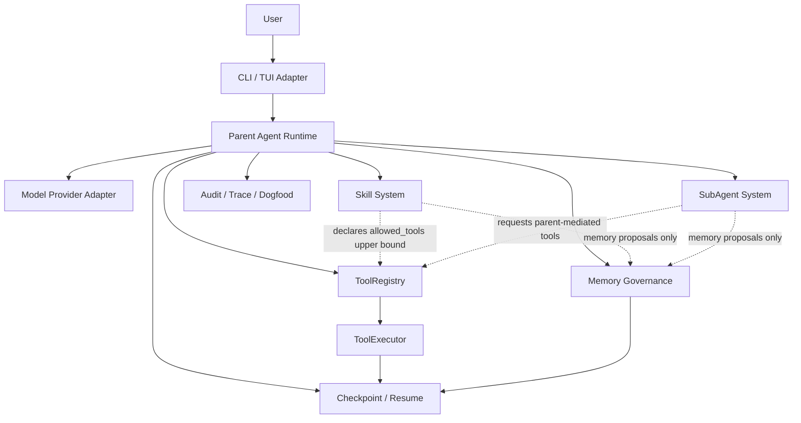

# Architecture Map

这篇文档解决什么问题：用文字图和 Mermaid 图说明 First Agent 的主要模块关系和治理边界。

不解决什么问题：不列出每个函数和测试文件，不替代 `docs/ARCHITECTURE.md` 的历史深潜。

推荐读者：新开发者、架构审计者、Coding Agent。

## 文字图

```text
User
  -> CLI / TUI
  -> Parent Agent Runtime
      -> Model Provider Adapter
      -> ToolRegistry / ToolExecutor
      -> Memory Governance
      -> Skill System
      -> SubAgent System
      -> Checkpoint / Resume
      -> Audit / Trace / Dogfood
```

## Mermaid 图



## 关键边界

| 边界 | 规则 |
|---|---|
| Parent Agent Runtime | 拥有主 loop、状态机、模型调用和结果分派 |
| ToolRegistry | 工具定义、风险、confirmation、可见性过滤的 authority |
| ToolExecutor | 单次工具执行入口；保存 checkpoint 和 tool_result |
| Memory Governance | 所有长期记忆写入必须经过这里 |
| Skill System | 不执行工具，不直接写 Memory，不拥有 loop |
| SubAgent System | 只做 bounded delegation，不拥有 loop，不默认真实 LLM |
| Checkpoint | 只保存安全恢复摘要，不保存 secret 或完整大 artifact |
| CLI/TUI | presentation / adapter；不能复制 runtime 决策 |

## 审计视角

全局代码审计重点不是“有没有更多模块”，而是有没有绕过这些 authority：

- SubAgent 是否绕过 Parent Runtime？当前没有。
- Skill/SubAgent 是否绕过 ToolRegistry？当前没有。
- Memory 是否 silent retain 或 auto approve？当前没有。
- CLI/TUI 是否直接写 Memory / Checkpoint / Tool result？当前没有。
- 是否出现第二套 main loop？当前没有。
