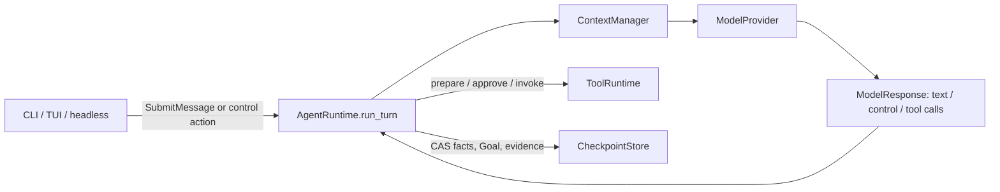

# 012 Trusted Continuity MVP — 产品与架构合同

## 1. 文档权威

本文是 012 的 Product Contract、现状差距、架构决策和安全边界的唯一权威。`STRATEGY.md` 定义长期方向；`docs/plans/2026-08-02-001-feat-trusted-continuity-plan.md` 定义实施顺序和验收；`docs/implementation/012_LOOP_HANDOFF.md` 只定义外部 Coding Agent 的执行协议。

`docs/plans/2026-07-25-010-feat-general-workspace-agent-plan.md` 保留为上一轮宽范围设计记录，但其中的 dynamic authority、optimizer、canary、promotion、跨 Goal transfer 等内容不是 012 的实现授权。发生冲突时，本文优先。

现有 `KERNEL_ARCHITECTURE.md` 与 `EXTENSION_CONTRACTS.md` 的唯一 Runtime、ContextManager、ToolRuntime、effect ordering 和静态 composition 不变量继续有效，本文不能削弱它们。

## 2. 目标与边界

012 交付一条可信连续性主线：用户在一个 workspace 启动 First Agent，通过同一个入口先问问题、再给出任务；Agent 在必要时做最小澄清，把明确任务变成 durable Goal，在既有 authority 内持续执行，跨重启恢复，并且只在独立证据满足验收条件后显示 `VERIFIED_DONE`。

### In scope

- 一个自然语言入口，不要求用户选择 chat/task/code 模式。
- 直接回答、最小澄清、建立/继续 Goal 的 typed control contract。
- 默认 product-owned、owner-only state root 与 deterministic workspace/session selection。
- Goal contract、Goal status、pause/cancel/correct、crash recovery 与用户可见投影。
- 绑定 Goal revision/criterion 的 evidence 与 verified-completion gate。
- 现有 workspace Memory 加一个最小 owner-local preference source/store/tool seam。
- Provider destination/data-class disclosure 和 durable acknowledgement receipt。
- CLI、TUI、headless typed-action parity。
- fake/mocked HTTP、离线 reference suite 和一条真实 Provider E3 journey。

### Out of scope

- 动态 multi-root、运行时扩目录/工具/服务、hot reload、dynamic registry。
- 自动生成或晋级 Skill/playbook、replay/canary/promotion/rollback。
- 后台 daemon、无限自主循环、整机活动监控、跨设备同步。
- 账号、多用户权限、大众 GUI、强沙箱。
- 把 Graphify、Understand Anything、Claude Code supervisor 或本开发 loop 作为产品能力。

## 3. 当前真实基线（2026-08-02）

| Area | 已存在 | 012 缺口 |
|---|---|---|
| Runtime | `AgentRuntime.run_turn` 是唯一 model/tool loop；tool effect 有 approval、`EXECUTING` 和 result checkpoint | 没有 Goal/control/evidence 语义 |
| State | owner-only `LocalCheckpointStore`、CAS、replay、unknown-effect recovery | 默认启动仍是 `InMemoryCheckpointStore`；只支持显式 `--state/--resume`，没有 state root/session selector |
| UI | CLI/TUI/headless 共用 typed action；approve/reject/recovery/resume/cancel-run 有 parity | 没有 Goal summary、clarification、pause/correct/cancel-goal、provider disclosure、verified/block projection |
| Context | `KernelContextManager` 独占预算和 ContextSource 投影 | 没有 Goal/control/evidence 的 pinned core facts |
| Memory | workspace-scoped store/source/governed tools；ProviderTrustProfile 绑定 destination | record provenance 不足；没有 owner preference scope；forget 语义未向用户解释 |
| Provider | Anthropic/OpenAI compatible adapter 只做 `ContextPack -> ModelResponse` | 没有 provider-neutral control block；没有用户可见 egress disclosure receipt |
| Completion | `RunStatus.COMPLETED` 表示本次 run 安全停止 | 没有 `goal_claimed_complete` 与 `goal_verified` 的区分 |
| Capabilities | Skill/MCP/Memory/SubAgent/Scheduler/TUI 已沿稳定 seam 接入 | 012 必须复用，不能为 Goal 再造平行执行路径 |

规划前门为：`git diff --check`、`ruff check .` 通过，`pytest -q -rx` 为 `376 passed`。这是基线健康证据，不是 012 完成证据。

## 4. 产品需求

- **TC-01 Unified entry**：所有自然语言输入继续只形成 `SubmitMessage`，随后进入 `AgentRuntime.run_turn`；不得在 CLI、composition 或 Provider 外再调用模型做分类。
- **TC-02 Direct answer**：无需工具和 durable work 的问题可直接回答；不能建立空 Goal 来伪装能力。
- **TC-03 Direction boundary**：只有缺失信息会改变 outcome、beneficiary、target、scope、显著成本、敏感数据处理、external commitment、authority 或 irreversible effect 时才阻塞询问。普通实现选择由 Agent 记录后自主决定。
- **TC-04 Durable Goal**：任何 task tool call 之前必须已有 CAS-persisted GoalFrame；纯回答不需要 Goal。
- **TC-05 Continuous progress**：Goal 建立后，同一次 Runtime invocation 必须继续到 approval、authority/config 缺口、retry/limit、unknown effect、verified done 或准确 blocked，不得因为输出普通进度文字要求用户输入“继续”。
- **TC-06 Visible control**：用户能查看 Goal、当前状态、下一安全步骤和 evidence，并能 pause、cancel 或通过自然语言 correction 修订 Goal。
- **TC-07 Deterministic recovery**：默认状态可持久化；唯一安全候选可恢复，多个候选或 binding drift 必须选择/确认，unknown effect 不自动重放。
- **TC-08 Verified completion**：模型停止、自报完成或 `RunStatus.COMPLETED` 不能单独产生 `VERIFIED_DONE`。
- **TC-09 Fact ownership**：Goal、workspace fact 与 owner preference 各有单一权威；项目事实不得进入跨 workspace preference。
- **TC-10 Honest memory**：每条 preference 有 provenance、revision/supersedes 和 active/tombstone 状态；forget 只承诺停止未来 active recall。
- **TC-11 Provider disclosure**：任何 remote `generate` 前已有匹配 family/model/destination/data classes 的 disclosure receipt；配置变化使 receipt 失效。
- **TC-12 Parity and observability**：每个用户可执行 action 都有 typed action 和机器可读结果；CLI/TUI 不能拥有仅 UI 可见的状态推进。
- **TC-13 Goal-aware approval**：固定 workspace authority 内、由当前 Goal 精确授权的安全可逆动作不重复询问；超出 Goal target/scope、重大成本、敏感数据、external commitment、authority expansion 或 irreversible boundary 的动作继续 fail closed/请求批准。

## 5. 一条入口，不是第二个 Agent

禁止的实现包括：

- Runtime 前的 intent-classifier model call。
- CLI/TUI 根据自然语言自行改 Goal。
- Provider adapter 根据响应推进 checkpoint 或执行工具。
- Goal service 自己循环调用 Provider/ToolRuntime。
- 以定时器、supervisor 或 CodingLoop 代替产品 Runtime。

## 6. Provider-neutral control protocol

当前 `ModelResponse` 只有 text/tool-call block。012 增加 immutable `ModelControlBlock`，由 Provider adapter 将 provider-native reserved structured call 规范化而来。它是控制消息，不是 Tool，不进入 `ToolRuntime.invoke`。

`ContextPack` 增加独立的 `control_schema` 与 pinned atomic `ControlReceipt` group。每个 control 有 correlation ID；Runtime 接受并 CAS 后生成 durable receipt。下一次 Provider 请求由 adapter 将该 receipt 映射为对应 native tool-use/tool-result continuity，防止 provider 重复 control 或拒绝缺失结果。`control_schema/receipt` 永远不出现在 `KernelToolRuntime.definitions/prepare/invoke`。

最小 control variants：

- `ClarificationRequest(question, boundary_code, missing_fields, safe_assumptions)`
- `GoalProposal(goal_frame)`
- `GoalProgress(goal_id, goal_revision, summary, next_step)`
- `GoalDeltaProposal(goal_id, expected_revision, delta, reason)`
- `CompletionClaim(goal_id, goal_revision, criterion_evidence_refs)`
- `BlockedClaim(goal_id, goal_revision, blocker, safe_attempts, resume_condition)`

Provider adapter 只负责 JSON/schema normalization；合法性、revision binding、状态变更和 effect ordering 全部由 Runtime/reducer 裁决。

控制协议使用一个 reserved provider-native schema，但不能注册为普通产品工具。架构测试必须证明：

- reserved control 永远不出现在 `KernelToolRuntime` registry。
- adapter 不导入 checkpoint、state reducer 或 tool runtime。
- malformed、多个互斥 control、control 与非法 tool-call 组合在 effect 前 fail closed。
- OpenAI/Anthropic adapter 必须通过 `control -> receipt -> next request` 完整 payload fixture；不能把 control receipt 展平为普通 user text。
- 无 active Goal 时的 task tool call 被拒绝；Runtime 先持久化 Goal，再重新构建 ContextPack 才允许执行。

## 7. Goal contract 与状态

### GoalFrame

最小 immutable fields：

- `goal_id`, `revision`, `created_from_fact_ids`
- `workspace_identity_digest`
- `user_outcome`, `beneficiary`, `targets`, `scope`, `non_goals`
- `assumptions`
- `proposed_criteria[]`：模型提出的候选，不自动成为完成权威
- `admitted_criteria[]`：稳定 criterion ID、绑定用户 outcome fact 的 closed oracle kind、machine-checkable predicate、required evidence class 与 admission digest
- `authority_snapshot`：固定 workspace/capability/provider bindings 与 user-authoritative grants 的 digest，不含 credential
- `created_at`, `updated_at`

Goal 修订只能通过 bound `GoalDelta` 增加 revision；旧 frame 保留为 checkpoint fact。改变 outcome/beneficiary/target/scope/authority/acceptance 的 delta 必须先进入 clarification/authority 状态，不能由模型静默接受。

`authority_snapshot` 不是动态权限注册表。它只冻结启动时 composition 已有的 workspace/capabilities/provider，以及 Runtime 已验证的 user-authoritative grants。模型产生的 Goal/target/scope 本身不授予权限。它不能添加新 root、tool 或 service。

### Authority and admission bindings

- `GoalAuthorizationBinding` 只能来自 authoritative user fact、exact human approval/action 或既有 durable grant；它绑定 canonical workspace identity、operation、normalized relative target、goal/revision、source fact/action 和 digest。
- `CriterionAdmissionBinding` 绑定 user outcome fact、closed oracle kind 与 machine-checkable predicate。模型可以提议 criterion，但不能单独 admission、弱化或删除 mandatory criterion。
- `FactAdmissionBinding` 由 Runtime 从 durable fact 生成，绑定 fact ID/kind/digest、workspace、goal revision 与 admission class；Memory tool 只能消费这个 binding，不能访问 checkpoint 或相信模型提供的 ID。
- 无法机械证明 source 与 exact target/operation/predicate/admission class 匹配时，保持 `NEEDS_AUTHORITY`/`REQUIRE_APPROVAL`，不能推断授权。

### GoalStatus

- `GOAL_READY`：Goal 已持久化，尚未执行 effect。
- `EXECUTING`：Runtime 正在模型/工具边界内推进。
- `NEEDS_AUTHORITY`：需要 provider disclosure、tool approval 或固定 composition 外的新权限/config。
- `PAUSED`：用户请求在下一个安全 checkpoint 暂停。
- `BLOCKED`：已耗尽安全且在范围内的恢复，缺少一个明确决定/配置/外部状态。
- `VERIFIED_DONE`：所有 mandatory criteria 都有有效 evidence。
- `CANCELLED`：用户终止，不代表回滚已完成 effect。

`ANSWERING` 与 `CLARIFYING` 是 interaction state，不是 Goal terminal state。`RunStatus.COMPLETED` 继续只表示一次 Runtime run 安全结束；UI 不得把它翻译成 Goal 完成。

### Control actions

- 自然语言仍只用 `SubmitMessage`。
- 新增窄 typed actions：`AcknowledgeProviderDisclosure`、`SelectGoal`、`PauseGoal`、`ResumeGoal`、`CancelGoal`、`ConfirmCriterion`。`ResumeGoal` 必须绑定 `goal_id` 与 `expected_revision`，不能复用不带 Goal identity 的旧 run `Resume` 语义。
- correction 使用普通 `SubmitMessage` 进入同一模型/control protocol；Runtime 在接受 Goal delta 前停止派发新的 effect。
- pause 是 cooperative：已经发出的外部 effect 不能撤回；如果 checkpoint 为 `EXECUTING`，只能先进入 unknown-effect recovery，不能伪装成安全暂停。

### Runtime-owned ControlInbox

012 必须提供 process-local、non-mutating `ControlInbox`，让 CLI/TUI/headless 在同步 `run_turn` 活跃时提交绑定 conversation/goal/revision/invocation 的 pause/correct/cancel request。Inbox 本身不是状态权威；Runtime 只在 provider 前、tool prepare 前和 result CAS 后轮询，并由 reducer/CAS 形成 durable state。`EXECUTING` 时的请求只能在 result checkpoint 或 unknown-effect recovery 后生效。Blocked provider/tool call 不承诺即时 kill。

## 8. 默认持久化与恢复

### Product-owned state root

默认 root 为 owner home 下的固定产品目录 `~/.local/state/my-first-agent/v1`，可由显式 `--state-root` 覆盖。root 必须在 workspace 外、真实目录、owner-only `0700`；文件为 regular/no-follow/owner-only `0600`。

不得读取 `.env`、Claude 配置或任意 workspace 文件来推断 state root。Credential 永远只在 composition root 从用户指定 env name 注入。

### Workspace identity

`WorkspaceIdentityV1` 绑定 resolved canonical path、平台文件 identity（可用时）与版本化 digest。软链接别名解析到同一 canonical identity；目录替换、无法确认 identity 或 authority/provider drift 时不自动恢复。

### Deterministic session layout（无可写 catalog）

state root 使用 `workspaces/<workspace-digest>/<conversation-id>.json` 的版本化 deterministic layout。启动只允许 bounded enumerate 当前 exact workspace-digest 目录，并逐个严格加载产品 checkpoint；它不扫描 workspace、其他 workspace state 或任意 home 目录，也不维护第二份 catalog/revision/terminal/provider mirror。

Composition 的窄化 bootstrap 例外只允许：解析 root/identity、bounded enumerate 当前产品目录，并排他初始化一个空 schema v2 checkpoint。这与现有 architecture 的“setup 可以初始化全新 checkpoint”一致。文件名/identity 在创建前确定；失败留下的 missing/invalid checkpoint 由 strict load fail closed，不通过第二文件修复。初始化完成后，只有 `AgentRuntime.run_turn` 可以写 checkpoint/Goal/action state。

启动选择规则：

1. 无候选：在 deterministic workspace state directory 排他初始化一个 schema v2 checkpoint。
2. 恰好一个 nonterminal 候选，且 workspace/provider/authority bindings 全匹配：恢复并展示摘要。
3. 多个候选：只展示 bounded metadata，要求 `SelectGoal`，不能猜“最近一个”。
4. identity 或 binding drift：`NEEDS_AUTHORITY`，不能自动调用 Provider/Tool。
5. checkpoint 为 `EXECUTING`：进入现有 unknown-effect recovery；不能自动 invoke。

checkpoint 升级为 schema v2，新增 Goal、interaction、disclosure 和 evidence fields。旧 schema 必须 fail closed；012 不提供静默 fallback 或双写。若需要迁移，只能另写显式、可验证、一次性的迁移计划。

## 9. Evidence 与完成

### EvidenceRecord

每条 evidence 至少绑定：`evidence_id`、`goal_id`、`goal_revision`、`criterion_id`、`source_kind`、`source_fact_ids`、`artifact/result digest`、`oracle_identity`、`verdict`、`created_at`。

允许的 verification authority：

- deterministic oracle：文件 digest、schema validator、测试命令、read-after-write、远端 commit receipt 等。
- 与 executor 明确隔离的 verifier receipt；必须记录 verifier identity 和输入 digest。
- 对主观标准的显式用户 `ConfirmCriterion`。

不允许：同一模型的自然语言自评、没有绑定 Goal revision 的旧 receipt、缺失原始 fact/digest 的总结、mock/fake 结果冒充真实外部完成。

`CompletionClaim` 只触发 Runtime 验证。Runtime-owned closed oracle registry 从 raw durable tool/user facts 重新推导 evidence；模型不能直接创建 `EvidenceRecord`。mandatory admitted criteria 全部有效才 CAS 到 `VERIFIED_DONE`；否则保持执行、形成准确 blocker，或请求用户确认主观 criterion。

Filesystem MVP oracle 固定为 exact workspace identity + normalized relative path + approved content digest + read-back digest。模型提出空/弱化 criterion、无关 receipt 或自由 metadata 都不能满足它。

## 10. Goal-aware approval（不等于动态扩权）

当前 ToolPolicy 只看静态 `ALWAYS/NEVER`。012 扩展 `ToolPrepareContext`/policy evaluation，使其只读取 Runtime 提供的 immutable `GoalAuthorizationBinding`：goal/revision、workspace digest、exact target/operation、source user fact/action、risk/side-effect class 和 binding digest。

默认规则：

- fixed workspace 内 read/list 继续允许，但 private/protected path 继续拒绝。
- 只有 user-authoritative binding 明确覆盖的 exact target/operation 才可在未漂移时避免重复询问；模型 GoalProposal、路径别名或自由 scope 文本本身永远不能降级 approval。
- overwrite 未在 Goal 中声明的既有内容、扩大 target/scope、敏感数据、外部发送、重大成本、不可逆或无法分类的动作必须 `REQUIRE_APPROVAL` 或 `DENY`。
- MCP、SubAgent、owner preference mutation 等现有高风险 capability 不因 Goal 存在自动降级；除非设计中为该具体 capability 定义了更窄且可测试的 authority rule。
- prepare 与 invoke 必须用同一 policy identity/Goal binding 重评；Goal correction 或 revision drift 使 intent/approval 失效。

Policy 仍属于唯一 ToolRuntime；Runtime/CLI 不直接执行工具，也不从自然语言绕过 policy。

## 11. Workspace fact 与 owner preference

现有 workspace Memory 的 ContextSource/ToolRuntime seam 保持不变，但 record/admission 收紧为 provenanced `AgentFact`：每条记录绑定 Runtime 生成的 `FactAdmissionBinding`、durable user/assistant/tool fact ID、digest、origin 与 workspace scope。没有 verified binding 的自由文本或模型伪造 ID fail closed；Memory callable 不访问 checkpoint。纯模型推断不能持久化。Derived note 只有在引用 First Agent 受治理完成且可验证的 source facts 时才可保存，并且不能伪装成用户陈述或工具事实。

012 新增的 owner preference 仍通过 `ContextSource` + governed tools 接入，不改 ContextManager 所有权。

### Admission

只有以下来源可进入 owner preference：

- 当前用户明确要求跨 workspace 记住的陈述。
- Agent 展示完整 preference preview 后，用户明确确认。
- 用户对既有 preference 的纠正或 forget 指令。

项目文件、README、网页、Memory 召回、tool result、SubAgent output、模型推断或失败结果一律不能成为 admission authority。

### Record

`OwnerPreferenceRecord` 至少包含：`record_id`、`revision`、`kind=preference`、`subject=owner`、`content`、`content_digest`、`source_fact_ids`、`created_by=user_confirmed`、`provider_trust_profile`、`created_at`、`supersedes`、`status=active|superseded|forgotten`。

召回为 untrusted context block，并遵守当前用户输入 > Goal > workspace > owner preference。Provider destination/profile 不匹配时 fail closed，不静默迁移或发送。

`forget` 通过 governed mutation + CAS 将记录变为未来不再 active recall；UI 必须说明它不删除历史 conversation/evidence，也无法撤回已发送给远程 Provider 的副本。

## 12. Provider disclosure

Composition 显式向 Runtime 注入 immutable `ProviderDescriptor(family, model, canonical_destination, trust_profile, remote)`；Runtime 不反向依赖具体 adapter，也不自行猜 URL。ContextManager 在最终 `ContextPack` 上产生 closed `data_classes`（user message、workspace excerpt、Goal facts、workspace memory、owner preference、tool result、tool schema）。

`ProviderDisclosure` 由 descriptor + exact `ContextPack.data_classes` 生成。

remote Provider 第一次使用或任一 identity/data-class 变化时，必须在 `generate` 前显示 disclosure，并持久化用户 acknowledgement receipt。未确认时状态为 `NEEDS_AUTHORITY`，provider call count 为零。Receipt 不包含 key、header、完整 prompt 或私有内容。

配置 Provider 不等于授权任意数据类别；启用 owner preference 后如 data-class 集合扩大，需要新的 bound acknowledgement。

Remote destination 必须 fail closed：HTTPS（loopback 开发例外可用 HTTP）、无 userinfo/query/fragment、禁止 redirect 改变目的地，HTTP client 不继承 ambient proxy/config（`trust_env=False`）。自定义 proxy/CA/network route profile 留给后续显式 capability，不在 012 隐式支持。

## 13. UI projection

CLI、TUI、headless 均从 authoritative state/result 投影：

- workspace identity（bounded label）、Goal summary/revision/status。
- Provider destination/model/data-class disclosure 状态。
- 下一可执行 action：submit/select/acknowledge/approve/reject/resume/pause/cancel/confirm/recovery。
- `BLOCKED` 的已验证进展、缺失条件、已尝试安全恢复、唯一恢复条件。
- `VERIFIED_DONE` 的 criterion/evidence 摘要和 caveats。
- preference 的 content、source、revision/status 和 forget 限制。

外部文本继续使用 literal safe-display；事件只 advisory，重启视图只从 checkpoint 与 deterministic session locator 投影，不能通过 event log 重建权威状态。

## 14. Security invariants

- 未确认 remote disclosure 前 provider call count = 0。
- 无 durable Goal 时 task tool prepare/invoke count = 0。
- tool effect 顺序保持 intent → CAS `EXECUTING` → invoke at most once → CAS result。
- Goal delta、evidence、preference mutation 都用 revision binding/CAS。
- workspace file/web/tool/model 内容不能授权权限、确认 disclosure、确认 criterion 或晋级 owner preference。
- cross-workspace task fact recall = 0；provider/profile mismatch recall = 0。
- unauthorized effect、duplicate effect、false `VERIFIED_DONE` 任一出现即 stop-ship。
- state/session-locator/preference corruption、unknown field、symlink、owner/mode mismatch 均 fail closed。
- 无 compatibility fallback、service locator、dynamic registry、第二个 Runtime 或第二个 model/tool loop。

## 15. Frozen reference journey

1. 启动时看到 workspace、Provider、authority、Memory 状态；remote 首次使用需要 bound disclosure acknowledgement。
2. 简单问题直接回答，checkpoint 中不存在 Goal。
3. 一个影响结果的模糊任务只产生一个 clarification，provider/tool effect 为零。
4. 明确本地任务先持久化 Goal，再走现有 ToolRuntime/approval/effect ordering。
5. 在 crash-before-effect、crash-after-`EXECUTING` 与普通进程重启三个点恢复；不重复已完成动作，不重放 unknown effect。
6. deterministic evidence 支持 `VERIFIED_DONE`；同样输入但缺 receipt 时保持未完成。
7. 新 workspace 只召回一条用户确认的 owner preference；恶意 README 中的“记住我”不能晋级，旧 workspace fact 不出现。
8. explain/correct/forget 后重启，旧 preference 不再 active recall，并准确说明历史/远端副本未被擦除。

负向 suite 还必须覆盖：问题夹带行动、任务夹带问题、多个恢复候选、workspace alias/replacement、provider destination change、pause/correct/cancel、duplicate caller、retryable provider、invocation limit、tampered evidence、false completion 和 preference conflict。

## 16. Likely code ownership

这不是强制目录重构；实现者应优先最小改动并保持高内聚。

- `agent/runtime/contracts.py`、`state.py`、`loop.py`、`checkpoint.py`：唯一 action/control/Goal/evidence 状态推进和 schema v2。
- `agent/runtime/context.py`：Goal/control/evidence core context 预算；Memory 仍只作为 source。
- `agent/provider/*`：reserved control schema 的 provider-neutral normalization；不拥有业务状态。
- `agent/continuity/`（如确有多个高内聚组件）：workspace identity、deterministic session locator、纯 validation/oracle；不得拥有 model/tool loop。
- `agent/memory/`：owner preference store/source/governed tools 和 provenance。
- `agent/cli/*`、`agent/tui/*`、`main.py`、`agent/composition.py`：薄 action adapter、projection、静态 composition 和默认 state root。
- `tests/continuity/` 加 touched-area tests：合同、恢复、disclosure、verification、preference、reference journey；现有 kernel/capability tests 必须继续 Green。

## 17. Open configuration boundary

真实 Provider E3 只允许在用户提供或已在当前进程显式配置的非秘密参数与 credential env name 下运行。执行者不得搜索 `.env`、shell history、Claude config 或日志获取 key。配置缺失时，先完成全部离线实现与门，再只报告所需环境变量名、base URL 类型、provider family 和 model；不得回显 key value。
