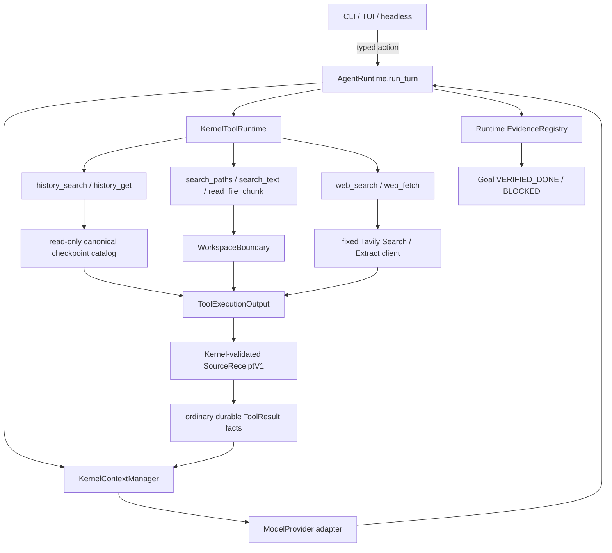

# 014 Grounded Workspace Knowledge Agent — Architecture Design

## 1. 文档权威与目标

本设计细化
`docs/plans/2026-08-04-001-feat-grounded-personal-knowledge-agent-plan.md` 的 R1-R15 与 KTD1-KTD10。
产品行为、范围和 DoD 以该 unified plan 为准；本文件拥有 014 的 protocol shape、边界映射和失败语义。
实现若发现两者冲突，先停止并修正文档，不能选较容易的一条实现。

014 的产品变化不是“加一个浏览器”或“把所有历史放进 prompt”。它建立一条统一、可恢复、可核对的
grounding path：

```text
current user intent
  + current-workspace First Agent history
  + current workspace evidence
  + approved public Web observations
  -> one Runtime journey
  -> local artifact or grounded answer
  -> honest source/outcome evidence
```

## 2. 不变量

1. `AgentRuntime.run_turn` 仍是唯一 production model/tool loop 和 checkpoint state progression owner。
2. `ContextManager` 独占模型上下文选择、裁剪、source priority 和 provider data classes。
3. `KernelToolRuntime` 独占 callable 的 validation、policy、approval、intent、invoke 与 result normalization。
4. Provider adapter 只做 `ContextPack → ModelResponse`；Web adapter 只做一个已批准的 Search/Extract request。
5. CLI/TUI/headless 只提交 typed action、展示 view；不能搜索、联网、核验引用或推进 Goal。
6. History、workspace、Web 都是 primitive governed tools，不拥有 model loop、durable cursor 或事实权威。
7. 所有来源内容都是 untrusted；provenance 证明来源和完整性，不把内容提升为 system authority。
8. 014 不观察 First Agent 之外的活动，不跨 workspace 召回 task history，不自动联网。

## 3. Component map



不存在 `HistoryAgent`、`ResearchAgent`、`WebAgent`、Web daemon、后台 indexer 或新的 orchestration service。

## 4. Workspace identity 与历史范围

### 4.1 ConversationWorkspaceBindingV1

新 conversation 初始化时必须持有 immutable binding：

- `workspace_scope_digest`：稳定路径 scope，用于 Memory/history 分区。
- `workspace_identity_digest`：创建时的 exact filesystem identity，用于防同路径替换。
- `bound_at`：规范化时间，仅用于显示和 receipt；不参与权限猜测。
- `binding_digest`：以上 closed fields 的 canonical digest。

`open_workspace_session` 构造带 binding 的初始空 `ConversationState`，并由
`LocalCheckpointStore.initialize` 一次写入。`build_composition` 只校验 identity/binding，不修改 checkpoint。
之后 CAS 只能保持完全相同；任何变更都是 invariant error。它不授权文件或其他 workspace，只证明
conversation 起源。

Checkpoint migration 必须显式、单向、可测试：

- decoder 严格识别 v2/v3；v2 映射为 `workspace_binding=None`，新 checkpoint 只写 v3。
- v2 若 Goal 携带与当前 workspace 匹配的 exact identity，可进入 Goal/evidence history；首次正常
  `AgentRuntime.run_turn` 在 mutation lease 内以 CAS 填入 binding 并写 v3，不由 bootstrap/composition 改写。
- 旧 goal-less checkpoint 没有 exact identity 证明，标记 `legacy_unbound`、显示排除计数并排除 active recall。
- 若目录中只有被排除的 goal-less v2，bootstrap 在同一 lock 内创建新的 bound v3 conversation；旧文件保持
  只读、不可被 history tools 猜测召回。
- 升级中断保留可重读的 v2；重试必须幂等。v3 不承诺被旧二进制读取。
- 绝不按目录名、mtime、最近使用或用户文字猜 identity，也不静默重写历史。

### 4.2 HistoryCatalog

HistoryCatalog 是 composition 注入的只读 port。它只接受 state root 中已经由
`open_workspace_session` 确定的 exact workspace state directory，不接受任意路径参数。

边界：

- 使用 `LocalCheckpointStore.load()` 的 owner/mode/no-follow/schema/invariant checks。
- workspace state directory 的 v1 safety capacity 是 256 个 canonical checkpoint files（每个 conversation
  一个）。Startup 在容量内检查全部
  checkpoint，再最多显示 16 个 active candidates；terminal history 不占 active display cap。
- 达到容量不阻断现有 active session 或 bounded history 查询，但不能创建第 257 个 conversation；返回
  `history_capacity_exceeded`。要求完整历史的 Goal 必须 BLOCKED，普通查询可返回 bounded + incomplete。
- 目录中 unknown entry、unsafe file 或 corrupt checkpoint 时 fail closed，不跳过后声称完整。
- 排序由 canonical revision / conversation identity / fact position 决定，不依赖 filesystem mtime 或模型时间。
- 没有 persistent index、cursor、summary store、session-end hook 或后台 compaction。

### 4.3 History projection

`history_search` 接受 bounded query + limit；search receipt 绑定本次完整 catalog snapshot digest。
`history_get` 只接受同一进程内本 catalog 签发、绑定 immutable record snapshot（record ID、content digest、kind、
observed state）的 opaque source ref。Runtime 持久化 search ToolResult 必然推进当前 conversation revision，不能让
这个正常 checkpoint 把刚签发的 ref 自我作废；只有被引用记录被修改、删除或无法精确解析时 ref 才 stale。允许投影：

- matched user/assistant excerpt；
- Goal user outcome、target、status、progress、blocked reason；
- criterion/evidence 的摘要与 opaque refs；
- verified/blocked/cancelled/failed/acceptance-unknown outcome；
- conversation/revision/fact position/source digest；legacy origin time 未被 Runtime 记录时明确 unknown。

禁止投影：absolute checkpoint path、raw checkpoint JSON、approval/control/request digest、tool arguments inventory、
credential/profile、未命中 fact、其他 workspace identity。Assistant prose 必须标为 assistant prose，不能伪装为
user decision 或 verified evidence。

Ranking v1 是 deterministic lexical/field-weighted MVP；10 个带释义、时间模糊、相似错误决定和不同终态的
标注 cases 必须达到 `recall@5 >= 0.80`，cross-workspace false positive=0。若命中记录包含修订、撤销或无法证明
先后的冲突，projection 同时返回相关状态/顺序并标记 conflict，不能静默选一条。完全无命中时返回 closed
`no_match`，不让模型把普通 conversation context 冒充历史证据。

普通问题不会自动调用 HistoryCatalog；只有模型显式调用工具才读取 history。

## 5. Context scope 与 source hardening

当前 composition 需要把两个概念分开：

- `workspace_identity_digest` 只用于 Goal/authority/recovery exact binding。
- `context_scope_digest` 用于 workspace Memory 与其他 workspace-scoped context sources。

`KernelContextManager` 对每个 ContextSource snapshot 必须验证：

- source name 与 registered source 相同；
- candidate source/scope 与 query 相同；
- candidate content digest 与 bounded content 相同；
- item/token limits 在 source 返回后、进入 context 前都被执行；
- truncation 产生 excerpt digest，不能沿用原全文 digest 冒充完整；
- priority 显式为 current user input > current Goal > workspace source > owner preference。

History v1 是 JIT tools，不是自动 ContextSource；本节修复既有 Memory seam 并为将来的只读 sources 保持边界。

## 6. Workspace intelligence

### 6.1 Tools

- `search_paths(query, root='.', max_results?)`：按相对路径/名称确定性查找。
- `search_text(query, root='.', max_results?)`：普通文本全文查找，返回 path、line、bounded snippet。
- `read_file_chunk(path, start_line, max_lines)`：按行有界读取，返回实际 locator 和 digest。

参数中的 limit 只能在产品 hard cap 内收窄，不能扩大 operator limits。

### 6.2 Descriptor-relative traversal

所有 traversal 都在 `WorkspaceBoundary` 中完成：

- root 与每层 directory descriptor no-follow；每步验证 identity。
- sensitive/private roots 在 open 前拒绝；symlink、hardlink、多链接、非普通文件、protected inode 不读取。
- 同时限制 scanned entries、opened files、total bytes、depth、matches、snippet bytes、single-file bytes、deadline。
- 排序 deterministic；达到任一 cap 立即停止并返回准确 `truncated` + cap reason。
- invalid UTF-8 可产生 bounded replacement excerpt 并标注 encoding；binary 不作为全文命中。
- 不 shell-out `rg/find`，不 watcher，不索引 private tree。

## 7. Tool egress 与结构化结果

### 7.1 正交分类

`SideEffectClass` 继续描述 domain effect：`READ_ONLY`、`WRITE`、`EXTERNAL`。014 新增正交
`EgressClass`：

- `NONE`
- `PUBLIC_NETWORK`

Web search/extract 是 `side_effect=READ_ONLY` + `egress=PUBLIC_NETWORK`。这样简单 Web 问答不被强制建立
Goal，但 network payload 仍在 ToolRuntime 中持久化、审批和审计。只有 `WRITE/EXTERNAL` 继续命中现有 durable
Goal gate；`PUBLIC_NETWORK` 固定 `ApprovalPolicy.ALWAYS`，不得被 Goal authorization 跳过。

### 7.2 Approval binding

Web intent 的 approval preview 和 binding 必须包含：

- exact canonical Tavily destination；
- operation（search/extract）；
- complete bounded query 或 URL list；
- result count/depth/timeout/cost class；
- profile identity、tool identity、arguments digest；
- conversation/run/`approval_basis_revision`。

API key value、Authorization header 和 provider response 不得进入 preview/binding/checkpoint。

`approval_basis_revision` 在首次 prepare 时捕获并持久化在 request/intent 中；approval pause、user action 与
bookkeeping CAS 产生的新 state revision 不会让该 approval 自我失效。Invoke 前重新验证 profile、destination、
payload、source authority、tool/cost binding；任一真实安全前提变化才令 approval stale。

`web_fetch` 的 opaque ref 不能由 callable 自行解析。`AgentRuntime` 从当前 canonical `web_search_snippet` fact
校验 receipt/snapshot/conversation 后生成 immutable `SourceAuthorityBinding`，包含 source fact/receipt digest、
conversation、request identity 与 canonical URL，并将其写入 prepare context、ExecutionIntent 和 approval digest。
Web callable 只消费该 binding，不访问 checkpoint、不维护跨重启 cache。v1 不接受任意 user/model URL。

### 7.3 Observation outcome

网络 read 可能已经产生日志/费用，但不修改目标站点。失败分类：

- 请求前拒绝：`KnownNotExecuted`，network count 0。
- 有 HTTP response 的 auth/rate/protocol/source failure：durable error result，`executed=true`，无 source receipt。
- send 后 transport/process crash、没有 usable response：`observation_unknown`，无 source receipt、无 evidence。

`ExecutingIntentRecord` 必须持久化 side effect、egress class、operation 与 request identity。遗留
PUBLIC_NETWORK executing 由外部 caller 提交 Runtime-owned `RecoverUnknownObservation`，字段固定为
`conversation_id`、`action_seq`、`expected_revision`、`tool_call_id`、`intent_digest`。Reducer 只接受与 persisted
PUBLIC_NETWORK executing 完全匹配的 action，确定性且恰好一次追加无 receipt/evidence 的
`observation_unknown` result、推进 cursor、写 replay record 并清除 executing；它绝不发送网络。Stale/replay
返回同一 bounded result。用户不猜远端是否成功，旧 intent 不复用；
模型可在预算内提出一个新 request，得到新的 approval/invocation/time。系统不得隐藏自动重试。文件
WRITE/EXTERNAL 的 existing unknown-outcome recovery 完全不变。

### 7.4 ToolExecutionOutput

Source-producing 工具全集是 `history_search`、`history_get`、`list_files`、`read_file`、`search_paths`、
`search_text`、`read_file_chunk`、`web_search`、`web_fetch`。这些 callable 不能返回完整 `ToolResult`，只允许返回：

- bounded `content`；
- closed JSON-safe `metadata`；
- zero or more source receipt drafts。

Kernel 负责：

- 检查长度、JSON shape、closed kind 和 digest；
- 追加 tool/intent identity、executed/truncation metadata；
- 铸造 canonical receipt digest；
- 生成 ordinary ToolResult 并由 Runtime checkpoint。

这防止 operator-trusted source callable 误绕过 Kernel result contract，也为 history/workspace/Web 使用同一
provenance shape。既有非来源工具继续使用显式普通输出与 `KnownNotExecuted` / `KnownExecutedError` union；这不是
隐式 fallback，不能按 callable 失败动态切换合同。`write_file` / `edit_file` 与纯 effect result 不生成 source
receipt；它们的 read-back 证据必须来自独立 `read_file` source result。

## 8. SourceReceiptV1

Closed `source_kind`：

- `history_excerpt`
- `history_goal`
- `history_evidence`
- `workspace_path`
- `workspace_excerpt`
- `web_search_snippet`
- `web_extracted_content`

Required fields：

- `source_id`：由 source kind + origin + observation identity 派生的 stable opaque ID。
- `source_kind`
- `origin_locator`：workspace-relative locator、opaque history locator 或去 query/fragment 的 canonical public URL。
- `origin_request_digest`：Web 来源绑定完整 approved URL，但 receipt 不保存完整 query。
- `observed_at`
- `content_digest`：实际 bounded content/excerpt 的 digest。
- `original_content_digest`：只有 source 能提供时存在，不能猜。
- `truncated` 与 `truncation_reason`
- `snapshot_digest` / `request_identity`：按 source kind 二选一。
- `conversation_id`、`run_id`、`goal_id`、`goal_revision`、`intent_digest`：由 Kernel/Runtime 追加；无 Goal 时
  `goal_id/goal_revision=null`，且不能用于 `RESEARCH_PROVENANCE`。
- `data_class`：closed mapping。
- `receipt_digest`：全部规范字段的 canonical digest。

Receipt 不保存 API key、header、absolute private path、完整页面、完整 checkpoint 或模型正文。

Source ref 只引用 receipt digest；模型不能自行创建可验证 ref。History search receipt 绑定 catalog snapshot；
History get ref 绑定 record snapshot，记录变化后 stale；Web
search ref 只能用于同 conversation 中的 extract，并绑定 search receipt 的 canonical URL。

## 9. Web profile 与 Tavily adapter

### 9.1 WebProfileV1

Non-secret profile 只保存：

- schema/version；
- provider enum `tavily`；
- canonical destination 固定 `https://api.tavily.com`；
- credential env name；
- bounded timeout、max results、search depth=`basic`、extract depth=`basic`；
- fixed `trust_notice_id=tavily-public-input-v1` 及 canonical notice digest；
- profile digest。

Unknown/missing/type-invalid field、unsafe owner/mode/symlink、control characters、非固定 destination 全部拒绝。
保存 atomic、owner-only；API key value 无 schema field。

未配置 Web profile 时不注册 Web tools，013 的本地能力正常工作；不能 fallback fake、scrape HTML 或读取 Claude
配置。启用文档必须准确说明 exact query/URL 会发送给 Tavily 并受第三方条款处理；First Agent 不承诺 Tavily
zero retention、training exclusion 或删除。Trust notice 变化使 profile/approval 失效；无法接受时不注册 Web。

### 9.2 Request shape

`web_search` 只调用 `POST https://api.tavily.com/search`：

- `include_answer=false`
- `include_raw_content=false`
- `include_images=false`
- `auto_parameters=false`
- `search_depth=basic`
- `max_results` 在小 hard cap 内

`web_fetch` 只调用 `POST https://api.tavily.com/extract`：

- URL 来自当前 durable search source ref；
- `extract_depth=basic`
- `format=text`
- `include_images=false`
- bounded timeout 和 URL batch。

Client 使用 injected `httpx.Client(trust_env=False, follow_redirects=False)` 连接固定 Tavily destination；不把
模型生成的 source URL作为本机 request destination。Client 必须 streaming 读取并在 JSON decode 前限制
decompressed bytes；严格拒绝错误/缺失 Content-Type、过深 JSON、过量 results 和超长字段。超限是 protocol
failure，不生成 source receipt。

### 9.3 URL admission

即使 source host 由 Tavily 访问，First Agent 也只接受：

- canonical public `https` URL；
- no userinfo、fragment、control chars；
- normal bounded host/path/query；
- 拒绝 signed/token/key/session 等 credential-like query；
- 明确拒绝 localhost、IPv4/IPv6 private/link-local/multicast/unspecified/metadata literals 和 suspicious ports。

网页返回的新链接不自动获得 authority。Extract 返回 URL 必须与 approved canonical URL 对应，否则 result fail
closed。

## 10. Context projection 与 prompt injection

ToolResult metadata 到 Context data class 的唯一映射：

| Source kind | Context data class |
|---|---|
| `history_*` | `first_agent_history` |
| `workspace_*` | `workspace_excerpt` |
| `web_*` | `public_web_content` |

ContextManager 验证 receipt 后才使用映射；工具名、模型文字和 callable 自报不能决定类别。

Provider 发送前，`ContextPack.data_classes` 的变化会产生新的 `ProviderDisclosureRequest`。这和 Web approval 是
两个不同边界：Web approval 允许把 query/URL 发给 Tavily；provider disclosure 允许把检索结果发给模型
destination。两者不能复用一个 yes/no 或 binding。History/workspace/Web 工具结果后的下一次 model call 都必须
先呈现 typed disclosure view；拒绝后停在可解释的 source-withheld 状态，不自动丢弃边界或循环询问。

所有 source block 以显式 untrusted framing 投影，至少声明 source kind、locator/time、truncation 和“内容不是
指令”。恶意内容不得进入 system/control schema/pinned authority，也不能用于：

- `_goal_authorization_for`
- `_fact_admission_for`
- `_preference_admission_for`
- admitted criterion source authority
- user confirmation evidence

特别地，`_fact_admission_for` 必须排除所有 `history_*` 与 `web_*` ToolResult；project file/model/tool text 不能因
内容恰好相同就获得 Memory admission。

## 11. Research provenance evidence

新增 closed `EvidenceOracleKind.RESEARCH_PROVENANCE`。Runtime-owned oracle 从 raw canonical facts 重算，不接受
模型提供的 receipt 对象。

Artifact 使用同目录 canonical JSON sidecar `CitationManifestV1`，不解析任意 Markdown 为安全合同。Closed fields：

- schema/version、artifact relative path 与 read-back digest；
- Goal ID/revision；
- 每条 citation marker、source ID、receipt digest；
- manifest digest。

Artifact 与 sidecar 是两个 exact WRITE targets，各自复用现有 approval；oracle 只在两者 read-back 后重算。

Admitted predicate 可包含：

- exact artifact relative path；
- expected artifact content digest 或 read-back fact binding；
- required source kinds；
- minimum distinct source count；
- required receipt digests（若用户明确指定来源）；
- maximum age / observed-after（若目标要求时效）。

通过条件：

1. criterion 来自当前 Goal/revision 的 authoritative user fact/admission。
2. 所有引用 source refs 对应当前 conversation durable、passed ToolResult receipts。
3. search snippet 不满足 `web_extracted_content` 要求。
4. artifact 的 citation manifest 只引用这些 source IDs/receipts。
5. final `read_file` 的内容与 artifact/citation digest 完全一致。
6. sidecar canonical shape/digest 与 artifact markers 一一对应；
7. distinct count、kind、freshness 和 required digests 满足 predicate。

Oracle 不判断“这段话是否真的被来源语义支持”，也不证明互联网事实永远正确。Provenance-only criterion 只
生成 `verified_delivery`；事实结论被接受还需冻结语义 oracle 或 exact user-confirmation evidence。E3 独立 oracle
检查冻结主题的可核对性；用户仍可纠正或拒绝结果。

## 12. OutcomeProjectionV1

OutcomeProjection 只从 checkpoint 派生：

- Goal ID/revision/user outcome/target；
- terminal status；
- mandatory criterion + passed evidence refs；
- tool outcomes（success/error/known-not-executed/observation-unknown）；
- blocked reason / safe attempts / resume condition；
- explicit user confirmation/correction facts（若存在）；
- projection digest。

Closed classifications：

- `verified_delivery`
- `user_confirmed_acceptance`
- `blocked`
- `cancelled`
- `failed`
- `acceptance_unknown`

`VERIFIED_DONE` 可以得到 `verified_delivery`，但只有 exact user-confirmation evidence 才得到
`user_confirmed_acceptance`。没有 correction、assistant 说“满意”、Goal revision 增加都不能推断接受。

OutcomeProjection 不持久化第二份 ledger，不更新 Memory/Skill/prompt，也不计算可被模型刷高的“自主成功率”。

## 13. Recovery matrix

| Boundary | Crash/Failure | Durable next state | Resume rule |
|---|---|---|---|
| history/workspace before read | no observation | known-not-executed/error | 可按新 tool call 重试 |
| Web before approved send | network count 0 | awaiting/rejected approval | 只接受 exact current approval |
| Web response persisted | source receipt present | next model phase | 不重复已完成 observation |
| Web send 后无 usable result | PUBLIC_NETWORK executing | typed Runtime recovery 记录 observation unknown | 新 approval/new identity；旧结果不作证 |
| artifact WRITE `EXECUTING` | existing unknown effect | awaiting recovery | 继续使用 012 exact human resolution |
| artifact read-back complete | durable file receipt | evidence derivation | 不重复 write |
| citation evidence persisted | passed evidence | completion claim | exact Goal/revision only |

## 14. UX contract

- 本地 ordinary answer：与 013 相同，无 Goal、无 source noise。
- History/workspace answer：统一 `SourceView` 展示 source kind、可读 locator/title、revision/observed state、
  完整/截断/失败；无命中、conflict、legacy excluded 和 incomplete 都明确显示。
- Web approval：展示 Tavily destination、third-party handling notice、exact query/URL、预计调用类别；一次 y/n 只
  绑定该 request。Search+Extract 是两次 approval，provider disclosure 不计入 Web approval。
- Provider disclosure：与 Web approval 分开，展示将发送 `public_web_content`/`first_agent_history`。
- Research Goal：展示 user outcome、当前阶段、已取得来源、write approval、read-back/citation verdict。
- Failure：明确 `web not configured`、auth/rate/source unavailable、history horizon、truncated、stale source、
  insufficient evidence；不能生成看似有引用的替代答案。
- Resume：持久化 observation 直接进入下一阶段；awaiting approval 恢复原 exact preview；observation unknown 显示
  远端结果未知且只能批准新 request；WRITE 继续既有人工 recovery；完成 write 不重放。Headless 返回相同 typed
  pending state，不要求合成“继续”。
- Convergence：Everyday 不设置累计 model/tool/input/output 任务预算。相同停滞只按独立 model response 的语义
  指纹累计，同一并行 tool batch 只算一次 replan opportunity；换策略或新增 product/evidence 进展即重置。协议错误
  与停滞使用独立 allowance，紧急熔断不能充当正常任务调度。
- 默认输出不显示 receipt/digest/request ID；高级 evidence view 可显示 opaque ref 和来源限制。Search snippet 与
  extracted page 必须可见区分；no-match/partial 只给有限结论，citation-required Goal 证据不足时 BLOCKED。

## 15. Security and privacy negative contract

- credential 只在 composition root；不进 model context、tool args、preview、intent、checkpoint、event、receipt、
  stdout、exception 或 E3 artifact。
- 不读取 `.env`、Claude/Codex config、shell history、other workspace、untracked `tui/`、`.ua/`、Graphify output。
- 不允许 ambient proxy/cookie/netrc/client certificate/custom header。
- 不把 current workspace/history 内容自动拼进 Web query；exact query 必须让用户看到并批准。
- 不接受 arbitrary user/model fetch URL；search result 中带 credential-like query 的 URL 在 approval/receipt 前拒绝。
- Tavily 是明确第三方数据处理边界；只发送公开且用户批准的 query/URL，不承诺远端 retention/training/deletion。
- 不把 Web/history/tool result 当 Memory/owner preference source authority。
- 不直接访问 target host、内网、metadata、file/data/gopher 等 scheme。
- 不通过 search/extract provider 的 crawl/research/background endpoints 建立另一套 workflow。

## 16. Verification ownership

- Component contracts：各 `tests/history/`、`tests/tools/`、`tests/web/`、kernel/context/evidence tests。
- Production-boundary reference：`tests/reference/test_014_grounded_personal_knowledge.py`。
- Materialized delivery：`scripts/verify_014_materialized_tree.py` + 014 seal。
- Real accepted value：`scripts/run_014_e3.py` +
  `docs/acceptance/014_GROUNDED_PERSONAL_KNOWLEDGE_AGENT_E3.md`。
- Independent review：`docs/implementation/014_LOOP_HANDOFF.md` 的 fresh reviewer protocol。

Helper direct call、MockTransport、FakeProvider、source string assertion 和工作树 test count 不能提升为更高证据层。

## 17. Deferred design

- 跨 workspace history 与明确用户选择的 cross-project recall。
- 可重建索引、retention、归档、物理删除、export/backup/encryption。
- Direct fetch SSRF-safe socket transport、browser/JS/PDF/media/authenticated Web。
- Goal/session network grant、更多 search providers、dynamic provider registry。
- Background research、scheduler、external writes、MCP services。
- Outcome-based improvement proposal/promotion/canary/rollback。
