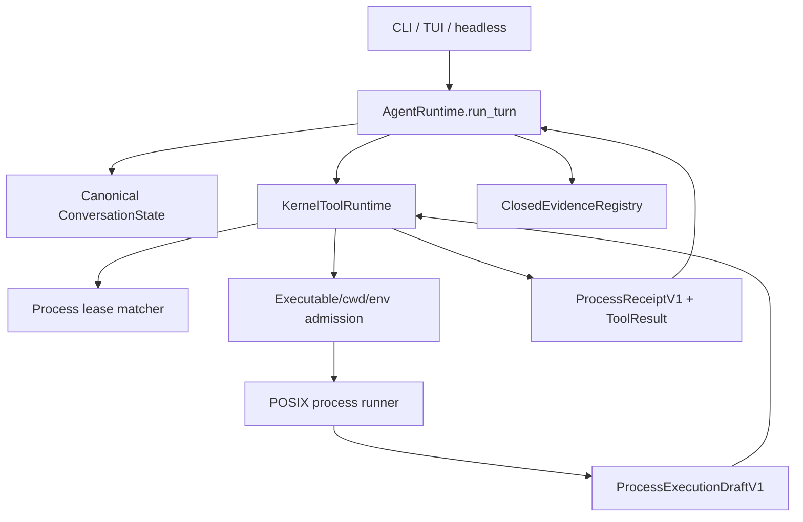
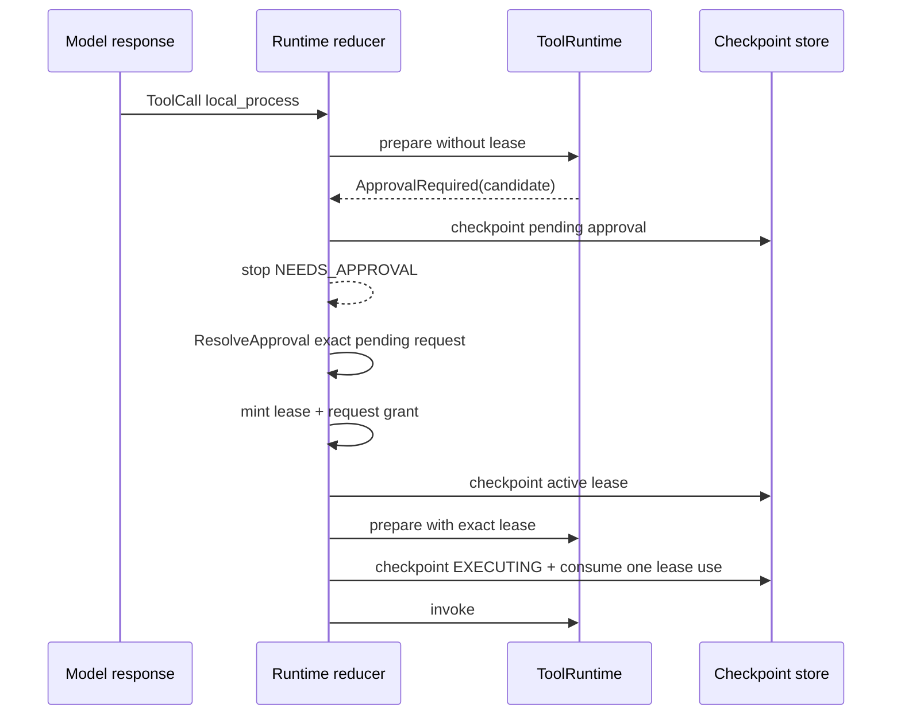

# 015 Governed Local Action — Architecture Design

## 1. Authority and target

本设计细化 `docs/plans/2026-08-09-001-feat-governed-local-action-plan.md` 的 Product Contract。Plan 的 R-ID
拥有产品行为，KTD-ID 拥有实现机制；本文只把合同投影为可实现的边界和状态变化。冲突时依次服从 `AGENTS.md`、
`STRATEGY.md`、Kernel/Extension contracts、015 plan，再到本文。

015 只增加一个 `local_process` governed tool。它让 First Agent 在当前 Goal 中运行结构化本机程序，但不增加
shell、Coding Agent mode、第二个 Runtime、daemon 或 OS sandbox 承诺。

## 2. Preserved invariants

- `AgentRuntime.run_turn` 是唯一 production model/tool loop 和 checkpoint 初始化后的 state progression owner。
- `ContextManager` 独占模型上下文选择；process output 只能作为 bounded untrusted tool result 进入 context。
- `KernelToolRuntime` 独占 prepare、policy、approval matching、invoke 和 result normalization。
- ToolSpec、intent、approval、checkpoint 和 receipt 用 `LOCAL_SAME_UID_PROCESS` 表达 child authority；它与 wrapper-owned egress 正交。
- Provider adapter 只做 `ContextPack -> ModelResponse`；它不能 spawn、批准、恢复或铸造 receipt。
- CLI、TUI、headless 只翻译 typed action 和渲染 state/result/event。
- Composition 静态注册 capability；不增加 dynamic registry、service locator、fallback 或 feature flag。
- `EXECUTING` checkpoint 必须先于 effect；result checkpoint 必须晚于 Kernel result。
- 未确认 effect 继续使用既有 unknown-outcome recovery，绝不自动重放。

## 3. Trust model

### 3.1 What 015 guarantees

015 保证：用户在 spawn 前看到 exact top-level command 与资源/环境策略；授权有限、可撤销并绑定当前 Goal；
First Agent 不主动把 credential/proxy/Provider 配置注入 child；runner 对自己启动的 POSIX process group 做 bounded
timeout 与 reap；Runtime 用 durable receipt 和现有 evidence oracle 判断完成。

### 3.2 What 015 does not guarantee

获批 child 以 First Agent 相同 OS user 运行。cwd 只是初始目录，不限制 filesystem。清理 environment 不是
filesystem、network 或 process sandbox。child 可以通过系统 API、用户数据库或绝对路径发现同 UID 资源，也可联网
或派生脱离原 process group 的进程。approval preview、README 和 UI 必须使用这一准确措辞。

015 不声称阻止恶意的用户自有 executable。用户批准的是一项 operator-trusted same-UID action。更强隔离需要
独立里程碑选择 OS sandbox/container、network policy 与 filesystem allowlist。

## 4. Component map

`agent/process/` 是高内聚 capability package，不拥有 Runtime state。Runner 既不读取 checkpoint，也不认识 Goal、
approval 或 model。它只消费已经准备好的 immutable spawn request 并返回 closed draft 或抛出未确认异常。

## 5. Closed contracts

### 5.0 ExecutionAuthorityClass

这是与 `EgressClass` 正交的 closed enum，只有两个 v1 成员：

- `IN_PROCESS`：现有 file、Web、Memory、Skill、MCP、SubAgent 等 callable 仍由各自 side-effect/egress policy 治理，
  不代表它们无副作用或无网络，只表示该 ToolSpec 不授予一个新的 same-UID OS process。
- `LOCAL_SAME_UID_PROCESS`：只有 `local_process` 使用；Policy 必须要求 §5.3 的 exact process candidate/lease 和
  same-UID informed approval。

每个 `ToolSpec`、`ExecutionIntent` 和 durable executing record 都携带一个明确成员，不能从 `SideEffectClass` 或
`EgressClass` 推断。该成员进入 ToolSpec/intent identity digest；015 必须为全部现有静态注册显式投影
`IN_PROCESS` 并重新基线 identity tests。Checkpoint schema 使用一次明确的 versioned migration：只有 015 之前、从未可能
包含 process intent 的旧 schema 可以把缺失成员迁移为 `IN_PROCESS`；当前 schema 缺失/未知成员一律 strict-decode
失败。不得使用运行时 optional fallback、基于 tool name 猜测或 compatibility branch。

### 5.1 ProcessCommandV1

Canonical command identity 包含：

- 用户/模型提交的 executable token。
- resolved executable canonical path。
- symlink-chain digest 与 final executable identity。
- exact ordered argv；不包含 argv[0] 的隐式重写语义。
- workspace-relative cwd 与 descriptor-bound cwd identity。
- selected `short|standard|long` resource profile identity。
- fixed environment policy identity。
- `LOCAL_SAME_UID_PROCESS` authority identity。
- canonical command fingerprint。

模型工具参数只暴露 `executable`、`argv`、`cwd`、`profile`。profile 只能是 `short`、`standard`、`long`；
timeout/output caps 由本文 §7.3 固定，不让模型提交 raw limits。

### 5.2 ExecutableIdentityV1

identity 至少绑定：

- canonical resolved path。
- 每段 symlink 的 path、link target 与 stat digest。
- final `st_dev`、`st_ino`、file type、mode、size、`mtime_ns`。
- bounded streaming content SHA-256。
- executable bit 与 regular-file verdict。

Admission 可以接受 absolute executable、PATH 中的 bare name 或 workspace-relative executable。它拒绝空 token、NUL、
directory、non-regular、不可执行、symlink loop、解析漂移和超出 identity byte budget 的文件。PATH 只在 composition
时捕获并用于 resolution；最终 spawn 使用 resolved absolute path。

Approval 后、spawn 前重新计算 identity。变化返回 `KnownNotExecuted(code="executable_identity_changed")` 或等价 closed
code，并且 spawn count 为零。该 revalidation 缩小 race，不宣称消除 kernel-level TOCTOU。

### 5.3 ProcessAuthorityCandidateV1

candidate 是 approval request 的 closed typed projection，包含：

- Goal ID/revision 与 workspace identity digest。
- command fingerprint 及可读 command projection。
- executable、argv、cwd、resource、environment digests。
- requested maximum uses = 8。
- issued-at candidate time 与 expiry policy = 60 minutes。
- same-UID trust notice identity/digest。
- execution-authority identity/digest；不得从 `EgressClass` 推断。

candidate 不包含 credential、raw environment、checkpoint path、absolute workspace path 或 opaque host data。preview 可以显示
resolved executable absolute path，因为这是用户批准的执行对象；checkpoint 中只保留合同需要的 path 与 digest，任何
secret-like value 必须在 admission 前拒绝或在 render 时 fail closed。

`candidate_digest` 必须由 candidate 的全部 immutable authority fields 计算，而不是由调用者任意提供。当前 checkpoint
schema v6 对 current candidate 重新计算并严格核对 digest；v3-v5 无该可验证合同，migration 必须撤销 pending
process candidate/lease 并要求重新 prepare + approval，绝不得用当前代码为旧数据重签。这样即使
checkpoint JSON 中的 readable command、fingerprint、Goal/workspace binding、profile 或 artifact requirement 被单独改写，
reload 也会 fail closed，不能把已展示的授权偷换为另一条命令。

`ApprovalRequest` 对 process 请求携带一个 optional closed-union member `process_authority_candidate`，值是完整 canonical
`ProcessAuthorityCandidateV1`，而不是只有 preview 或 binding digest。它随 `AWAITING_APPROVAL` checkpoint strict
round-trip；非 process request 必须为 absent。Restart 后 `ResolveApproval` 只能从该 durable candidate 铸造 lease，
并重新核对 current Goal ID/revision、workspace、request/action identity 与 state revision。candidate 缺失、类型不匹配、
字段漂移或 stale 时拒绝批准且零 spawn，不得从 preview、model output 或 transient prepare memory 重建。

### 5.4 ProcessAuthorityLeaseV1

只有 `ResolveApproval(approved=true)` 的 Runtime reducer 可以从 current pending candidate 铸造 lease。lease 包含：

- lease ID 与 lease digest。
- candidate 的所有 binding identity。
- 用户可读的 exact command projection；CLI/TUI/headless 的 lease 视图不得只显示 digest。
- approved request/action identity。
- `issued_at`、`expires_at`。
- `max_uses=8`、`uses_consumed`。
- active/revoked 状态只由 canonical state transition 派生；不建立第二份 ledger。

匹配要求所有字段 exact equal。不存在 wildcard、prefix、regex、normalized-equivalent argv 或目录授权。`uses_consumed`
在 intent 进入 durable `EXECUTING` checkpoint 时递增；preparation denial、stale approval 和未进入 `EXECUTING` 的请求
不消耗。checkpoint 后的 identity/spawn failure 不恢复 use。实现必须用 checkpoint CAS 避免同一 use 并发消费。

Durable expiry 使用注入的 UTC clock 与 strict RFC 3339 timestamps。若 current time 早于 `issued_at`、timestamp 无法解析或
clock rollback 使有效性不能证明，lease 立即失效并重新批准。单次 process deadline 仍使用 monotonic clock；不得混用
wall clock 计算 timeout。

`lease_digest` 同样覆盖全部 immutable lease fields；`uses_consumed` 是唯一由 checkpoint CAS 单调推进的 mutable counter。
current schema v6 reload 必须验证 digest，禁止接受“保留旧 digest、改写 fingerprint/expiry/profile/readable command”的
retargeted lease。ToolRuntime 在 prepare 匹配后先重验 binding/policy，再在真正 callable/spawn 前紧邻重验
expiry 与 remaining uses。哈希、文件身份或 policy 重验跨过过期边界时必须零 spawn 并重新请求授权。

### 5.5 ProcessExecutionDraftV1

Runner 只能返回 closed draft：

- spawn verdict 与 observed PID/process-group identity。
- monotonic start/end duration。
- exit code 或 signal/timeout termination class。
- cleanup attempts 与 group-reaped confirmation。
- stdout/stderr captured bytes、digest、decoded bounded projection 与 truncation flags。
- closed error code；不得带自由 metadata map。

Draft 不是 receipt。普通 callable 返回 draft 必须继续被拒绝；只有 registration safety policy 明确标记 closed
`local_process_v1` 时，Kernel 才允许解析。

### 5.6 ProcessReceiptV1

`KernelToolRuntime` 用 verified `ExecutionIntent` 与 validated draft 铸造 receipt：

- receipt version、receipt digest、tool identity、intent digest、lease ID/digest/use ordinal。
- Goal ID/revision、workspace identity。
- executable identity、argv/cwd/resource/environment digests。
- execution-authority identity。
- outcome：`exited`、`signaled`、`timed_out_reaped`；unknown 不产生 receipt。
- exit/signal、duration、stdout/stderr digest/bytes/truncation。
- observed process-group cleanup claim。

ToolResult metadata 只投影 evidence oracle 所需的 closed receipt fields。完整 receipt 作为 canonical tool-result fact 的
受限子结构持久化；UI 默认只显示 command、exit/timeout、duration 和 truncation。

ContextPack 投影 process result 时必须使用专用
`FIRST_AGENT_UNTRUSTED_PROCESS_RESULT {tool_call_id,receipt_digest}` frame。普通 untrusted tool result 只能得到通用 frame，
不能被验收当作 process-output 证据。E3 必须证明所有被转发的 durable process receipt digest 都出现在专用 frame中。

## 6. Tool schema and shell exclusion

`local_process` input schema 只允许：

- `executable`: non-empty bounded string。
- `argv`: bounded array of bounded strings，可以为空；每个元素拒绝 NUL。
- `cwd`: normalized workspace-relative directory，默认 `.`。
- `profile`: closed enum `short|standard|long`，默认 `standard`。

不得出现 `command`、`shell`、`script`、`stdin`、`env`、raw `timeout`、`background`、`pty` 或 redirection fields。
`KernelToolRuntime` 把 argv 直接交给 process API，始终 `shell=False`。`;`、`|`、`>`、`$()`、backtick 和 newline 在
argv 中只作为 literal bytes，不做额外字符串拒绝；安全性来自无 shell parsing，而不是不完整 metacharacter blacklist。
OpenAI-compatible adapter 允许模型把 JSON string 内的 newline 直接输出为裸 LF，并在进入 typed arguments 前归一化为
同一 newline 值；该兼容仅覆盖 string 内 LF。NUL、坏转义、trailing comma 或其他非法 JSON 仍 fail closed，不能借
“修复”改变 command 语义。

解释器本身可以作为 approved executable，例如 Python。用户批准的是 exact interpreter argv；preview 必须显示完整
inline code 或 script path。lease 不承诺绑定 argv 引用文件的内容，UI 的 same-UID notice 必须说明 command 可能执行
workspace 中随后变化的代码。First Agent 自己修改 Goal 会失效 lease；外部文件修改不会被伪装成已检测。

## 7. Admission boundary

### 7.1 cwd

cwd 复用 `WorkspaceBoundary` 的 descriptor-relative、no-follow、private/sensitive denial、ancestor identity 和 protected
inode 规则。最终必须是当前 workspace 内的 directory。Admission 返回打开的/可重验的 cwd identity；runner 不重新
解释用户 path string。

cwd admission 只保护 First Agent 的起始目录选择。它不限制 child 的后续 chdir/open/network 行为。

### 7.2 EnvironmentProfileV1

Admission 只构造 immutable environment plan，不创建目录。`EXECUTING` checkpoint 完成后，runner 才从空 map 构造
child environment 并创建下列 owner-only directories：

- `HOME` 指向本次 invocation 的 owner-only product temp home。
- `TMPDIR` 指向 owner-only product temp dir。
- `PATH` 只保留 composition 捕获值中存在且 canonical resolution 后的绝对目录；空项、相对项和不可解析项拒绝。
  executable admission 与 child environment 消费同一份 sanitized PATH，防止 `/usr/bin/env` shebang 在 child cwd
  中被相对目录劫持；approval/receipt 只保存 policy digest，不保存 raw PATH。
- locale 使用 closed safe subset；若 host locale 不可安全采用，使用平台可用的 deterministic fallback。
- 不传 `ANTHROPIC_*`、`OPENAI_*`、`FIRST_AGENT_*_KEY`、`TAVILY_*`、`HTTP*_PROXY`、`ALL_PROXY`、`NO_PROXY`、
  `SSH_*`、`AWS_*`、`GOOGLE_*`、`AZURE_*`、`GITHUB_*`、cookie/netrc/session 或其他 ambient key。

实现应采用 allowlist 构造，不采用越来越长的 denylist 作为安全边界。上述 deny names 是 acceptance canary，不是
实现策略。isolated directories 在 execution 完成后 best-effort cleanup；cleanup failure 不改变 child outcome，但记录
bounded advisory，且不得泄露内容。

### 7.3 ResourceProfileV1

三个 profile 的规范值：

| Profile | Wall deadline | TERM / KILL grace | stdout / stderr / combined bytes | Rendered chars |
|---|---:|---:|---:|---:|
| `short` | 10 s | 1 s / 1 s | 256 KiB / 256 KiB / 512 KiB | 16,000 each |
| `standard` | 120 s | 2 s / 2 s | 1 MiB / 1 MiB / 2 MiB | 32,000 each |
| `long` | 900 s | 5 s / 5 s | 2 MiB / 2 MiB / 4 MiB | 64,000 each |

所有 profile 同时限制：

- wall-clock deadline 与 TERM/KILL grace。
- stdout cap、stderr cap、combined cap 与 rendered-char cap。
- argv item count、单项 bytes 与 total bytes。
- executable identity hash bytes。

固定值为 128 argv items、每项 16 KiB、total 64 KiB、executable hash 256 MiB。超过任一值在 approval/spawn 前
fail closed。Profile 是 command fingerprint 的一部分；切换 profile 必须重新批准。

CPU、memory、file size、process count 等 OS rlimit 若实现必须作为 defense-in-depth，不能取代 timeout/output contract，
也不能在不跨平台验证时写成产品保证。

## 8. Approval and lease state transitions

`ResolveApproval(approved=true)` 除铸造 lease 外，还要当即铸造 mandatory process-receipt criterion（绑定
Goal/revision/tool-call/command fingerprint/成功 outcome）。此时 receipt digest 尚未存在，oracle 必须 strict decode
后续 Kernel `ProcessReceiptV1` 并校验全部绑定；unknown recovery 的用户分类不能删除或替代这条义务。

Lease use 在 intent 进入 durable `EXECUTING` checkpoint 时消费。之后即使 executable revalidation 或 spawn 前创建
isolated directory 失败，该 use 也不恢复；这让 crash/concurrency accounting 单调且确定。Preparation denial、stale
approval 和未进入 `EXECUTING` 的请求不消耗。

Goal delta、natural-language correction、pause、cancel 和 verified completion 必须清空 process leases。普通 approval
bookkeeping revision 不能让刚批准的 lease 自我失效；匹配绑定 Goal revision，而不是每次 ConversationState revision。

`RevokeProcessAuthority` 是 typed action，参数是 readable selected lease 或 `all`。它要求 expected state revision，并
采用 replay/CAS 语义。Revoke 不假装取消已在运行的 process；若当前已在 `EXECUTING`，UI 明确说明 revoke 只阻止
后续 execution，当前 outcome 仍按 runner/recovery 处理。

## 9. Process lifecycle

### 9.1 Spawn

Runner 使用 resolved absolute executable 与 exact argv，`shell=False`、stdin closed/DEVNULL、stdout/stderr pipes、
`start_new_session=True` 或等价 POSIX group creation。不得使用 `os.system`、shell wrapper、terminal emulator 或
async background handle。

spawn 前错误可以证明 effect 未发生，返回 `KnownNotExecuted`。一旦 process API 返回 PID，任何未分类异常都视为
可能已执行。

### 9.2 Output drain

stdout 与 stderr 必须并发增量读取，避免 child 因 pipe backpressure deadlock。超过 stream cap 后仍需 drain/discard 到
process exit 或 cleanup完成，不能停止读取导致 hang。保存 bounded decoded projection、raw byte digest、observed byte count
和 truncation。invalid UTF-8 用 deterministic replacement，不让 terminal control/ANSI/bidi 进入未转义 UI。

### 9.3 Timeout and cleanup

deadline 到达后：

1. 记录 timeout observation。
2. 向 observed process group 发送 TERM。
3. 在 bounded grace 内继续 drain/reap。
4. 仍存活则向同一 group 发送 KILL。
5. 在最终 bounded grace 内 reap parent 并确认 observed group 状态。

只有 parent reaped 且 group cleanup claim 有支持证据时，返回 `timed_out_reaped`。`communicate(timeout)` 抛出本身不
表示 child 已停止。kill/reap 无法确认时抛给 Runtime，进入 unknown recovery。

child double-fork/setsid 可能逃离 group；receipt 不得声称“所有 descendant 已终止”。

## 10. Outcome and recovery matrix

| Observation | Classification | Durable result | Automatic retry |
|---|---|---|---|
| admission/spawn 前失败 | known not executed | error ToolResult, `executed=false` | model may submit a new request |
| normal exit 0 | known executed | process receipt | no replay of same intent |
| normal nonzero/signal | known executed | error or non-success process receipt | no automatic retry |
| timeout and group cleanup confirmed | known executed timeout | timed-out process receipt | no automatic retry |
| spawn 后 exception, cleanup unknown | unknown outcome | existing RecoveryRequest | never |
| restart sees `EXECUTING` | unknown outcome | recovery UI | never |

用户 resolution 继续使用既有 `success` / `failed` / `stop` contract。`success` 只解决“effect 是否发生”的未知，不得
自行伪造 process receipt 或 command evidence。若 Goal 需要 receipt，用户必须重新建立可验证结果或用明确
USER_CONFIRMATION criterion；不能把 recovery prose冒充 Kernel observation。

## 11. Evidence rules

`TOOL_RECEIPT` criterion predicate 可以要求：

- exact tool/operation identity。
- exact process receipt digest 或 command fingerprint。
- expected outcome class 与 exit code。
- optional stdout/stderr digest 或 bounded output token。

Oracle 采用加式 closed shape，不能把现有单键合同整体放宽：

- 012-014 非 process receipt 的 legacy `{"receipt_digest": ...}` 精确形状保持原行为。
- `ProcessReceiptV1` 必须使用 typed process predicate，至少包含 `receipt_kind=process_v1`、command fingerprint 和
  expected outcome；`exited` 还必须给 expected exit code。批准时铸造的义务可不包含当时尚未生成的
  `receipt_digest`，但 oracle 仍必须 strict decode canonical receipt 并精确校验 Goal/revision/fingerprint/outcome/exit。
  若 predicate 包含 `receipt_digest`，必须为 64-lowercase-hex 且精确相等。stdout/stderr digest 是 optional closed keys。
- predicate 的 receipt kind、必需键、值类型或任何 key 不在 closed allowlist 时 fail closed；不能因为 metadata 多了
  字段就接受，也不能让 legacy one-key predicate替代 process-success criterion。

`ToolResult.metadata` 只投影 Kernel 从 `ProcessReceiptV1` 计算的上述 closed fields。普通 callable metadata、model prose
或同名自由 map 不能进入该分支。实现必须补 012-014 单键回归和 process wrong-kind/wrong-outcome/wrong-exit/unknown-key
mutation tests。

ClosedEvidenceRegistry 只读取 current Goal/revision 的 durable raw ToolResult fact，重算 receipt digest 与 predicate。
它拒绝 fake、error、unknown、wrong Goal、wrong lease、mutated receipt 和 assistant prose。

Artifact delivery 需要两个 mandatory criteria：process receipt 证明 command contract，filesystem digest/read-back 证明
artifact。Research artifact 继续使用 `RESEARCH_PROVENANCE`。模型不能用 exit 0 取消其他 mandatory criterion。

## 12. UI contract

### 12.1 Approval preview

默认 preview 按这个顺序显示：

1. 为什么当前 Goal 需要本机程序。
2. resolved executable 与每个 argv 的 literal rendering。
3. workspace-relative cwd。
4. timeout 与 output caps。
5. isolated environment policy。
6. lease：8 uses、60 minutes、当前 Goal/revision、可撤销。
7. 高风险提示：same-UID、cwd 非隔离、可联网/派生子进程、argv 引用内容可能变化。
8. yes/no 决定。

不得把 risk notice 藏在 advanced view。CLI/TUI/headless 的 wording 可以适配介质，但 canonical request 和决定相同。

### 12.2 Authority view and revoke

默认 `/permissions` 或等价 typed view 展示 active process lease 的 command summary、cwd、剩余 uses 和 expires-at。
advanced view 才显示 lease digest/ID。`/revoke` 的自然语言和精确命令都转为 typed revoke action；adapter 不直接改 state。

### 12.3 Result view

显示 exit/timeout、duration、stdout/stderr bounded projection 与 truncation。unknown outcome 必须显著显示“不能确认是否
完成，未自动重跑”，并给出 existing resolution choices。

## 13. Composition and platform behavior

支持 POSIX lifecycle 时，standard composition 静态注册 `local_process`。ToolSpec 使用 `SideEffectClass.EXTERNAL`、
wrapper `EgressClass.NONE` 和 `ExecutionAuthorityClass.LOCAL_SAME_UID_PROCESS`。`EgressClass.NONE` 只表示 wrapper 不发送
网络，不表示 child 无网络能力。Policy 对该 authority class 永远要求 exact process approval。

这只让模型知道 tool schema，不授予任何 process authority。未支持平台可以不注册，但 startup/view 必须准确说明 capability unavailable；不得注册一个后来
走 shell fallback 的伪实现。

Materialized tree 必须从同一 `main -> composition -> AgentRuntime -> KernelToolRuntime` 路径构造。E3 harness 不得自己
实例化 runner 代替 production composition。

## 14. Security negative contract

- 不读取 `.env`、shell history、netrc、Claude/Codex config/memory/session 或 private/runtime 数据。
- 不把 provider/Web credential 传给 child 或写入 preview/checkpoint/event/context/receipt/docs。
- 不允许 model 设置 env、stdin、timeout、output cap、shell、TTY 或 background。
- 不允许省略/降级 `LOCAL_SAME_UID_PROCESS` authority class，也不把 wrapper egress 投影成 child network guarantee。
- 不允许 lease wildcard、prefix、directory、provider-generated approval 或跨 Goal reuse。
- 不根据 exit 0、stdout 文本或 model prose 自动 `VERIFIED_DONE`。
- 不把 cwd、environment cleanup、process group 或 rlimit 描述为 OS sandbox。
- 不通过 SubAgent/MCP/Skill 绕开 local process contract，也不把 local process runner复用为产品内 CodingLoop。

## 15. Verification ownership

- Contracts/checkpoint：`tests/kernel/`。
- Admission/runner/tool：`tests/process/`。
- Approval/recovery/evidence：`tests/continuity/` 与 `tests/kernel/`。
- CLI/TUI/headless parity：各 adapter tests 与 015 reference journey。
- Materialized truth：`scripts/verify_015_materialized_tree.py` 与 delivery seal。
- Real Model truth：`scripts/run_015_e3.py` 与 015 E3 receipt。
- Final architecture/security truth：fresh reviewer 与完整 gates。

## 16. Deferred design

015 不提前设计 OS sandbox policy、network allowlist、Windows Job Objects、interactive streaming、background job handle、
multi-root lease、signed executable publisher、package manager credential profile 或 autonomous command optimization。这些能力
必须在真实 dogfood 证明需求后各自形成新的 durable authority contract。
