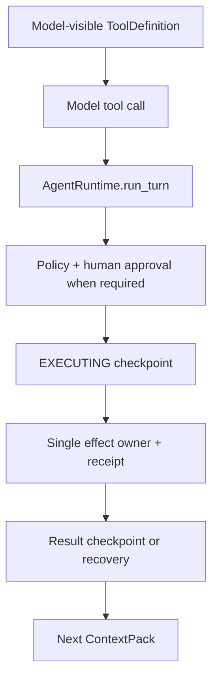

# Capability Evidence Closure Contract

## Purpose

本合同定义六项 capability 从“代码存在”晋级到“本地闭环”的共同证明规则。

它不增加 Runtime abstraction，也不取代各 capability design。
它约束实现者如何证明现有设计已经落地，防止 test name、源码形状、局部 happy path 或安全拒绝被误写成完整能力。

## Authority and scope

权威顺序为：`AGENTS.md`、`docs/architecture/KERNEL_ARCHITECTURE.md`、`docs/architecture/EXTENSION_CONTRACTS.md`、本合同、各 capability design、实施计划与执行记录。

本合同适用于 Skill、MCP、Memory、SubAgent、Scheduler、TUI，以及它们依赖的 delivery、approval、outcome、lifecycle 和 claim 证据。

它不授权真实 provider、真实 MCP、真实 credential、用户私有 Memory/Skill、外部网络、commit 或 push。

## Evidence ladder

| Level | Proves | Does not prove |
|---|---|---|
| E0 source-shape | import、符号、schema 或静态 owner 关系存在 | 运行时行为、effect count、恢复语义 |
| E1 component behavior | 一个 owner 在受控输入下产生正确 observable result | 跨 owner wiring、真实入口、clean delivery |
| E2 boundary journey | production composition 经过真实边界完成状态旅程，并验证失败路径和计数 | 新机器能收到相同内容、用户认为能力有价值 |
| E2M materialized delivery | 从精确 intended tree 非 editable 安装后重现 E0-E2 | 外部系统兼容性、真实任务价值 |
| E3 accepted reference task | 用户批准的 reference task 产生可核对价值 | 未测试场景、production readiness |

任何 test count 都不能跨级替代证据。
`locally-verified` 至少需要目标 capability 的 E1、E2、E2M，以及非本轮实现执行器完成的 promotion review；reviewer 必须在写 controls 前亲自重跑 materialized content gate，而不是只信任 executor receipt。`accepted` 还需要独立的 E3 record。
实现执行器可以提交证据和推荐 verdict，但不能单方面把自己修改的实现、test oracle、manifest、verifier 与 claim 封成 `locally-verified`。

## Observable-oracle contract

每个 blocking finding 必须先有一个因目标缺口而失败的行为测试。
测试名称、docstring、实现符号或源代码字符串不能作为该测试唯一 oracle。

一个合格 oracle 至少断言下列适用项：

- 输入与最终 executable effect 是同一个 canonical object。
- effect、provider、spawn、open 或 mutation count 符合预期。
- authoritative `RunResult`、checkpoint、pending request 或 durable record 进入预期状态。
- known-not-executed、known-executed success、known-executed error 与 unknown 没有互相降级。
- restart、replay、conflict 或 stale binding 后仍从 authoritative state 得到同一结论。
- bounded preview、result 和 error 没有截断后冒充完整对象。
- 使用 production composition 或真实 owner boundary，而不是绕过审批、checkpoint 或 adapter 的直接 helper call。

以下模式不能单独关闭 finding：

- `assert "some_symbol" in source`。
- 测试只验证异常类存在，却不验证 call/effect count 与 state。
- 只构造第二份 catalog/store 来模拟“运行时复验”。
- 用 FakeProvider 的立即返回证明任意 provider 都有 deadline/termination contract。
- 用 submit-only Pilot 证明 TUI action parity。
- 用安全拒绝当前 provider 证明 SubAgent 已可用。
- 用脏工作树的 Ruff/pytest 证明 Git delivery。

## Agent-native E2 chain

凡是模型可见 capability tool，正向 E2 必须尽可能经过同一条 production chain：

直接调用 store、catalog、bridge、runner 或 callable 只能提供 E1。
Scheduler 与 TUI 没有 model-visible ToolDefinition 时，E2 从真实 typed action/external occurrence 入口开始，并以 authoritative checkpoint/result、调用计数和下一合法 action 为终点。
每项 capability 还要有一个 failure/recovery E2；只有安全拒绝而没有正向 supported journey 时，claim 保持 `implemented-candidate`。

## Prepared-effect binding

所有 WRITE 或 EXTERNAL capability 都必须让现有 `ExecutionIntent`、approval request 与 callable 共享同一个 prepared effect。

prepared effect 在现有合同中至少绑定：

- canonical executable input 及其 digest。
- operator-readable destination、operation、risk 与 side-effect class。
- executable、cwd、record、store、provider 或 child profile 等适用 identity。
- revision、generation、descriptor digest 等 precondition。
- effect 后由哪个 owner 产生 commit/outcome receipt。

人类可读 preview 与机器 digest 缺一不可。
digest 只能证明批准后没有变化，不能证明用户看懂了对象；无法完整安全显示的 effect 必须在 `EXECUTING` 前拒绝。

## Outcome and receipt contract

Capability callable 只能产生四种父侧语义：

| Outcome | Required fact | Parent handling |
|---|---|---|
| known-not-executed | owner 能证明 effect commit point 未越过 | `executed=false` bounded tool error |
| known-executed success | owner 收到并验证 terminal success | `executed=true, is_error=false` |
| known-executed error | owner 收到并验证 terminal business/protocol result，且 execution 已知 | `executed=true, is_error=true` |
| unknown | effect 可能发生，但 terminal result、cleanup 或 termination 无法确认 | 抛给 Runtime，进入 human recovery |

只有实际持有 transport、store mutation 或 provider call receipt 的 owner 可以分类。
adapter exception、timeout 名称或调用方猜测不能覆盖 receipt。

## Durable identity contract

凡是 design 声明 scan/prepare 后复验的对象，运行时必须同时比较 content digest 与打开对象的 identity。

相同内容的 inode/file replacement、ancestor swap、symlink/hardlink 变化、revision rollback 都属于 drift，除非对应 design 明确只承诺 content identity。
复验必须基于 no-follow descriptor-relative open 或等价稳定 handle；先 `stat` 再普通 path `open` 不满足该合同。

## Lifecycle ownership

CLI、Scheduler、TUI 与 capability closeables 共用一个 composition lifecycle：

1. 停止接受新 action。
2. 等待已承诺为 bounded 的 invocation/worker 收口，或保留可恢复状态。
3. 从 authoritative result/checkpoint 投影最终状态。
4. reverse-close 已构造的 resources，且每个 resource 只关闭一次。

任何早返回、startup exception 或 UI close intent 都不能绕过该序列。
Textual thread cancellation、event 丢失和 terminal renderer 输出都不是 Runtime completion 的权威证据。

## Delivery admission contract

`docs/implementation/008_INTENDED_TREE_MANIFEST.json` 是历史证据，不再是可信 delivery source。
它由 `git diff HEAD` 加全部未跟踪文件自动生成，已把 runtime-state path 纳入产品树；`scripts/verify_materialized_tree.py` 的 `--content` 与 `--control-seal` 也尚未实现。

009 使用新的 exact manifest，并遵守以下 admission 规则：

- tracked change 可从 pinned baseline commit 枚举，但 operation 与 final digest 仍需验证。
- untracked path 不能因为“存在”就自动进入 manifest；只能由显式 product/test/package/doc allowlist admission 进入。
- add/modify entry 在读取或 hash 前必须 descriptor-relative no-follow 打开，并验证为 owner-controlled、link count 为 1 的 regular file；manifest 同时声明并复验 Git mode/type。symlink、hardlink 和特殊文件一律在读取内容前 fail closed。
- `.env*`、credential、runtime logs/state、`.ua/`、`graphify-out/`、`tui/agent_log.jsonl`、`tui/memory/`、用户 Memory/Skill/MCP/SubAgent 私有目录永不读取内容、永不 hash、永不 materialize。
- 未命中 allowlist 或 denylist 的 untracked path 只报告 repo-relative path 并让 gate fail；不能 broad-add、猜测或静默忽略。
- manifest 自身是 non-self-hashed root of trust；execution log、independent review receipt 与 current-status 是 post-content controls。executor 可在 content gate 后只向 execution log 写 provisional receipt/verdict；随后只有独立 reviewer 可完成 review receipt、final log/status 与 control digests，manifest 记录三者最终 digest。
- temporary Git index 只能应用 exact manifest entries 与声明的 control files，不得改真实 index。
- materialized product 必须 non-editable 安装到临时环境，并从 neutral cwd 验证 module/entrypoint origin；任何 import 指回原 dirty tree 都失败。
- materialized install、Ruff、pytest、entrypoint 与其 descendants 必须运行在 verifier-owned 的 OS deny-network boundary 内，并先以 DNS/TCP 负向探针证明阻断。当前 Darwin target 使用 `/usr/bin/sandbox-exec`；boundary 缺失或探针未在发送前失败时 E2M fail closed。

## Claim contract

每项 capability 独立晋级，允许不同结果：

- `designed`：design 边界完整。
- `implemented-candidate`：代码与局部自动测试存在，但仍有 closure 或 delivery blocker。
- `locally-verified`：适用 E1/E2/E2M 全部通过、residual limitation 已写明，且独立 promotion review receipt 已确认 manifest admission、关键 oracle test body，并记录 reviewer-owned content-gate rerun。
- `accepted`：用户批准的 E3 record 完成。

`safe-unavailable` 不是 claim level，而是 capability limitation：例如 SubAgent 在没有合格 provider contract 时可以正确 fail closed，但不能因此宣称可用、`locally-verified` 或 accepted。

执行记录只允许 `not started`、`Red confirmed`、`Green focused`、`verified`、`blocked`。
只有命令 exit code 已知、输出未截断且 oracle 覆盖目标行为时才能写 `verified`。
`blocked` 必须保留准确 Red evidence、具体无法满足的合同、最终安全行为与未晋级 claim；它不能用 source shape、安全拒绝或删掉 oracle 来伪装 Green。
执行器写入的 `verified` 是 unit evidence state，不自动提升 capability claim；promotion review 失败或未运行时，claim 仍是 `implemented-candidate`。

## Capability closure index

| Capability | Design authority | 009 closure focus |
|---|---|---|
| MCP | `docs/architecture/capabilities/MCP_DESIGN.md` | exact approval、frozen env/identity、bounded transport、receipt + cleanup |
| Memory | `docs/architecture/capabilities/MEMORY_DESIGN.md` | strict durable snapshot、revision-bound preview、fresh source projection |
| SubAgent | `docs/architecture/capabilities/SUBAGENT_DESIGN.md` | provider contract、receipt precedence、exact handoff、honest availability |
| Scheduler | `docs/architecture/capabilities/SCHEDULER_DESIGN.md` | calendar-valid identity、one-shot conflict reconciliation、latest state |
| Skill | `docs/architecture/capabilities/SKILL_DESIGN.md` | identity + digest revalidation、model-visible metadata、read-only scope |
| TUI | `docs/architecture/capabilities/TUI_DESIGN.md` | complete keyboard actions、authoritative reopen、shared event/lifecycle |

## External anchors

- MCP tools and human-in-the-loop guidance: `https://modelcontextprotocol.io/specification/2025-11-25/server/tools`
- MCP stdio transport stdout/stderr rules: `https://modelcontextprotocol.io/specification/2025-11-25/basic/transports`
- Agent Skills format and progressive disclosure: `https://agentskills.io/specification`
- Textual thread workers: `https://textual.textualize.io/guide/workers/`
- Textual headless Pilot testing: `https://textual.textualize.io/guide/testing/`
- Python subprocess timeout and pipe caveats: `https://docs.python.org/3.11/library/subprocess.html`
