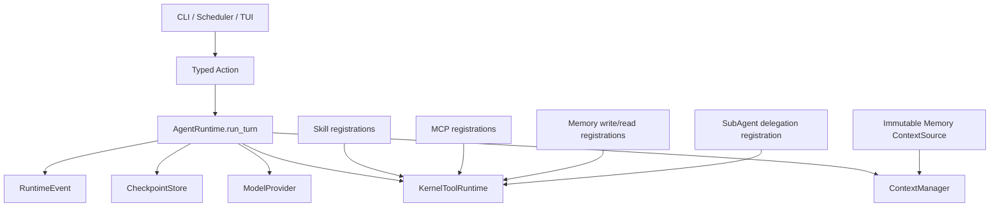

# Capability Reintroduction Roadmap

## Objective

本路线图规定 `my-first-agent` 如何在不破坏 Minimal Runtime Kernel 的前提下，重新接入 Skill、MCP、Memory、SubAgent、Scheduler 和 TUI。

目标不是恢复旧代码，而是让每项能力先形成一个小而完整的纵向闭环，并为后续增强保留真实边界。

## Non-negotiable boundaries

- `AgentRuntime.run_turn` 仍是唯一 production model/tool loop 和 conversation state 变更入口。
- `ContextManager` 仍是模型可见上下文的唯一选择者。
- `KernelToolRuntime` 仍是所有 capability callable 的唯一调用者。
- 任何 WRITE 或 EXTERNAL effect 仍遵循 `prepare → approval/policy → checkpoint EXECUTING → invoke → result checkpoint`。
- CLI、Scheduler 和 TUI 只提交 typed action，并消费 `RunResult` / `RuntimeEvent`。
- Provider adapter 仍只投影 `ContextPack → ModelResponse`，不得调用工具或推进状态。
- 不恢复旧 API、旧 checkpoint、旧 CLI 或旧 capability state，也不增加 compatibility fallback。
- 不增加动态 plugin manager、service locator、第二个 registry lifecycle 或 dormant feature flag。
- Graphify 与 Understand Anything 只帮助 Coding Agent 理解代码，不进入产品运行时。

## Shared extension shape

能力包只能贡献不可变合同、registration、read-only context candidates 或外部 adapter。
它们不能拥有 Runtime 的控制权。

## Implementation order

| Order | Capability | Boundary proven | Entry gate | Exit gate |
|---|---|---|---|---|
| 0 | Tool composition foundation | 多来源 registration、per-registration policy 与 outcome 仍汇入一个显式 composition，并锁定 EXECUTING action legality | 当前 Kernel 全量测试通过 | 文件工具行为不变，所有 callable caller 仍唯一；EXECUTING Cancel unchanged、Resume 进入 recovery；不预建 ContextSource/closeable seam |
| 1 | Skill | operator-trusted declarative capability 可经 governed tools 渐进披露 | Order 0 完成 | Skill body/resource 可读；后续 declared Python entrypoint 复用既有 structured sandbox，无 prompt hook |
| 2 | MCP | 固定的外部工具描述可映射为 governed EXTERNAL tools，并由首个真实 closeable 验证 ordered close stack | Skill 非回归通过 | stdio fixture 完成 initialize/call/close，漂移与未知结果 fail closed |
| 3 | Memory | 新的 ContextSource seam 与 sources composition 不夺取 ContextManager 所有权 | MCP 非回归通过 | approved memory 可预算召回，写操作经审批，source 错误在 provider 前失败 |
| 4 | SubAgent | 同一个 AgentRuntime 实现可执行受限 child run | Memory 非回归通过 | child 无工具/无继承/单次同步终结，父侧 effect ordering 可证明 |
| 5 | Scheduler | Runtime 可被可幂等的外部 occurrence caller 驱动 | SubAgent 非回归通过 | duplicate fire replay，暂停状态交还人类，无后台 scheduler loop |
| 6 | TUI | 新界面可完全复用 typed action/event/result | 所有前置合同稳定 | CLI/headless/TUI 状态结果等价，无 UI-only mutation |

这些计划是默认安全顺序下的**候选队列**，不是“完成前一项就自动实现下一项”的授权。
后一个计划开始前，前一个计划的 Definition of Done 必须全部满足，并且用户必须基于 reference-task evidence 显式授权继续；用户也可以停在任何一个已产生价值的阶段。若要调整顺序，先重审新前置关系，不能由 Coding Agent 自行跳过。
Order 0 不是单独的长期 framework；它由 Skill 计划 `2026-07-18-002` 的 U1 一次性完成，并立即由第一个真实 capability 验证。

本路线图最初记录的 reducer 缺口已由 `2026-07-18-002` U1 修复并由 Kernel tests 锁定；后续 TUI 只做跨入口回归，不再次定义或改写该 reducer 语义。

2026-07-19 的实现审计没有推翻本路线图的接入顺序，但推翻了“六项均已验收”的完成声明。2026-07-20 follow-up 又证明 008 的 delivery final gate 未实现，并发现多个 named test 没有覆盖其声称的行为。008 artifacts 因此冻结为历史；当前真实状态以 `docs/architecture/CURRENT_CAPABILITY_STATUS.md` 为准，closure 证据与执行顺序见 `docs/audits/2026-07-20-capability-evidence-closure-audit.md`、`docs/architecture/CAPABILITY_EVIDENCE_CLOSURE_CONTRACT.md` 与 `docs/plans/2026-07-20-009-close-capability-evidence-gaps-plan.md`。在 009 自动门完成前冻结新增能力。

### Product value gates

每项在实现前都要由用户批准一个具体 reference task；以下是可直接采用或替换的候选。自动测试证明边界，reference task 证明值得保留，两者缺一不可。

| Capability | Candidate reference task | Exit evidence |
|---|---|---|
| Skill | 给定一个 operator-approved 本地 Skill 及一个 resource，让 Agent 显式激活后按其中规则完成一次领域回答 | tool trace、完整未裁剪 guidance、回答中可核对的规则应用 |
| MCP | 对一个用户明确批准的本地 stdio MCP tool 使用无敏感测试数据完成一次真实读/写任务 | 完整 argument preview、approval/EXECUTING/result trace、server-side effect/result check |
| Memory | 在 conversation A 明确 remember 一条项目约定，在 conversation B 的同 workspace/profile 下正确召回并应用 | approval preview、store revision、BudgetReport selection 与最终回答 |
| SubAgent | 让 isolated child 独立审查一段 bounded 设计提案，并与 parent 直接回答对照 | child handoff/成本/时长、至少一个可核对的增量观点；无增量则阶段不授权 |
| Scheduler | 外部 occurrence 触发一个 benign task，并把 needs-human 状态交给人完成 | duplicate fire 计数、relative handoff、人工 resolution 后 authoritative terminal report |
| TUI | 通过 TUI 完成与 CLI 相同的一次 submit → approval/recovery → terminal journey | action digest parity、checkpoint/result parity、键盘路径与 restart evidence |

## Coding Agent handoff protocol

日常能力扩展仍应一次只交一份计划。009 是一次例外性的 closure program：它不增加六项能力，而是按一个 dependency-ordered loop 修复共同 evidence/delivery contract 与六项现有边界。

Coding Agent 应按以下顺序读取，而不是先吞下全部文档：

1. 当前计划的 `Goal Capsule`、`Verification Contract` 和 `Definition of Done`。
2. 当前 active U-ID 及其引用的 requirements/KTD。
3. 对应 capability design、`EXTENSION_CONTRACTS.md` 与被修改的现有代码。
4. 只实现当前 unit 的 Red test 和最小 Green；通过该 unit verification 后再进入下一个 unit。
5. 普通 capability plan 开始前确认用户已批准 reference task。009 不执行 E3；它结束后只提交 automated/local evidence 与 eligibility verdict，等待用户逐项授权。

009 的实现执行器只能提交 provisional verdict；`locally-verified` promotion 与 control seal 由非同一 agent/session 按 `docs/implementation/009_INDEPENDENT_REVIEW.md` 独立完成，避免实现、oracle、manifest 与 claim 由同一执行器自我封存。

每份计划完成后必须单独审阅 diff，并重新运行 architecture/full-suite gates。
如果实现细节与设计冲突，Coding Agent 应报告 blocker；不得通过兼容层、第二套 loop、跳过测试或扩大 scope 自行“解决”。

## Capability contracts

### Skill

- 使用显式 trust roots 构建 bounded immutable catalog。
- 遵循公开 Agent Skills `SKILL.md` 核心格式，但只承诺本项目验证过的严格 subset。
- 每个 Skill 映射为 read-only activation tool；完整 body 只在模型调用该工具后进入 ToolResult。
- `references/` 和 `assets/` 通过单独的 no-follow bounded read tool 读取。
- 只有 `entrypoints` 声明的 `scripts/<name>.py` 可经 exact approval 与既有 structured sandbox 执行；resource tool 不读取脚本。
- 不实现安装/升级/卸载 lifecycle 或远程 registry；用户直接管理显式 Skill root 下的目录。
- experimental `allowed-tools` 不形成 authority。

设计依据：`docs/architecture/capabilities/SKILL_DESIGN.md`。
执行计划：`docs/plans/2026-07-18-002-feat-governed-skill-source-plan.md`。

### MCP

- composition 只读取人类批准的本地 catalog snapshot，不在启动时联网或启动 server。
- 每个 remote tool 映射为一个具体 namespaced `ToolSpec`，不提供万能 `mcp.call`。
- risk、side effect、approval 与 output limit 全部来自本地 policy；remote annotations 只是不可信提示。
- 首版只支持 stdio、bounded text result 和 bounded synchronous call。
- resources、prompts、OAuth、Streamable HTTP、Tasks、notifications 和 live refresh 延后。

设计依据：`docs/architecture/capabilities/MCP_DESIGN.md`。
执行计划：`docs/plans/2026-07-18-003-feat-governed-mcp-tools-plan.md`。

### Memory

- `ContextSource` 只提供 immutable candidates；`ContextManager` 决定是否纳入、顺序与裁剪。
- Memory 内容以带 provenance 的不可信 context block 呈现，永远不能覆盖 system policy。
- store 同时绑定 workspace scope 与 operator-approved provider trust profile；profile 改变时不能自动把旧 Memory 外发给新 destination。
- search/get 是 read-only governed tools；remember/update/forget 是 approval-bound WRITE tools。
- Memory store 显式绑定 workspace scope，且不进入 conversation checkpoint。
- 自动抽取、总结、consolidation、向量检索、跨 workspace 共享和后台维护延后。

设计依据：`docs/architecture/capabilities/MEMORY_DESIGN.md`。
执行计划：`docs/plans/2026-07-18-004-feat-budgeted-memory-source-plan.md`。

### SubAgent

- 父 Agent 通过 `EXTERNAL + ALWAYS_APPROVAL` 的 delegation tool 请求 child run。
- tool adapter 只调用 composition root 注入的 `ChildAgentRunner`，不得导入 provider 或实现循环。
- `ChildAgentRunner` 的唯一 production 实现复用同一个 `AgentRuntime.run_turn`。
- v1 child 使用独立 state、空 ToolRuntime、无 ContextSource、bounded immutable handoff 和一次 model call。
- 后台、递归、并行、工具继承、Memory/MCP/Skill 继承和 child resume 延后。

设计依据：`docs/architecture/capabilities/SUBAGENT_DESIGN.md`。
执行计划：`docs/plans/2026-07-18-005-feat-bounded-subagent-delegation-plan.md`。

### Scheduler

- v1 是给 cron、launchd、CI 或其他外部调度系统调用的 occurrence adapter，不是内置计时器。
- 每次 occurrence 使用独立 conversation/checkpoint 和确定性的首次 `SubmitMessage`。
- 相同 occurrence 重放相同 action，依赖现有 replay contract 防止重复运行。
- approval、recovery、limit 或 retryable pause 必须交还人类，Scheduler 永不自动批准或分类未知结果。
- recurrence parser、timezone、job daemon、自动重试和通知延后。

设计依据：`docs/architecture/capabilities/SCHEDULER_DESIGN.md`。
执行计划：`docs/plans/2026-07-18-006-feat-scheduler-external-caller-plan.md`。

### TUI

- Textual 作为 optional dependency；基础 CLI 安装不引入 TUI 依赖。
- TUI 只把用户 intent 翻译为现有 typed actions。
- Runtime 调用在 single-flight worker thread 中执行；event callback 只入队，不重入 Runtime。
- authoritative state 始终来自 `RunResult` 与 checkpoint；events 只做提示。
- v1 不宣称 streaming、background tasks 或多 conversation dashboard。

设计依据：`docs/architecture/capabilities/TUI_DESIGN.md`。
执行计划：`docs/plans/2026-07-18-007-feat-tui-runtime-adapter-plan.md`。

## Shared engineering decisions

### Supported Python baseline

能力重接前先把项目基线提升到 Python `>=3.11`，并让 Ruff target 与测试矩阵使用同一基线。
Python 3.10 将在 2026-10 结束安全支持；继续为它新增 MCP、Textual 等可选集成，会把很快要删除的兼容分支带入每个能力。

这个决定不引入兼容层，也不迁移旧运行时数据。

### Explicit composition, not discovery

每项能力只有在调用方显式提供配置时才参与 composition。
“未配置”表示能力不存在，而不是存在一个关闭的 feature flag。

### Registration ownership

各能力返回 `tuple[RegisteredTool, ...]`。
composition root 将这些 tuple 显式拼接，并且只构造一个 `KernelToolRuntime`。

每个 registration 绑定自己的 policy identity 和 effect metadata。
ToolRuntime 不根据工具名猜测 policy。

### Explicit composition lifecycle

Order 0 建立一个小型、静态的 composition result，替代继续向 `main.py` 内嵌 assembly，但不提前固化尚无消费者的扩展 seam：

- Skill 阶段只贡献 registrations，并显式构造一个 ToolRuntime、一个 ContextManager 和一个 AgentRuntime。
- MCP 作为首个真实 closeable，在自己的计划中把 composition result 扩展为 ordered close stack。
- Memory 在定义 `ContextSource` 后，同一计划再把 explicit sources tuple 接入 composition 与 ContextManager。
- `main.py`、Scheduler、TUI 选择 caller/adapter，但不能重新组合第二套 core。
- teardown 顺序固定为：停止接受新 action → 等待当前 bounded invocation 返回或让进程退出后由 checkpoint recovery 接管 → 关闭 MCP session/bridge 等资源。
- 没有全局 getter、service locator、dynamic plugin registry、hot reload 或 dormant capability flag。

这个 result 是 composition root 的返回值，不进入 Runtime state、checkpoint、context 或 event。

### Immutable identity

Skill content digest、MCP descriptor/config digest、Memory store precondition 和 SubAgent runner/budget digest 都必须进入现有 intent/approval binding。
配置或内容变化后，旧审批必须失效。

### Invocation outcome taxonomy

所有 capability callable 只允许产生三类结果：

1. known executed result：明确的成功，或远端明确返回的业务错误；写入正常 tool result checkpoint。
2. known not executed：在 effect 之前证明没有执行，例如 precondition/schema/descriptor 漂移；写入带 `executed=false` 的 bounded error result，允许模型修正。
3. unknown outcome：effect 可能已经发生但结果无法确认；必须抛给 `AgentRuntime` 进入现有 human recovery，不能包装成普通 tool error 或自动重试。

这套分类由 ToolRuntime 合同承载，不能由各能力各自发明异常语义。

### Bounded synchronous v1

首版能力只有同步、有限时、有限输出的完成或失败。
任何需要 durable task ID、poll、pause、cancel 或 resume 的异步能力，都必须先另行设计 task lifecycle，不能用内存对象或 advisory event 冒充。

### Human authority

approval 和 unknown-outcome recovery 保持 human-only authority。
TUI 可以展示并提交对应 typed action，但模型、Scheduler、MCP server、Skill 或 child Agent 都不能替用户批准。

每个 approval 同时需要 human-readable preview 与 machine-verifiable digest binding：digest 只能证明“批准后没变”，不能证明用户看懂了对象。
Memory preview 显示 bounded content/diff，MCP 显示 server/tool/executable/credential-profile identity 与完整 canonical bounded arguments，SubAgent 显示 provider destination 与 handoff；不能以 hash 代替可判断内容，无法完整展示的 effect 必须在执行前拒绝。

## Cross-capability verification

- Architecture tests 必须继续证明 production 中只有 `agent/runtime/loop.py` 调用 provider、ToolRuntime 和 checkpoint mutation ports。
- 每项计划都要更新 `tests/architecture/test_cutover_absence.py` 的新 package allowlist，同时继续禁止旧 `skill_system`、`subagent_system`、`runtime_integration` 和旧 `tui/` 路径。
- 所有 feature-bearing units 先写 Red test，再做最小 Green 实现。
- 所有测试使用 fake provider、local fixture、临时文件和受控时钟，不访问真实 provider、MCP server、用户 Memory、私有 skill roots 或外部网络。
- 每项完成时都运行 touched-area tests、`git diff --check`、`.venv/bin/ruff check .` 和 `.venv/bin/python -m pytest -q -rx`。

## Program stop conditions

出现以下任一情况时，不应继续下一个能力：

- 新能力需要直接调用 `ModelProvider.generate`、`ToolRuntime.invoke` 或 `CheckpointStore.compare_and_swap`。
- 新能力需要自己保存 parent Runtime cursor 或自己解释 conversation state。
- effect 在 `EXECUTING` checkpoint 之前发生，或异常后被自动重试。
- 模型上下文出现不受 `ContextManager` 预算和 provenance 管理的内容。
- TUI、Scheduler 或 capability management 出现没有 typed action/governed tool/human-only 标记的 mutation。
- 计划需要恢复旧 API、旧状态或旧目录才能通过测试。

## External specification anchors

- Agent Skills: `https://agentskills.io/specification`
- MCP specification revision: `https://modelcontextprotocol.io/specification/2025-11-25`
- MCP Python SDK stable line: `https://github.com/modelcontextprotocol/python-sdk/tree/v1.x`
- Textual workers: `https://textual.textualize.io/guide/workers/`
- Textual testing: `https://textual.textualize.io/guide/testing/`
