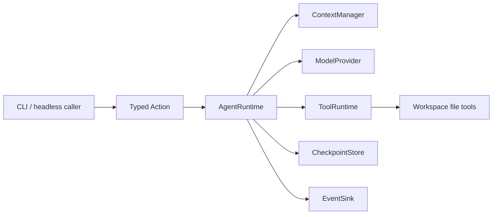
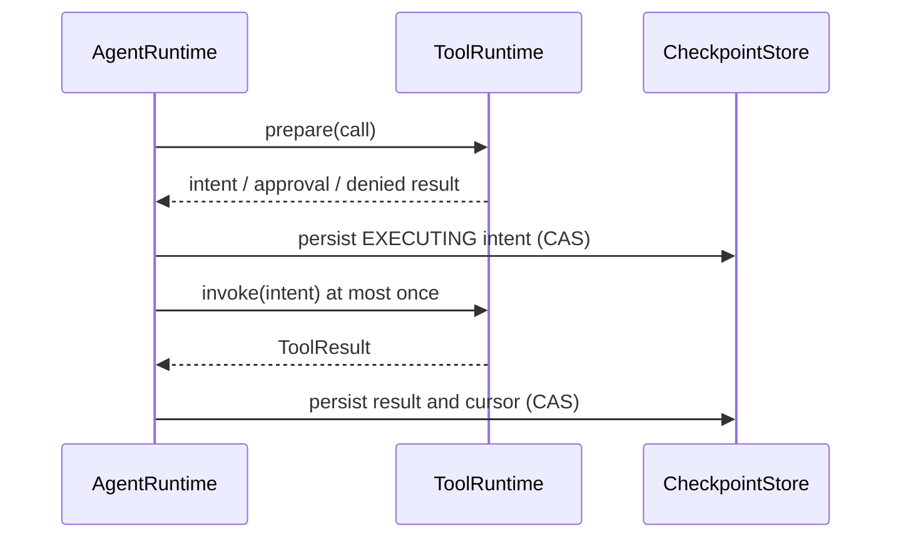

# Runtime Kernel Architecture

## 目标

Kernel v1 保护的是几个长期稳定的所有权边界，而不是预装尽可能多的功能：

1. `AgentRuntime.run_turn` 是唯一状态变更和模型循环入口。
2. `ContextManager` 是模型可见上下文的唯一决策者。
3. `ToolRuntime` 是工具解析、策略、审批绑定与 callable 调用的唯一入口。
4. `CheckpointStore` 在每个外部 effect 前后提供 CAS 和恢复边界。
5. `RuntimeEvent` 只负责通知；checkpoint 与 `RunResult` 才是事实来源。

## 单向依赖

- `runtime.contracts`：不可变数据合同，只依赖标准库。
- `runtime.state`：纯状态转换，只依赖叶子合同。
- `runtime.ports`：注入式行为接口。
- `runtime.context`、`runtime.tools`：各自拥有领域语义。
- `runtime.loop`：只依赖合同与 ports，不依赖具体 provider、CLI 或文件工具。
- `provider`、`runtime.checkpoint`、`runtime.events`、`agent.tools`：port adapter，不拥有循环。
- `main.py`：当前唯一组合根。Capability reintroduction 的 Order 0 可先把 registrations 的静态 assembly 提取到 `agent/composition.py`；MCP 出现首个真实 closeable 时再加入 close stack，Memory 定义 ContextSource 时再加入 sources tuple。`main.py` 仍是配置与 caller 入口；二者不能演变成 service locator 或第二套 Runtime。

这个 DAG 防止某个新能力通过“临时调用”绕开主循环，最终演化成第二个 Agent。

## 一次工具 effect 的顺序

`prepare` 不得调用工具。需要审批时，request 会绑定工具版本、策略、参数、目标、旧内容前置条件和新内容摘要；任何变化都会使旧审批失效。若进程在 `EXECUTING` 后无法证明结果已持久化，Runtime 进入 `AWAITING_RECOVERY`，不会自动重试副作用。

`ContinuationPhase.EXECUTING` 也是共享 action legality 的安全边界：durable active run 处于该 phase 时，`CancelRun` 必须由 reducer 拒绝且 state 不变；所有 CLI/headless/TUI caller 都只能提交一次 `Resume`，让同一个 Runtime 生成 `AWAITING_RECOVERY` request。进入 `AWAITING_RECOVERY` 后只接受 exact `ResolveUnknownToolOutcome`，不能再用 Resume/Cancel 绕过分类。adapter 隐藏按钮不能替代这条 Kernel 合同。

## 调用预算与收敛

`InvocationLimits` 的 model/tool/input/output 累计上限是 caller 可选的暂停策略；显式整数仍产生可恢复的
`PAUSED_LIMIT`，`None` 表示该 caller 不按任务累计量中断。Everyday composition 使用 `None`，因此一个仍在产生
新事实、改变策略或完成子目标的任务不会因为调用次数或累计 token 要求用户反复 `/resume`。这不取消单次
`ContextManager` 窗口、provider 单次输出、工具 I/O、deadline、checkpoint 容量或 effect approval 的有限边界。

协议/结构错误与任务停滞是两个独立熔断器。`max_invalid_repairs` 约束无法严格归一化或不合法的 control；
`max_no_progress_replans` 只累计连续独立 model response 中语义相同的停滞指纹。同一 response 的并行 tool batch
只提供一次 replan opportunity，不能在模型看到 ToolResult 前耗尽 allowance；换工具/参数/错误原因、产生真实
产品结果或新增验证 evidence 都重置停滞指纹。默认 Everyday 的 16 次相同停滞是紧急熔断，不是正常调用预算。

## 上下文管理

`KernelContextManager` 统一预算 system policy、当前输入、历史、未解决请求、工具 schema 与工具结果，并保留输出空间。裁剪是确定性的：先限制过大的工具结果，再按最旧的完整原子组淘汰；tool call 与对应 result 不会被拆开。固定核心仍装不下时，会在 provider 调用前返回 limit，而不是悄悄丢失安全事实。

Kernel v1 不做模型生成的摘要，也没有可执行的 Context Contributor 插件。Memory 若重新进入项目，必须先定义一个只读、不可变、受预算约束的 context-source seam。

## 持久化边界

本地 store 只接受显式 v1 路径，使用 `0700` 目录、`0600` 文件、no-follow open、进程锁、snapshot token 和 revision CAS。`--state` 只创建，`--resume` 只加载。它不扫描、不迁移也不删除旧状态。

## 诚实边界

Kernel v1 已通过 fake 和 mocked HTTP 合同验证，但这不等同于“通用 Agent 已完成”或生产级沙箱。Python tool source 是 operator-trusted；对抗同 UID 进程的最终文件竞态、untrusted extension 隔离、流式模型协议、语义压缩与真实 provider dogfood 都不在当前承诺内。
