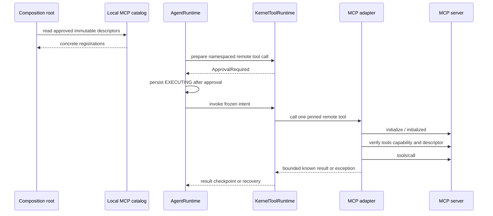

# Governed MCP Tools Design

## Purpose

MCP v1 把人类批准的远程 MCP tool descriptor 映射为具体的 Kernel `ToolSpec`，并在真正调用时复用现有 approval、EXECUTING checkpoint、result checkpoint 与 unknown-outcome recovery。

它不在 composition 时联网，也不让 MCP client 拥有 agent loop 或 live registry。

## Version baseline

- Protocol revision: `2025-11-25`。
- Python SDK: stable `mcp==1.28.1`，并保留 `<2` upper bound。
- Python: `>=3.11`，与 capability program 的统一基线一致。
- `httpx` minimum: `>=0.27.1`，与 SDK v1 合同对齐。

SDK v2 在 2026-07-18 仍是 pre-release major rewrite。
本设计不使用 v2 API，也不在没有独立 migration plan 时解除 `<2`。

## Position in the Kernel

## Catalog and configuration

v1 使用显式 JSON catalog，且文件不能包含 credential value。

每个 server entry 至少包含：

- stable local `server_id`。
- `transport: stdio`。
- direct executable `command` 与 argv list；不经 shell。
- optional explicit cwd。
- explicit environment variable names to forward；value 只在 composition root 解析。
- 转发 credential 时必填 operator-readable、非秘密的 `credential_profile` label。
- 每个 server 必填 operator-controlled、非秘密的 `safety_generation`；它不是 credential 值，也不能仅靠改 catalog 绕过 unresolved safety latch。
- pinned protocol revision。
- 一个或多个 tool descriptor。

每个 tool descriptor 至少包含：

- remote name 与唯一的 local namespaced name，例如 `mcp__repo__search`。
- description 与 bounded JSON input schema。
- optional output schema。
- 本地 `risk`、`side_effect`、`approval_policy`、`output_limit_chars` 和 safety policy。
- descriptor digest 与 config digest。

remote `annotations`、`serverInfo.instructions`、`_meta`、title 和 icons 不参与任何本地安全决定。

未知 tool、重复 local name、schema 超限、unsupported schema、credential value 出现在 catalog 或 catalog digest 冲突都在 startup fail closed。

command 必须是显式 absolute、regular、no-follow 的 operator-trusted executable。catalog 冻结 device/inode/mode/size/content digest，prepare 与 spawn 前重新验证；这些 identity 与 cwd identity 进入 approval preview/binding。
project-owned transport 最终仍按 path spawn，因此 v1 不能消除同一用户在最后一次验证后的替换窗口，也不宣称 filesystem/process sandbox；无法接受该 trust boundary 时不得启用本地 stdio server。

## Discovery decision

v1 不实现 runtime discovery。

`initialize`、server process spawn 和 `tools/list` 都是 EXTERNAL effects；把它们放进 startup 会绕过 conversation checkpoint 和 user approval。

因此首版 catalog 由 operator 审核并显式提供。
未来 catalog import 必须是单独的、受治理的 provisioning flow，产出 immutable snapshot，且只有下一次 composition 才能生效。

`notifications/tools/list_changed` 不能修改 live registrations。
如果 invocation 时发现 remote descriptor 漂移，当前 call 返回 known-not-executed error，要求重新 provisioning 和重启。

## Concrete ToolSpec mapping

| Source | Local meaning |
|---|---|
| local namespaced name | `ToolSpec.name` |
| local description | `ToolSpec.description`，remote description 只作审核输入 |
| pinned input schema | `ToolSpec.input_schema` |
| descriptor/config digest | `ToolSpec.version` 和 identity binding |
| local risk/effect/approval | `ToolSpec.risk`、`side_effect`、`approval_policy` |
| local output limit | `ToolSpec.output_limit_chars` |
| remote annotations | ignored for policy |

默认策略是 `EXTERNAL + ALWAYS_APPROVAL`。
即使 remote annotation 声称 read-only 或 idempotent，也不能自动降级。
每次 approval preview 必须完整展示 server/tool/executable/credential-profile identity 与 canonical bounded arguments JSON；arguments 的最大 canonical preview 长度不能大于人类审批界面上限。无法完整展示时在 effect 前返回 known-not-executed，digest 只负责绑定所见对象，不能替代内容预览。

## Invocation lifecycle

每次 invocation 创建一个有限时 stdio session，不保存跨调用 client cursor：

1. 在 Runtime 已持久化 `EXECUTING` 的前提下，原子写入 durable `ARMED` safety marker。
2. 直接启动配置的 executable，不使用 shell。
3. `initialize` 协商 protocol/capabilities。
4. 发送 `notifications/initialized`。
5. 确认 server 声明 `tools` capability。
6. 有界分页执行 `tools/list`，验证目标 descriptor 的 name/schema digest 未漂移。
7. 本地使用 pinned JSON Schema 验证 arguments。
8. 执行一次 `tools/call`；记录 request bytes 是否可能已写出。
9. 验证并规范化 result。
10. 关闭 stdin，有限时等待，再按 transport 规范终止残留进程；确认整个 process group 退出后才清除 safety marker。

同步 Kernel 与 async SDK 之间使用一个进程级 `McpAsyncBridge`：它拥有一条长生命周期 event-loop thread，但不在 startup 创建 session、连接 server 或执行 discovery。
每次 callable 把一次有限时 coroutine 提交到该 owner loop，并在该 coroutine 内创建和关闭独立 stdio session；同步等待由总 wall-clock cap 约束。
bridge 不持有 Runtime state、不缓存 remote registry，也不把 callback 送回 Runtime；composition shutdown 必须显式关闭 owner loop。

v1 不使用 SDK 自带的 `stdio_client` 来 spawn，因为进程 handle 与 call-write commit receipt 必须由本项目持有。小型 project-owned `McpStdioTransport` 直接拥有 process group、stdin/stdout/stderr caps、newline-delimited framing 与 cleanup，并通过 SDK 的 public `ClientSession(read_stream, write_stream)` stream contract 把消息流交给 SDK；SDK 继续独占 JSON-RPC request/response/session lifecycle，transport 不能再实现一套 MCP client。transport 在第一次 `tools/call` OS stdin write attempt 之前保守地把 `call_may_have_been_sent` 置为 true，partial/failed write 也不能回退。

U3 的第一个 Red 是 pinned `mcp==1.28.1` public-API feasibility test：证明可在不导入 private symbol、不使用 SDK-owned spawn 的情况下向 `ClientSession` 注入 project-owned streams，并同时持有 process/commit receipt。若该 public contract 不成立，立即停止本阶段并修订设计；禁止用 private SDK hook 或弱化 outcome classification 勉强继续。

client capability manifest 只声明完成 v1 tool call 所需的能力，并且不注册 Sampling、Roots、Elicitation、Tasks、resource 或 prompt callback。
server 在 call 前主动请求未协商能力时，session 以 known-not-executed protocol error fail closed；在 `tools/call` 可能送出后出现同类协议破坏，则按 unknown outcome 处理。

bridge 与 intent-aware executor 之间使用 immutable `McpBridgeOutcome`，至少携带 classification（`NOT_EXECUTED` / `EXECUTED` / `UNKNOWN`）、`call_may_have_been_sent`、`terminal_response_received`、`terminal_request_id_matched`、`process_exit_confirmed` 和 bounded sanitized result/error。只有 transport/session owner 可以设置这些 commit-state 字段；executor 只能把 `NOT_EXECUTED` 映射为 `executed=false`、把 `EXECUTED` 映射为 known result、把 `UNKNOWN` 抛给 Runtime recovery。任何无法带回 receipt 的 bridge/host exception 在已持久化 `EXECUTING` 后按 unknown 处理，不能包装成普通 tool error。

## Timeouts and cancellation

initialize、每页 list、call 和 shutdown 各自有 timeout，并受一个不可延长的总 wall-clock cap 限制。

stdio timeout 后先有限时协议关闭，再终止该 invocation 创建的独立 process group。完整 terminal response 后只要 process 已确认退出，协议 close warning 不改变 known result；无法确认清理、逃离 process group 的 daemon/grandchild 或残留 credential-bearing process 会同时产生 unknown outcome 并把整个 bridge 原子置为 terminal `QUARANTINED`。quarantine 拒绝所有后续 submission，`ResolveUnknownToolOutcome` 只能分类当前 effect、不能解除隔离。

进程内 quarantine 之外，MCP 使用显式 `--mcp-safety-state PATH` 的 owner-only/no-follow durable `McpSafetyLatch`。它是带 revision 与 opaque marker token 的跨进程 CAS state machine：`arm(expected_clear_revision, binding)` 只能从 exact `CLEAR` 原子转成 `ARMED`，已有任意 marker、revision conflict 或有限 lock deadline 超时都必须在 spawn 前 fail closed；两个进程不能覆盖彼此 marker。每次 invocation 在 Runtime 已持久化 `EXECUTING` 后、spawn 前 arm，binding 包含 server/config/profile/`safety_generation`/intent digest 与随机 marker token；只有 transport 确认整个 process group 安全退出后，才能用 exact revision + token + full binding 清除，其他 invocation 无权 clear。arm loser 返回 known-not-executed result，server process count 为零。

宿主 crash 或 cleanup uncertainty 会留下 marker，下一次 composition 必须 fail closed，不能创建 MCP registrations；即便两个 composition 都曾在 CLEAR 时启动，invoke-time CAS 也只能允许一个 spawn。该 latch 只是防止残留进程后的再次调用，不保存 agent cursor，也不判断本次 tool result。

清除 stale marker 只能走 operator-only offline recovery command：在同一锁下精确匹配 marker revision/token/full binding，要求显式确认残留进程已终止；若使用 credential，还要求确认 credential 已轮换并提供新的 `safety_generation`。command 以 CAS 原子记录 resolution 后才允许新 composition；仅修改 catalog generation、重启、重新解析 credential 或执行 `ResolveUnknownToolOutcome` 都不能清除 latch。程序只能记录 operator attestation，不能虚假声称自己验证了外部 credential rotation。
call request 可能写出后的 timeout、disconnect、process crash 或 adapter exception 表示结果未知，异常必须传播给 AgentRuntime 进入 `AWAITING_RECOVERY`；在 call bytes 发送前可证明的失败是 known-not-executed。

协议 cancellation 是 optional，不能作为“远端一定没有执行”的证据。
v1 不自动 retry effectful MCP call。

## Result normalization

支持：

- bounded text content blocks。
- `isError: true` 映射为 known tool execution error，允许模型修正参数，但不自动 retry。

首版拒绝或只返回不含 payload 的安全摘要：

- `structuredContent` 和 output schema projection。
- image、audio 和 binary content。
- resource links 与 embedded resources。
- server `_meta`、icons 和 arbitrary URI fetch。
- task-augmented result。

`tools/call` 的 commit point 是“任意 call request bytes 可能已写出”。从这一刻到收到完整且 request ID 匹配的 terminal `CallToolResult` 之前，JSON-RPC error、wrong ID、partial/malformed response、transport/timeout/disconnect 都是 unknown outcome。
完整匹配的 terminal result 已证明 execution outcome 已返回：`isError: true`、unsupported content 或超出本地 output policy 都是 known executed error；只有在 call request 尚未发送时可证明的 protocol/config error 才是 known-not-executed。

## Credential and process safety

- catalog 只记录可转发的 environment variable names 与非秘密 credential profile label；credential value 在 composition root 注入到不可序列化的 secret holder，并在该 composition 生命周期内冻结。
- 每次 credential-bearing composition 生成新的非秘密 random credential epoch；profile label 与 epoch 进入 ToolSpec identity、intent/approval binding，重启或重新解析 credential 会使旧 pending approval fail closed。credential value 本身不进入 ToolSpec、checkpoint、event 或 model context。
- catalog 的 `safety_generation` 与 durable latch 共同处理跨 crash 隔离；random composition epoch 只使旧 approval 失效，不是 credential rotation 或 process cleanup 的证明。
- child process environment 使用 allowlist，不继承整个 parent environment。
- command/args/cwd 进入 server config digest；变化使旧 intent 和 approval 失效。
- stderr 有界捕获并默认不进模型；stderr 内容不代表协议失败。
- stdout 只接受 MCP framing；非协议输出导致 transport failure。
- stdout/stderr 都有 byte cap；stderr 中疑似 credential 的内容不能进入 ToolResult/event/rendered error。
- server 不自动获得 tool workspace、Memory path、Skill roots 或 checkpoint path。
- 未协商的 server-initiated request/notification 不能触发 provider、workspace、用户交互或 credential lookup。

## Failure semantics

| Failure | Classification |
|---|---|
| invalid local config/schema | startup failure |
| approval rejected | no invocation |
| remote descriptor drift before tools/call | known-not-executed tool error |
| remote `isError: true` | known tool execution error |
| protocol/JSON-RPC error before any call bytes | known-not-executed when provable |
| JSON-RPC error、wrong ID、partial/invalid response after call bytes | unknown outcome / human recovery |
| timeout/disconnect after call may have been sent | unknown outcome / human recovery |
| oversized or unsupported result | known error only when call completion is certain; otherwise recovery |
| list_changed notification | mark invocation stale; never hot mutate registry |

## Verification matrix

- Local fixture proves initialize must precede operation and capability negotiation is enforced。
- Fixture 主动发送 Sampling、Roots、Elicitation、Tasks 与 unsolicited request，证明 client 不声明、不响应，也不触发任何本地 capability。
- Pagination continues until `nextCursor` is absent/null，空字符串 cursor 仍按 opaque value 处理。
- Descriptor/config/policy drift invalidates ToolSpec identity and approval binding。
- Remote annotations cannot lower approval or change side-effect class。
- Arguments obey pinned schemas and size/depth limits；structured output 在 v1 fail closed。
- stderr logs do not enter model or count as failure；stdout contamination fails closed。
- timeout/disconnect after call produces exactly one parent recovery request and no automatic retry。
- partial write、wrong ID、invalid JSON、JSON-RPC error、oversized terminal result 与完整结果后的 close timeout 分别验证 commit-point 分类。
- approval 后 executable/ancestor 替换与 forked child cleanup fault 都 fail closed，并记录 residual same-UID/process-isolation 风险。
- approval preview 完整显示 canonical bounded arguments；参数变化、credential epoch 变化或超出 preview cap 时 invocation count 为零。
- bridge outcome 的四个 commit-state booleans 覆盖全部 classification；cleanup uncertainty 后 bridge quarantine 拒绝第二次 submission；host crash 留下的 durable safety marker 在 reopen、human outcome resolution 后仍阻止新 MCP composition，直到 operator-only recovery 推进 generation。
- 两个独立进程从同一 CLEAR latch 并发 invoke 时，只有一个 exact CAS arm/spawn；loser 是 known-not-executed，不能覆盖/清除 winner marker。winner 未确认 process-group exit 或 crash 后，marker 始终保留。
- `isError: true` reaches the model as paired bounded tool result。
- No production source outside `agent/runtime/loop.py` directly invokes ToolRuntime or checkpoint mutation。
- Tests do not call a real MCP server or external network。

## 009 audited closure gate

本设计的边界仍有效，但 2026-07-20 follow-up 证明当前实现尚未满足以下 normative closure：

- canonical arguments 不能在 preview 中截断后以完整值执行；canonical 与 escaped preview 任一超限都在 spawn 前 known-not-executed。
- env values、executable、ancestor 与 cwd identity 在 approval 前冻结，invoke 只能消费 frozen object；spawn 前同时复验 identity 与 digest。
- production stdio fixture 必须经 `AgentRuntime → ToolRuntime → EXECUTING → bridge → result/recovery` 完整旅程验证；直接调用 `_finalize_outcome` 只能算 component evidence。
- stdout/stderr/result/error 全部在 transport owner 内 bounded，stderr 持续 drain；直接 child exit 不能替代 process-group cleanup receipt。
- remote `isError` 与 completed unsupported content 是 `executed=true/is_error=true`，并作为 paired tool result 进入下一次 `ContextPack`；不能返回普通成功字符串。
- call 后 timeout、wrong ID、partial/malformed response 或 cleanup uncertainty 进入 parent recovery，latch 保持 ARMED，且没有自动第二次 call。
- `force_clear` 的 residual-process、credential-rotation 与 generation attestation 默认都是否定；只有 operator 显式肯定并精确 CAS 才能推进。

只有上述正向 E2、失败/恢复 E2 与 009 materialized E2M 同时通过，MCP 才能标 `locally-verified`。
本地 fixture 不等于用户授权的真实 MCP E3。

## Deferred

- Streamable HTTP、OAuth、legacy SSE。
- resources、prompts、Roots、Sampling、Elicitation 和 protocol Logging。
- MCP Tasks、long-running operations、poll/cancel/resume lifecycle。
- live list_changed refresh、multi-session client pool 和 background connection。
- automatic catalog import、remote registry 和 trust-on-first-use。
- binary/media/resource rendering。
- structuredContent 与 output schema projection。

## Sources

- MCP specification: `https://modelcontextprotocol.io/specification/2025-11-25`
- MCP lifecycle: `https://modelcontextprotocol.io/specification/2025-11-25/basic/lifecycle`
- MCP tools: `https://modelcontextprotocol.io/specification/2025-11-25/server/tools`
- MCP transports: `https://modelcontextprotocol.io/specification/2025-11-25/basic/transports`
- Python SDK v1: `https://github.com/modelcontextprotocol/python-sdk/tree/v1.x`
