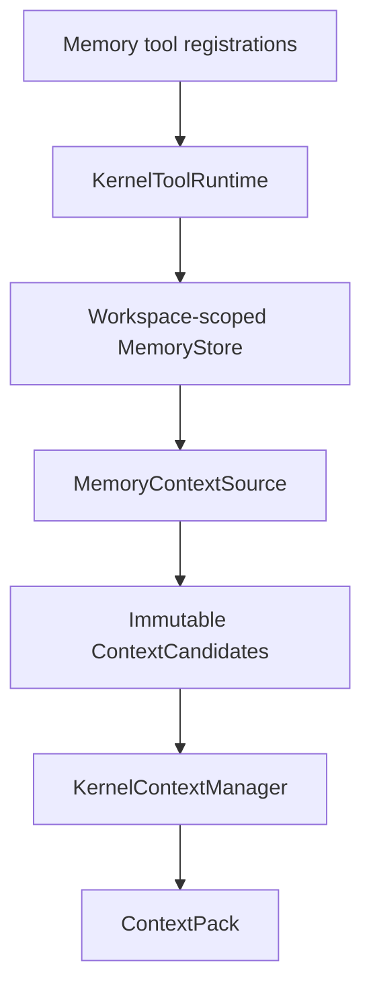

# Budgeted Memory Context Source Design

## Purpose

Memory v1 在不同 conversation 之间保留用户明确批准的信息，并让 ContextManager 在当前输入预算内决定是否召回。

Memory 不能自己拼 prompt、修改 Runtime state、调用 provider 或在 session end 偷偷写入。

## Boundary split

Memory 有两个完全分开的入口：

- read path：`MemoryContextSource` 提供 immutable candidates。
- mutation path：remember/update/forget 作为 governed tools 执行。

Conversation checkpoint 不保存 Memory records、store path、Memory cursor 或一次 context build 的选择报告。
它只保存正常的 tool call/result facts；source digest 与 included/excluded/clipped candidate IDs 只存在于该次 `ContextPack.BudgetReport`，不扩展 durable state schema。

## Generic ContextSource seam

`runtime.contracts` 增加不可变叶子合同：

- `ContextQuery`：conversation/run identity、当前用户文本、workspace scope 和 ContextManager 给出的 source limits。
- `ContextCandidate`：stable candidate ID、source name、workspace scope、content、content digest、provenance 和 deterministic rank key。
- `ContextSourceSnapshot`：source identity、revision、snapshot digest 与 immutable bounded candidates tuple。

`runtime.ports` 增加：

- `ContextSource.snapshot(query) -> ContextSourceSnapshot`。

约束：

- source 只返回上述 snapshot；snapshot payload 只能是候选，不能含 `ModelMessage` 或 `ContextPack`。
- source 不能标记 pinned/safety priority。
- source 不得调用 provider、tool、checkpoint 或 event sink。
- source 结果必须 immutable、JSON-safe、bounded 和 deterministic。
- ContextManager 独自决定候选顺序、budget inclusion、clipping 与 exclusion。

`KernelContextManager` 显式接收一个 sources tuple；没有统一 source registry 或动态发现。
每次 `build` 都要求 source 重新加载一个严格、不可变的 store snapshot，并把 snapshot digest 带入 candidates 与 `BudgetReport`；一次 build 内不能观察两个 revision，批准的写入只在下一次 build 可见。

## Context representation

Memory candidate 使用新的 provider-neutral `context` block，包含：

- source label。
- stable candidate ID。
- provenance/digest。
- bounded text。
- `untrusted: true`。

Provider adapter 只把该 block 投影为清晰标记的非 system 文本。
它不能把 Memory 提升为 system/developer authority。

Memory candidate IDs 复用 `BudgetReport.included_ids/excluded_ids/clipped_ids`，使选择可解释而不把完整未选内容写入 event。

## Selection and budget policy

ContextManager 先保留现有 safety/current/pending core，再处理 recent atomic conversation groups 与 Memory candidates。

Memory 使用独立的 `max_source_tokens` 和 `max_source_items` 上限，且该上限包含在总 input budget 内。
Memory 可以替代较旧的非 pinned history，但不能挤掉 current user fact、pending approval/recovery、system policy 或工具 schema。

lexical score 使用不依赖 locale/第三方 tokenizer 的固定算法：query/content 先做 Unicode NFKC 与 `casefold()`；ASCII letter/digit 的最大连续串是一个 token，每个非 ASCII alphanumeric code point 是一个 token，其他字符只作分隔。去重后的 query tokens 与 candidate token set 匹配，score 为 `2 * matched_unique_query_tokens + exact_phrase_bonus`，其中规范化后的完整非空 query 是 content substring 时 bonus 为 `1`；空 query score 为 `0`。

候选排序由固定规则完成：

1. lexical relevance score 降序。
2. approved record recency 降序。
3. stable record ID 升序作为 tie-breaker。

v1 不使用 embedding、LLM rerank 或 semantic summary。

## Memory record and store

`MemoryRecord` 至少包含：

- opaque stable `record_id`。
- canonical workspace scope digest。
- bounded UTF-8 content。
- content digest。
- created/updated time 与 injected clock 支持。
- revision/precondition token。
- provenance indicating explicit user-approved tool mutation。

本地 store 是显式路径的 versioned JSON document，header 绑定 canonical workspace scope 与 operator-approved、非秘密的 provider trust-profile identity；使用 owner-only directory/file、no-follow、regular-file check、独立 lock file、atomic replace 和 revision CAS。

lock file 不随 data replace，且是 owner-only、no-follow regular file。持锁期间完成 data fd identity/mode/link 校验、revision/CAS 检查、同目录 `0600` temp write、file fsync、replace 与 parent-directory fsync；任何失败都不使用新 revision 继续。
create/load、source read、prepare 与 mutation 都使用 monotonic clock 驱动的不可延长 lock-acquisition deadline，禁止无期限 blocking lock；该 deadline 只约束取得锁的等待，不虚假承诺能中断已经进入的 OS filesystem call。

Memory state 与 conversation checkpoint 必须位于 tool workspace 外，二者路径不能重叠。
store 不扫描、不迁移、不自动创建旧格式。

首次启用使用互斥的显式模式：

- `--memory-create PATH`：目标必须不存在，排他创建 revision 0 的空 store，并绑定 canonical workspace scope 与当前 approved provider trust profile。
- `--memory-store PATH`：目标必须存在且完整通过 version/security/scope/provider-profile 校验，只加载不覆盖。

普通 `memory_remember` 不能隐式创建 store；并发 create loser、半文件或 unsupported schema 都 fail closed。

## Governed tools

### `memory_search`

- READ_ONLY、无需审批。
- 参数：bounded query 与 limit。
- 返回 scoped record ID、bounded text、digest 和 provenance。

### `memory_get`

- READ_ONLY、无需审批。
- 参数：record ID。
- 返回一个 scoped approved record。

### `memory_remember`

- WRITE、始终审批。
- 参数：bounded content。
- approval binding：workspace scope、store revision、新 content digest、policy identity；新 record 尚不存在，因此不绑定 record identity/revision。
- approval preview 显示 bounded scope、operation 和待保存内容；content digest 负责把所见内容与最终 mutation 精确绑定。

### `memory_update`

- WRITE、始终审批。
- 参数：record ID、新 content、expected record revision 与 expected record digest。
- approval binding：record identity、store revision、现有 record revision、旧/新 content digest 和 policy identity。
- approval preview 显示 bounded record ID 与完整 before/after diff；mutation/record 上限必须不大于 approval preview 上限，无法完整显示时在 effect 前拒绝并要求更小的修改。

### `memory_forget`

- WRITE、始终审批。
- 参数：record ID、expected record revision 与 expected content digest。
- approval binding：record identity、store revision、现有 record revision、删除前 content digest 和 policy identity。
- approval preview 显示 bounded record ID 与将删除的完整 bounded content。

所有 write 的 callable exception 在 effect 可能发生后必须进入现有 unknown-outcome recovery。
Memory 不增加自己的 pending confirmation state。

## Scope and privacy

- workspace scope 来自 composition root 的 canonical workspace，不从 cwd 或模型参数推断。
- provider trust-profile identity 是 operator 配置的稳定、非秘密 `profile_id`，并绑定 provider family 与 destination；Memory 启用时必须显式可验证。credential 只在相同 approved principal/trust domain 内轮换时才可沿用 profile ID；切换账号、租户或信任主体必须使用新 ID。store profile 与当前 composition 不匹配时 startup fail closed，不提供自动 reauthorization 或跨 provider 召回。
- 一个 workspace 的 source/tools 无法读取另一个 scope 的 records。
- Memory path、完整 store inventory 和未匹配记录不进入 model context 或 event。
- tool output、context candidate 和日志都执行字符/记录数量限制。
- secret-like 检测只是 defense-in-depth：命中时 mutation fail closed，但未命中绝不构成“内容安全”保证；Memory 是明文本地存储，召回内容会再次发送给当前 provider。
- 如果内容不能安全形成足以让人判断的 approval preview，mutation 必须在 effect 前拒绝，不能退化为只显示 digest/count 的盲批。
- v1 不加密静态文件，只承诺 owner-only local storage；需要更强保护时另行设计 encrypted store adapter。

## Failure semantics

如果没有配置 Memory，Runtime 行为与当前 Kernel 完全相同。

如果显式配置 Memory：

- create 模式只接受 missing target；load 模式的 missing/malformed/version/security/scope/provider-profile error 在 startup fail closed。
- source/read lock acquisition timeout 或 transient source I/O/unavailable error 在 provider 调用前转成 generic `FAILED_RETRYABLE/context_source_unavailable`，由现有 `Resume` 在外部条件修复后重试；provider call count 必须为零。
- mutation 在 effect 前无法于 deadline 内取得锁时返回 known-not-executed `memory_busy`；已经越过 atomic replace commit point后的异常进入 unknown-outcome recovery。
- integrity、authorization、version、scope 或 snapshot inconsistency 是 fatal fail closed，不能用 Resume 掩盖。
- 空搜索结果是正常的零 candidates。
- store CAS mismatch 在 effect 前返回 known-not-executed error 或使旧审批失效。
- effect 后 outcome 不明进入 `AWAITING_RECOVERY`，不自动 retry。
- Memory 太大只影响 source inclusion，不得使 system/current/pending core 被丢弃。

## Verification matrix

- 同一 query/snapshot 产生 byte-equivalent candidates、source digest/item IDs 与相同 BudgetReport。
- NFKC/casefold、ASCII token、非 ASCII alphanumeric token、exact phrase bonus、空 query 与 tie-break 都有 table tests。
- source 无权返回 pinned block 或直接修改 `ContextPack.system`。
- Memory context 在 Anthropic/OpenAI projection 中保持 untrusted provenance。
- 小预算下 current/pending facts 保留，Memory 按 source cap 裁剪/淘汰。
- malformed or unavailable configured store 在 provider 前失败且 provider call count 为零。
- remember 的 approval 精确绑定 scope、store revision 与新 content digest，且不伪造尚不存在的 record revision；update/forget 另外绑定现有 record ID、record revision/precondition token 与相应 content digest。
- symlink、wrong owner/mode、path overlap 和 cross-workspace access 全部拒绝。
- 独立 lock inode、replace 后 directory fsync、各 crash point 与并发 CAS 都有 fault-injection coverage。
- barrier-held lock 证明 source timeout 时 provider call 为零、mutation timeout 时 store mutation 为零，且 acquisition deadline 不可延长。
- provider trust profile mismatch 在 startup fail closed，未召回任何 record。
- crash fault injection 证明 EXECUTING 在 store mutation 前，result checkpoint 在 mutation 后。
- fake/local tests 不读取真实 Memory 目录或用户数据。

## 009 audited closure gate

2026-07-20 follow-up 发现当前 store/test 与本设计的 strict snapshot 合同相反。
以下要求对 009 是 normative：

- load 不做 `str()`、`int()`、`float()` 等容错 coercion；unknown fields、exact type、content/store digest、record/store revision、timestamp 与 scope/profile invariant 任一不符都 fail closed。
- data load 在 stable lock 内通过 no-follow opened handle bounded read；先 `stat` 再普通 path `open` 不算 identity-safe。
- `snapshot()` 每次从 durable revision-consistent immutable view 构建，不能长期复用进程内 `_records` 缓存。
- remember 绑定真实 store revision 与完整 content；update/forget 绑定同一 revision 的 before state，分别展示完整 bounded before/after 与删除内容。`target_digest` 非空不等于 revision-bound proof。
- candidate 不能静默截断后继续使用完整 record digest；完整纳入、明确 excluded 或带原长/digest 的 clipped evidence 三选一。
- capability E2 必须从 governed Memory tool 开始，经 approval、`EXECUTING` 与 mutation checkpoint，在新 conversation 的 ContextManager 与 provider request projection 中观察 recall。直接 `store.remember()` 只证明 store E1。
- 使用两个 workspace/store instance 验证 scope isolation、fresh external update 与 stale preview zero-mutation。

通过 strict store unit tests 但没有 governed cross-conversation E2 或 009 materialized E2M，仍只能是 `implemented-candidate`。

## Deferred

- 自动抽取、suggestion、session-end hook 和 silent retain。
- consolidation、emergence、aging、LLM summary 和 conflict synthesis。
- vector database、embedding retrieval 和 external Memory service。
- cross-workspace/global profile、sharing 和 import/export。
- background maintenance、TTL 和 asynchronous cleanup。
- encryption/key management。
- backup/disk/同用户进程读取明文 Memory 的更强隔离。

## Related contracts

- `docs/architecture/KERNEL_ARCHITECTURE.md`
- `docs/architecture/EXTENSION_CONTRACTS.md`
