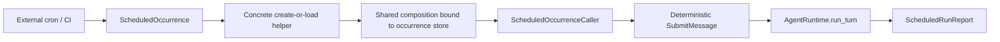

# Scheduler External Caller Design

## Purpose

Scheduler v1 让 cron、launchd、CI 或其他外部调度器把一个已经发生的 occurrence 交给 Kernel。

本项目不负责计算“什么时候触发”，只负责把一次外部触发稳定地映射为 conversation、checkpoint 与 typed action，并把需要人类处理的状态诚实返回。

## Boundary

Scheduler entry adapter 是 External caller：

- 先用 scheduler-local concrete helper 创建或加载本次 occurrence 专属 store/snapshot，再把该 store 显式注入 shared composition builder；当前 `AgentRuntime` 永久绑定一个 store，因此禁止先构造 Runtime 再切换 store。
- `ScheduledOccurrenceCaller` 只接收已绑定同一 store 的 Runtime 与 snapshot，并且只能调用 `AgentRuntime.run_turn`；不能直接调用 provider、ToolRuntime 或 checkpoint mutation port。
- 不能拥有 loop、background thread、polling daemon 或 durable scheduler cursor。
- 不解释或修改 Agent 的 pending request。

## Occurrence contract

`ScheduledOccurrence` 至少包含：

- bounded `schedule_id`。
- stable、外部生成的 `occurrence_id`。
- canonical UTC `scheduled_for`，只作为 identity/provenance，不用于本地计时。
- bounded message。
- 显式 state root / workspace scope，由 composition root 验证。

checkpoint filename **只**从 `schedule_id + occurrence_id` 确定性派生；这样相同 occurrence 的冲突请求一定命中同一 state。
conversation ID 绑定完整 occurrence identity：`schedule_id`、`occurrence_id`、`scheduled_for`、message digest 与 workspace scope。run ID 与首次 action digest 绑定同一组字段，因此同一 occurrence 带来的内容/时间/scope 漂移在加载 revision 0 时也会因 conversation identity 不匹配而立即在原 checkpoint 上冲突。
原始 schedule/occurrence text 不直接用作文件路径。

每个 occurrence 创建一个新 conversation。
v1 不把多次 fire 追加到共享 conversation，因为那会把跨次序、paused run 与 replay ownership 混在一起。

## Atomic create-or-load

首次触发按以下流程执行：

1. 构造 revision `0`、`next_action_seq=1` 的新 `ConversationState`。
2. scheduler-local concrete `create_or_load_occurrence_store()` helper 使用 `LocalCheckpointStore.initialize` 的排他创建语义初始化 occurrence checkpoint；不新增只有一个实现的 factory port。
3. 若另一个进程已经创建，loser 只加载现有 snapshot。
4. 验证现有 conversation identity 与本次完整 occurrence identity 完全一致；不一致时在提交 action 前返回 conflict。
5. 把 returned store 注入 shared composition，确认 Runtime/store 与 snapshot token 属于同一实例，再由 caller 提交固定的 `SubmitMessage(action_seq=1, expected_revision=0)`。

并发 winner 执行，loser 依赖现有 action replay contract 得到同一 recorded result。
如果 loser 在 winner 提交首次 action 之前读到了 revision 0，它可能先收到一次 snapshot `CONFLICT`；adapter 只允许加载一次 authoritative snapshot，并重交**完全相同的 seq 1 action**完成 replay reconciliation。
这不是 effect retry：action digest、run ID、message 和 sequence 都不能改变，Runtime 仍先做 replay check；第二次仍冲突就原样报告，不能循环重试或提交新 sequence。

如果同一 `schedule_id + occurrence_id` 带来不同 `scheduled_for`、message digest 或 workspace scope，必须在原 checkpoint 返回 occurrence conflict，绝不覆盖已有 checkpoint。

## Result mapping

`ScheduledRunReport` 携带 authoritative occurrence status、conversation/run ID、initial-action replayed 标记、error code、relative checkpoint reference 和 pending request type/ID 的安全摘要。
relative checkpoint reference 与调用方已知的 state root 组合后，足以让 CLI/TUI 加载同一 conversation；report 不泄露绝对私有路径或 binding body。

duplicate fire 的 `run_turn(seq=1)` 在 replay record 仍保留时可能 replay 首次 action 当时的 paused result，但返回 state 已经是当前 authoritative snapshot。
replay 是快路径，不是 occurrence-lifetime identity 的唯一证据：如果 seq 1 已超出 bounded replay window，caller 只能在 authoritative state 的 `active_run.run_id` 或 `last_safe_result.run_id` 与本次 deterministic run ID 精确匹配时，把 `action_sequence_expired` 解释为安全 duplicate；否则是 occurrence conflict。这个 read-only fallback 不提交新 action、不新增 scheduler ledger，也不重复 provider/effect。
adapter 必须根据 returned/current state 生成 occurrence report：active run 决定 paused status；没有 active run 时使用匹配 deterministic run ID 的 `last_safe_result`。因此人工使用 seq 2+ 解决后，后续 duplicate fire 报告当前 completed/cancelled/fatal 状态，而不是过期的首次 pause。

处理规则：

- `COMPLETED`：外部调度器可以记录成功。
- `AWAITING_APPROVAL`、`AWAITING_RECOVERY`：报告 `needs_human`，不自动提交 resolution。
- `LIMIT_REACHED`、`CONVERSATION_LIMIT_REACHED`、`FAILED_RETRYABLE`：报告 `needs_human`，不自动 Resume 或 retry。
- `FAILED_FATAL`、`CONFLICT`、`CANCELLED`：报告终止状态。

Scheduler 无权把 retryable 解释成“安全重跑整个 occurrence”；effect 是否发生只能由 Kernel checkpoint 与人类 recovery 决定。

concrete create-or-load helper 只封装 path derivation、排他 initialize 与 load，不暴露 `compare_and_swap`；创建后的所有 conversation mutation 仍只由绑定该 store 的 Runtime 完成。

## Configuration and invocation

v1 提供一个 headless scheduler command/entrypoint，接收显式 occurrence JSON 或等价 typed arguments，并复用 composition root 构造的 Runtime。

- 不读取 crontab。
- 不从当前时间猜 occurrence ID。
- 不使用隐式 cwd 作为 workspace scope。
- 输出稳定、bounded、machine-readable report；不打印 credential、完整 approval payload 或 checkpoint content。
- process exit code 只反映 completed / needs-human / fatal-conflict 三类自动化结果，详细状态保留在 report。

## Verification matrix

| Scenario | Expected result |
|---|---|
| first occurrence | atomic initialize，执行固定 seq 1 action |
| exact duplicate fire | replayed result，provider/effect 不重复 |
| exact duplicate after seq 1 replay expiry | deterministic run ID 匹配后报告 current state，provider/effect 不重复 |
| concurrent first fire | 一个 winner；loser 最多一次 exact-action reload + replay |
| same ID, different message | conflict，provider call count 为零 |
| same ID, different scheduled time/scope | 命中同一 checkpoint 后 conflict，不创建旁路文件 |
| approval/recovery pause | report needs-human，不自动推进 |
| pause 后由 CLI/TUI 解决，再 duplicate fire | 报告当前 authoritative terminal status，provider/effect 不增加 |
| retryable/limit | report needs-human，不创建新 run |
| separate occurrences | 独立 conversation/checkpoint |
| malformed path/identity | fail closed，不碰 workspace 外文件 |

## 009 audited closure gate

当前 human resolution 后 duplicate report 的 happy path可以保留，但 009 还必须关闭：

- `scheduled_for_utc` 通过真实 calendar parse 与 canonical UTC round-trip；不存在的月、日、闰日、时分秒、offset 或未批准 fractional form 必须拒绝。
- `conversation_busy` 与 `checkpoint_conflict` 使用同一个 one-shot reconciliation 规则：reload authoritative snapshot，重交完全相同 seq-1 action；第二次冲突原样返回，禁止 loop。
- 两个独立 caller/composition 通过 barrier 竞争同一 occurrence，provider/effect 总计最多一次。
- pause → human seq-2 resolution → terminal → duplicate 必须从最新 checkpoint 报告 terminal，不能把首次 replay result 当 authoritative state。
- workspace scope 与 occurrence identity drift 命中原 checkpoint 并零 provider/effect；Scheduler 不获得 approval/recovery authority。

只有正向 occurrence、并发/恢复 E2 与 009 materialized E2M 同时通过，Scheduler 才能标 `locally-verified`。

## Deferred

- cron/rrule parser、timezone、DST、misfire 和 calendar semantics。
- daemon、queue、worker pool、lease、heartbeat 和 distributed scheduler store。
- automatic retry、backoff、catch-up、coalescing 和 notification delivery。
- recurring shared conversation、workflow DAG 和 approval bot。
- 管理 UI、schedule CRUD 和 external scheduler provisioning。

## Related contracts

- `docs/architecture/KERNEL_ARCHITECTURE.md`
- `docs/architecture/EXTENSION_CONTRACTS.md`
