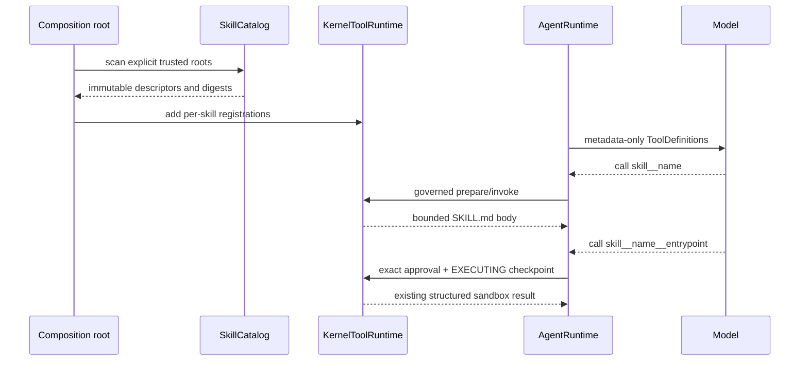

# Governed Skill Capability Design

## Purpose

Skill v1 让模型按需读取 operator-trusted 的专业指令，并可通过现有 ToolRuntime 与 native sandbox 执行 Skill 明确声明的 Python entrypoint。Skill 仍不能直接改 system prompt、调用模型或绕开 ToolRuntime。

它实现的是 Agent Skills 文件格式的安全子集，不实现 package lifecycle 或 remote registry。安装就是把目录放到显式 Skill root，卸载就是删除该目录；catalog 只在下次启动重新扫描。

## Position in the Kernel

Skill body 只通过普通 `ToolResult` 进入 conversation facts，并由现有 ContextManager 预算。
不存在 active-skill state、turn-start hook 或 Skill 专用 checkpoint。

## Supported format

每个 Skill 是显式 trust root 下的一级目录，目录根必须有 `SKILL.md`。

v1 严格验证以下 Agent Skills 字段：

- `name`：必填，1–64 个字符，只允许 `a-z`、`0-9` 和单个 `-`，必须等于父目录名。
- `description`：必填，1–1024 个字符，说明能力及使用时机。
- `license`：可选字符串，只用于展示。
- `compatibility`：可选字符串，最长 500 字符，只用于展示。
- `metadata`：可选 string-to-string map，只保留 bounded allowlisted display metadata。
- `allowed-tools`：可以解析并标记 unsupported，但 v1 不把它视为授权或预审批。
- `entrypoints`：可选列表；每项只允许 `id` 与 `script`，其中 script 必须是一级 `scripts/<name>.py`。

YAML 基于 SafeLoader 的严格子类解析，不执行自定义 tag，并拒绝 duplicate keys、aliases、cycles；raw bytes、node depth/count 与 scalar bytes 都有上限。
非法 frontmatter、重复名称、symlink、越界路径、文件超限或 catalog 超限都在 startup fail closed。

## Progressive disclosure

### Level 1: metadata

composition 时只读取并冻结 `name`、`description`、可选展示字段和内容 digest。

每个 Skill 生成一个名称稳定的 activation tool：`skill__` 加经过验证的 manifest `name` 原文，例如 `code-review` 映射为 `skill__code-review`。不做 `-`→`_` 或其他 canonicalization，避免两个合法名称发生转换碰撞。
Tool description 只包含 bounded metadata，不包含 Skill body。

### Level 2: instructions

模型调用 activation tool 后，callable 重新校验文件 identity 与 digest，再返回完整 Markdown body、provenance 和可读 resource 列表。
catalog 在 startup 已拒绝超过 body 上限的 Skill；完整 activation result（body、provenance 与 resource inventory）还必须不超过 composition 的 `ContextLimits.max_tool_result_chars`。activation 不允许静默截断指令；无法完整返回时必须产生 known-not-executed error。
在总 input budget 足够时，下一次 `ContextPack` 必须包含完整 activation result，且该 fact 不得出现在 `BudgetReport.clipped_ids`；若其他 pinned core 使完整 group 无法装入，只能显式返回现有 `context_core_too_large`，不能提供部分 Skill 指令。

Skill 在 scan 后被修改时，旧 ToolSpec identity 或 safety binding 必须失效。
运行中的 registry 不 hot refresh。

### Level 3: resources

通用 `skill__read_resource` 只读取已注册 Skill 的 `references/` 或 `assets/` 下一个相对文件。

catalog 为 body 和每个可见 resource 分别冻结 ancestor/file descriptor identity 与 content digest。activation/resource read 都通过 no-follow directory descriptors 打开目标，在同一 opened fd 上校验 stat/digest 后读取；任一 resource-only 漂移也不能借用 catalog 总 digest 蒙混过去。

它要求：

- path 必须相对 skill root，且只能进入 `references/` 或 `assets/`。
- no-follow、regular-file、same-root、bounded UTF-8 read。
- 不递归跟随文件内引用，也不自动读取 URL。
- resource tool 永远不能读取 `scripts/`；脚本只能经声明生成的 governed entrypoint tool 执行。

### Level 4: declared Python entrypoints

仅声明的 Python 文件会生成 `skill__<skill-name>__<entrypoint-id>`。catalog 在启动时固定脚本目录与文件 identity、size、digest；调用前再通过逐段打开的 no-follow descriptor 重验。未声明 `entrypoints` 的旧 Skill 即使带有 `scripts/`，仍保持只读 activation 行为，不会自动执行或读取脚本。

执行复用唯一 `KernelToolRuntime`、现有 approval/lease、`EXECUTING` checkpoint、`NativeSandboxExecutor` 和 structured readback，不建立第二套 loop 或进程执行器。child 由固定 `first_agent_skill_runner` 加载已认证脚本，只接受 bounded JSON arguments；sandbox 对可写 Skill package 仅放行本次声明脚本的精确路径，不放行整个 package，因此脚本不能在审批后读取新增 sibling、SKILL.md 或 resource。网络、workspace、ambient credential、shell 与子进程均禁止，结果必须满足封闭 observation 协议。

## Tool registrations

### Per-skill activation

- Risk: `LOW`
- Side effect: `READ_ONLY`
- Approval: `NEVER`
- Arguments: empty object
- Output: 经过 startup size gate 的完整 Markdown body plus stable provenance
- Identity: descriptor fields、body digest、resource inventory digest 和 local policy version

### Resource read

- Risk: `LOW`
- Side effect: `READ_ONLY`
- Approval: `NEVER`
- Arguments: `skill_name`、`path`
- Output: bounded UTF-8 text
- Identity: catalog snapshot digest 和 resource policy version

### Declared entrypoint

- Risk: `HIGH`
- Side effect: `EXTERNAL`
- Approval: `ALWAYS`
- Authority: `ISOLATED_SANDBOX`
- Network: `OFF`
- Arguments: 一个 bounded JSON object
- Output: fixed runner 的 bounded structured observation
- Identity: Skill identity、entrypoint digest、arguments digest、runtime closure、policy 与 resource-limit digest

Skill content 被视为 operator-trusted guidance，但仍不是 authority。
它可以建议调用工具，不能修改 risk、approval、workspace 或 Runtime limits。

## Tool composition prerequisite

当前文件工具 factory 直接返回完整 `KernelToolRuntime`，所以 Skill 实现的第一个单元必须建立以下最小组合合同：

- capability factory 返回 `tuple[RegisteredTool, ...]`。
- composition root 显式拼接 registrations，只创建一个 `KernelToolRuntime`。
- `RegisteredTool` 绑定可选 per-registration `ToolPolicy`，不按工具名路由。
- registered executor 接收已冻结的 `ExecutionIntent`，使后续 MCP、Memory 和 SubAgent 可以使用 idempotency identity，而不夺取 ToolRuntime 所有权。
- callable 的 known domain result 可显式表达 executed success/error 或 known-not-executed error；effect 可能已发生的未分类 exception 仍传播到 Runtime recovery。

这个合同不是 plugin manager。
它没有动态发现、生命周期或全局 registry。

## Trust and safety

- Skill roots 必须由用户显式配置，不能扫描 home、workspace 或 Coding Agent 的 `.agents/.codex/.claude` 目录作为产品默认值。
- Skill root 与 tool workspace 分离；Skill 不借用普通 file tools 读取自身私有目录。
- 所有路径检查基于打开后的 descriptor，拒绝 symlink 和目录替换。
- catalog 设置最大 Skill 数、单文件字节数、body 字符数、resource 数和 metadata 总字符数。
- body/resource 中的 prompt injection 最多影响模型建议，不能影响 policy、approval、credential 或 Runtime state。
- Skill 文件、绝对 root 和私有内容不进入 event payload。
- Skill package 可以由 owner 直接写入显式 root；entrypoint 代码必须通过 descriptor identity/digest 与 child digest 双重校验，sandbox 本身不给 package 写权限且只允许读取精确入口文件。hermetic runtime 仍必须只读且通过 closure qualification。

## Failure semantics

- Startup schema/path/duplicate failure：能力不 composition，Runtime 不启动。
- Activation 前 digest 漂移：返回 known-not-executed tool error，要求重启以重建 catalog。
- Body 无法完整装入 activation result：返回 known-not-executed error，不能截断后假装激活成功。
- Read error：返回 bounded generic error，不泄露绝对路径。
- Skill activation result 不参与通用 partial clipping：可容纳时完整纳入下一次 `ContextPack` 且不产生对应 `clipped_id`；若 pinned core 与完整 activation group 无法同时容纳，则显式返回 `context_core_too_large`。只有非 Skill activation 的普通结果继续沿用 ContextManager 的通用裁剪规则。
- Skill 指令要求 forbidden action：底层工具 policy 决定，Skill 没有特殊权限。
- Skill body、resource、任一 entrypoint 在 spawn 前漂移，或 runtime/policy 无法重验：返回 known-not-executed，不进入 unknown-outcome recovery。
- child 已 spawn 后的失败按现有 structured sandbox 结果与 recovery 合同处理，不能伪装为未执行。

## Configuration

v1 接受一个或多个显式 `--skill-root PATH`。这是目录发现，不是安装系统。

要启用声明脚本，还必须提供显式 `--skill-runtime-root PATH`，该目录必须是已资格认证的 immutable `skill-runtime-v1`。未提供时仍可 activation/read resource，但不注册 entrypoint tool；不从当前 venv、PATH、home 或 workspace 猜测 runtime。

没有配置时不创建任何 Skill registration，也不显示“Skill disabled”状态。
配置只在 startup 读取一次。

## Verification matrix

| Scenario | Expected result |
|---|---|
| valid metadata | 只把 name/description 暴露为 ToolDefinition |
| activation | body 经 ToolRuntime effect ordering 进入对应 tool result |
| activation context budget | 可容纳时下一 ContextPack 含完整 body 且无 clipped ID；不可容纳时显式 context limit |
| resource read | 仅 references/assets 内 bounded regular file 可读 |
| duplicate names | startup fail closed |
| duplicate YAML keys、alias/cycle bomb | startup fail closed before catalog construction |
| symlink or traversal | 拒绝且不泄露目标 |
| ancestor/file/resource-only replacement | known-not-executed，不读取替换内容 |
| changed body after scan | identity mismatch，旧 approval/intention 不可用 |
| undeclared scripts | 保留只读 Skill；不注册执行工具，resource tool 仍拒绝 scripts |
| declared entrypoint without runtime | 只注册 activation/resource，不提供执行工具 |
| declared entrypoint with runtime | exact approval 后经既有 structured sandbox 执行 |
| entrypoint/script-directory drift | spawn 前 known-not-executed，零执行 |
| malicious instructions | 不能绕过 tool approval/policy |
| no configured roots | 基础 Kernel 的 tool/context 行为完全不变 |

## 009 audited closure gate

2026-07-20 follow-up 确认 strict frontmatter allowlist 已实现，可以保留；未关闭的是运行时 identity 与 model-visible disclosure：

- catalog 必须为 `SKILL.md` body 与每个 resource 冻结 ancestor/file identity 和 digest；activation/read 在同一 opened handle 上同时比较两者。
- 内容完全相同但 inode/file 或 ancestor 被替换仍是 drift，返回 known-not-executed；只改内容的 digest test 不足以证明 identity。
- model 初始只见 bounded name/description/display metadata；activation 后的 ToolResult/下一次 `ContextPack` 保留 bounded metadata、provenance 与 resource inventory，不暴露 absolute root。
- production E2 从 model-visible ToolDefinition 开始，经 ToolRuntime activation/resource result 到下一次 ContextPack；直接 `catalog.read_*` 只算 E1。
- no configured roots、prompt hook、default home/workspace scan 与 `allowed-tools` authority 继续保持 absent；脚本只允许声明式 entrypoint。

正向 activation/resource E2、same-content replacement failure E2 与 009 materialized E2M 全部通过前，Skill 仍是 `implemented-candidate`。

## Deferred

- Skill package manager、版本切换、升级编排和 remote registry。
- Skill dependency resolution、lockfile 或 package version negotiation。
- 自动触发算法、embedding retrieval 或 persistent active-skill lifecycle。
- `allowed-tools` enforcement。
- entrypoint 的依赖安装与网络权限。
- 不可信 repository Skill 的进程隔离。

## Sources

- Agent Skills specification: `https://agentskills.io/specification`
- Agent Skills client guidance: `https://agentskills.io/client-implementation/adding-skills-support`
- Current local boundaries: `docs/architecture/EXTENSION_CONTRACTS.md`
