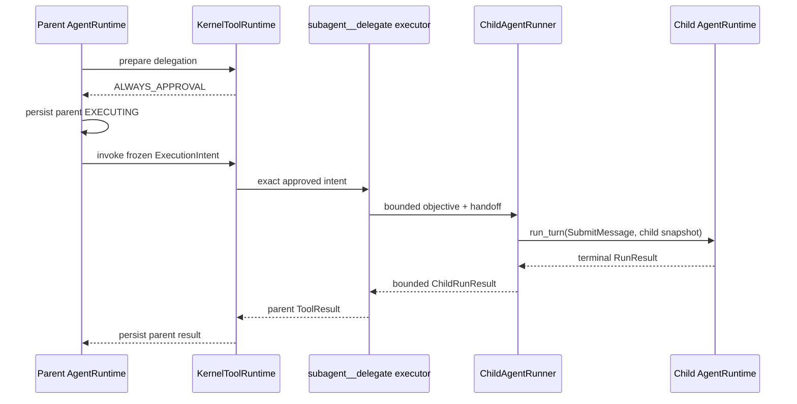

# Bounded SubAgent Delegation Design

## Purpose

SubAgent v1 允许父 Agent 把一个明确、有限的只读思考任务交给 child Agent，并把 child 的最终文本作为父侧普通 tool result 返回。

它证明的是“同一个 Kernel 可以被安全复用”，不是恢复旧 `subagent_system`、新增 orchestration framework，或在 tool 里藏第二套 model/tool loop。

## Required contract amendment

当前 `EXTENSION_CONTRACTS.md` 的 ToolSource 规则“不能自行调用模型”需要精确化：

- 普通 ToolSource 仍不得导入或调用 `ModelProvider`，也不得实现 model/tool loop。
- 只有 `subagent__delegate` 的 executor 可以调用 composition root 注入的 `ChildAgentRunner` port。
- `ChildAgentRunner` 的唯一 production implementation 必须构造同一个 `AgentRuntime` 类，并且只调用它的 `run_turn`。
- child 的 provider call 仍只能发生在 `agent/runtime/loop.py`。

如果不能接受这项窄化合同，SubAgent 就只能是一个外部 delegation service；不能在进程内实现。

## Position in the Kernel

父侧 delegation 始终只是一个 governed EXTERNAL tool effect。
父 `AgentRuntime` 不知道 child state，child `AgentRuntime` 也不知道父 cursor。

## Tool contract

`subagent__delegate`：

- Risk: `HIGH`。
- Side effect: `EXTERNAL`。
- Approval: `ALWAYS_APPROVAL`。
- Arguments: bounded `objective` 与 bounded immutable `handoff`；不接受 provider、tool、path、budget 或 policy override。
- Static ToolSpec identity: runner version、child limits digest、与 parent 相同的 approved provider trust profile identity 与 parent workspace scope。
- Per-call intent/approval binding: static ToolSpec identity 加本次 objective/handoff digest。
- Output: bounded final child text、child run ID、termination reason 和不含私密 context 的统计摘要。

approval preview 必须显示 provider destination/profile identity 与 bounded objective/handoff，digest 只负责绑定所见内容。

executor 必须接收冻结的 `ExecutionIntent`，并从父 intent idempotency key 派生稳定 child conversation/run identity。
模型不能自行指定 child ID，也不能通过重复相同 parent action 创建第二个 child。

## Child isolation profile

v1 child 固定使用以下 profile：

- 与父侧相同的 `AgentRuntime` class 和同一 production loop implementation。
- 独立、仅本次调用存活的 `ConversationState` 和 in-memory `CheckpointStore`。
- 独立 `KernelContextManager`，不配置任何 `ContextSource`。
- 空 `KernelToolRuntime`；child 不能请求文件、Skill、MCP、Memory 或另一个 SubAgent。
- 不继承父 conversation history、pending request、tool result、Memory、Skill body、MCP credential 或 workspace filesystem capability。
- handoff 只含父模型显式提供并经过大小限制的文本，不自动复制父 context。
- 最多一次 model call、零 tool calls、固定 input/output token cap，并且 composition 要求 child provider 的有限时 request timeout 不超过 child profile 上限。

v1 不用不可终止的 Python thread 包装同步 `run_turn` 来伪造 hard wall-clock cancellation。
同步 receipt 路径（`ChildAgentRunner`）只接受结构化声明 `receipt_type="synchronous"` 的 provider
（其 `generate` 保证同步返回、不会悬挂，例如本地确定性 provider substitute）。production HTTP
provider 不满足该合同：socket/read timeout 不能证明 provider 已终止。

真正的 hard deadline 经 **进程隔离合同（G8）** 提供：见下方 “Process-isolated hard-deadline
contract”。

v1 child 必须使用与 parent 相同的 approved provider trust profile；可以复用实例或同配置 adapter，但不能把 handoff 发送到另一个 provider/destination。
credential 只在 composition root 注入，不能进入 handoff、intent、event 或 checkpoint。未来跨 provider delegation 是独立的产品/安全决策，不能靠普通 tool argument 开启。

父模型仍可能把已见过的 Memory/tool result 手工复制进 handoff；因此 approval preview 是最后的人类外发检查，设计不宣称“未自动继承”就等于内容无敏感信息。

## Completion semantics

只有 child 返回 `RunStatus.COMPLETED` 才是成功，并把 bounded message 转成 parent known executed result。

以下 child 结果统一转为 bounded `child_nonterminal` known executed error，随后丢弃 child state：

- `AWAITING_APPROVAL` / `AWAITING_RECOVERY`。
- `LIMIT_REACHED` / `CONVERSATION_LIMIT_REACHED`。
- `FAILED_RETRYABLE` / `FAILED_FATAL` / `CONFLICT` / `CANCELLED`。
- 一次 model call 返回 tool call 而无法在零 tool budget 内完成。

这不是父侧 unknown outcome：只要 runner 明确拿到了 child 的这些终态，parent delegation effect 的结果就是已知失败。

## Unknown-outcome semantics

parent 已写入 `EXECUTING` 后，如果宿主进程崩溃，或 runner/provider adapter 抛出无法分类且无法返回 child `RunStatus` 的异常，parent 无法证明 child 是否产生了外部模型副作用或最终文本。

此时异常必须传播，由 parent `AgentRuntime` 进入现有 `AWAITING_RECOVERY`；不得自动再建 child，也不得把它包装成 `child_nonterminal`。

human 只能通过现有 `ResolveUnknownToolOutcome` 决定父侧记为成功或失败。v1 不恢复 child，也不尝试找回其临时 state。

## Events and observability

- parent 只发出普通 tool requested/result/approval/recovery events。
- child events 不直接混入 parent event sequence；runner 最多返回 bounded summary counters。
- child prompt、provider raw response、credential 和临时 checkpoint 不写 parent events。
- child identity 与 parent idempotency identity 的关联可记录 digest，不记录完整 handoff。

## Failure and replay matrix

| Scenario | Expected result |
|---|---|
| approval rejected | child runner call count 为零 |
| same parent action replay | 返回已有 parent result，不创建新 child |
| changed runner/budget/provider identity | 旧 approval binding 失效；different provider denied |
| child completed | 一个 bounded parent tool result |
| child asks for tool | `child_nonterminal`，不执行工具 |
| child pauses or reaches limit | `child_nonterminal`，不暴露 child resume |
| host/runner crashes after parent EXECUTING | 恢复时 parent `AWAITING_RECOVERY`，无自动 retry |
| recursive delegation attempt | child tool catalog 为空，无法发起 |

## 009 audited closure gate

2026-07-20 follow-up 证明当前实现只用 provider 类型分支拒绝 HTTP adapters，尚未实现本设计要求的 executable provider lifecycle。
009 必须满足：

- `ChildProfile` 结构化绑定 provider trust identity、bounded-return/deadline capability、receipt version 与 child caps；不能用 provider class/name 作为 contract。
- objective/handoff 的 schema、prepare、preview 与 execute 使用同一 limit；limit+1 在 child call 前拒绝，任何路径不得静默切片。
- supported fake provider 产生 single-use call receipt。runner 在解释 child `RunResult` 前先消费 receipt；unconfirmed receipt 覆盖 nonterminal/error normalization 并使 parent 进入 recovery。
- `COMPLETED` + confirmed terminal receipt 才是 success；confirmed nonterminal 是 `executed=true/is_error=true/code=child_nonterminal`，不能是普通字符串。
- production E2 从 parent model-visible `subagent__delegate` definition 开始，经过 parent approval/`EXECUTING`、一个 child `AgentRuntime.run_turn`、parent result checkpoint 与下一次 parent `ContextPack`；直接 runner test 只是 E1。
- child provider call count 最多一，child tools/sources/workspace 为零，same parent intent replay 不创建第二个 child。

如果没有一个满足上述 contract 的 positive supported provider E2，SubAgent 必须保持 `implemented-candidate + safe-unavailable`，不能标 `locally-verified`，也不能进入 E3。
009 不得为追求可用性引入不可终止 timeout thread 或降低 unknown-outcome contract。

## Process-isolated hard-deadline contract (G8)

`agent.subagent.process_runner.ChildProcessRunner` 是 SubAgent 的真实 hard-deadline provider
路径，用于没有 synchronous `deadline_contract` 的 production provider（HTTP adapters）。它实现
了原 Deferred 的 “hard wall-clock preemption 和独立 child process termination”。

### Deadline guarantee

- child 在独立 OS 进程内运行**同一个** `AgentRuntime.run_turn`（经 `runner.build_child_runtime`，
  subagent 包内唯一导入 `agent.runtime.loop` 的位置）。不创建第二套 model/tool loop。
- parent 拥有该进程的 process group（`start_new_session=True`），在 `hard_deadline_seconds` 后
  用 `killpg` 终止整个 group 并 `wait` 确认退出。这是唯一诚实的 hard deadline：socket/read
  timeout 只能放弃在途请求，不能证明 provider 已终止；只有进程所有权能保证 child 本地终止。
- runner 自身声明 `ProviderDeadlineCapability(receipt_type="process_terminated")`——capability
  来自进程边界，不来自 HTTP adapter（绝不给 urllib/http adapter 挂 `deadline_contract` 属性）。

### Process / thread lifecycle

- parent 只创建一个 child process（per delegation），不创建 worker thread、不创建第二条 event loop。
- child 进程短暂、单次：跑一次 `run_turn` → 序列化 bounded 结果到 stdout → exit 0。
- deadline kill 走 `SIGTERM`→grace→`SIGKILL`，最终 `wait` 收尸，避免僵尸/孤儿。
- IPC hygiene：child stderr 直达 `DEVNULL`（OS 级丢弃，deadlock-safe、不缓冲、不进 result——避免
  >pipe-buffer stderr 阻塞 child 触发假 UNCONFIRMED）；parent 以 `_MAX_RESULT_BYTES` 有界读取 stdout，
  oversized/malformed 判 UNCONFIRMED；per-run temp 目录在 finally 安全移除（先删 config.json 再
  rmdir 空目录，不跟随 symlink）。
- in-process 同步路径（`ChildAgentRunner`）仍保留给声明 synchronous deadline 的 provider；composition
  按 provider 的 `deadline_contract.receipt_type` 选择路径，不是 fallback。

### Termination receipt

- `TERMINATED`：child exit 0 且 stdout 是合法结果 JSON（child 已 terminally 报告 `RunStatus`——
  无论 COMPLETED 还是被 run_turn 分类为 FAILED_*）。
- `UNCONFIRMED`：parent 在 deadline 前 child 未自行退出（被 parent kill），或 child 非 0 退出 / 未写
  合法结果。provider call 可能已发生 → parent 必须进入 unknown-outcome recovery；`UNCONFIRMED`
  覆盖一切 child normalization。该覆盖经确定性故障注入测试（child generate 阻塞 >> deadline）。

### Credential handling

- `ChildProviderSpec` 只携带非秘密 config 与 `credential_env_name`；credential 值**永不**跨进程
  序列化（不进 config 文件 / event / checkpoint / manifest）。
- child 从自身 env（继承自 parent）按 `credential_env_name` 读取 credential，用于在子进程内构造
  HTTP adapter。child config 文件是 bounded、owner-only、no-follow 临时文件，用后删除。

### 限制（residual）

- 该合同为 **trusted child implementation** 的 hard-deadline 与终止保证；针对 *untrusted* child
  implementation 的进程隔离（独立 sandbox/credential 边界）仍 Deferred。
- poll-loop 终止有 `poll_interval`（默认 20ms）量级的调度抖动：receipt 仍诚实（child 是否“自行
  报告”决定 TERMINATED/UNCONFIRMED），但 kill 时刻可能略晚于 `hard_deadline_seconds`。
- child 仍是单次、只读、零工具预算、固定 input/output cap；不支持 child resume / 多 model call。

## Deferred

- child tools、workspace、Skill、MCP、Memory 或 parent context inheritance。
- 多 model call、planning loop、child resume 和 durable child checkpoint。
- 后台、并行、fan-out/fan-in、routing、adjudication 和 role registry。
- streaming、progress forwarding、cancel in-flight child 和 child task IDs。
- 针对不可信 child implementation 的进程隔离（与 G8 的 trusted-child hard-deadline 合同不同）。

## Related contracts

- `docs/architecture/KERNEL_ARCHITECTURE.md`
- `docs/architecture/EXTENSION_CONTRACTS.md`
