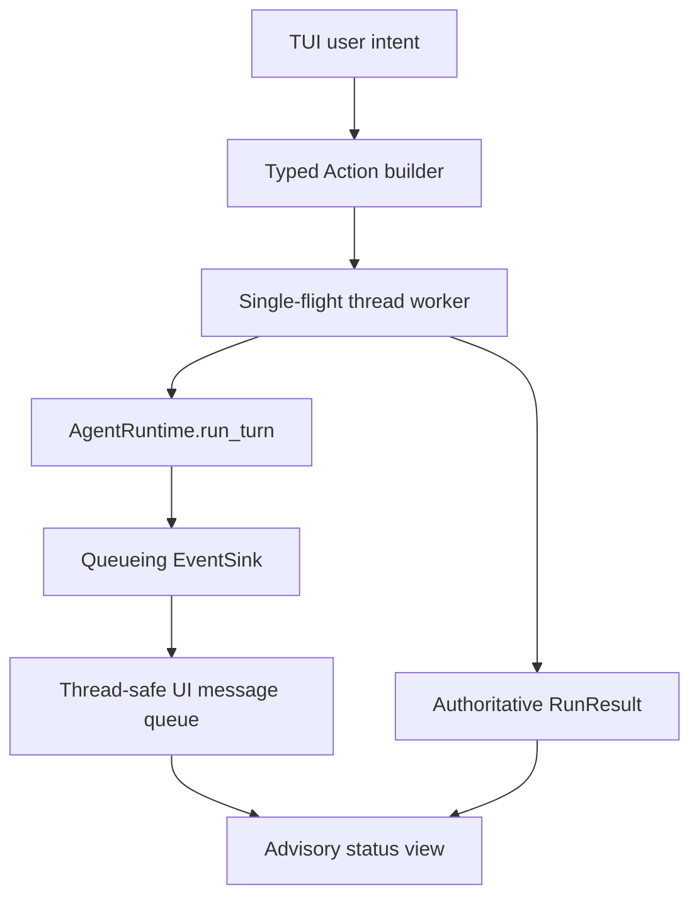

# Textual TUI Runtime Adapter Design

## Purpose

TUI v1 为现有 Kernel 提供一个可选的 Textual 界面，并保持 CLI/headless 的 action、state 和 recovery 语义完全一致。

它不是新的 Runtime，也不把 batch event 包装成“流式 Agent”。

## Dependency baseline

- Python: `>=3.11`。
- Optional extra: `textual>=8.2,<9`。
- base install、headless 和普通 CLI 不导入 Textual。

Textual thread worker 可以承载同步 `run_turn`，但取消 thread worker 不能终止正在执行的 Python thread。
因此 v1 明确不提供 in-flight cancel。

## Adapter boundary

- action builder 必须复用 CLI 已验证的合法性规则或共享纯函数；不能复制一套状态机。
- Textual-free adapter 提供同步 `execute_once()`、single-flight gate 与 event queue，但自己不创建 thread；唯一 thread owner 是 Textual worker，它只调用一次 adapter execution。
- event sink 只把 immutable event 放入 thread-safe queue，再由 UI thread `post_message`/`call_from_thread` 渲染。
- event 不改变按钮权限、revision 或 pending request；这些都来自最新 `RunResult.state` 或重新加载的 checkpoint。

TUI startup/reopen 先执行一次 Textual-free 的 authoritative `store.load()` 来构建初始 view；这是只读装载，不提交 action，也不调用 provider/tool。Scheduler handoff 使用显式 `state-root + relative checkpoint reference + workspace` 入口，按现有 durable-state path 规则解析同一个 checkpoint；TUI 不扫描 state root、猜 cwd 或展示其他 conversation。
worker exception 后同样重新加载 checkpoint 决定可恢复界面，不能依赖可能缺失的 RunResult。

## Typed action parity

TUI 必须能表达全部现有用户 action：

- `SubmitMessage`。
- `ResolveApproval(approved=true/false)`。
- `ResolveUnknownToolOutcome(MARK_SUCCEEDED/MARK_FAILED)`。
- `Resume`。
- `CancelRun`：正常交互只在 Runtime 已经返回 paused state 后可用；另允许从 durable checkpoint 重开时，对“本地没有 worker、active run 为 `RUNNABLE` 且 phase 不是 `EXECUTING`”的 interrupted 场景使用。shared reducer 对 `RUNNABLE/EXECUTING` 的 Cancel 必须返回 unchanged conflict；所有入口只能先 `Resume` 进入 Kernel recovery，不能用 Cancel 绕过未知 effect classification。

TUI 不增加 UI-only mutation，例如“跳过审批”“强制重试工具”或“清空 active run”。

每个 action 使用当前 authoritative state 的 `conversation_id`、`next_action_seq` 与 `revision`；pending resolution 必须携带 exact request ID 和 binding digest。

## Single-flight lifecycle

同一 conversation 同时最多存在一个 Runtime worker。

worker active 时：

- 禁用所有会提交 action 的控件。
- 允许滚动、复制和安全关闭提示。
- 不显示有效的 cancel 按钮，因为 Textual cancel 不能证明 model/tool 已停止。

worker 返回后：

- 先应用完整 `RunResult`，再根据 authoritative state 重新计算可用 action。
- events 可去重和补充展示，但不得覆盖 result。
- 若 TUI 关闭或进程崩溃，下一次启动从 checkpoint 恢复；如果 effect 已在 `EXECUTING`，现有 Kernel recovery 规则负责 fail closed。

active worker 收到 close intent 时进入明确的 `closing_requested` view：立刻停止接受新 action，显示“正在等待当前调用安全收口；这没有取消 model/tool effect”，并保持 process/resources 存活。worker 在已配置的 bounded deadline 内返回后，TUI 先应用 result/checkpoint，再逆序关闭 shared resources 并退出；若 deadline 被底层实现违反，UI 保持 `shutdown_blocked` 且不提前 teardown，外部终止进程按 crash/recovery 处理。TUI 不提供伪装成安全 cancel 的 force-exit action。

重启加载到“本地没有 active worker，但 checkpoint 是 `RUNNABLE`”时，TUI 显示 interrupted run：`EXECUTING` phase 只允许新 sequence 的 `Resume` 以进入 recovery；其他 phase 允许 `Resume`/`CancelRun`。绝不重交原 `SubmitMessage`（unfinished replay record 会正确保持 action-in-progress）。
未指定 durable state 的 in-memory 模式不承诺跨进程恢复。

## Pending request rendering

approval/recovery 表单的唯一数据源是 authoritative state 的：

`active_run.pending_request`

这份 state 可以来自最新 `RunResult.state`，也可以来自 startup/reopen 的 `store.load()`；重开不要求先制造一个新的 `RunResult`。

如果事件丢失、重复或晚到，只要 authoritative state 有 pending request，TUI 仍必须能重建表单。
相反，如果 event 表示 approval requested 但 authoritative state 已经推进，TUI 不得展示过期批准按钮。

UI 只显示 bounded preview、request ID、风险/effect class 和安全摘要；binding digest 可用于 action，但不需要完整展示。

## Authoritative projection matrix

startup/reload 与 worker result 共用一个 pure projection，不能由 widget 自行猜状态：

| Authoritative input | Main view | Enabled actions | Reload/focus rule |
|---|---|---|---|
| no active run + `last_safe_result` | terminal status；`COMPLETED` 文本来自 `last_safe_result.message` | new SubmitMessage | focus input；同一 final message 只渲染一次 |
| no active run + no result | ready | SubmitMessage | focus input |
| `AWAITING_APPROVAL` | exact approval form | approve / reject | focus form；不用 event 重建 |
| `AWAITING_RECOVERY` | exact recovery form | mark succeeded / mark failed | focus form；不提供 retry |
| `PAUSED_LIMIT` / `PAUSED_RETRYABLE` | bounded reason | Resume / CancelRun | focus Resume |
| local worker absent + `RUNNABLE/EXECUTING` | interrupted unknown effect | Resume only | Resume 后让 Kernel 产生 recovery request |
| local worker absent + other `RUNNABLE` | interrupted run | Resume / CancelRun | focus Resume；不 replay SubmitMessage |
| startup/reopen：本地无 worker，但 persisted `owner_invocation_id` 非空 | stale-owner candidate；仍按 authoritative phase/status 投影 | 由前述 RUNNABLE/pending 行决定 | durable owner 字段本身不是 live lease 证明；不能永久锁死 crash recovery |
| 本地提交 action 后 Runtime 返回实际 `conversation_busy` | busy | none | reload only；reload 后重新按 authoritative state 投影，不缓存 busy 结论 |
| worker exception / revision or checkpoint conflict | bounded error | none until reload | authoritative `store.load()` 后重新投影 |

`RunResult.delivery_warnings` 与 events 只能附加 advisory 文本，不能改变表格中的 action availability。unknown status/error 使用 generic bounded 文案。

## Rendering and privacy

- 当前执行完成时 assistant final message 来自 `RunResult.message`；startup/reopen 的 terminal message 来自 `state.last_safe_result.message`。
- approval/recovery/error/result 中所有模型或外部工具可控文本都经过同一个 literal safe-display projection：Textual/Rich 使用 `markup=False`，不解析 markup/link，ANSI、C0/C1 与 Unicode bidi control 用可见且无歧义的 escape 表示。approval digest 仍绑定原始 canonical 内容；若 escape 后的完整 preview 超过 UI cap，则必须在 effect 前拒绝，不能截断或隐藏。
- tool/model progress events 明确标记为 advisory，不伪装成 token streaming。
- error code 使用稳定映射；未知 error 保留 generic 文案。
- 不展示 checkpoint raw JSON、credential、绝对私有路径、Memory inventory、Skill roots 或 MCP environment。
- event/result 文本仍受 Kernel output limits；TUI 自己再限制 retained rows，避免无限内存增长。

## Test strategy

Textual 官方 `App.run_test()` 与 `Pilot` 覆盖：

- action builder 与 CLI 对同一 state 产生等价 typed action。
- active worker 时 single-flight 控件状态。
- event 重复、乱序或缺失不改变 authoritative action availability。
- approval/recovery/Resume/paused Cancel 的完整交互。
- projection matrix 覆盖所有 `ActiveRunStatus`/`RunStatus`、busy/conflict/worker exception 与 terminal reopen；final message 只出现一次。
- close/crash 后 checkpoint replay 与 pending request 重建。
- active-worker close 显示 no-cancel warning，stop-accepting → bounded result → closeables 顺序可验证；deadline violation 不提前 teardown。
- Scheduler `state-root + relative ref + workspace` 直接打开 needs-human checkpoint，且不扫描其他 state。
- 所有 action 纯键盘可达；pending form 获得焦点，Tab 顺序固定且焦点可见；approve/reject/mark succeeded/mark failed 有文字标签且不靠颜色，Enter 不默认批准或判定成功。
- 直接从 approval/recovery checkpoint 启动时，无需制造 action 即可显示正确表单，provider/tool call count 为零。
- 未安装 Textual 时 base import 和普通 CLI 正常，TUI entrypoint 返回明确安装提示。

所有测试使用 fake Runtime/Provider、临时 checkpoint 和 deterministic events；不启动真实 provider 或外部 UI automation。

## 009 audited closure gate

当前 Textual App 仍只有 submit → completed Pilot。
009 对本设计的 closure 以完整 authoritative keyboard journey 为准：

- Pilot 真实按键覆盖 submit、approve、reject、mark succeeded、mark failed、Resume 与合法 paused Cancel，并断言 action fields/digest 与 CLI builder 一致。
- App 可直接从 durable approval/recovery/interrupted checkpoint 启动；pending form 不依赖新 event 或伪造 action，provider/tool call count 为零。
- `RUNNABLE/EXECUTING` reopen 只显示 Resume；event 丢失、重复、乱序不改变 action availability。
- Runtime composition 与 TUI adapter 使用同一个 queue EventSink；background events 不再写 `TerminalRenderer` 污染 Textual screen。
- Textual 是唯一 worker thread owner。adapter 不创建第二线程，Textual worker cancellation 不宣称 model/tool effect 已终止。
- normal exit、startup partial failure、worker exception、active close 与 Scheduler handoff 都经过同一 lifecycle owner；stop-accepting、result/recovery preservation、reverse close exactly once 可观察。
- active call 不安全收口时显示 `shutdown_blocked` 并保持 resources，不提供 force-exit/cancel 冒充安全终止。

submit smoke、projection unit test 或源码中的 action method 只能算 E0/E1。
完整 keyboard/restart/lifecycle E2 与 009 materialized E2M 通过前，TUI 不能标 CLI parity 或 `locally-verified`。

## Deferred

- token streaming、partial assistant content 和 in-flight cancellation。
- multi-conversation tabs、dashboard、history browser 和 background run list。
- MCP resource/media rendering、Markdown webview、file picker 和 clipboard integration。
- scheduler management、Memory editor、Skill marketplace 和 capability configuration UI。
- remote TUI、websocket/API service 和 multi-user state。

## Sources

- Textual workers: `https://textual.textualize.io/guide/workers/`
- Textual testing: `https://textual.textualize.io/guide/testing/`
- Current local boundaries: `docs/architecture/EXTENSION_CONTRACTS.md`
