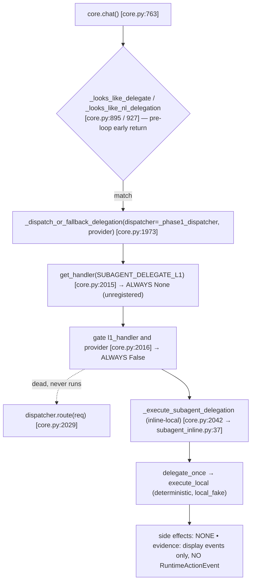
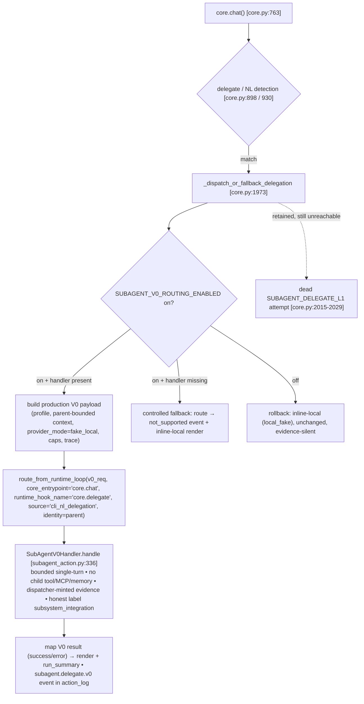

# feat: SubAgent V0 production routing + Golden E2E Phase A (Repair Window 1)

## Summary

Route live CLI/NL subagent delegation through the already-registered
`SUBAGENT_DELEGATE_V0` handler via the `RuntimeActionDispatcher`
(`route_from_runtime_loop`), behind a default-off rollout flag, while keeping the existing
inline-local path as the only controlled fallback. Add explicit Golden E2E scenarios under
`tests/golden_e2e/` that characterize today's inline-local behavior and then prove the
flag-on V0 route. Scope is exactly Roadmap **SA-1** + **GE-1 Phase A** — nothing else.

**This window's goal is "V0 production routing migration completed under flag" with honest
`subsystem_integration` evidence — the expected, correct outcome for a dispatcher-routed
`fake_local` V0 route.** Raising the North Star §20 Subagent critical gate to 3 — or even
reaching `harness_runtime_e2e` — is explicitly NOT a required outcome of this window
(B1 resolved B1-A; see Provenance Decision).

This is a plan-only artifact. No production code, tests, Roadmap, or North Star are
changed by writing it.

---

## Problem Frame

`SubAgentV0Handler` is implemented, registered (`agent/runtime_integration/phase1_hook.py:179`),
and contract-verified (12 green tests in
`tests/runtime_integration/test_subagent_v0_runtime_boundary.py`) — but **not
production-routed**. Live delegation never reaches it: `core.chat` takes a pre-loop
early-return shortcut into `_dispatch_or_fallback_delegation`
(`agent/core.py:1973`), which attempts a `SUBAGENT_DELEGATE_L1` handler that is
**registered nowhere**, so it unconditionally falls through to the inline-local path
(`agent/subagent_inline.py:37`, `execution_mode="local_fake"`). That fallback writes
**no dispatcher evidence** — only display events.

North Star principle J (Bounded subagents) and B (One Runtime Spine) require the
production subagent path to flow through the runtime dispatcher with parent-minted
provenance and child evidence return. OD-1 is already adjudicated (V0 is the target).
Until V0 is routed, there is no Golden E2E proving any live subagent path, and the
production delegation path stays evidence-silent. SA-1 closes the routing gap with honest
dispatcher-routed (`subsystem_integration`) evidence; GE-1 Phase A supplies the executable
acceptance floor. (Raising the §20 gate to 3 needs loop-origin provenance and is out of
scope here — see the Provenance Decision.)

---

## Provenance Decision (B1 — resolved: B1-A)

**Decision (user-adjudicated): B1-A.** Window 1 keeps the pre-loop delegation seam and
does NOT move delegation into `run_main_loop`. V0 is routed through the
`RuntimeActionDispatcher` with provenance that matches the real call site:

- Route via `route_from_runtime_loop` with a truthful `core_entrypoint="core.chat"`, a
  delegation-specific `runtime_hook_name="core.delegate"`, and an honest pinned
  `source="cli_nl_delegation"` (any non-`core_loop` value; `source` is a free `str`,
  `schema.py:221`). **Forging `source="core_loop"` is forbidden.**
- Honest evidence level (verified against code): the `fake_local` V0 success path returns
  `observed_call=None` (`agent/runtime_integration/subagent_action.py:919`), so it carries
  no `target_module_proof`; `is_runtime_e2e_evidence` is False
  (`evidence.py:474-533`) and `classify_evidence_level` (`evidence.py:616-648`) returns
  **`subsystem_integration`** — the dispatcher-routed tier below `harness_runtime_e2e` and
  `real_core_loop_runtime_e2e`, both of which require a registered-target module proof this
  window does not produce. **`subsystem_integration` is the honest, expected, correct
  outcome — not a failure.** It already proves dispatcher routing + minted provenance + no
  second runtime, which today's evidence-silent inline path does not.

**Migration vs gate — two distinct things the plan keeps separate:**

- *In scope this window:* "V0 production routing migration completed under flag" — V0 is
  reachable through the dispatcher when the flag is on, with real dispatcher-minted
  provenance, bounded child, correct inheritance, and evidence on success / error /
  fallback.
- *NOT a required outcome this window:* raising the §20 Subagent gate to 3, or even
  reaching `harness_runtime_e2e`. Gate→3 needs loop-origin (`core_loop`) provenance (the
  pre-loop seam cannot honestly produce it); `harness_runtime_e2e` needs a registered-target
  module proof (the `fake_local` route invokes none). Both are out of scope.

**B1-B is NOT the next step — it is a separate, independent design spike.** Whether
delegation must move into `run_main_loop` to earn L3 is deferred to a spike that must
first prove, with evidence:

1. the concrete acceptance value L3 brings over honest L2;
2. why the pre-loop seam cannot serve as a legitimate governed path;
3. relocation's impact on the early-return shortcut, render, conversation state, tool
   flow, checkpoint, fallback, and rollback.

No code is relocated for a score without that evidence.

**Roadmap acceptance mismatch (recorded, not acted on):** Roadmap SA-1's Exit condition
bundles "Subagent gate 具备到 3 的证据" and "无效 L1-attempt … 移除" into SA-1. Window 1
delivers neither (honest `subsystem_integration`; the L1 attempt is retained). This is logged as a Roadmap
acceptance mismatch / follow-up amendment request; the Roadmap is **not** modified this
round (see D6).

---

## Requirements

### SubAgent production routing (SA-1)

- R1. Live CLI and NL delegation route `SUBAGENT_DELEGATE_V0` through the runtime
  dispatcher when the rollout flag is enabled.
- R2. V0 is routed via `route_from_runtime_loop`, going through the Spine with
  dispatcher-minted provenance that is not forgeable from `request.payload`. Per B1-A the
  `source` is the honest pinned `cli_nl_delegation` (non-`core_loop`), so the evidence
  honestly classifies as `subsystem_integration`. The plan does not claim — and the code
  must not forge — `core_loop` provenance, and the route does not reach
  `harness_runtime_e2e` (it produces no registered-target module proof).
- R3. The parent passes the turn bound (`max_turns=1`), context caps (`max_files` /
  `max_context_chars`), permission (`capability_flags`, tool/MCP/memory default-deny),
  tool subset (`allowed_tools`), parent-built context, and trace id into the V0 request
  payload; the child cannot execute tools, call MCP, or write memory/checkpoint
  directly. (V0 has no `budget` key — that is the L1 handler's concept.)
- R4. The V0 `RuntimeActionResult` (`status` / `parent_decision_status` / `safe_output`)
  is mapped into the `core.chat` return string and the run-summary event. The
  user-visible text necessarily differs from inline-local: V0's default `fake_local`
  success `safe_output` is `{"summary": <hash>}` (`subagent_action.py:979-987`), not a
  readable summary, so U3 defines an explicit V0→string mapping rather than claiming
  field-for-field equivalence with `render_delegate_result`.
- R5. Inline-local is the single controlled fallback, triggered only by a defined,
  narrow condition (structural unavailability), never by a V0 business failure.
- R6. Every dispatcher-routed outcome emits evidence: V0 success and V0 error each produce
  a `subagent.delegate.v0` `RuntimeActionEvent`, and the controlled fallback (flag on but
  V0 handler structurally unavailable) produces a dispatcher `not_supported`
  `RuntimeActionEvent` — making the fallback observable, unlike today's evidence-silent
  inline path.
- R7. A rollout switch (env flag, default off, left off this window) and a rollback path
  exist and are tested. Rollback = flag off → the current inline-local path, behavior
  unchanged (evidence-silent, exactly as today), no second runtime. This is distinct from
  the controlled fallback (R6), which fires only when the flag is on and V0 is structurally
  unavailable and is observable via a dispatcher `not_supported` event — not a new evidence
  taxonomy and not a parallel emit path.
- R8. The dead `SUBAGENT_DELEGATE_L1` attempt is retained untouched this window; it is
  not the production path and is not removed.
- R13. The window's success criterion is "V0 production routing migration completed under
  flag" with honest `subsystem_integration` evidence (window-level acceptance criterion,
  not assigned to a single unit). Raising the §20 Subagent gate to 3 — or reaching
  `harness_runtime_e2e` — is explicitly NOT required; `subsystem_integration` is recorded
  as the expected, correct outcome.

### Golden E2E Phase A (GE-1)

- R9. An explicit `tests/golden_e2e/` suite covers the Phase A checklist (G1–G7 below:
  simple conversation, tool success, inline-local subagent characterization, flag-on V0
  delegation, flag-off rollback, V0-unavailable controlled fallback,
  provenance/evidence assertions) — driven through `chat()` with `FakeProvider`, no real
  LLM/MCP/network. Each test asserts user-visible results AND key runtime evidence, never
  just handler registration, source strings, or private-function returns. Event matching
  uses `RuntimeActionType.SUBAGENT_DELEGATE_V0` (value `subagent.delegate.v0`, dotted),
  never a hand-typed string.
- R10. The subagent scenario first characterizes the current inline-local behavior
  (flag off), then a flag-on variant asserts the live V0 route after wiring.
- R11. Golden E2E and the V0 boundary test exercise the **live** path (through
  `core.chat`), satisfying the `V0_WIRING_DECISION.zh.md` exit condition that
  integration tests cover the live route, not just an isolated `route_v0` handler call.

### Source-of-truth consistency

- R12. `runtime_decision_frame` subagent level and the SoT-truth tests in
  `tests/runtime_integration/test_subagent_runtime_truth.py` are reconciled with the
  wired dual-path state (V0 gated + inline-local fallback) in the same unit that wires
  V0 — they encode the very fact being changed and will break otherwise.

---

## Key Technical Decisions

- KTD1 — **Route from the existing pre-loop delegation seam, not from inside the turn
  loop.** Wiring lands in `_dispatch_or_fallback_delegation` (`agent/core.py:1973`),
  which already holds the same `_phase1_dispatcher` instance the loop uses (passed at
  `core.py:898` / `:930`). Relocating delegation into `run_main_loop` is a larger
  architectural change and is out of scope (B1-B).

- KTD2 — **Provenance is dispatcher-minted and honest (B1-A).** Route via
  `route_from_runtime_loop` (sets `dispatcher_origin="runtime_loop"`) with truthful
  `core_entrypoint="core.chat"`, `runtime_hook_name="core.delegate"`, and pinned
  `source="cli_nl_delegation"`; never forge payload fields (the dispatcher strips
  payload-supplied provenance per `dispatcher.py:339-341`). The `fake_local` V0 success
  invokes no registered-target module (`observed_call=None`, `subagent_action.py:919`), so
  `is_runtime_e2e_evidence` is False and `classify_evidence_level` (`evidence.py:616-648`)
  honestly returns `subsystem_integration` — below both `harness_runtime_e2e` and the
  `core_loop` L3 level. Do not forge `source="core_loop"`. See the Provenance Decision.

- KTD3 — **Production V0 payload builder is a net-new private function in
  `agent/core.py`; the test helpers are not reused.**
  `tests/runtime_integration/subagent_v0_contract_helpers.py` (`build_v0_request`,
  `build_v0_context`) is explicitly test-only. The production builder maps parent state
  → V0 payload: `profile_id`, `task`, `provider_mode="fake_local"`, parent-built bounded
  context (`prepared_v0_context` with `max_files` / `max_context_chars` /
  `parent_selected_files`), `capability_flags`, and trace identity. It is a private
  helper inside `core.py` — no new module (single consumer).

- KTD4 — **`provider_mode="fake_local"` by default.** The live inline path is
  deterministic (`local_fake`, no network). V0 production routing defaults to
  `fake_local` to preserve that behavior and honor the red line "no real LLM/MCP". The
  `real_opt_in` mode (which requires `parent_opt_in`) is out of scope this window.

- KTD5 — **Rollout flag modeled on the memory-gate pattern; default stays off this
  window.** Add `SUBAGENT_V0_ROUTING_ENABLED` (default off) read exactly like
  `agent/memory_runtime_hooks.py:33` reads `MEMORY_CONSOLIDATION_ENABLED`. The default
  is NOT flipped on this window (see OQ2) — SA-1 is discharged by a flag-on Golden E2E,
  not by changing the production default. All flag-dependent tests pin the flag
  explicitly (off for inline-local, on for V0) so none depends on the default.

- KTD6 — **Two distinct off-V0 paths; neither is a silent business-failure fallback.**
  (a) *Rollback* — flag off → current inline-local, behavior unchanged, evidence-silent
  (today's path); the rollback proof. (b) *Controlled fallback* — flag on but V0 handler
  structurally unavailable (`get_handler` returns None) → route the V0 request anyway so
  the dispatcher emits a real `not_supported` `RuntimeActionEvent` (the fallback evidence,
  via `_unsupported_result`), then render inline-local. A V0 *business* failure surfaces as
  a failure result (R4) and does NOT fall back — a silent business-failure fallback would
  re-create the second-production-path smell North Star B/§15 forbids.

- KTD7 — **Golden E2E live as a new `tests/golden_e2e/` package.** Net-new directory
  (allowed; GE-1 is additive), not a reorg of existing `tests/` (red line 9). It reuses
  the smoke harness pattern (`chat()` + `FakeProvider` + `on_runtime_event` capture)
  and the integration conftests.

---

## High-Level Technical Design

### Current call graph (live delegation — verified)



### Target call graph (flag on)



### Rollout / rollback state

```mermaid
stateDiagram-v2
  [*] --> InlineLocalDefault: flag absent/off (today + post-U3 default)
  InlineLocalDefault --> V0Routed: SUBAGENT_V0_ROUTING_ENABLED=true
  V0Routed --> InlineLocalDefault: unset flag (instant rollback; prior evidence preserved)
  V0Routed --> ControlledFallback: V0 handler structurally unavailable
  ControlledFallback --> InlineLocalDefault: same inline path + fallback evidence
```



---

## Implementation Units

### U1. Characterization Golden E2E (Phase A, current behavior)

- Goal: Lock today's behavior for the three Phase A scenarios before any production
  change. R9, R10 (flag-off half).
- Requirements: R9; R10 (flag-off characterization only — the flag-on V0 variant is
  delivered in U4).
- Dependencies: none.
- Files:
  - `tests/golden_e2e/__init__.py` (new)
  - `tests/golden_e2e/conftest.py` (new — import existing `FakeProvider` + capture
    fixtures directly from `tests/conftest.py`; no new shared helper module)
  - `tests/golden_e2e/test_golden_simple_conversation.py` (new)
  - `tests/golden_e2e/test_golden_tool_success.py` (new)
  - `tests/golden_e2e/test_golden_subagent_delegation.py` (new)
- Approach: Model on `tests/smoke/test_first_usable_task_e2e.py` (`chat(..., provider=FakeProvider(), on_runtime_event=capture)`).
  The subagent scenario drives `chat()` with a delegate command / NL trigger and sets
  `SUBAGENT_V0_ROUTING_ENABLED` explicitly **off**, asserting the inline-local render +
  `execution_mode="local_fake"` + absence of a V0 `RuntimeActionEvent`. Do not rely on
  a scripted subagent provider fixture — `subagent_action_fixture` is "Reserved — not
  yet supported in fake" (see `docs/design/fake-provider-scripted-scenario-contract.md`).
- Execution note: Characterization-first. These must pass on the first run against
  unchanged production code; if any fails, the behavior diagnosis is wrong — STOP and
  investigate, do not edit production to force green.
- Patterns to follow: `tests/smoke/test_first_usable_task_e2e.py`;
  `tests/runtime_integration/test_subagent_inline_local_live.py` arrange/act/assert.
- Test scenarios:
  - Simple conversation: `chat("…", FakeProvider())` emits `assistant.delta` events
    whose concatenation contains the fake echo; non-empty reply. Sub-case (same file):
    empty input `chat("   ", FakeProvider())` returns `""`.
  - Tool success: a fake `tool_call` (or `run_local_demo`) yields an `executed`
    envelope and a `tool_result` trace event.
  - Subagent delegation (flag off): delegate command → non-empty inline render;
    captured request `execution_mode == "local_fake"`; no `RuntimeActionType.SUBAGENT_DELEGATE_V0`
    (`subagent.delegate.v0`) event in the dispatcher action log. (Match by the enum value,
    not a hand-typed string; assert absence of the V0-typed event specifically so it
    survives U3 adding a fallback-typed event.)
- Verification: `pytest tests/golden_e2e/` green on unchanged production code.

### U2. V0 live-route contract tests (RED before wiring)

- Goal: Express the SA-1 contracts as focused tests that fail on current code and pin
  the wiring target. R1, R2, R3, R4, R5, R6, R7.
- Requirements: R1, R2, R3, R4, R5, R6, R7.
- Dependencies: U1 (sequencing only — U2 references no U1 artifact; commit order, not
  code coupling).
- Files:
  - `tests/runtime_integration/test_subagent_v0_live_route.py` (new)
- Approach: Drive `chat()` with `SUBAGENT_V0_ROUTING_ENABLED=true` and a delegate
  trigger; inspect the dispatcher action log / result evidence. Assert each SA-1
  contract independently so failures localize.
- Execution note: TDD — these are RED until U3. Expected initial failure mode is
  "no V0 RuntimeActionEvent / flag unread / fallback emits no evidence".
- Patterns to follow: dispatcher-level assertions in
  `tests/runtime_integration/test_subagent_v0_runtime_boundary.py`; provenance evidence
  keys in `agent/runtime_integration/dispatcher.py:537-555`.
- Test scenarios:
  - Routing (R1): flag on + delegate → a `RuntimeActionType.SUBAGENT_DELEGATE_V0`
    (`subagent.delegate.v0`) `RuntimeActionEvent` with `handler_name == "SubAgentV0Handler"`
    (match by enum value, not a hand-typed string).
  - Provenance (R2, B1-A): assert the exact `classify_evidence_level(...)` return label
    `== "subsystem_integration"`, not a hand-picked field subset; AND assert the emitted
    evidence has `dispatcher_origin == "runtime_loop"`, `core_entrypoint == "core.chat"`,
    `runtime_hook_name == "core.delegate"`, and `runtime_action_source != "core_loop"`
    (`== "cli_nl_delegation"`). A payload that tries to forge `source="core_loop"` /
    `core_loop_invoked` does NOT change the label. (`source` is a free string and the sole
    L3 discriminator — this assertion is the guardrail that fails the suite if anyone
    forges.)
  - Result mapping (R4): a V0 success result (`safe_output == {"summary": <hash>}`) maps
    to the specific rendered string defined in U3 and a `subagent_delegations=1`
    run-summary — asserting the V0 shape, not equivalence to inline-local render.
  - Inheritance (R3): the built V0 payload carries parent `max_files` /
    `max_context_chars` / `parent_selected_files` and trace id; evidence shows
    `second_runtime_created is False`, `autonomous_child_loop is False`, `max_turns == 1`;
    no child tool/MCP/memory side effect occurs.
  - Controlled fallback (R5/R6): with the V0 handler structurally unavailable
    (`get_handler` None), routing yields a dispatcher `not_supported` event and inline-local
    render; a V0 *business* failure does NOT fall back (asserts a failure result instead).
  - Rollback (R7): flag off → inline-local executes, behavior unchanged and evidence-silent
    (no V0 event), no second runtime.
- Verification: all new tests RED before U3, GREEN after U3.

### U3. Wire production delegation through V0 (minimal, flag-gated)

- Goal: Make U2 green with the smallest change; keep U1 (flag off) green. R1–R8, R12.
- Requirements: R1, R2, R3, R4, R5, R6, R7, R8, R12.
- Dependencies: U1, U2.
- Files:
  - `agent/core.py` (`_dispatch_or_fallback_delegation` — add flag-gated V0 branch
    above the retained dead L1 attempt; add production V0 payload builder + result
    mapping + evidence-bearing fallback)
  - `agent/runtime_decision_frame.py` (flag-aware `subagent_level` — in-scope because
    the SoT-truth tests assert this value directly, see below)
  - `tests/runtime_integration/test_subagent_runtime_truth.py` (reconcile THREE
    assertions to the dual-path state — R12)
- Approach: At the top of `_dispatch_or_fallback_delegation`, when the flag is on and
  `get_handler(SUBAGENT_DELEGATE_V0)` is present, build the production V0 payload via a
  private builder in `core.py` (KTD3, KTD4), route via `route_from_runtime_loop` with the
  honest pinned `source="cli_nl_delegation"` (KTD2, B1-A → `subsystem_integration`), map
  the result to a string + run-summary (R4), and on structural unavailability fall back to
  inline-local while emitting a `not_supported` evidence event (KTD6, R6). Specifics pinned
  here so the implementer makes no undesigned call:
  - Result mapping (R4): V0's `safe_output` is `{"summary": <hash>}` on `fake_local`
    success, not readable text. Render `status` + `parent_decision_status` + a fixed
    "result available (`<hash>`)" line; state plainly the user-visible text differs from
    `render_delegate_result`. Do not claim field-for-field equivalence.
  - Fallback evidence (R6): the controlled fallback (flag on, V0 handler unavailable) routes
    the request so the dispatcher emits a genuine `not_supported` event via
    `_unsupported_result` (`dispatcher.py:443-495`) — not a hand-built dict, not a new event
    type, not a second emit path. The flag-off rollback stays evidence-silent (R7,
    unchanged from today).
  - Leave the dead L1 attempt (`core.py:2015-2029`) and the inline-local helper
    untouched (R8); the inline import surface stays intact for the boundary guard.
  - SoT reconciliation (R12) — make `runtime_decision_frame.subagent_level` flag-aware
    (V0-routed level when on, `inline_local_fallback` when off) and update all THREE
    breaking assertions in lockstep:
    - `test_production_cli_delegation_routes_l1_then_falls_back` (function `:156`, assert
      `:175`) asserts core source does NOT contain `SUBAGENT_DELEGATE_V0` — breaks when the
      branch is added.
    - `test_sot_does_not_overclaim_v0_as_live_execution_path` (`:181`) asserts the SoT
      execution-path string — must reflect the gated dual-path.
    - `test_subagent_level_is_inline_local_fallback` (`:214`, asserts `:230`
      `subagent_level == "inline_local_fallback"`) — must become flag-aware.
- Execution note: Do not weaken `tests/test_architecture_boundaries.py`. In particular
  `test_cli_subagent_delegation_uses_registry_and_delegate_once` pins
  `agent/subagent_inline.py`'s import surface — the fallback still uses inline-local, so
  that boundary must stay intact.
- Patterns to follow: env-gate read at `agent/memory_runtime_hooks.py:33`; result/render
  mapping already present at `core.py:2030-2039`; `route_from_runtime_loop` call shape in
  `agent/loop.py` turn-end probe.
- Test scenarios:
  - U2 suite flips RED → GREEN.
  - U1 (flag off) remains GREEN.
  - SoT-truth: updated assertions reflect "core contains both L1 (dead) and V0 (gated);
    default behavior inline-local"; `subagent_level` flag-aware.
  - Boundary suite (`tests/test_architecture_boundaries.py`) stays GREEN — no child
    cross-domain side effect, no second runtime, inline import surface intact.
- Verification: `pytest tests/runtime_integration/ tests/golden_e2e/ tests/test_architecture_boundaries.py`
  green with flag both off and on (run the on-cases via env).

### U4. Repoint Golden E2E + V0 boundary to the live V0 route

- Goal: Add flag-on live-path assertions and fulfill the `V0_WIRING_DECISION` exit
  condition. Test-only; no production change. R10, R11.
- Requirements: R10, R11.
- Dependencies: U3.
- Files:
  - `tests/golden_e2e/test_golden_subagent_delegation.py` (add flag-on V0 variant
    alongside the retained flag-off characterization)
  - `tests/runtime_integration/test_subagent_v0_runtime_boundary.py` (extend to exercise
    the live route through `core.chat` with the flag on)
- Approach: The subagent Golden E2E keeps a flag-off scenario (inline-local
  characterization) and adds a flag-on scenario asserting the live V0 route. Extend the
  boundary test so at least one case routes V0 through `core.chat` (live), not only via
  the isolated `route_v0` helper. The rollout default is NOT flipped here (OQ2); the
  stale boundary-test docstring (D3) is NOT corrected here (deferred doc-align, avoiding
  a drive-by edit).
- Execution note: Keep the flag-off fallback characterization permanently — losing it
  would drop the rollback proof. Tests pin the flag explicitly (on/off); they do not
  depend on the production default.
- Patterns to follow: `route_v0` helper vs live `chat()` entry; U1 scenario shape.
- Test scenarios (Golden E2E checklist G4–G7):
  - G4 Flag-on V0 delegation: delegate via `chat()` with the flag on → user-visible V0
    render + a `RuntimeActionType.SUBAGENT_DELEGATE_V0` (`subagent.delegate.v0`)
    `RuntimeActionEvent` whose `classify_evidence_level(...)` is `subsystem_integration`;
    no second runtime.
  - G5 Flag-off rollback: still inline-local render, evidence-silent (rollback proof,
    identical to G3).
  - G6 V0-unavailable controlled fallback: flag on but handler structurally unavailable →
    dispatcher `not_supported` event + inline-local render. A V0 *business* failure
    surfaces as an error and does NOT fall back (KTD6).
  - G7 Provenance/evidence assertions: the flag-on event carries honest provenance
    (`runtime_action_source != "core_loop"`; forged `source="core_loop"` does not change
    the `subsystem_integration` label); success, error, and controlled fallback each carry
    a dispatcher event.
  - Boundary live case: V0 exercised through `core.chat` (flag on), evidence keys as in U2.
- Verification: full `pytest` green with the flag pinned on and off; `V0_WIRING_DECISION`
  live-path exit condition (integration test exercises the route) satisfied.

### U5. Roadmap Status Delta (report-only, post-acceptance)

- Goal: After U1–U4 are green and acceptance passes, **输出 Roadmap Status Delta
  报告**，向 docs-only 流程指出 SA-1 / GE-1 实际需要的状态更新建议。
- Requirements: none — post-acceptance reporting; not traced to an R-ID (the
  code/test side of R12 is delivered in U3, not here).
- Dependencies: U1, U2, U3, U4.
- Files:
  - **执行 Agent 不编辑、不创建 commit** 到本 Plan 或
    `docs/06-audit/CURRENT_ARCHITECTURE_REPAIR_ROADMAP.zh.md`。
  - 输出物（report-only）：一份 Roadmap Status Delta 草稿（建议修改项 + 依据
    green test ids），由 docs-only Agent 在实施独立审计后单独落地。
- Approach: 报告层只描述 "V0 routing migration done under flag, honest
  subsystem_integration" 的状态建议；不修改 SA-1 / GE-1 acceptance / exit 口径
  （D6 修订由 docs-only 流程独立处理）；不修改
  `docs/06-audit/V0_WIRING_DECISION.zh.md` 与
  `docs/06-audit/CURRENT_AUDIT_STATUS.zh.md`（它们是本窗口外的事）。
- Execution note:
  - **执行期间 Plan 与 Roadmap 都是 frozen read-only contract**；
  - 本单元仅产出报告草稿；不写入文件、不创建 commit；
  - 实际 Roadmap 状态更新由 docs-only 流程在实施独立审计后单独执行。
- Test scenarios: 无 — report-only，不产生文件变更。
- Verification: 报告草稿可被 docs-only 流程独立消费；本单元不触发 git 变更。

---

## Output Structure

```text
tests/golden_e2e/                      # new (U1)
  __init__.py
  conftest.py
  test_golden_simple_conversation.py
  test_golden_tool_success.py
  test_golden_subagent_delegation.py
tests/runtime_integration/
  test_subagent_v0_live_route.py       # new (U2)
```

---

## Golden E2E Phase A — Test Checklist

All live in `tests/golden_e2e/`, driven through `chat()` + `FakeProvider` (no real
LLM/MCP/network), with the flag pinned explicitly per test. **Each test asserts a
user-visible result AND key runtime evidence — never only handler registration,
source-string greps, or private-function returns.**

| # | Scenario | Unit | Asserts (user-visible + runtime evidence) |
|---|---|---|---|
| G1 | Simple conversation | U1 | `assistant.delta` echo text; non-empty reply; empty input → `""` |
| G2 | Tool success | U1 | `executed` envelope + `tool_result` trace; user-visible tool output |
| G3 | Inline-local subagent characterization (flag off) | U1 | inline render string; `execution_mode="local_fake"`; no `subagent.delegate.v0` event (match by enum) |
| G4 | Flag-on V0 delegation | U4 | V0 render string; `subagent.delegate.v0` event; `classify_evidence_level == subsystem_integration`; no second runtime |
| G5 | Flag-off rollback | U4 | identical inline-local render to G3, evidence-silent (rollback proof) |
| G6 | V0-unavailable → controlled fallback | U4 | dispatcher `not_supported` event + inline-local render; V0 business failure → error (no fallback) |
| G7 | Provenance / evidence assertions | U4 | `runtime_action_source != "core_loop"`; forged `source="core_loop"` does not change the `subsystem_integration` label; success/error/controlled-fallback each carry a dispatcher event |

G1–G3 are characterization (green on unchanged code, flag off). G4–G7 assert the flag-on
live V0 route and land after U3 wiring.

---

## Commit Matrix

| # | Commit | Unit | Independently rollback-able | Touches production code |
|---|---|---|---|---|
| 1 | `test(golden): lock current conversation/tool/subagent paths` | U1 | yes (delete new test dir) | no |
| 2 | `test(subagent): define V0 inheritance/provenance/fallback contracts` | U2 | yes (delete new test file) | no |
| 3 | `feat(subagent): route production delegation through V0 (flag default off)` | U3 | yes (revert core/frame/SoT-test) | yes |
| 4 | `test(golden): repoint delegation scenario to V0 (live path)` | U4 | yes (remove flag-on cases) | no |
| — | (no commit) | U5 | n/a — report-only | no |

> U5 不在本 commit matrix 产生 commit：执行 Agent 只产出 Roadmap Status Delta
> 草稿；实际 Roadmap 状态更新由 docs-only 流程在实施独立审计后单独落地。

No final mixed review-fixes commit: review findings are folded into the unit they
belong to before that unit's commit.

---

## Feature / Rollout Gate

- Flag: `SUBAGENT_V0_ROUTING_ENABLED` (env, read like `MEMORY_CONSOLIDATION_ENABLED`).
- Flag semantics (locked):
  - missing or invalid value → off;
  - off → current inline-local fallback, behavior unchanged;
  - on → V0 dispatcher path.
- Default: off, and left off for the entire window. The flag-on Golden E2E (G4) must pass.
- Two independent phases: (1) wire + prove behind the flag — this window, default off;
  (2) flip the default on — a SEPARATE future plan. Flipping the default on is forbidden
  this window; a future default-on requires its own plan, commit, full suite, Golden E2E,
  and rollback review.
- Override: setting the env var off at any time restores inline-local immediately
  (rollback) — evidence-silent, exactly as today; historical evidence from prior flag-on
  runs remains in the action log.

## Rollback

- Per-commit: each commit reverts independently (Commit Matrix).
- Runtime: unset `SUBAGENT_V0_ROUTING_ENABLED` → inline-local path, evidence preserved,
  no second runtime. The flag-off Golden E2E scenario is the standing rollback proof.
- The inline-local helper and the dead L1 attempt are never deleted this window, so the
  pre-V0 behavior is always one flag away.

## Failure Modes

- F1. V0 cannot be routed honestly — the only way to the target evidence would be forging
  `source="core_loop"`, or the honest label comes out worse than `subsystem_integration`
  (e.g. `not_covered`) → STOP; never forge provenance. B1-B (relocating into the loop) is a
  separate design spike, not an in-window fallback — do not relocate to chase a score.
- F2. V0 contract requires a shape change to accept production payloads → STOP, update
  `V0_WIRING_DECISION.zh.md` (its own rule: "the next contract change must update this
  doc"), re-run the 12 boundary tests, re-gate.
- F3. SoT reconciliation (R12) reveals deeper coupling than a flag-aware level → STOP,
  reassess; do not silently flip `is_capability_complete()` allowed-set semantics.
- F4. A boundary test in `tests/test_architecture_boundaries.py` trips (child
  cross-domain, second runtime, inline import surface) → STOP; the wiring is wrong, not
  the test.
- F5. Characterization (U1) fails on first run → behavior diagnosis wrong; STOP, do not
  edit production to force green.
- F6. Fallback starts firing on V0 business failures (KTD6 violated) → second-path
  smell; STOP and narrow the trigger.

---

## Scope Boundaries

### In scope

- "V0 production routing migration completed under flag", honest `subsystem_integration`
  evidence, the `tests/golden_e2e/` Phase A checklist (G1–G7), and U3 SoT reconciliation.

### Explicit non-goals

- Raising the §20 Subagent critical gate to 3, or reaching `harness_runtime_e2e` (both
  need provenance / module proof the `fake_local` pre-loop route cannot honestly produce;
  explicitly not required — see Provenance Decision).
- No GE-1 Phase B/C, SPA-1, RS-1, CR-1, GE-2, GE-3, MEM-*, or any other Roadmap item.
- Do not delete the inline-local path (it is the controlled fallback).
- Do not delete or re-activate the L1 attempt as a production path; do not restore the
  `SUBAGENT_DELEGATE_L1` / `SUBAGENT_DELEGATE_L2` handlers as production routing targets.
- Do not remove `SubAgentDelegateL0Handler` (the dispatcher-registered handler behind
  the turn-end L0 probe, `phase1_hook.py:169` — distinct from the inline-local fallback).
  Removing it diverges from the `V0_WIRING_DECISION` exit text; that divergence is
  recorded deliberately, and L0 removal is a separate future item.
- Do not introduce a second runtime; do not let the child execute tool/MCP/memory
  writes directly.
- Do not enable `real_opt_in` provider mode or any real LLM/MCP/network call.
- Do not reorganize existing `tests/` directories; do not touch `AGENTS.md` or
  `.claude/settings.json`.
- Do not relocate delegation into the turn loop this window (B1-B).

### Deferred to follow-up work

- Moving delegation into `run_main_loop` for native `core_loop` / L3 provenance (B1-B).
- Flipping the rollout default off → on (OQ2).
- Correcting the stale `test_subagent_v0_runtime_boundary.py` xfail docstring (D3) and
  the stale North Star §3.1 wording (D1/D2) — separate, user-approved doc-align items.
- Fixing the stale `agent/loop.py:570-573` comment (empty-registry claim, D5) — not in
  any file this window touches.
- GE-1 Phase B/C and the `tests/adversarial/` stub.

---

## Resolved Decisions

- OQ1 / B1 — **Resolved B1-A.** Keep the pre-loop seam; route V0 through the dispatcher
  with honest pinned `source="cli_nl_delegation"` → `subsystem_integration` evidence. No
  forging; no relocation. See the Provenance Decision.
- OQ2 — **Decided: default off this window.** Flipping the default on is a separate
  future plan (own commit, full suite, Golden E2E, rollback review).
- OQ3 — **Decided: Golden E2E lives in `tests/golden_e2e/`.**

---

## Risks & Dependencies

- Dependency: `route_from_runtime_loop` provenance mechanism (exists,
  `agent/runtime_integration/dispatcher.py:350`); V0 handler + registration (exist).
- Dependency: SA-1 ⇄ GE-1 co-delivery — the subagent Golden E2E characterizes
  inline-local (green now) and is repointed to V0 after U3; not a circular prerequisite.
- Risk: SoT-truth tests encode the pre-wiring fact and break on U3 by design (R12);
  mitigated by reconciling them inside U3, not as drive-by edits.
- Risk: `FakeProvider` cannot script a subagent fixture; mitigated by driving delegation
  through the CLI/NL trigger, not a provider tool-call, and labeling the scenario as
  "dispatch path verified" rather than full business execution.

---

## Discrepancies Between Code and Frozen Docs (surfaced, not acted on)

Per the freeze rule, these are reported, not silently corrected; none changes the target
architecture.

- D1. North Star §3.1 / Roadmap SA-1 describe live delegation as "L1-attempt → inline
  fallback". The L1 attempt (`core.py:2015-2029`) is **unreachable dead code**
  (`SUBAGENT_DELEGATE_L1` is registered nowhere); the live path is **unconditional
  inline-local**. The plan treats the "retain L1" constraint as applying to dead code.
- D2. North Star §3.1 names `_execute_subagent_delegation` as the core entry; it is an
  import alias (`core.py:107`). The real seam is `_dispatch_or_fallback_delegation`
  (`core.py:1973`).
- D3. `test_subagent_v0_runtime_boundary.py` docstring and
  `subagent_v0_contract_helpers.py` `V0_*_XFAIL` constants call the 12 tests "RED
  guardrails / strict xfails"; they are plain passing tests. Doc drift; deferred to a
  doc-align follow-up — not corrected this window (avoids a drive-by edit).
- D4. `V0_WIRING_DECISION.zh.md` exit condition lists removing `SubAgentDelegateL0Handler`;
  this window keeps it (inline-local stays as fallback). Recorded as a deliberate
  divergence in U5.
- D5. `agent/loop.py:570-573` comment claims the turn-end L0 probe uses an empty
  registry; the registered handler uses a non-empty descriptors registry
  (`phase1_hook.py:169`). Out of scope; noted for a future doc-align item.
- D6. Roadmap SA-1's Exit condition bundles "Subagent gate 具备到 3 的证据" and
  "无效 L1-attempt … 移除" into SA-1; Window 1 delivers neither (honest L2; L1 attempt
  retained per user constraint; honest `subsystem_integration` evidence). Recorded as a Roadmap acceptance mismatch / follow-up
  amendment request — the Roadmap is not modified this round.

---

## Stop Conditions

ce-work must stop and wait for the user when any holds:

- Any Failure Mode F1–F6 fires.
- Achieving the target evidence would require forging `source="core_loop"` provenance.
- A change would require editing `AGENTS.md`, `.claude/settings.json`, North Star, this
  Plan, `CURRENT_ARCHITECTURE_REPAIR_ROADMAP.zh.md`, or any out-of-scope Roadmap item
  (including flipping the rollout default, or B1-B relocation). **执行期间本 Plan 与
  Roadmap 都是 frozen read-only contract——执行 Agent 不得修改，须停止并等待
  用户。**
- Wiring would require deleting inline-local, removing the L1 attempt, adding a second
  runtime, or letting the child execute tool/MCP/memory directly.
- The V0 contract must change shape to accept production payloads (re-gate via F2).

Handoff-ready (for another, cheaper coding agent via `/goal` + `ce-work`) only when:
Blocker/High = 0 across the three reviews; the plan requires no `core_loop` forgery; B1-B
is explicitly out of scope; default-off + flag-on verification + rollback are unambiguous;
the `tests/golden_e2e/` checklist (G1–G7) is enumerated; and execution has not started.

Acceptance (all required before U5 / window close): U1 (G1–G3) green on unchanged code;
U2 green after U3; full `pytest` green with the flag pinned off and on; boundary suite
green; `V0_WIRING_DECISION` live-path exit condition met; **V0 production routing migration
completed under flag, with honest `subsystem_integration` evidence as the success
criterion — gate→3 and `harness_runtime_e2e` are out of scope this window.** Review chain
before close: CE code
review (`ce-code-review`), gstack `/review`, and an independent fresh-context audit all run
with no unresolved Blocker/High — each finding folded into the owning unit's commit, never
a mixed review-fixes commit.

---

## Sources / Research

- `agent/core.py:763` `chat`; `:898/:930` delegation call sites; `:1973`
  `_dispatch_or_fallback_delegation`; `:2015-2029` dead L1 attempt; `:2042` inline
  fallback; `:107` `_execute_subagent_delegation` alias.
- `agent/subagent_inline.py:37` `execute_subagent_delegation`, `:63` `execution_mode="local_fake"`.
- `agent/runtime_integration/subagent_action.py:321` `SubAgentV0Handler`, `:336` `handle`.
- `agent/runtime_integration/phase1_hook.py:169-182` L0 + V0 registration (no L1).
- `agent/runtime_integration/dispatcher.py:335` `route`, `:350` `route_from_runtime_loop`
  (parameterizable `core_entrypoint`/`runtime_hook_name`), `:537-555` provenance minting.
- `agent/memory_runtime_hooks.py:33` env-gate pattern for the rollout flag.
- `tests/smoke/test_first_usable_task_e2e.py` Golden E2E harness model;
  `tests/runtime_integration/test_subagent_inline_local_live.py` inline-local
  characterization; `tests/runtime_integration/test_subagent_runtime_truth.py` SoT-truth
  (will be reconciled); `tests/runtime_integration/test_subagent_v0_runtime_boundary.py`
  12 contract tests; `tests/test_architecture_boundaries.py` boundary invariants;
  `tests/runtime_integration/subagent_v0_contract_helpers.py` test-only V0 payload shape.
- `docs/06-audit/V0_WIRING_DECISION.zh.md` (Option 2 lead, exit condition);
  `docs/design/fake-provider-scripted-scenario-contract.md` (`subagent_action_fixture`
  reserved); `docs/real-e2e/UNIFIED_RUNTIME_FLOW_CONTRACT.md` (runtime-loop provenance
  rules); `docs/design/subagent-boundary-architecture.md` (two delegation paths).
