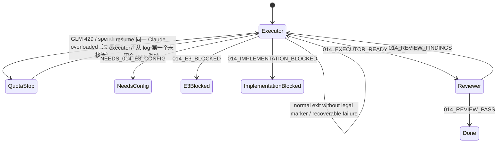

# 014 Grounded Workspace Knowledge Agent — Claude Code Loop Handoff

## 1. 这是什么

这是 repo 外的 Loop Engineering 执行协议，不是 First Agent 产品能力。Claude Code 是唯一 coding executor；
它独立完成实现、证据记录与 fresh 只读 reviewer 启动。**额度耗尽（GLM 429 / spending limit / overloaded）即
立即停止本 process，不由任何其他 agent 接管**；resume 时由同一 Claude executor 从 execution log 第一个未闭合
gate 继续。禁止把本协议实现成产品内 CodingLoop、supervisor、daemon 或第二套 Runtime。

用户已明确授权在当前仓库内给 Claude Code 最大开发权限，并要求使用已配置好的最强选项。本协议**不硬编码任何
model alias**（alias 可能被重映射）；执行者只在 invocation 层选择 model/effort/permission，不读取、不重写
用户 Claude settings/auth，也不探测 credential。本次 current-run 选择见下方 note。

### Current state（2026-08-05，权威当前状态）

**Current-run 选择**：本次 executor invocation 实际观察到 `--model opus` 映射到 `glm-5.2[1M]`、`--effort max`、
bypass permissions（**不是**旧 `--model fable` alias；本协议不再依赖任何具体 alias）。**额度耗尽（GLM 429 /
spending limit / overloaded）即立即停止本 process，不由 Codex 或任何其他 agent 接管**；resume 由同一 Claude
executor 从 execution log 继续。

**Reviewer boundary deviation（必须记录，不得当 pass）**：本次曾启动的 `project-auditor` reviewer 违反
no-Claude-memory 边界，读取了 `.claude/agent-memory/project-auditor/MEMORY.md` 及其 S5 memory 文件，且被
stopped、无完成记录。该 review **不构成 qualifying fresh reviewer evidence**；不读取/回显其 transcript，不把其
结论当 pass。随后改用 fresh `general-purpose` 只读 reviewer（prompt 明确禁止 project-auditor / memory / private /
runtime / `.claude/`）重审。**该 reviewer 也未完美 boundary-compliant**：它在仓库根执行过 `ls -la`，输出列出了
`.claude`/`.codex`/`.ua`/`memory`/`sessions`/`tui` 等**目录名称**（仅目录名，未进入或读取内容），违反 prompt 的
列举边界；故其 no P0/P1/P2 产品审查仅作辅助证据，不替代主执行者亲自重跑的 gate。

**当前树状态**：offline gates Green（git diff check / ruff / pytest 925 / verify membership+content+control）；
**真实 Model + Web E3 已 accepted**（当前树 3 连续，2026-08-05T08:52–08:55 UTC，`openai_compatible` /
`deepseek-v4-flash` + Tavily，三次 exit 0、19/19 claims、journeys 全 passed；receipt 顶层
`acceptance.status=accepted`）。hosted 模型有固有 flakiness（production adapter 已强制 `temperature=0`），三连前有
非连续失败 run，均被未改动的产品代码正确 fail-closed、未放宽 acceptance/decoder/no-progress/oracle。详细命令/exit/
flakiness 诚实披露见 `docs/implementation/014_EXECUTION_LOG.md` §9。**U10 mandatory held-out value journey 已 PASSED**
（2026-08-05）：fresh reviewer 选 novel topics（logging 默认级别 / `default log level` 释义 / RFC 9114 HTTP/3），executor
前台运行同预算 production value journey（真实 adapter/approval/checkpoint，不 mock/放宽）→ verdict=passed（见
`docs/acceptance/014_GROUNDED_PERSONAL_KNOWLEDGE_AGENT_HELDOUT_VALUE.json`，不改写 frozen receipt）。**全部闭合**：post-held-out
fresh independent reviewer no P0/P1/P2 + 最终完整 gates（154 entries）全 Green；权威最终状态见 execution log §9.3。

## 2. Execution envelope

- 工作目录：`/Users/jinkun.wang/work_space/my-first-agent`
- 分支：`main`；用户单独维护仓库，不创建 feature branch/PR。
- Claude：已配置，直接调用 CLI；不要运行 setup/login，不改 model alias 或 settings。
- 权限：仓库内 Read/Edit/Write/Bash/test 最大权限；外部网络仅用于官方文档和协议允许的 bounded E3。
- 不读取/输出 `.env`、secret/private/runtime、Claude/Codex memory/settings/auth、shell history、netrc。
- 不读取、删除、覆盖、stage 未跟踪根目录 `tui/`；已跟踪 `agent/tui/` 和 `tests/tui/` 只在 U7 准确 Red 时改。
- 不 commit/push/tag/改 remote，除非用户在完成后另行明确授权。
- Graphify 只读线索；current source/tests/contracts 才是实现权威。不得刷新 graph 摄入 ignored/private input。
- 不并发运行多个文件修改 process。Handoff 先记录当前 unit/diff/gate，再继续。

## 3. Authority and precedence

1. `AGENTS.md`
2. `STRATEGY.md`
3. `docs/architecture/KERNEL_ARCHITECTURE.md`
4. `docs/architecture/EXTENSION_CONTRACTS.md`
5. 014 plan 的 Product Contract、Verification Contract、Definition of Done
6. `docs/architecture/014_GROUNDED_PERSONAL_KNOWLEDGE_AGENT_DESIGN.md`
7. `docs/acceptance/014_GROUNDED_PERSONAL_KNOWLEDGE_AGENT_E3.md`
8. 本 handoff
9. `docs/implementation/014_EXECUTION_LOG.md`（只记录事实和进度，不能改合同）

若 lower-precedence 文档与 higher-precedence 不一致，执行者停止对应 unit、记录冲突并修正文档；不能挑容易的
版本。Plan 的 A1-A3 是显式未由用户单独确认的 planning assumptions，reviewer 必须重点攻击。

## 4. Executor prompt

```text
你是 my-first-agent 的 014 Grounded Workspace Knowledge Agent 主执行者。直接在当前 main 工作。用户给了当前仓库内 Read/Edit/Write/Bash/test 最大权限；不要为可逆开发步骤停下来询问。不要 commit/push/tag/改 remote。

先读 AGENTS.md、STRATEGY.md、KERNEL_ARCHITECTURE.md、EXTENSION_CONTRACTS.md。然后扫描 014 plan 的 headings，只先读 Goal Capsule、Verification Contract、Definition of Done 和当前 active U-ID；按 unit 依赖需要再读该 unit 引用的 R/F/AE/KTD、014 design、014 E3 和 014_EXECUTION_LOG.md。检查当前 git status/diff 和最后一个完整 gate。不要读取未跟踪根目录 tui/、.env、secret/private/runtime、Claude/Codex settings/auth/memory、shell history或 netrc。

目标：实现 014 到 Definition of Done。First Agent 要能按需检索当前 exact workspace 中由自己 canonical checkpoint 保存的历史，安全检索当前 workspace，经过 exact approval 使用固定 Tavily Search/Extract 查询公开 Web，在唯一 AgentRuntime.run_turn 内跨重启生成带 source receipts/citations 的本地 artifact，并由 Runtime-owned citation oracle 验证后才 VERIFIED_DONE。

绝对不变量：
1. AgentRuntime.run_turn 是唯一 production model/tool loop 和 state progression owner；ContextManager 独占 context/budget/data classes；KernelToolRuntime 独占 callable lifecycle；Provider adapter 只做 ContextPack -> ModelResponse。
2. 不创建 HistoryAgent/ResearchAgent/WebAgent、pre-runtime classifier、第二 Runtime/loop、CodingLoop、supervisor、daemon、dynamic registry、durable cursor/index authority、compatibility fallback 或 dormant flag。
3. history 只查 current exact workspace First Agent canonical history；不读其他 workspace、TUI/event logs、Graphify/UA、Claude/Codex sessions 或 ambient PC activity。历史永远不是当前权限/Memory/criterion authority。
4. Web 只走 fixed Tavily /search 和 /extract；Search 与 Extract 分别对 exact query/URL batch 经 ToolRuntime approval；fetch 只消费 durable search ref，不接受 arbitrary URL；不 direct fetch target host，不继承 proxy/cookie/netrc/custom header，不自动联网。
5. history/workspace/Web 内容全部 untrusted。它们不得形成 Goal authorization、Fact/Preference admission、user confirmation 或 completion authority。
6. credential value 只从 014 E3 明确 env name在 composition 内存注入；不进入 args/preview/binding/checkpoint/event/context/receipt/stdout/exception/docs。
7. 保留用户未跟踪根目录 tui/，不 reset/restore/clean/checkout 丢弃工作树。

工作方式：
- 严格按 U0→U10。每个行为/架构变化先写能证明缺口的 Red，运行并记录真实失败，再做最小 Green、focused regression 和 execution log 更新。
- 不为单次使用创建通用 framework；优先复用 existing checkpoint/WorkspaceBoundary/ToolRuntime/ContextManager/evidence patterns。
- U1-U6 每个 capability 必须各自达到 plan 定义的 E1/E2，才能进入 integrated journey；helper direct call、Fake/Mock、string assertion 不算 production-boundary pass。
- 持续更新 docs/implementation/014_EXECUTION_LOG.md：active unit、Red/Green command + exit、changed files、decisions/deviations、remaining gates。只记录真实完整结果。
- 一个 focused Green 或 unit Green 不是停止点。失败先诊断并修复；不要把关键任务交给 background Agent 后结束。
- timeout、输出截断、无 exit code、先前 run、测试数上涨、模型自报都不能算 pass。

完成前运行 014 plan Verification Contract 的全部未截断 gates。真实 E3 只读五个 FIRST_AGENT_014_E3_* 变量；缺失时必须先完成全部 offline/E2M。

Stop protocol：
- offline/E2M 全 Green且五项真实配置全部缺失：只输出准确 NEEDS_014_E3_CONFIG(...)；部分缺失输出
  014_E3_BLOCKED(reason=incomplete_config)。
- bounded live attempt 失败：只输出准确 014_E3_BLOCKED(reason=...)，保存 secret-free receipt；不是完成。
- 官方 Web 合同/数据处理边界或架构不变量出现无法由代码解决的冲突：只输出准确 014_IMPLEMENTATION_BLOCKED(reason=...) 与证据；不得静默换 provider/边界。
- U0-U9、三次真实 E3 与 full gates 全通过：输出 014_EXECUTOR_READY_FOR_REVIEW 和证据路径；U10 由外部 fresh
  reviewer 执行，这只是交审。
- 其他情况继续工作，不得输出完成 marker。
```

## 5. 外部 supervisor state machine



Supervisor 不是仓库程序。它只保存 Claude CLI session ID/stream/exit code 和 repo execution log，不向产品新增
任何 file/module/command。

### Transition rules

- **无合法 marker 正常退出：** resume 同一 Claude session；prompt 只要求读 log/diff/最后 failure，从第一个
  未闭合 gate 继续。
- **GLM 429 / spending limit / overloaded：** 立即停止本 process，**不接管、不重规划、不并发改文件**；resume
  时由同一 Claude executor 按 §6 resume prompt 从 log 第一个未闭合 gate 继续。
- **Context/session 损坏：** 新 Claude executor 按 §3/§4 读权威材料；不相信旧聊天摘要。
- **NeedsConfig/E3Blocked/ImplementationBlocked：** 这是需要用户、服务配置或重新决定产品边界的暂停态；只报告
  env 名、destination/model、公开合同证据和 secret-free reason，不能读取或回显 key。
- **ReadyForReview：** 启动 fresh session，只读审计；不能把 executor 的 reviewer subagent 当 fresh review。
- **ReviewFindings：** executor 按每个 finding 先 Red 再最小 Green，跑完整 gates，然后换新的 fresh
  reviewer 审全部 diff。
- **ReviewPass：** 唯一产品 loop 终态；随后才向用户报告并等待 commit/push 授权。

## 6. Resume prompt

```text
继续同一个 014 executor，不重新规划、不扩大范围。先读 docs/implementation/014_EXECUTION_LOG.md、当前 git status/diff、014 plan 当前 active U-ID 和最后一个完整失败/gate；从第一个未闭合 Red/Green/exit gate 继续。阶段性 Green、正常退出和无 marker 都不是停止点。继续遵守唯一 AgentRuntime.run_turn、current-workspace history、fixed approved Tavily Search/Extract、untrusted sources、no-secret、保留未跟踪根目录 tui/、不 commit/push。只有 014 handoff 定义的合法 marker可以停止。
```

## 7. Quota-stop 与 resume 协议

额度耗尽（GLM 429 / spending limit / overloaded）时：立即停止本 process，不接管、不并发改文件。Resume 时由
同一 Claude executor（新 invocation）按 §6 resume prompt 操作：

1. 读取 log 最后一个完整记录和当前 diff；确认上一 command 是否有 exit code、输出是否截断。
2. `git diff --check` + active unit 最小 focused gate，区分 incomplete code、test Red 与 unrelated/pre-existing。
3. 在 log 写明 resume reason、active U、last verified gate；不重写先前证据。
4. 从第一个未闭合 Red/Green/gate 继续 Red→Green。

本协议只有一个 coding executor（Claude Code），不再有 Codex takeover。任何 reviewer 必须是 fresh、只读、且
明确禁止读取 Claude/Codex memory/settings/auth/private/runtime 与 `.claude/` 的独立 invocation（**不得使用
project-auditor**，因其会读取 `.claude/agent-memory`）；优先用 `general-purpose` 只读 reviewer。

## 8. Fresh reviewer prompt

```text
你是 014 Grounded Workspace Knowledge Agent 的 fresh correctness/security/architecture reviewer。不要相信 executor 的完成声明，第一次只读审计；不得修改文件、commit/push。

完整读取 AGENTS.md、STRATEGY.md、Kernel/Extension contracts、014 plan 的 Product/Planning/Verification/DoD、014 design、014 E3、014 execution log、当前完整 diff、新增测试、materialized verifier/seal 和三次 secret-free E3 receipts。不得读取 .env、secret/private/runtime、Claude/Codex config 或未跟踪根目录 tui/。

主动构造失败：第二 loop/Runtime/research agent；ContextSource 自动历史/联网；cross-workspace 或 legacy unbound history leak；16+ terminal startup/horizon；scope digest confusion；workspace traversal/symlink/hardlink/private/budget bypass；Web send before approval、stale approval、profile/key/proxy leak、direct target fetch；observation crash/retry伪 evidence；source/data-class/receipt forgery；search snippet冒充 fetch；prompt injection 形成 Goal/Memory/criterion authority；citation laundering；false VERIFIED_DONE；restart重复 write；outcome 把无纠正当满意；fake/helper 冒充 E2/E3；materialized seal 摄入未跟踪/私有内容。

运行必要 focused tests 与全部未截断 Verification Contract gates，核对 E3 script 确实走 product composition、production Model adapter、production Tavily adapter 和真实 approval/checkpoint/evidence。固定 E3 通过后，另选未写入 fixture 的 history 释义和不同公开 Web 主题，各运行一次同预算 production value journey。任何 actionable P0/P1/P2 输出 014_REVIEW_FINDINGS，含 file/line、复现、expected/actual、fix standard；不得同时输出 pass。只有合同、三次真实 claims、held-out value journey、完整 gates 和 delivery evidence 都通过时输出 014_REVIEW_PASS；P3 可作为 advisory 同时记录，并列实际命令/exit/receipt与 residual caveats。
```

## 9. Legal stop markers

- `NEEDS_014_E3_CONFIG(required=FIRST_AGENT_014_E3_PROVIDER,FIRST_AGENT_014_E3_BASE_URL,FIRST_AGENT_014_E3_MODEL,FIRST_AGENT_014_E3_API_KEY,FIRST_AGENT_014_E3_WEB_API_KEY)`
- `014_E3_BLOCKED(reason=<incomplete_config|model_auth|model_endpoint|web_auth|web_rate_limit|web_protocol|source_unavailable|provider_protocol|product_no_progress|product_invalid_provider_response|product_invalid_model_control|product_invalid_model_output|product_output_truncated|product_conversation_capacity|timeout>)`
- `014_IMPLEMENTATION_BLOCKED(reason=<web_contract_drift|web_trust_policy_unaccepted|architecture_contract_conflict>)`
- `014_EXECUTOR_READY_FOR_REVIEW`
- `014_REVIEW_FINDINGS`
- `014_REVIEW_PASS`

任何其他自定义 marker 无效。GLM 429 / spending limit / overloaded 触发立即停止（不接管、不是产品 blocker
marker）；resume 由同一 Claude executor 从 log 继续。

## 10. Final report contract

最终报告必须区分：

- 014 实际验证的 current-workspace history、workspace search、approved public Web、source/citation/outcome 能力。
- 仍延期的 cross-workspace history、shell/process、direct browser/authenticated Web、multi-root、external writes、
  background scheduler 和自主优化。
- source/provenance evidence 的保证与不保证（不声称语义真理或远端删除）。
- source/full/materialized/E3/reviewer 的实际证据、已知 caveat、未提交工作树状态。

只有用户之后明确要求，才执行 commit/push。
