# 015 Governed Local Action — Claude Code Loop Handoff

> 2026-08-16 current closure override：用户已要求 Codex 直接接手后续闭合。本文件保留此前 Claude loop 的可恢复协议，
> 但 §1-§9 中“Claude 是唯一 executor”、GLM model/quota 与 fresh-Claude reviewer 的描述不再约束当前执行。当前仍受同一
> 产品合同、文件/secret 边界、合法 gate 和 no-commit/no-push 约束；Coding executor 的更换绝不进入 First Agent 产品。

## 1. Purpose

这是 repo 外的 Loop Engineering 执行协议，不是 First Agent 产品能力。Claude Code 是 015 唯一 coding executor；
它持续实现、验证、记录证据并在交审后修复 findings。外部 Codex 只负责启动、监控、识别合法 marker 和在额度恢复
后恢复 Claude；不得接管 product coding，也不得把 supervisor 写进仓库。

用户已明确授权 Claude Code 在当前仓库内使用最大开发权限，并要求固定 GLM 5.2、`effort=max`。已配置的本机
Claude Code 是唯一配置来源；supervisor 不运行 setup/login，不改 settings/model alias/auth，不读取或回显 credential。

## 2. Current execution choice

- CLI model selector：使用当前配置中实际映射到 `glm-5.2[1M]` 的 selector；已知当前环境的工作 selector 是 `opus`。
- 启动后必须从 Claude init receipt 验证 served model 为 `glm-5.2[1M]`。不匹配即停止，不静默换模型。
- Effort：`max`，必须从 invocation/init evidence 验证。
- Permission：`--dangerously-skip-permissions`，仓库内 Read/Edit/Write/Bash/test 最大权限。
- Slash commands：disabled，避免 executor 改变外部 loop 协议。
- Branch：直接 `main`；不创建 feature branch/PR。
- Landing：不 commit/push/tag/改 remote，除非用户在 015 完成后另行授权。

最大权限不覆盖内容边界：Claude 不得读取 `.env`、secret/private/runtime、Claude/Codex settings/auth/memory/session、
shell history、netrc 或未跟踪根目录 `tui/`。真实 E3 只读取 015 acceptance 指定的四个 env name，且不回显 value。

## 3. Authority precedence

1. `AGENTS.md`
2. `STRATEGY.md`
3. `docs/architecture/KERNEL_ARCHITECTURE.md`
4. `docs/architecture/EXTENSION_CONTRACTS.md`
5. 015 plan 的 Product Contract、Verification Contract、Definition of Done
6. `docs/architecture/015_GOVERNED_LOCAL_ACTION_DESIGN.md`
7. `docs/acceptance/015_GOVERNED_LOCAL_ACTION_E3.md`
8. 本 handoff
9. `docs/implementation/015_EXECUTION_LOG.md`（事实日志，不能降低上层合同）

发现冲突时，executor 停止对应 unit，记录 evidence，并输出合法 implementation blocker。不得选择更容易的版本、
修改 acceptance 来配合代码，或把 assumption 当用户授权。

## 4. Execution envelope

- 工作目录：`/Users/jinkun.wang/work_space/my-first-agent`。
- 保留当前 014 dirty tree；不 reset/checkout/clean/revert 用户或先前 loop 工作。
- 不读取、删除、覆盖、stage 未跟踪根目录 `tui/`。
- 只修改当前 active U-ID 需要的 tracked/new 015 product/tests/docs。
- 每个行为/架构变化先有准确 Red，再做最小 Green 与 focused regression。
- 不并发启动多个修改同一工作树的 executor。Fresh reviewer 只在 executor marker 后启动。
- Graphify/UA 只是 read-only coding aid，不是产品依赖；current source/tests/contracts 才是权威。
- 官方 Python 文档可用于 subprocess/os 合同；不得向其他外部服务发送仓库内容。

## 5. Executor prompt

```text
你是 my-first-agent 的 015 Governed Local Action 主执行者。直接在当前 main 工作。用户已授权当前仓库内 Read/Edit/Write/Bash/test 最大权限；不要为可逆开发步骤停下来询问。不要 commit/push/tag/改 remote。

先读 AGENTS.md、STRATEGY.md、KERNEL_ARCHITECTURE.md、EXTENSION_CONTRACTS.md。扫描 015 plan headings，只先读 Goal Capsule、Verification Contract、Definition of Done、Implementation Unit index、当前 active U-ID；再读当前 unit cited R/F/AE/KTD、015 design 对应章节、015 E3 和 015_EXECUTION_LOG.md。检查 git status/diff 与最后一个完整 gate。不要读取 .env、secret/private/runtime、Claude/Codex settings/auth/memory/session、shell history、netrc 或未跟踪根目录 tui/。

目标：把 docs/plans/2026-08-09-001-feat-governed-local-action-plan.md 实现到 Definition of Done。First Agent 要在同一个自然语言入口中，通过现有 AgentRuntime/KernelToolRuntime/approval/checkpoint/evidence 路径运行结构化、shell-free、bounded POSIX local process；用户批准的是 Goal/revision/workspace/executable/exact argv/cwd/limits/env 绑定、8 uses、60 minutes、可撤销的 durable lease；Runtime 铸造 receipt，crash/unknown 不重放，exit 0 不替代 artifact/semantic evidence。

绝对不变量：
1. AgentRuntime.run_turn 是唯一 production model/tool loop 和 state progression owner；ContextManager 独占 context；KernelToolRuntime 独占 callable lifecycle；Provider adapter 只做 ContextPack -> ModelResponse。
2. 不创建 CodingLoop、ProcessAgent、ShellAgent、第二 Runtime/loop、pre-runtime classifier、daemon、dynamic registry、service locator、compatibility fallback 或 dormant flag。
3. local_process 不接受 command string、shell、stdin、env、TTY、interactive、background、pipeline、redirection 或 raw model-selected limits；只接受 short/standard/long closed profile，始终 shell=False。
4. same-UID process 不是 sandbox。cwd/environment/process group 不能宣传为 filesystem/network confinement；approval/README/UI 必须明确风险。
5. credential/proxy/provider/Web key 不进入 child env、args/preview/binding/checkpoint/event/context/receipt/stdout/exception/docs。
6. ToolSpec/intent/approval/checkpoint/receipt 必须携带 LOCAL_SAME_UID_PROCESS authority；wrapper egress 不能冒充 child 无网络。spawn 前必须有 durable Goal、exact approval/lease 与 EXECUTING checkpoint；spawn 后不确定失败进入 existing unknown recovery，绝不 auto-rerun。
7. 普通 callable 不能伪造 ToolResult/receipt/evidence；只有 local_process closed draft 可由 Kernel 验证并铸造 ProcessReceiptV1。
8. VERIFIED_DONE 只由 current Goal/revision 的 closed evidence 得出；process exit 0 或 output/model prose不能单独证明 artifact/语义完成。
9. 保留完整 012/013/014 与 extension behavior；不 reset/restore/clean/checkout 丢弃 dirty tree或根目录 tui/。

工作方式：
- 严格按 U1→U10 依赖推进。先在 execution log 记录 U1 doc review/baseline 和第一个准确 Red，再写 product code。
- 每项行为/架构变化先写能证明用户可见合同或 stop-ship boundary 的 Red，运行并记录真实 failure/exit；再最小 Green、focused regression、execution log。
- 优先复用 existing ToolRuntime/approval/checkpoint/recovery/evidence/WorkspaceBoundary patterns；不为单次使用创建 framework。
- 一个 focused Green、unit Green、正常 exit、无 marker、测试数上涨或模型自报都不是停止点。失败先诊断并修复，不把关键任务留给 background Agent 后结束。
- 持续更新 docs/implementation/015_EXECUTION_LOG.md：active U、Red/Green command+exit、changed files、decision/deviation、last complete gate、next exact gate。只记录真实完整结果。
- 完成前运行 015 Verification Contract 全部未截断 gates。真实 E3 只读四个 FIRST_AGENT_015_E3_* variables；缺失时先闭合全部 offline/E2M。

Stop protocol：
- offline/E2M 全 Green 且四项 E3 配置全部缺失：只输出准确 NEEDS_015_E3_CONFIG(...)。
- 部分配置或 bounded live failure：只输出准确 015_E3_BLOCKED(reason=...) 和 secret-free evidence；不是完成。
- 平台 lifecycle、same-UID trust 或架构合同无法同时满足：只输出准确 015_IMPLEMENTATION_BLOCKED(reason=...) 与证据；不得静默改边界。
- U1-U9、三次连续真实 E3、full gates 全通过：输出 015_EXECUTOR_READY_FOR_REVIEW 与证据路径；这只是交审。
- reviewer 输出 015_REVIEW_FINDINGS 后，逐项 Red→Green、重新运行受影响 E3和全部 gates，再次输出 READY 交给新的 fresh reviewer。
- 其他情况继续工作，不得输出完成 marker。
```

## 6. External supervisor state machine

```mermaid
stateDiagram-v2
  [*] --> Executor
  Executor --> Executor: no legal marker / recoverable failure / normal exit
  Executor --> QuotaWait: GLM 429 / five-hour limit / spending limit / overloaded
  QuotaWait --> Executor: service quota restored; resume same session or evidence log
  Executor --> NeedsConfig: NEEDS_015_E3_CONFIG
  Executor --> E3Blocked: 015_E3_BLOCKED
  Executor --> ImplementationBlocked: 015_IMPLEMENTATION_BLOCKED
  Executor --> Reviewer: 015_EXECUTOR_READY_FOR_REVIEW
  Reviewer --> Executor: 015_REVIEW_FINDINGS
  Reviewer --> Done: 015_REVIEW_PASS
```



Supervisor 只保存 Claude session ID、stream、exit code、quota reset evidence 和 repo execution log。它不能新增仓库内
supervisor/module/command，也不能把自己当 First Agent Scheduler。

### Transition rules

- **正常 exit 无合法 marker：** resume 同一 Claude session。若 session 不可恢复，用新 GLM 5.2 executor 按权威 docs/log 继续；不相信旧聊天摘要。
- **429/额度耗尽/overloaded：** 立即停止当前 Claude process，不换模型、不由 Codex 接管 coding、不并发改文件。优先采用服务错误提供的 reset time；到时恢复同一 session。无 reset time 时最早五小时后做一次 bounded retry。
- **NeedsConfig：** 只有 offline/E2M 已闭合且四项全部缺失才合法。向用户只请求 env names、base URL 和 model，不读取/回显 key。
- **E3Blocked：** 保存 secret-free failure，executor 继续修复产品/runner 可修复问题；auth/config/service blocker 才等待用户或服务。
- **ImplementationBlocked：** 只在 plan 列出的 closed reason 且有证据时停用户决策；不能拿“实现很难”当 blocker。
- **ReadyForReview：** 启动 fresh read-only reviewer session；executor 自己的 self-review 不算 fresh。
- **ReviewFindings：** 同一 executor 修复后必须换另一 fresh reviewer 或 fresh session全量复审。
- **ReviewPass：** 唯一 015 完成 marker；随后才向用户报告并等待 commit/push 授权。

## 7. Resume prompt

```text
继续同一个 015 executor，不重新规划、不扩大范围。先读 docs/implementation/015_EXECUTION_LOG.md、当前 git status/diff、015 plan 当前 active U-ID、最后一个完整 failure/gate；确认上一命令是否有 exit code、输出是否截断。从第一个未闭合 Red/Green/gate 继续。

继续固定唯一 AgentRuntime.run_turn、KernelToolRuntime、structured shell-free local_process、exact finite Goal lease、same-UID honest disclosure、closed child environment、EXECUTING-before-spawn、unknown-no-replay、Kernel receipt、criterion-specific VERIFIED_DONE。保留 dirty 014 tree与未跟踪根目录 tui/，不读 secrets/private/runtime/Claude config，不 commit/push。阶段性 Green、正常 exit、无 marker都不是停止点；只有 015 handoff 的合法 marker可以停。
```

## 8. Quota wait and resume

当 stream 出现 GLM 429、五小时额度、spending limit 或 overloaded：

1. 保存当前 session ID、stream tail、exit code 和服务声明的 reset time；不把错误写成产品 blocker。
2. 确认 Claude process 已退出；不运行第二个 executor，不由 Codex 修改 product code。
3. 在 reset time 到达后恢复同一 session，并发送 §7 resume prompt。
4. Resume 后先读 log/diff，运行 `git diff --check` 与 active unit 最小 focused gate，区分 incomplete edit、accurate Red 和 unrelated baseline。
5. 在 execution log 追加 resume reason、last verified gate 与 next gate；不重写先前 evidence。

等待期间不做 commit/push，不改 Claude config，不读取 auth。若服务给出新的 reset time，更新等待而不是高频重试。

## 9. Fresh reviewer prompt

Reviewer 必须是新的 Claude Code session，served model 仍为 `glm-5.2[1M]`、`effort=max`。第一次只读审计；允许 Read、
Grep、Glob 和运行 tests 的 Bash，不允许 Edit/Write，不读取 `.claude/`、`.codex/`、memory/session/private/runtime、`.env`
或根目录 `tui/`。

```text
你是 015 Governed Local Action 的 fresh correctness/security/architecture reviewer。不要相信 executor 的完成声明。只读审计，不修改文件、不 commit/push；禁止读取 .env、secret/private/runtime、Claude/Codex config/auth/memory/session、shell history、netrc、未跟踪根目录 tui/ 或列举这些目录内容。

先读 AGENTS.md、STRATEGY.md、Kernel/Extension contracts、015 plan Product/Planning/Verification/DoD、015 design、015 E3、015 execution log、完整 diff、新增 tests、materialized verifier/seal 和三次 secret-free E3 receipts。运行必要 focused 与全部未截断 gates。

主动攻击：第二 loop/Runtime/ProcessAgent；shell/string/pipeline/metacharacter injection；spawn-before-approval/checkpoint；Goal-less/stale/cross-workspace lease；wildcard/prefix/expiry/use/revoke bypass；approval preview 隐藏 same-UID/cwd/network/child risks；executable symlink/inode/content drift；cwd no-follow/private escape；ambient key/proxy/session leak；output bomb/pipe deadlock/invalid UTF-8/control chars；timeout未 kill/reap却声称 stopped；double-fork false claim；crash/restart duplicate effect；ordinary callable forged draft/receipt/evidence；exit 0 false VERIFIED_DONE；stdout prompt injection授予权限；CLI/TUI/headless divergence；unsupported platform shell fallback；Mock/helper/source-only 冒充 E2M/E3；delivery seal 摄入未跟踪/private内容；012-014 regression。

核对 E3 确实走 materialized main→composition→AgentRuntime→KernelToolRuntime→production runner/adapter/approval/checkpoint/evidence，26 claims 从 durable facts/counters重算，三次连续且 receipt secret-free。任何 actionable P0/P1/P2 输出 015_REVIEW_FINDINGS，包含 file/line、复现、expected/actual、fix standard；不得同时输出 pass。只有合同、三次 E3、materialized/full gates、docs truth 全闭合时输出 015_REVIEW_PASS，并列实际命令/exit/evidence与 residual caveats。
```

## 10. Legal stop markers

- `NEEDS_015_E3_CONFIG(required=FIRST_AGENT_015_E3_PROVIDER,FIRST_AGENT_015_E3_BASE_URL,FIRST_AGENT_015_E3_MODEL,FIRST_AGENT_015_E3_API_KEY)`
- `015_E3_BLOCKED(reason=<incomplete_config|model_auth|model_endpoint|provider_protocol|product_no_progress|product_invalid_model_control|product_invalid_model_output|product_output_truncated|product_conversation_capacity|timeout>)`
- `015_IMPLEMENTATION_BLOCKED(reason=<platform_lifecycle_unavailable|architecture_contract_conflict|same_uid_trust_policy_unaccepted>)`
- `015_EXECUTOR_READY_FOR_REVIEW`
- `015_REVIEW_FINDINGS`
- `015_REVIEW_PASS`

其他自定义 marker 无效。429/额度耗尽/overloaded 触发 §8 外部等待，不是产品 marker。

## 11. Final report contract

最终报告必须区分：

- 实际验证的 structured local process、exact lease、timeout/recovery、receipt/evidence 和 interface parity。
- same-UID trust boundary 的保证与不保证，不宣称 OS sandbox、filesystem/network confinement 或所有 descendants 必然终止。
- 仍延期的 shell/TTY/background、Windows、multi-root、browser/desktop control、sandbox、external writes 和 autonomous optimization。
- source/full/materialized/E3/reviewer 的实际命令、exit、counts、receipt paths 与 residual caveats。
- 未提交 dirty tree 状态；只有用户另行要求才 commit/push。
