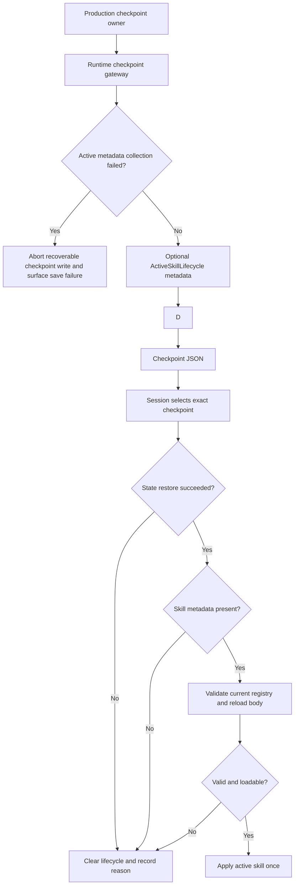
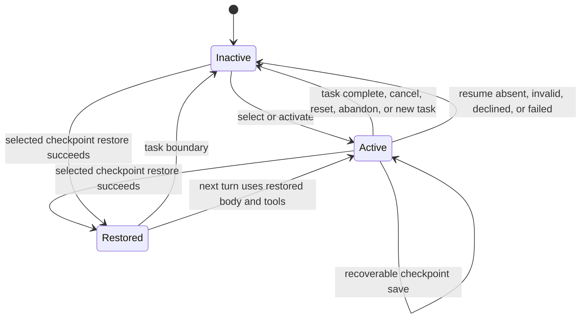

# fix: Close active skill lifecycle gaps

## Summary

Phase 3 收口 active skill 剩余生命周期缺口：所有可恢复 runtime checkpoint 都保存安全的 skill metadata；resume 对 lifecycle 做原子恢复或清理；所有 production task boundary 都移除旧 skill body 和工具限制。fake provider 的空列表守卫在现有生产代码中已经成立，本计划只补真实 turn-end 路径的回归测试。

---

## Problem Frame

Active skill 状态位于 `AgentState` 之外，而 checkpoint 保存和 task 清理分散在 runtime、confirmation、tool、transition、memory、session 多条路径。只覆盖 `core.py` 会产生两类不一致：task state 已保存但 active skill 丢失；task 已取消或重置但旧 body 和 `allowed_tools` 仍污染下一任务。

当前工作区的实现草稿还使用了全局 pending restore metadata 和大范围异常吞噬。这会造成跨 session 混用、隐藏部分恢复失败，并可能在 active skill 生效时写出不含 skill metadata 的可恢复 checkpoint。

---

## Planning Baseline

本计划是 intent-to-add 新文件，可通过 path-scoped diff 独立审计。工作区已有 production/test 变更均视为未经验证的实现草稿，不视为任何 Implementation Unit 已完成；`ce-work` 必须按本计划验证、修订或替换这些变更。

本次 planning pass 不修改 production code 或 tests。

---

## Requirements

### Checkpoint persistence

- R0. 修改行为前，先用聚焦的 characterization tests 锁定完整的 production checkpoint save、resume outcome 和 task boundary inventory。
- R1. 所有写入可恢复 checkpoint 的 production 路径必须通过一个 runtime checkpoint gateway，在实际写入时收集 active-skill metadata。
- R2. `agent/checkpoint.py` 必须保持 Skill-agnostic，只接收通用 optional top-level sections，不 import 或构造 lifecycle、registry、loader。
- R3. Checkpoint metadata 必须使用明确的 lifecycle API，且不得包含 skill body、raw `SKILL.md`、prompt、resource content、user input 或 secret。
- R4. 顶层 optional `"skill"` section 不得修改 checkpoint schema version，也不得把 skill state 放进 `TaskState`。
- R15. Lifecycle active 且 gateway 无法收集安全 skill metadata 时，必须 fail closed：不得写出缺少 `"skill"` section 的可恢复 checkpoint，不得为了让保存成功而清理 active skill；通过现有 checkpoint save error/result path 向 caller 暴露失败。

### Restore semantics

- R5. 只有 session resume 实际选中的同一个 checkpoint 在 task、memory、conversation state 全部恢复成功后，才允许恢复 skill。
- R6. 缺少或为空的 `"skill"` metadata 必须主动清除 runtime 中已有 lifecycle state，并记录 reason=`checkpoint_missing_skill_section`。
- R7. Skill 缺失、hidden、disabled、invalid 或 body 无法加载时，必须清除 lifecycle，且不能阻断 session resume。
- R8. Restore 成功时必须从当前 registry/manifest 重新加载 body 和 `allowed_tools`，全部成功后一次性 apply lifecycle state。
- R9. Resume declined、no actionable resume、state restore failure 都必须清除已有 active skill；不得把全局 pending restore metadata 带入后续 task 或 session。

### Task boundaries and evidence

- R10. Task complete、cancel、reset、abandon、new-task boundary 必须在 task state 被丢弃或复用前 deactivate active skill。
- R11. `AgentState.reset_task()` 和 `agent/transitions.py` 不得直接 import Skill 或记录 Skill evidence；transition 内已有清理副作用的路径通过 caller 注入的通用 boundary callback 完成 lifecycle 清理。
- R12. 正常 recorder path 必须产生 `skill.deactivated`、`skill.restored`、`skill.restore_cleared`；recorder sink 失败不得回滚 lifecycle state，但必须沿用现有 observability failure surface，且 metadata 只允许安全标识、reason、source 和 count。

### Regression coverage

- R13. Fake provider 且 visible skill 为零时，必须进入正常 `no_suitable_skill` 或 skip path，不得访问空列表索引。
- R14. 除 lifecycle 增量外，必须保持现有 checkpoint identity、transition、confirmation、tool、memory、session 行为不变。

---

## Scope Boundaries

- 不新增 Skill selection algorithm、invocation state、memory boundary、subagent boundary 或 confirmation-pending schema。
- 不修改 checkpoint schema version、`TaskState` 或 `AgentState.reset_task()` 行为。
- 不让 Skill 绕过 `ToolRuntimeMediator`，不允许 Skill 直接调用 MCP tool。
- 不引入 process-global pending restore slot，也不新增第二套 fake/real runtime。
- 除保持 `agent/transitions.py` Skill-agnostic 所需的最小 callback seam 外，不重新打开 runtime transition consolidation。
- 不重构无关 checkpoint、confirmation、memory、tool 行为。
- 除非 implementation research 证明存在另一个不安全的空列表访问，否则不修改 `agent/loop.py` 的 fake-provider guard。

---

## Context & Research

本地代码已有足够模式，外部研究不会改变本计划的设计。

### Patterns to Preserve

- `agent/checkpoint.py` 已按 dataclass 声明字段过滤 restore 数据，并忽略未知 top-level section，因此通用 optional section 可保持向后兼容。
- `agent/runtime_integration/checkpoint_save.py` 是现有 runtime-owned checkpoint handler，适合作为 production save gateway 的 owner。
- `agent/skill_system/lifecycle.py` 是 active body 和 `allowed_tools` 的唯一状态源；checkpoint restore 不得创建第二个 owner。
- `agent/runtime_integration/phase1_hook.py` 已体现当前 `SkillRegistry` / `SkillLoader` 构建模式。
- `tests/test_checkpoint_ownership.py` 和 `tests/test_architecture_boundaries.py` 已有 AST-based ownership inventory，应继续约束 gateway 和 import boundary。

### Recoverable Checkpoint Save Inventory

下表中的 checkpoint 都能被后续 resume，因此必须改走 runtime gateway。`save_session_snapshot()` 是 archive operation，不是 checkpoint writer，不在本 inventory 内。

| Owner group | Production entry points | Required treatment |
|---|---|---|
| Core dispatch | `agent/core.py::_dispatch_checkpoint_save` | Direct fallback 和 dispatcher path 都走 gateway；不在 dispatcher payload 中预计算 metadata。 |
| Runtime handler | `agent/runtime_integration/checkpoint_save.py::CheckpointSaveHandler.handle` | 调用同一个 gateway，在实际写盘前收集 metadata。 |
| Response handling | `agent/response_handlers.py::_maybe_advance_step`, `handle_end_turn_response` | 所有 direct low-level save 原位替换为 gateway。 |
| Tool execution | `agent/tool_executor.py::execute_single_tool`, `agent/tool_runtime_mediator.py::mediate` | 保持现有保存时机，只替换保存入口。 |
| User transitions | `agent/transitions.py::apply_user_replied_transition` | 使用通用 gateway，不 import Skill module。 |
| Memory confirmation | `agent/memory_interaction.py::handle_memory_confirmation_reply`, `handle_inline_confirmation_reply`, `_clear_pending_and_save` | 通过已有 helper seam 传入 gateway。 |
| Confirmation | `agent/confirmation/dispatcher.py`, `agent/confirmation/tool.py`, `agent/confirmation/plan.py` | 所有 direct recoverable save 改走 gateway。 |
| Session lifecycle | `agent/session.py::finalize_session`, `handle_interrupt_with_checkpoint`, `handle_double_interrupt` | 保留 session identity，并在 resumable checkpoint 中保存 active-skill metadata。 |

### Task Boundary Inventory

| Owner group | Production boundaries | Required treatment |
|---|---|---|
| Core | `agent/core.py::chat` 的 new user task | 在 `state.reset_task()` 前 deactivate。Task 尚未开始的 error-recovery reset 保持为 non-boundary。 |
| Response handling | `agent/response_handlers.py` 的 cancel/reset/complete path | 在 checkpoint clear 和 task reset 前 deactivate。 |
| Plan confirmation | `agent/confirmation/plan.py` 的 new-task、reject、cancel、completed-step path | reset/clear 前调用 runtime helper。 |
| User input | `agent/confirmation/user_input.py` 的 invalid-state reset，以及 `agent/transitions.py` 的 collect-input completion | Caller 注入 boundary callback；transitions 保持 Skill-agnostic。 |
| Main loop | `agent/loop.py::run_main_loop` 的 tool confirmation decline/error | 新增通用 dependency，在 clear/reset 前调用。 |
| Session | `agent/session.py::handle_interrupt_choice` 的 user abandon | clear/reset 前 deactivate。 |
| Resume outcomes | Declined resume、non-actionable checkpoint、failed state restore、missing/empty skill metadata | 即使没有 task reset，也按 restore-specific reason 清除 lifecycle。 |

---

## Key Technical Decisions

- KTD1. **统一 production checkpoint gateway：** 所有 recoverable save owner 调用 runtime gateway。Gateway 从显式 session identity 或 `state.memory.session_id` 推导 lifecycle namespace，在写盘时收集 metadata，再调用 `agent.checkpoint.save_checkpoint`。这样可同时覆盖 mid-turn save，并避免 dispatcher payload 中 metadata 过期。
- KTD2. **Active metadata fail closed：** lifecycle 已 active 时，不允许因为 metadata 收集异常而静默写出缺少 `"skill"` 的可恢复 checkpoint。正确行为是中止本次 recoverable checkpoint write、保持 lifecycle 不变，并通过既有 save failure/result path 暴露错误；不得把 active skill 清掉来伪造成功保存。Evidence sink failure 可 best-effort，但 checkpoint correctness 不能被 blanket `except Exception` 隐藏。
- KTD3. **同步恢复 selected checkpoint：** session selection 返回实际用于 state restore 的 parsed checkpoint 和 path；state restore 成功后立即交给 runtime restore coordinator。不得使用 module global，也不得延迟到后续 `chat()` 消费。
- KTD4. **Absence means inactive：** 缺失和空 `"skill"` section 都表示 no active skill，restore 返回前必须清空旧 body 和 `allowed_tools`。
- KTD5. **Current descriptor wins：** checkpoint metadata 只负责识别 skill 和提供 audit context；body 和工具限制使用当前 registry/manifest，checkpoint 中陈旧的 `allowed_tools` 不能成为 policy。
- KTD6. **Runtime caller owns cleanup：** lifecycle helper 负责状态变更并返回安全 result；runtime caller 决定调用时机。Transition code 只接收通用 callback，不 import Skill，也不记录 Skill evidence。
- KTD7. **Fake-provider production code 不变：** `if provider_kind == "fake" and _visible:` 已保护 `_visible[0]`。除非找到另一条真实不安全路径，本轮只新增 turn-end regression test。
- KTD8. **Test-first execution：** 按仓库 `AGENTS.md`，每个行为单元先写 focused failing test。现有草稿测试只有在能针对缺失 contract 产生预期失败时才可作为 Red evidence。

---

## High-Level Technical Design

### Save and restore flow

### Lifecycle transitions

图中约束的是 owner 和执行顺序，不指定最终函数签名。

---

## Acceptance Examples

- AE1. Given tool execution 或 confirmation 中存在 active skill，when 该路径保存 recoverable checkpoint，then 顶层 `"skill"` metadata 存在且不含 body 或 raw content。
- AE2. Given checkpoint 含合法 skill metadata，when 实际选中的 checkpoint state restore 成功，then body 和 `allowed_tools` 来自当前 descriptor，并产生 `skill.restored`。
- AE3. Given runtime 预先存在旧 active skill，when 成功恢复的 checkpoint 缺少或含空 `"skill"` section，then lifecycle inactive，并产生 reason=`checkpoint_missing_skill_section` 的 `skill.restore_cleared`。
- AE4. Given runtime 预先存在旧 active skill，when checkpoint state restore 失败或用户拒绝 resume，then 旧 body 和工具限制被清除，后续 `chat()` 不可能再次消费它们。
- AE5. Given active skill，when 任一 inventory 中的 task complete/cancel/reset/abandon/new-task boundary 执行，then 下一任务没有旧 skill prompt section，也没有旧 skill tool restriction。
- AE6. Given fake provider 且 registry 没有 visible skill，when 真实 turn-end selection hook 执行，then 不访问 index zero，并返回正常 no-selection result。
- AE7. Given lifecycle active 且 metadata collection 失败，when production owner 请求 recoverable checkpoint save，then 不写出缺少 `"skill"` 的 checkpoint、不清理 active skill，并通过 checkpoint save failure/result path 暴露失败。

---

## Implementation Units

### Landing order and scope control

U6 的 owner migration 覆盖面较大，但它是 AE1 的完整性要求，不是额外功能。实现时按以下顺序收敛，任一阶段未完成都不能标记 Skill lifecycle closeout：

1. U0-U1：先锁 ownership/boundary contract 和 checkpoint-safe lifecycle metadata。
2. U2：建立 runtime gateway、fail-closed metadata collection 和 low-level checkpoint compatibility。
3. U6：按 owner group 原位迁移所有 recoverable save；每组迁移后运行对应 focused tests，最后由 AST ownership test 证明 gateway 外无 production recoverable low-level save。
4. U3-U4：在 save surface 闭合后实现 selected-checkpoint restore 和 task-boundary cleanup。
5. U5：补 fake-provider empty-visible regression，不做生产代码 churn。

### U0. Lock ownership and boundary inventories

**Goal:** 在 production edit 前，为完整 save、restore、task-boundary surface 建立会失败的 characterization coverage。

**Requirements:** R0, R11, R14

**Dependencies:** None

**Files:**
- Modify: `tests/test_checkpoint_ownership.py`
- Modify: `tests/test_architecture_boundaries.py`
- Modify: `tests/test_checkpoint_scope_selection.py`

**Approach:**
- 将现有 direct-save whitelist 改为 contract：production recoverable save 必须进入 runtime gateway；low-level `agent.checkpoint.save_checkpoint` 只保留给 persistence tests 和 gateway。
- 保留 task reset/clear owner 的明确 inventory；真正 task boundary 必须同时出现 lifecycle helper 或 injected callback。
- 固化 `agent/checkpoint.py` 和 `agent/transitions.py` 不得直接 import Skill、调用 lifecycle 或记录 Skill evidence。
- Task 尚未开始的 error-recovery reset 作为按 function name 审核过的 exception，不强行注入 lifecycle 行为。

**Execution note:** 先让 inventory 和 architecture tests 针对当前实现草稿缺少 gateway/完整 boundary contract 的问题失败。

**Test scenarios:**
- Gateway 外新增 direct production `save_checkpoint()` call 时 ownership test 失败。
- True task boundary 缺少 lifecycle helper/callback 时 boundary inventory test 失败。
- `agent/checkpoint.py` 或 `agent/transitions.py` 出现 direct Skill import/lifecycle call 时 architecture test 失败。
- 已审核的 pre-task error-recovery reset 保持允许，并按 function name 固化。

**Verification:** Inventory 覆盖 research tables 中每个 owner group，并能阻止未经 review 的 ownership 扩张。

---

### U1. Define checkpoint-safe lifecycle metadata

**Goal:** 为 active skill 提供明确的 checkpoint contract 和 apply-only restore operation。

**Requirements:** R3, R4, R8, R12

**Dependencies:** U0

**Files:**
- Modify: `agent/skill_system/lifecycle.py`
- Modify: `tests/unit/test_active_skill_lifecycle.py`

**Approach:**
- 新增 `to_checkpoint_metadata()`，只包含 `skill_id`、audit timestamp/source、namespace context 和 metadata-level `allowed_tools`。
- 固定一种 inactive representation，并由 runtime gateway 在该状态省略 section。
- 新增 apply-only restore method，只接受已经 validate/load 的 body 和当前 descriptor tool set。
- Legacy `to_dict()` 保持独立，并明确不是 checkpoint authority。

**Execution note:** 先新增 metadata redaction 和 apply-only restore tests。

**Test scenarios:**
- Active lifecycle metadata 不含 body、prompt、resource content、user input 或 secret。
- Inactive lifecycle 返回文档规定的 empty representation。
- Apply-only restore 替换旧 active skill，并使用调用方提供的当前 body/tools。
- Checkpoint production path 不调用 legacy `to_dict()`。

**Verification:** Lifecycle tests 证明 checkpoint contract 仅含 metadata，且结果确定。

---

### U2. Add the runtime checkpoint gateway

**Goal:** 分离通用 checkpoint persistence 和 runtime-owned active-skill metadata collection。

**Requirements:** R1, R2, R3, R4, R15

**Dependencies:** U1

**Files:**
- Modify: `agent/checkpoint.py`
- Modify: `agent/runtime_integration/checkpoint_save.py`
- Modify: `agent/core.py`
- Modify: `tests/test_checkpoint_roundtrip.py`
- Modify: `tests/runtime_integration/test_checkpoint_dispatcher_mediation.py`
- Modify: `tests/test_checkpoint_ownership.py`

**Approach:**
- Low-level writer 支持通用 optional top-level sections，并拒绝覆盖 `meta`、`task`、`memory`、`conversation` 等 owned keys。
- Runtime gateway 保持现有 checkpoint call shape；在调用 low-level writer 前解析当前 lifecycle 并收集 metadata。
- `_dispatch_checkpoint_save` fallback 和 `CheckpointSaveHandler.handle` 都调用 gateway，删除 `_extra_sections` private payload threading。
- Lifecycle active 时，metadata collection 属于 checkpoint correctness；收集失败必须中止本次 recoverable write、保持 lifecycle 不变，并使用现有 save failure/result path 暴露错误。

**Execution note:** 先写 low-level compatibility、reserved-key、direct-fallback、dispatcher failing tests。

**Test scenarios:**
- Covers AE1. Core direct fallback 和 dispatcher save 产生相同 top-level skill metadata。
- 无 active skill 时省略 optional section，既有 checkpoint fields 不变。
- Generic extra sections 可 round-trip，且 `agent/checkpoint.py` 不 import Skill code。
- `extra_sections` 不能覆盖 reserved top-level keys。
- Covers AE7. Active metadata collection failure 不写出缺少 `"skill"` 的误导性 recoverable checkpoint，不清理 active skill，并让 caller 看到 save failure/result。

**Verification:** Core 和 dispatcher 共用一个 gateway，并生成等价 checkpoint JSON。

---

### U6. Migrate every remaining recoverable save owner

**Goal:** 确保 mid-turn、confirmation、tool、memory、transition、session checkpoint 都不会遗漏 active skill metadata。

**Requirements:** R1, R3, R14

**Dependencies:** U2

**Files:**
- Modify: `agent/response_handlers.py`
- Modify: `agent/tool_executor.py`
- Modify: `agent/tool_runtime_mediator.py`
- Modify: `agent/transitions.py`
- Modify: `agent/memory_interaction.py`
- Modify: `agent/confirmation/dispatcher.py`
- Modify: `agent/confirmation/tool.py`
- Modify: `agent/confirmation/plan.py`
- Modify: `agent/session.py`
- Modify: `tests/test_checkpoint_ownership.py`
- Modify: `tests/test_transition_checkpoint_boundaries.py`
- Modify: `tests/test_resume_pending_confirmation_dispatch.py`
- Modify: `tests/runtime_integration/test_skill_allowed_tools_lifecycle.py`

**Approach:**
- 将 checkpoint inventory 中每个 production low-level save 原位替换为 gateway，保留现有 source label、session/run identity 和保存时机。
- Memory 和 transition code 通过已有 helper seam 接收 gateway，不直接 import Skill module。
- Direct low-level save 只允许存在于 persistence-focused tests 和 gateway 内部。

**Execution note:** 按 owner group 逐组迁移；这是一个大 surface 的完整性工作，应以小 patch/小测试批次落地，但最后一组迁移前 ownership test 保持 Red，不能提前宣布 AE1 完成。

**Test scenarios:**
- Covers AE1. Tool execution 和 tool mediation checkpoint 包含安全 skill metadata。
- Covers AE1. Plan/tool confirmation 和 memory-confirmation checkpoint 包含安全 skill metadata。
- Covers AE1. User-input transition checkpoint 包含安全 skill metadata，同时 `agent/transitions.py` 保持 Skill-agnostic。
- Session interrupt/finalize checkpoint 保留 session identity 和 active-skill metadata。
- Existing pending confirmation 和 resume behavior 不变。

**Verification:** AST inventory 在 gateway 外找不到 production recoverable low-level save。

---

### U3. Restore or clear active skill from the selected checkpoint

**Goal:** 将 skill restore 绑定到实际成功恢复的 checkpoint，并移除全局 deferred metadata。

**Requirements:** R5, R6, R7, R8, R9, R12

**Dependencies:** U2, U6

**Files:**
- Add: `agent/skill_system/checkpoint_restore.py`
- Add: `agent/runtime_integration/skill_lifecycle.py`
- Modify: `agent/session.py`
- Modify: `agent/core.py`
- Modify: `tests/test_checkpoint_scope_selection.py`
- Modify: `tests/test_resume_full_flow.py`
- Modify: `tests/unit/test_active_skill_lifecycle.py`
- Add: `tests/runtime_integration/test_skill_checkpoint_resume_lifecycle.py`

**Approach:**
- Session selection 返回通用 selected-checkpoint restore result，包含 success、parsed checkpoint、selected path；仅需要 boolean 的旧 caller/test 继续使用 compatibility helper。
- State restore 成功后，立即把同一个 parsed checkpoint 传给 runtime lifecycle coordinator。
- Skill helper 负责 registry validation/body loading；runtime coordinator 负责 lifecycle、evidence、session orchestration。
- Absent/empty metadata 统一 deactivate，并记录 `checkpoint_missing_skill_section`。
- Invalid metadata、missing/hidden/disabled descriptor、body load failure、resume declined、non-actionable resume、state restore failure 都按具体安全 reason deactivate。
- 删除 global pending metadata 和后续 `core.chat()` consumption path。

**Execution note:** 修改 resume 实现前，先写“预先激活旧 skill”的 restore integration tests。

**Test scenarios:**
- Covers AE2. Valid selected checkpoint 只恢复一次，并使用当前 body/manifest tools。
- Checkpoint 中 stale `allowed_tools` 与当前 descriptor 不同；当前 descriptor 获胜。
- Covers AE3. 预先激活旧 skill 且 metadata absent 时，body/tools 清空并记录 `checkpoint_missing_skill_section`。
- Empty metadata 与 absent section 行为相同。
- Missing、hidden、disabled、invalid、empty-body、load-error skill 清理 lifecycle，但不阻断 task state restore。
- Covers AE4. State restore failure、resume decline、non-actionable checkpoint 都清理预先激活的 skill。
- 两个 session namespace 不能消费彼此的 restore metadata。
- Evidence 不含 body、prompt、resource content、user input 或 secret。

**Verification:** 不存在 global pending restore state；lifecycle state 始终对应实际被选中并成功加载的 checkpoint。

---

### U4. Deactivate active skill at every task boundary

**Goal:** 防止 completed、cancelled、reset、abandoned 或 replaced task 把 skill prompt 和 tool policy 泄漏到下一任务。

**Requirements:** R10, R11, R12, R14

**Dependencies:** U0, U3

**Files:**
- Modify: `agent/runtime_integration/skill_lifecycle.py`
- Modify: `agent/core.py`
- Modify: `agent/response_handlers.py`
- Modify: `agent/confirmation/dispatcher.py`
- Modify: `agent/confirmation/plan.py`
- Modify: `agent/confirmation/user_input.py`
- Modify: `agent/loop.py`
- Modify: `agent/transitions.py`
- Modify: `agent/session.py`
- Modify: `tests/test_architecture_boundaries.py`
- Modify: `tests/test_confirmation_flow.py`
- Modify: `tests/test_transition_checkpoint_boundaries.py`
- Modify: `tests/test_phase4_session_lifecycle.py`
- Modify: `tests/runtime_integration/test_skill_allowed_tools_lifecycle.py`

**Approach:**
- 新增一个 idempotent runtime helper：解析 session lifecycle、deactivate，并返回供 evidence 使用的安全 result。
- 在 task-boundary inventory 中每个 true boundary 前调用 helper。
- 需要保持 layer ownership 时，在 `ConfirmationContext` 和 `LoopDependencies` 中增加通用 callback。
- `apply_user_replied_transition` 内 collect-input completion 只调用 caller-supplied callback，再执行 clear/reset；transitions 不 import Skill/evidence module。
- 对已审核的 pre-task error-recovery reset 不增加 cleanup，因为该路径不存在 active task。

**Execution note:** 每个 owner group 先新增一个 failing behavior test，再接入 helper。

**Test scenarios:**
- Covers AE5. Normal task completion 在下一 task 前清空 active body 和 `allowed_tools`。
- Covers AE5. Plan rejection、feedback-as-new-task、user-input cancel、tool-confirmation decline、session abandon 都清除 active skill。
- Collect-input completion 通过 injected callback 清理，同时 transition architecture tests 保持通过。
- 无 active skill 时重复调用 boundary helper 是 no-op，不产生虚假 deactivation event。
- `skill.deactivated` 只包含安全 skill ID、reason、source。
- Next-task prompt 和 tool gate 不包含旧 skill restriction。

**Verification:** Inventory 中每个 true boundary 都有 focused behavior test，architecture inventory 无未审核缺口。

---

### U5. Pin the fake-provider empty-visible regression

**Goal:** 防止未来修改重新引入 real turn-end selection hook 的空列表崩溃。

**Requirements:** R13, R14

**Dependencies:** U0

**Files:**
- Modify: `tests/runtime_integration/test_skill_model_owned_selection.py`
- Do not modify: `agent/loop.py`，除非证明存在另一处不安全访问

**Approach:**
- 使用 fake provider 和 `list_visible()` 返回空列表的 registry 执行 `_try_phase1_turn_end_runtime_action`。
- 断言正常 no-selection dispatch；不测试 detached helper，也不在 test 中复制 guard。

**Execution note:** 该 regression test 应在现有 guard 上直接通过；不要为了制造 Red 而修改安全代码。

**Test scenarios:**
- Covers AE6. Empty visible list 不抛异常，并产生 `no_suitable_skill` 或既有 skip result。
- Fake provider 有一个 visible skill 时仍 auto-select 第一个 descriptor。
- Real-provider selection behavior 不变。

**Verification:** Real turn-end path 同时覆盖零个和非零 visible skill，且 `agent/loop.py` 无无行为变化的格式调整。

---

## System-Wide Impact

- **Checkpoint interface：** production caller 从 low-level writer 迁移到 runtime gateway，持久化语义不变；direct persistence tests 继续使用 low-level API。
- **Resume lifecycle：** session selection、state restore、active-skill restore 形成一个有序操作，不会出现 task state 来自一个 checkpoint、skill state 来自另一个 checkpoint。
- **Transition boundary：** transition rule 保持 deterministic 和 Skill-agnostic；仅在当前函数已拥有 clear/reset side effects 的位置增加通用 callback seam。
- **Tool policy：** restored/cleared `allowed_tools` 会立即影响 `ToolRuntimeMediator`，因此 restore/cleanup tests 必须同时验证 lifecycle state 和 gate behavior。
- **Evidence：** 正常 recorder path 必须产生 lifecycle event；event sink failure 不得改变 state outcome，但必须走现有 observability failure surface，且不得泄漏 raw content。
- **Compatibility：** checkpoint v1/v2、缺少 `"skill"` 的旧 checkpoint、pending confirmation、per-session identity、session snapshot 保持支持。

---

## Risks & Dependencies

| Risk | Mitigation |
|---|---|
| 漏掉 direct save owner | AST ownership tests 禁止 gateway 外的 production low-level save，并枚举所有现有 owner group。 |
| Runtime gateway 形成 import cycle | `agent/checkpoint.py` 保持无 Skill 依赖；runtime integration 向下调用 checkpoint persistence。 |
| Active metadata 被静默省略 | Lifecycle active 时 fail closed；metadata collection/restore 不使用 blanket exception swallowing。 |
| Fail-closed checkpoint save 改变 runtime 行为 | 只在 active lifecycle 且 metadata collection 失败时中止 recoverable write；不改变无 active skill 或 metadata 成功路径。 |
| Restore 选择错误 checkpoint/session | State restore 成功后同步传递实际 selected parsed checkpoint，并按当前 session identity 获取 lifecycle。 |
| Restore 半应用 | Descriptor validation 和 body load 全部成功后才执行一次 apply-only lifecycle call；任一失败都 deactivate。 |
| 新 reset path 造成 cleanup drift | Boundary inventory 和 behavior tests 在出现未审核 owner 时失败。 |
| 大量 caller migration 改变保存时机 | 原位替换 call，保留 source label、identity argument 和 transition assertion。 |
| Fake-provider review 产生无意义代码 churn | Production code 不变，直接测试真实 hook。 |
| U6 migration surface 过大 | 按 owner group 分批 landing，每组保留原保存时机/source/identity；closeout 前必须由 ownership test 证明所有 recoverable owner 已迁移。 |

---

## Sources & References

- `AGENTS.md`：TDD、scope、安全和 quality gate 要求。
- `agent/checkpoint.py`：通用 checkpoint serialization 和 backward-compatible restore filtering。
- `agent/runtime_integration/checkpoint_save.py`：runtime checkpoint ownership。
- `agent/session.py`：checkpoint selection 和 resume orchestration。
- `agent/skill_system/lifecycle.py`：active body 和 `allowed_tools` ownership。
- `agent/runtime_integration/phase1_hook.py`：registry 和 loader 构建模式。
- `tests/test_checkpoint_ownership.py`, `tests/test_architecture_boundaries.py`：ownership inventory。
