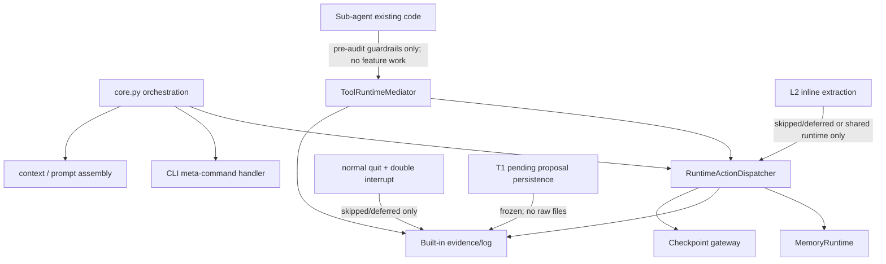

# Post-Memory Runtime Architecture Hardening Plan

## A. Background

Memory v0 / Mem0 has landed after Runtime State Transition Consolidation and Skill Lifecycle Cleanup. The current runtime mainline is healthy enough to keep moving, but the post-memory architecture audit found several P2 boundary risks that Sub-agent work would amplify if left ambiguous.

This plan is a small hardening pass between Memory v0 and Sub-agent v0. It does not reopen Memory v0 design. It freezes or clarifies legacy paths, tightens action ownership, and adds guardrails so future Sub-agent work starts from one runtime, one evidence/log path, and one governed memory boundary.

---

## B. Non-goals

This plan is not:

- A Sub-agent v0 plan.
- A Sub-agent implementation plan.
- A Memory v0 rework.
- A Runtime-wide refactor.
- A full `core.py` split.
- A full `ToolRuntimeMediator` split.
- An MCP expansion plan.
- A Memory consolidation, L2 extraction, or proposal-productionization plan.

This plan is:

- A narrow runtime architecture hardening plan after Memory v0 and before Sub-agent v0.
- A way to remove or freeze P2 risks that would otherwise become Sub-agent blockers.
- A set of characterization-first implementation units with focused tests, rollback paths, and closeout criteria.

---

## C. Current-state findings

### P2 findings in scope

| ID | Subsystem | Finding | Risk |
| --- | --- | --- | --- |
| P2-A | Session / Memory | `session.finalize_session()` and `session.handle_double_interrupt()` still reach legacy session-end extraction through `_run_session_end_memory_extraction()` and `extract_memories_from_session()`. | This path can create its own store, directly apply memory intents, write raw T1 pending files via `_persist_t1_pending_proposals()`, leak raw `summary["store_root"]`, fallback to HOME, and bypass MemoryRuntime, confirmation, dispatcher, and built-in evidence. |
| P2-B | Memory L2 / Core | `_maybe_run_l2_inline()` can still operate as a core-owned extraction path and risks direct backend construction, HOME fallback inconsistency, or silent skipped behavior. | It can diverge from the configured MemoryRuntime/shared store, hide real backend failures, and reintroduce implicit durable writes that Memory v0 otherwise made fail-closed. |
| P2-C | RuntimeAction | Specific Sub-agent action types are defined ahead of full production support: `SUBAGENT_CHILD_TOOL_REQUEST`, `SUBAGENT_CHILD_RESULT`, `SUBAGENT_PARENT_ADJUDICATION`, `SUBAGENT_CHILD_MEMORY_REQUEST`, and `SUBAGENT_CHILD_BATCH_MEMORY`. | Future work can mistake best-effort evidence dispatch or schema reservation for production handler support. |
| P2-D | Core / CLI | `core.py` still owns CLI meta-command branching for memory/subagent commands and feature glue. | New features are likely to accumulate in `core.py`, increasing coupling before Sub-agent work. |
| P2-E | Tool runtime | `ToolRuntimeMediator` owns gate, confirmation, memory tools, MCP, child tool/memory mediation, evidence redaction, and path redaction. | Sub-agent work will increase pressure on an already broad boundary. |
| P2-F | Sub-agent boundary | L0/L1/L2 Sub-agent paths, raw `batch_memory` parsing, child tool mediation, child memory mediation, and parent adjudication evidence exist before a full current-state audit. | Direct implementation risks raw child output, batch memory commits, direct child memory writes, unsafe failure evidence, and second-loop confusion. |
| P2-G | Fake / real / backend | Some fake/real/provider/backend guardrails remain xfailed or thin. | Fake-only closeout can miss real-like backend/provider path regressions. |

### P3 findings recorded for follow-up

| Item | In this plan? | Why deferred | Blocks hardening implementation? | Blocks Sub-agent current-state audit? | May block Sub-agent implementation? | Follow-up owner / phase |
| --- | --- | --- | --- | --- | --- | --- |
| `MemoryState.checkpoint_data` dead field | No | Cleanup is not needed to close P2 boundaries. | No | No | No | Runtime cleanup debt ledger |
| `MemoryState.long_term_notes` dead/compat field | No | Memory v0 checkpoint rules already avoid raw long-term records. | No | No | No | Runtime cleanup debt ledger |
| `MemoryRuntime.resolve_confirmation(direct_write=True)` compatibility default | No | Compatibility path needs a separate compatibility-removal decision. | No | No | Possibly, if Sub-agent code tries to use it as a commit shortcut | MemoryRuntime hardening follow-up |
| Consolidation adapter InMemory binding | Verify only | Audit status must be verified in U0 inventory; if already resolved, mark resolved instead of carrying as debt. | No | No | Only if Sub-agent depends on consolidation | U0 inventory, then Memory consolidation plan if still real |
| Catalog descriptor `implementation_id` drift | Partly | U3 should fix Sub-agent/action ownership drift only where it affects overclaim. | No | No | Possibly, if descriptor drift makes deferred actions look supported | U3 or RuntimeAction catalog follow-up |
| `_noop_event_logger` injectable path | No | It is low-risk and not part of Memory/Sub-agent boundary hardening. | No | No | No | Evidence/log cleanup follow-up |
| `runtime_decision_frame.py` documentation drift | No | Documentation drift should not expand this hardening pass unless it misstates a P2 boundary. | No | No | No | Documentation cleanup follow-up |
| Stash residue | No | Local git hygiene is outside the plan implementation. | No | No | No | Manual local cleanup |
| RuntimeActionType growth | Partly | U3 covers Sub-agent deferred action ownership; broader taxonomy ownership can follow. | No | Yes, as audit input | Yes, if Sub-agent actions remain ambiguous | U3 plus future ownership docs |
| `proposal_expired` / `proposal_failed` deferred taxonomy events | No | Proposal phase remains out of scope. | No | No | No | Future Memory proposal phase |

---

## D. Architecture decisions

- KTD1. Freeze session-end memory extraction before productionizing it. Both normal quit and double-interrupt exit paths must stop auto-writing MemoryStore or `{memory_root}/_pending/`. If the legacy hook remains callable, it must emit safe skipped/deferred evidence and must not record raw transcript, prompt, memory content, raw ids, raw pending proposal files, or raw filesystem roots.
- KTD2. Unify durable memory root behavior around fail-closed configuration. Legacy session-end extraction, T1 pending persistence, and L2 inline extraction must not silently fallback to `~/.my-first-agent/memory`; durable memory root must come from explicit config or a shared/configured MemoryRuntime store, otherwise the path is skipped/deferred with safe evidence.
- KTD3. Keep L2 inline extraction deferred. `core.py` must not construct durable memory stores directly. When no configured shared store/root exists, L2 inline must skip with safe evidence instead of silently failing or writing to an implicit location.
- KTD4. Separate production-supported actions from reserved/deferred actions. Production actions need handler/catalog coverage. Deferred Sub-agent child actions need explicit unsupported/deferred evidence and tests that prevent overclaim.
- KTD5. Extract only real CLI meta-command glue from `core.py`: show memories, forget memory, and show subagents. `update memory` is not a current CLI meta-command and must remain a future MemoryRuntime policy capability.
- KTD6. Keep `ToolRuntimeMediator` as the single tool execution boundary. This plan may extract helper functions for safe metadata/redaction, but it must not introduce a second mediator or a parallel tool path.
- KTD7. Do not implement Sub-agent. This plan only adds pre-audit guardrails so the next step can be a Sub-agent current-state audit; L2 delegation, parent adjudication, batch memory schema validation, and batch memory commit remain deferred.
- KTD8. Treat fake-only evidence as insufficient for closeout claims on backend/provider-sensitive paths. Add real-like filesystem/backend tests where they do not require real providers or secrets.
- KTD9. Do not stage or commit hardening implementation until required focused tests and quality gates pass. Failed tests stop implementation and require reporting, not partial closeout.

### Boundary model

---

## E. Implementation units

### U0. Inventory and characterization tests

- **Goal:** Establish a fresh baseline of current memory/session/L2/action/tool/Sub-agent boundaries before changing behavior.
- **Files likely touched:** `tests/runtime_integration/test_memory_session_end_boundary.py`, `tests/runtime_integration/test_memory_l2_inline_boundary.py`, `tests/runtime_integration/test_runtime_action_contract.py`, `tests/runtime_integration/test_subagent_l1_parent_mediated.py`, `tests/runtime_integration/test_memory_model_visible_tools.py`.
- **Implementation approach:** Add failing or characterization tests first for the exact P2 paths. Keep production code untouched until the tests identify the boundary being hardened. Inventory `agent/memory.py::_resolve_memory_root()` before hardening: characterize whether it currently falls back to `~/.my-first-agent/memory`, identify every production or legacy caller that can reach it, and map whether session-end extraction, T1 pending proposal persistence, or unconfigured callers can create/write HOME through it.
- **Tests:** Characterize that `finalize_session()` and `handle_double_interrupt()` can reach legacy extraction today; `_persist_t1_pending_proposals()` can write `_pending`; `summary["store_root"]` can expose raw path metadata; `_resolve_memory_root()` current HOME fallback behavior is proven before hardening and then updated during U1/U2 to enforce fail-closed or explicit opt-in behavior; L2 inline behavior is observable; deferred RuntimeAction types are distinguishable from supported actions; child memory mediation still emits safe evidence.
- **Rollback:** Remove only the newly added characterization tests if a later unit changes direction before implementation begins.
- **Closeout criteria:** Every later unit can reference a focused test that proves the old risk and the new boundary. U0 has a test or explicit inventory assertion for `_resolve_memory_root()` HOME fallback behavior and for the callers that can reach it.

### U1. Freeze legacy session-end memory extraction

- **Goal:** Stop every production session-exit path from auto-writing durable memory or raw pending proposal files outside MemoryRuntime and dispatcher governance.
- **Files likely touched:** `agent/session.py`, `agent/memory.py`, `agent/memory_runtime_hooks.py`, `agent/evidence_recorder.py`, `tests/runtime_integration/test_memory_session_end_boundary.py`, `tests/test_memory_session_hook.py`.
- **Implementation approach:** Prefer freeze/disable over migration. Both `finalize_session()` and `handle_double_interrupt()` should skip legacy extraction or route to a safe deferred hook that records non-content evidence. Freezing legacy extraction also freezes `_persist_t1_pending_proposals()` and any `{memory_root}/_pending/` writes. Do not productionize session-end extraction or T1 pending persistence in this plan.
- **Pending artifacts:** Legacy session-end extraction must not create raw pending proposal artifacts. If T1 pending is revived later, it must go through MemoryRuntime, RuntimeActionDispatcher, confirmation, built-in evidence/log, and Memory v0 governance.
- **Safe root metadata:** `extract_memories_from_session()` must not return raw `summary["store_root"]` values. Remove that field or replace it with safe metadata such as `root_hash`, `root_kind`, `path_kind`, and `redacted=true`. Evidence, action log, safe summary, and log viewer must not expose tmp paths, HOME paths, absolute paths, or raw memory root values.
- **HOME fallback:** Legacy session-end extraction and T1 pending persistence must not silently fallback to `~/.my-first-agent/memory`. Without an explicitly configured durable root or a shared/configured MemoryRuntime store, the behavior must be skipped/deferred with safe evidence. HOME fallback may only remain as explicit opt-in with safe evidence.
- **Tests:** `session.finalize_session()` does not write MemoryStore; `session.handle_double_interrupt()` does not write MemoryStore; neither path creates `{memory_root}/_pending/*`; disabled legacy extraction does not write raw pending proposals; no raw content appears in pending artifacts; skipped/deferred evidence excludes raw transcript, prompt, memory content, ids, and filesystem paths; summary data uses safe root metadata instead of raw `store_root`.
- **Rollback:** Revert both normal quit and double-interrupt hooks together only if a later decision accepts the bypass risk. Do not rollback only one exit path.
- **Closeout criteria:** All production session-exit paths no longer bypass MemoryRuntime/governance/evidence, no legacy raw pending files are created, no raw store root leaks remain, and `_resolve_memory_root()` cannot silently provide HOME fallback to session-end extraction or T1 pending proposal persistence when durable root is unconfigured.

### U2. L2 inline extraction boundary hardening

- **Goal:** Prevent L2 inline extraction from constructing isolated stores, silently failing, or writing outside the configured MemoryRuntime/shared store.
- **Files likely touched:** `agent/core.py`, `agent/memory_l2.py`, `agent/memory_runtime.py`, `agent/runtime_integration/memory_hook.py`, `tests/runtime_integration/test_memory_l2_inline_boundary.py`, `tests/test_memory_recall_injection_baseline.py`.
- **Implementation approach:** Keep L2 productionization deferred. If no shared durable root/store is configured, emit safe skipped evidence. If a tmp durable root/shared store is configured in tests, make the behavior deterministic and bounded. `core.py` must not directly instantiate `FilesystemMemoryStore`, and hardening must not fix L2 by restoring HOME fallback.
- **HOME fallback:** L2 inline extraction follows the same fail-closed rule as U1. Without `MEMORY_STORE_ROOT` or shared/configured MemoryRuntime store, it must not write HOME, must not silently fail, and must not create a separate store.
- **Tests:** No durable root means no `FilesystemMemoryStore` construction; no durable root means no HOME write; skipped behavior is visible and not silent; configured tmp shared store path behaves predictably; evidence excludes raw path, transcript, and memory text; `FilesystemMemoryStore()` fail-closed behavior is preserved.
- **Rollback:** Restore the prior L2 inline call path, then re-disable L2 via configuration if the hardening causes broader runtime disruption.
- **Closeout criteria:** L2 inline does not create a second store, does not write HOME implicitly, does not fail silently, and `_resolve_memory_root()` cannot silently provide HOME fallback to L2 legacy paths when durable root is unconfigured.

### U3. RuntimeAction catalog and deferred action ownership guardrails

- **Goal:** Make action ownership honest: production actions are handled, while deferred/reserved actions are explicitly marked and cannot be mistaken for supported behavior.
- **Files likely touched:** `agent/runtime_integration/schema.py`, `agent/runtime_integration/dispatcher.py`, `agent/runtime_integration/evidence.py`, `agent/runtime_integration/phase1_hook.py`, `tests/runtime_integration/test_runtime_action_contract.py`, `tests/test_architecture_boundaries.py`.
- **Implementation approach:** Add catalog metadata for supported/deferred status. Do not implement full Sub-agent child handlers. For reserved Sub-agent actions, return unsupported/deferred evidence through the dispatcher boundary when invoked. Do not treat `no_handler_registered` as feature support.
- **Sub-agent deferred action matrix:**

  | Action name | Current handler status to verify | Production-supported before Sub-agent v0? | Deferred/reserved? | Expected behavior before Sub-agent v0 | Evidence requirements | Raw child payload allowed? | Sub-agent v0 owner | Add handler now? |
  | --- | --- | --- | --- | --- | --- | --- | --- | --- |
  | `SUBAGENT_CHILD_TOOL_REQUEST` | Best-effort dispatch from `ToolRuntimeMediator`; no standalone production handler expected. | No | Yes | Evidence-only or explicit unsupported/deferred if routed directly. | Safe tool name/status metadata only. | No | Sub-agent v0 child tool ownership. | Defer full handler. |
  | `SUBAGENT_CHILD_RESULT` | Best-effort dispatch from mediator/Sub-agent action paths; no complete result lifecycle handler expected. | No | Yes | Evidence-only or explicit unsupported/deferred if routed directly. | Safe result status/count/hash metadata only. | No | Sub-agent v0 child result contract. | Defer full handler. |
  | `SUBAGENT_PARENT_ADJUDICATION` | Best-effort dispatch from L1 action path; parent adjudication is not productionized. | No | Yes | Explicit deferred; do not introduce parent adjudication behavior. | Safe decision/disposition metadata only. | No | Sub-agent v0 adjudication plan. | Defer full handler. |
  | `SUBAGENT_CHILD_MEMORY_REQUEST` | Best-effort dispatch from mediator; memory request remains rejected/deferred evidence-only. | No | Yes | Reject/defer and never write MemoryStore. | Safe hashes/counts/reason only. | No | Sub-agent v0 memory boundary. | Defer full handler unless needed for explicit unsupported evidence. |
  | `SUBAGENT_CHILD_BATCH_MEMORY` | Schema/evidence kind exists; batch memory parser exists in L2 executor; no production commit handler. | No | Yes | Reserved/deferred; no MemoryStore write and no production schema validation in this plan. | Safe count/hash/reason only. | No | Sub-agent v0 batch memory schema. | Defer full handler. |

- **Tests:** Catalog completeness distinguishes production from deferred; production-supported actions have handlers; every deferred action above has explicit unsupported/deferred behavior or evidence-only classification; unsupported evidence does not include raw child payload; direct dispatcher invocation cannot be mistaken for production support.
- **Rollback:** Revert catalog metadata and unsupported/deferred routing changes together, leaving existing dispatcher no-handler behavior intact.
- **Closeout criteria:** RuntimeAction tests no longer xfail for ownership overclaim on the actions covered by this unit.

### U4. CLI meta-command extraction from `core.py`

- **Goal:** Move memory/subagent CLI meta-command branching out of `core.py` while preserving behavior and evidence paths.
- **Files likely touched:** `agent/core.py`, `agent/runtime_integration/cli_handlers.py`, `agent/runtime_integration/phase1_hook.py`, `tests/test_memory_user_facing.py`, `tests/runtime_integration/test_memory_model_visible_tools.py`, `tests/runtime_integration/test_subagent_l1_parent_mediated.py`.
- **Implementation approach:** Add a thin CLI handler module that detects and dispatches only current real meta-commands: show memories, forget memory, and show subagents. `core.py` should call the handler and return early only on a handled command. The handler must reuse RuntimeActionDispatcher, MemoryRuntime, ToolRuntimeMediator, and evidence boundaries rather than reimplementing semantics.
- **Out of scope:** Do not add, extract, or test an `update memory` CLI command. There is no current `detect_update_memory`, `MEMORY_UPDATE` RuntimeActionType, or update CLI handler. Memory update/correction remains a future MemoryRuntime policy capability.
- **Tests:** Show memories, forget memory, and show subagents keep current user-visible behavior; failed forget paths do not claim success; no update/correction CLI command is introduced; existing MemoryRuntime confirmation/request paths remain unchanged; memory update/correction remains a deferred future MemoryRuntime policy capability and is not part of this hardening plan; evidence remains safe; `core.py` does not gain new command-specific logic.
- **Rollback:** Inline the handler call back into `core.py` if extraction causes behavior drift, while keeping characterization tests for the commands.
- **Closeout criteria:** CLI command behavior is unchanged and new CLI feature logic has a defined owner outside `core.py`.

### U5. ToolRuntimeMediator helper and guardrail hardening

- **Goal:** Reduce mediator pressure without changing the fact that it is the single model-visible tool execution boundary.
- **Files likely touched:** `agent/tool_runtime_mediator.py`, `agent/evidence_recorder.py`, `agent/runtime_integration/tool_result_feedback.py`, `tests/runtime_integration/test_memory_model_visible_tools.py`, `tests/test_tool_registry_contract.py`, `tests/test_tool_scope.py`.
- **Implementation approach:** Prefer helper extraction over class decomposition. Extract or consolidate safe tool input/output metadata, path redaction, memory tool result redaction, and child memory mediation helpers only when tests show duplication or drift risk.
- **Tests:** Model-visible tools still pass through mediator; memory tool redaction does not regress; path redaction does not regress; child memory remains rejected/deferred evidence-only; no bypass tests still pass.
- **Rollback:** Collapse helpers back into `ToolRuntimeMediator` if the extraction obscures flow or introduces import cycles.
- **Closeout criteria:** Mediator responsibilities are easier to audit, and no second tool execution path exists.

### U6. Sub-agent pre-audit guardrails only

- **Goal:** Prepare for a separate Sub-agent current-state audit without implementing Sub-agent v0.
- **Files likely touched:** `agent/subagent_system/executor.py`, `agent/subagent_system/request.py`, `agent/subagent_system/result.py`, `agent/runtime_integration/subagent_action.py`, `agent/tool_runtime_mediator.py`, `tests/runtime_integration/test_subagent_l1_parent_mediated.py`, `tests/runtime_integration/test_subagent_l2_contract.py`, `tests/test_subagent_memory_boundary.py`, `tests/test_subagent_local_mvp_contract.py`.
- **Implementation approach:** Add guardrails around existing paths only. This plan does not implement Sub-agent, productionize L2 delegation, productionize `batch_memory`, implement `batch_memory` schema validation, add parent adjudication behavior, add a second runtime loop, or create new child tool execution semantics. Existing L2 delegation and raw `batch_memory` parsing paths must remain frozen/deferred.
- **Boundary rules:** Child memory remains rejected/deferred evidence-only; no Sub-agent path directly writes MemoryStore; no batch memory commit path exists; no raw child output enters evidence/log/action_log; parent tool mediation remains required for child tools.
- **Tests:** Child memory still returns rejected/deferred after hardening; `batch_memory` raw parsing does not write MemoryStore; no raw child payload, key, or value preview enters evidence; no parent adjudication production behavior is introduced; no second runtime loop is introduced; child tool behavior does not expand beyond existing guardrails.
- **Rollback:** Remove only the guardrail tests/metadata additions if the later Sub-agent audit decides to redesign the boundary.
- **Closeout criteria:** The codebase remains honest that Sub-agent v0 is not implemented, and existing Sub-agent paths cannot write memory directly.

### U7. Fake / real / provider / backend guardrail cleanup

- **Goal:** Ensure closeout claims are not fake-only when backend/provider differences matter.
- **Files likely touched:** `tests/runtime_integration/test_memory_shared_store_l3.py`, `tests/runtime_integration/test_mcp_l3_real_core_loop.py`, `tests/test_provider_contract.py`, `tests/test_startup_readiness.py`, `tests/test_user_path_dogfood_smoke.py`.
- **Implementation approach:** Keep real provider integration deferred. Add or tighten real-like filesystem/backend tests that run locally without secrets. Reclassify xfails as either fixed guardrails or explicit deferred environment tests.
- **Tests:** Filesystem/shared-store paths run without fake-only assumptions; config/provider xfails are classified; no test name claims real core loop when it only exercises a harness path; no closeout report can claim real provider coverage from fake provider evidence.
- **Rollback:** Restore previous xfail markers if guardrail cleanup incorrectly blocks local development, while preserving the explicit deferred classification.
- **Closeout criteria:** Critical memory/backend guardrails are not xfailed, and remaining provider xfails are clearly environment/deferred.

### U8. Documentation and follow-up debt ledger

- **Goal:** Record remaining P3 debt and the boundary state that future Sub-agent planning must inherit.
- **Files likely touched:** `docs/plans/2026-06-09-post-memory-runtime-architecture-hardening-plan.md`, `docs/plans/README.md`, `docs/audits/post-memory-runtime-architecture-audit.md` if that audit artifact exists.
- **Implementation approach:** Keep documentation small. Record what remains deferred, why it is not in this hardening pass, and which future plan owns it.
- **Tests:** Test expectation: none -- this unit is documentation-only, but plan closeout must verify the debt ledger matches current code/audit findings.
- **Rollback:** Revert documentation-only changes without affecting runtime behavior.
- **Closeout criteria:** Future Sub-agent planning can see which issues were hardened, which were deferred, and which are still blockers.

---

## F. Test plan

- Run ruff on changed Python files.
- Run `git diff --check`.
- Run targeted runtime architecture tests covering state/dispatcher/catalog ownership.
- Run memory/session extraction tests proving normal quit and double-interrupt exit do not auto-write MemoryStore or `{memory_root}/_pending/*`.
- Run pending proposal tests proving disabled legacy extraction does not write raw pending proposal files and pending artifacts do not contain raw memory content.
- Run root metadata tests proving summaries/evidence/logs use `root_hash`, `root_kind`, `path_kind`, and `redacted=true` instead of raw `store_root`, tmp path, HOME path, or absolute path.
- Run HOME fallback tests proving session-end extraction, T1 pending persistence, and L2 inline do not silently write HOME when `MEMORY_STORE_ROOT` is unset.
- Run L2 inline skipped/shared-store tests.
- Run RuntimeAction catalog tests for production/deferred action honesty.
- Run CLI handler behavior tests for show memories, forget memory, and show subagents only.
- Run mediator redaction and no-bypass tests.
- Run Sub-agent boundary tests for rejected/deferred child memory, no direct memory write, no `batch_memory` commit, no raw child payload evidence, no parent adjudication production behavior, and no second runtime loop claim.
- Run fake/real/backend consistency tests that do not require secrets.
- Run full pytest, or classify residual failures as new regression, existing unrelated, environment/sandbox, or expected xfail.

---

## G. Implementation rules and quality gates

- Do not stage or commit any hardening implementation until required focused tests, ruff, and diff checks pass.
- If required tests fail, stop and report the failure; do not stage, commit, or call the unit complete.
- If full pytest is not run, classify the residual risk and explain why full pytest was deferred.
- Do not claim closeout while quality gates are failing or unrun without classification.
- Do not publish a partial hardening state as complete.
- Do not mix Sub-agent implementation into any hardening commit.
- Each unit must remain independently rollbackable.
- Closeout audit must confirm no staging or commit happened before quality gates passed.

---

## H. Rollback plan

Each implementation unit is file-level rollbackable. The safest rollback order is reverse unit order because later units depend on earlier boundary definitions.

- U8 rollback removes documentation-only changes.
- U7 rollback restores prior xfail classifications while preserving any non-invasive tests that still pass.
- U6 rollback removes Sub-agent pre-audit guardrails without enabling Sub-agent implementation.
- U5 rollback inlines helpers back into `ToolRuntimeMediator`.
- U4 rollback restores CLI command handling inside `core.py`.
- U3 rollback restores prior dispatcher/catalog behavior.
- U2 rollback disables L2 inline through the previous path or configuration.
- U1 rollback restores session-end extraction only if a later decision accepts the bypass risk.
- U0 rollback removes characterization tests that no longer match the chosen direction.

No unit should require data migration rollback, tag rollback, or remote state rollback.

---

## I. Closeout criteria

- Normal quit and double-interrupt exit no longer bypass MemoryRuntime, governance, confirmation, or built-in evidence/log.
- Session-end extraction no longer writes MemoryStore, `_pending`, raw pending proposals, raw transcript, raw prompt, raw memory content, raw ids, or raw filesystem paths.
- Legacy extraction summaries no longer expose raw `summary["store_root"]`; safe root metadata is used instead.
- L2 inline extraction no longer directly constructs durable stores, writes implicit HOME paths, or fails silently.
- HOME fallback strategy is unified: no legacy memory path silently writes HOME while Memory v0 durable store behavior is fail-closed.
- Deferred RuntimeActionType values no longer overclaim production support.
- `core.py` does not continue accumulating new CLI feature logic.
- No `update memory` CLI command is added or implied by this hardening plan.
- `ToolRuntimeMediator` remains the single tool execution boundary and does not gain a bypass path.
- Sub-agent code still cannot directly write MemoryStore.
- L2 delegation, parent adjudication, `batch_memory` schema validation, and batch memory commit remain deferred.
- Fake/real/backend guardrails no longer leave critical memory/backend paths xfailed.
- Failure/skipped evidence is safe and excludes raw transcript, prompt, memory content, raw ids, raw child payloads, raw paths, and raw exception detail.
- Focused tests and full pytest pass, or every residual is classified and accepted as non-blocking.
- No staging or commit occurs before quality gates pass.

---

## J. Risks and deferred work

- Sub-agent v0 remains deferred. This plan can prepare guardrails but must not design child planning, parent adjudication, or full L1/L2 execution semantics.
- Memory session-end extraction productionization remains deferred. If revived later, it must require confirmation, MemoryRuntime governance, dispatcher evidence, and safe logs.
- L2 inline extraction productionization remains deferred. Any future version must reuse configured MemoryRuntime/shared store.
- `batch_memory` schema validation and any batch memory commit path remain deferred to the Sub-agent v0 plan.
- Memory consolidation and emergence remain outside this plan.
- MCP expansion remains outside this plan.
- Full `core.py` and `ToolRuntimeMediator` decompositions remain outside this plan.
- Proposal lifecycle events such as `memory.proposal_expired` and `memory.proposal_failed` remain proposal-phase work.

### Post-hardening Sub-agent current-state audit scope

The next audit must cover these files and path families:

- `agent/subagent_system/executor.py`
- `agent/subagent_system/runtime.py`
- `agent/subagent_system/delegation.py`
- `agent/subagent_system/adjudication.py`
- `agent/subagent_system/context.py`
- `agent/subagent_system/memory_boundary.py`
- `agent/runtime_integration/subagent_action.py`
- `agent/runtime_integration/schema.py`
- `agent/runtime_integration/phase1_hook.py`
- `agent/tool_runtime_mediator.py` child tool and child memory paths
- `agent/context_builder.py`
- `agent/checkpoint.py`
- `agent/evidence_recorder.py`
- `tests/**/subagent`

The next audit must explicitly check:

- No second runtime loop.
- Child tool request ownership.
- Child memory rejected/deferred only.
- `batch_memory` schema validation status and continued deferral.
- Raw child output redaction.
- Failure evidence safe summary, with no `str(exc)` leakage.
- Parent adjudication ownership.
- No direct MemoryStore write.
- No checkpoint split-brain.
- No ToolRuntimeMediator bypass.
- No prompt/context pollution.
- No raw child payload in action log or evidence.
- No production overclaim for deferred action types.

---

## K. Next step after this plan

After this hardening plan is implemented and closed out, run a Sub-agent current-state audit. Do not proceed directly to Sub-agent implementation. The Sub-agent v0 plan must be written and audited separately, and it must inherit the boundaries established here: no second runtime, no direct child tool execution, no direct child memory write, and no raw child payload evidence.
