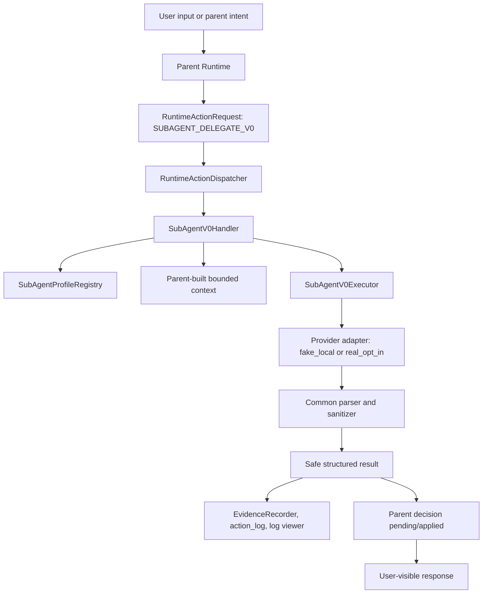
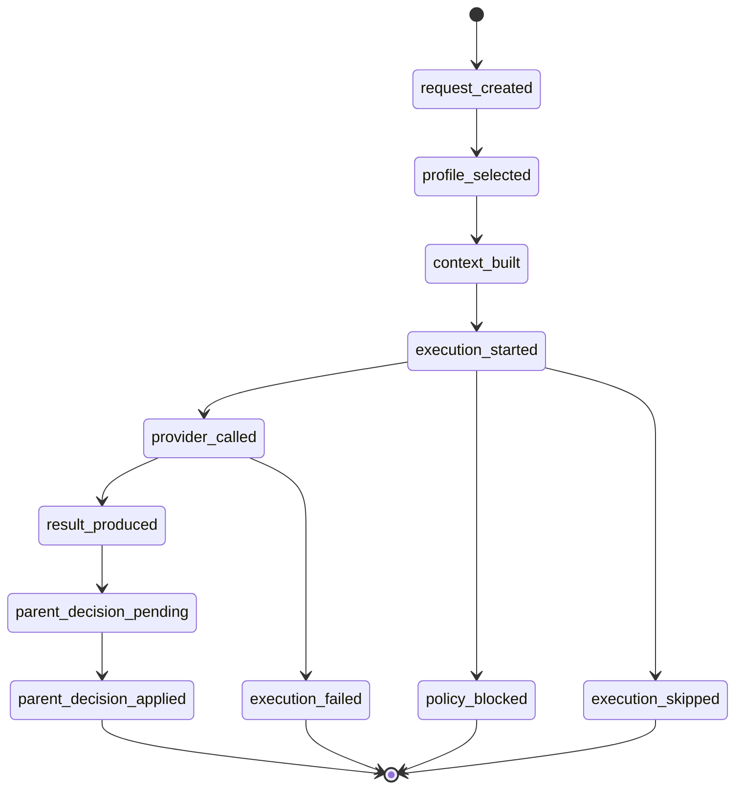
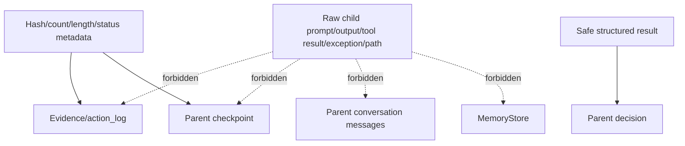

# Sub-agent v0 Init Plan

## Summary

This plan defines how to converge the existing Sub-agent prototype surface into a small, parent-owned Sub-agent v0. It is not a continuation of the current L1/L2 experimental system; it is a reset of the production boundary around one Runtime, one request/result path, safe evidence, and fake/real provider parity.

The current state is explicitly unsafe for direct v0 implementation. Existing L1/L2 code already contains mini-agent and second-runtime behavior: child provider loops, child tool-use loops, L2 revision/native loop behavior, batch memory parsing, and auto parent adjudication. v0 work must first freeze production-triggerable L1/L2 registration, fallback, and behavior, then introduce a single bounded production path.

---

## Plan Approval Status

- Plan audit status: PASS.
- Confirmed P1/P2 findings: none.
- Plan approved for implementation: YES.
- Need revise plan again: NO.
- Can start implementation: YES, but only from RED guardrail tests and freeze gates.
- Implementation must follow phased order: U1 -> U2 -> U3 -> U3A freeze gate -> U4 -> U5 -> U6 -> U7 -> closeout.
- U4 v0 execution cannot start until U3A freeze gate passes.
- v0 remains a predefined, parent-controlled, bounded, read-mostly child worker.
- Fake and real providers share one Runtime path.
- Evidence/logging is a hard architecture requirement, not a later add-on.

---

## Implementation Kickoff Gate

Implementation may start only when all of these gates are true:

1. Plan file is tracked in git.
2. No production code changes exist before implementation begins.
3. U1/U2 RED guardrail tests are written first.
4. U3 RuntimeAction/profile contract lands before v0 execution.
5. U3A L1/L2 freeze gate passes before U4.
6. U4 execution path includes the core evidence skeleton.
7. No uninstrumented v0 execution path exists.
8. No L1/L2 production handler coexists with V0.
9. No capability flag bypass exists.
10. No child tool execution is enabled by default.
11. No child memory, checkpoint, or context mutation is allowed.
12. No child result auto-adoption is allowed.

---

## Problem Frame

Post-Memory Runtime Architecture Hardening closed the Memory v0 boundary and left Sub-agent implementation blocked until a current-state audit. That audit found the Sub-agent surface is a mixed system: L0 demo/local fallback, L1 real-provider child loop, L2 native-loop experiment, deferred child RuntimeActions, and stale documentation claims.

Sub-agent v0 should be a basic capability with clear architecture, not an expansion of those experiments. It must run under the parent Runtime, use the same RuntimeActionDispatcher and evidence/logging system, share one fake/real provider execution path, and avoid child-owned tools, memory, checkpoint, context mutation, or recursive spawn.

---

## Scope Boundaries

### In Scope

- Define the v0 production architecture as a parent-created, bounded, read-mostly child worker.
- Plan how to front-load concrete production freeze for current L1/L2 experimental registration, fallback, and behavior before v0 implementation.
- Plan fake/real provider parity through one Sub-agent request/execution/evidence/result path.
- Plan safe logging and RuntimeAction evidence for Sub-agent lifecycle events.
- Plan RED guardrail tests that must fail on the current mixed architecture before v0 implementation.
- Plan profile capability flags and demo/product separation.

### Non-goals

- No L2 native loop.
- No `batch_memory`.
- No child autonomous planning.
- No recursive spawn.
- No child direct tool execution by default.
- No child memory write.
- No child checkpoint write.
- No raw child output in parent messages or checkpoint.
- No parent adjudication auto-accept.
- No dynamic profile generation.
- No multi-agent swarm.
- No MCP expansion.
- No background workers.
- No hidden real provider activation.
- No implementation in this planning pass.

### Deferred to Follow-Up Work

- Read-only child tool gateway may be designed after v0 if a concrete use case requires it.
- Parent-owned memory proposal conversion may be designed after v0 using MemoryRuntime, RuntimeActionDispatcher, confirmation, and safe evidence.
- L1/L2 reintroduction may be reconsidered after v0 if the second-runtime boundary is redesigned from first principles.
- Legacy SubAgent naming cleanup can follow v0 docs alignment unless it blocks audit readability.

---

## Requirements

### Runtime Ownership

- R1. Sub-agent v0 must use one parent Runtime and must not introduce a second runtime loop, independent session lifecycle, checkpoint writer, or memory writer.
- R2. Sub-agent v0 must not bypass RuntimeActionDispatcher, ToolRuntimeMediator, EvidenceRecorder, or parent Runtime policy.
- R3. Sub-agent v0 must expose one clear production RuntimeAction handler; L0/L1/L2 must not simultaneously count as product production handlers.
- R4. Parent Runtime must create the Sub-agent request, bounded context, execution policy, and parent decision.

### Provider Path

- R5. Fake and real providers must use the same Sub-agent request, execution, parser, sanitizer, evidence, and result path.
- R6. Default execution must be fake/local safe; real provider execution must require explicit opt-in from parent Runtime/config and must not activate silently from environment drift.
- R7. Provider mode metadata must enter safe evidence/log metadata without secrets, raw model config, raw prompts, or raw provider errors.

### Evidence and Observability

- R8. Every Sub-agent request must have `trace_id`, `delegation_id`, and `parent_trace_id`.
- R9. Sub-agent lifecycle events must record safe metadata for request creation, profile selection, context build, execution, provider call, result production, parent decision, skipped/deferred, policy-blocked, and failure paths before provider execution can merge.
- R10. Evidence, action_log, log viewer, and checkpoint-safe metadata must not include raw child prompt, raw child output, raw tool result, raw exception text, raw filesystem path, or secrets.
- R11. Child result must become a safe structured result before parent visibility or parent decision.

### Basic v0 Capability

- R12. v0 must support predefined profiles with explicit capability flags and demo/product status.
- R13. v0 execution must run one controlled task with `max_turns = 1` and no child-owned tool loop, revision loop, autonomous loop, or child message growth loop.
- R14. v0 must return structured safe result metadata and leave display/adoption to Parent Runtime.
- R15. v0 must not write memory, create memory proposals, write checkpoint data, mutate parent context, or spawn child agents.
- R16. v0 must disable child tools by default and return a structured `needs_parent_tool_request` result if a provider indicates a tool is needed.
- R17. Profile capability flags must be runtime execution gates enforced by handler, executor, or policy before the behavior they guard can run.
- R18. `output_schema` must constrain the safe structured result; raw provider output cannot bypass parser/sanitizer validation.

### Documentation and Auditability

- R19. v0 implementation must align source-of-truth docs/status with current code and remove stale claims before claiming readiness.
- R20. RED guardrail tests must define the v0 boundary before production implementation begins.
- R21. Full test closeout must pass or report only known/deferred xfail classifications.

---

## Current-State Correction Strategy

### Keep for v0

These files contain reusable pieces but still need audit during implementation:

- `agent/subagent_system/descriptor.py`
- `agent/subagent_system/registry.py`
- `agent/subagent_system/request.py`
- `agent/subagent_system/result.py`
- `agent/subagent_system/policy.py` safe policy pieces only
- `agent/subagent_system/context.py` parent-built bounded context pieces only
- `agent/subagent_system/trace.py` safe metadata pieces only
- `agent/runtime_integration/subagent_action.py` v0-safe handler pieces only

### Freeze Production Trigger Surface Before v0

These paths are not v0-safe and must not remain production behavior:

- `agent/subagent_system/executor.py::execute_l1`
- `agent/subagent_system/executor.py::execute_l2`
- `agent/subagent_system/delegation.py::delegate_l1`
- `agent/subagent_system/delegation.py::delegate_l2`
- `agent/runtime_integration/subagent_delegate_l2.py`
- L2 native loop
- `batch_memory` parsing
- child provider loop
- child `tool_use` loop
- parent adjudication auto-accept

Freeze means production registration, production fallback, and production behavior are disabled before `SUBAGENT_DELEGATE_V0` can be enabled. Test-only and experimental files may remain, but production RuntimeActionDispatcher route and product profile delegation must not reach them.

| Target | Current risk | v0 mechanism | File/function | Proof test | Future re-enable condition |
|---|---|---|---|---|---|
| `SUBAGENT_DELEGATE_L2` | Production dispatcher currently registers L2, making an experimental native loop look supported. | Unregister from production dispatcher before v0 handler is enabled; support status remains deferred/test-only. | `agent/runtime_integration/phase1_hook.py`, `agent/runtime_integration/schema.py` | `tests/runtime_integration/test_subagent_v0_runtime_boundary.py` proves L2 cannot be triggered from production dispatcher path. | A future design removes L2 native loop semantics and passes a separate review for one-Runtime compliance. |
| `SubAgentDelegateL2Handler` | Handler calls `delegate_l2` and can return success-shaped payloads. | Keep file only as experimental/test reference; v0 production path cannot import or call it. | `agent/runtime_integration/subagent_delegate_l2.py` | Direct production route lookup fails or reports deferred, and v0 handler call graph excludes L2 handler. | Handler is rewritten behind a new reviewed action with safe provider, evidence, and parent decision boundaries. |
| `execute_l1` / `execute_l2` | Both contain child provider loops; L2 also includes native-loop behavior. | Add explicit experimental/runtime/test-only guard and forbid v0 handler/executor calls to both functions. | `agent/subagent_system/executor.py::execute_l1`, `agent/subagent_system/executor.py::execute_l2` | v0 tests monkeypatch these functions to fail if invoked; product v0 delegation still succeeds. | A future execution model proves single parent-owned call semantics and no child loop. |
| `delegate_l1` / `delegate_l2` | Delegation helpers call child loops and auto adjudication. | v0 production path cannot call these helpers; `core.py` product delegation fallback cannot land on L1/L2. | `agent/subagent_system/delegation.py::delegate_l1`, `agent/subagent_system/delegation.py::delegate_l2`, `agent/core.py` | Product profile delegation uses `SUBAGENT_DELEGATE_V0` and proves `delegate_l1`/`delegate_l2` are not called. | A future compat wrapper routes through v0-safe request/result semantics without child loop behavior. |
| `batch_memory` parsing | L2 can parse memory proposals from child output. | v0 parser rejects or ignores `batch_memory`; no pending proposal and no `MemoryStore` write. | `agent/subagent_system/executor.py`, `agent/subagent_system/result.py` | v0 path rejects/ignores `batch_memory` and proves no pending files or store writes. | Future memory proposals are parent-owned MemoryRuntime requests with confirmation. |
| child provider loop / `tool_use` loop | Child messages can grow into an independent conversation and request tools. | v0 allows at most one parent-owned provider call; provider `tool_use` becomes `needs_parent_tool_request` metadata. | `agent/subagent_system/executor.py`, `agent/runtime_integration/subagent_action.py` | v0 tests prove no child message loop, no tool loop, and no parent message/checkpoint mutation. | A later read-only gateway passes policy-object and scratch-context review. |
| L2 revision loop | Child can request revision and continue autonomously. | v0 forbids revision loops; output either validates or returns a safe failed result. | `agent/subagent_system/delegation.py::delegate_l2` | v0 output-schema failure does not trigger revision; it records safe failure evidence. | Future revision design is parent-owned and bounded by RuntimeAction state. |
| parent adjudication auto-accept | Existing `adjudicate_result()` can auto accept `ok` results. | v0 does not call old auto-accept helper; result enters `parent_decision.pending` first. | `agent/subagent_system/adjudication.py`, `agent/subagent_system/delegation.py` | v0 parent decision tests prove no auto-accept and no memory/checkpoint/context mutation. | Old helper is renamed/rewritten as pending-decision or kept compat-only. |

`SUBAGENT_DELEGATE_V0` is the only product v0 production handler. `SUBAGENT_DELEGATE_L0` may remain demo/compat-only or become a compatibility wrapper into v0, but it must not count as a second product production handler. Product use must go through v0.

### Archive or Mark Compat-Only

These paths need explicit status so future work does not mistake them for v0:

- `agent/subagents/local.py`
- `agent/subagent_inline.py` if it remains fallback/demo behavior
- stale docs under old MVP/L1/L2 experiment claims

### Source-of-Truth Alignment Targets

These are not modified by this planning pass, but they must be included in the v0 implementation plan:

- `docs/PROJECT_STATUS.md`
- `docs/design/subagent-boundary-architecture.md`
- `docs/design/subagent-l1-l2-execution-contract.md`
- `docs/design/subagent-l2-native-loop-sdd.md`
- `agent/runtime_decision_frame.py`

---

## Key Technical Decisions

- KTD1. Add `SUBAGENT_DELEGATE_V0` instead of reusing current L1/L2 semantics: Existing L1 contains a child provider/tool loop and L2 contains native-loop behavior, so reusing them would hide second-runtime risk behind a v0 label. A new action gives v0 one auditable production entrypoint.
- KTD2. Keep `SUBAGENT_DELEGATE_L0` demo/compat-only unless it becomes a wrapper into v0: L0 is closer to v0-safe behavior, but it carries demo fallback and auto adjudication assumptions. Product profile delegation must use `SUBAGENT_DELEGATE_V0`, and L0 must not count as product capability.
- KTD3. Unregister `SUBAGENT_DELEGATE_L2` from production dispatcher before v0 readiness: L2 is experimental and currently overclaims production support by being registered. Deferred status without unregistering is insufficient for v0 if production route can still trigger `SubAgentDelegateL2Handler`.
- KTD4. v0 executor may call a provider only as a parent-owned single provider call: A single call can support fake/real parity without creating a child runtime loop. No child `tool_use` loop, revision loop, autonomous loop, or unbounded child messages are allowed.
- KTD5. v0 disables child tools first: A read-only gateway is possible later, but v0 should return `needs_parent_tool_request` structured metadata and let Parent Runtime decide whether to execute anything.
- KTD6. Memory remains rejected/deferred evidence-only: Any future child memory proposal must become a parent-owned MemoryRuntime request with confirmation and built-in evidence.
- KTD7. Parent decision is explicit: child result first enters `parent_decision.pending`; Parent Runtime policy must produce `parent_decision.applied` before display or adoption. `decision_type=display_only` may show a safe summary, but it is not adoption and cannot mutate memory, checkpoint, context, prompt, or messages.
- KTD8. RuntimeAction support status is the source of truth for capability reporting: Deferred child actions must not be inferred as production support from schema presence or default evidence kind.
- KTD9. Use a narrow adapter over the existing provider interface by default: Do not create a second provider runtime. Introduce a separate `SubAgentV0Provider` protocol only if RED tests prove the existing interface leaks v0 boundaries.
- KTD10. `output_schema` gates safe result shape: fake and real provider responses use the same parser/sanitizer and output-schema validation. Validation failure returns a safe failed result with safe evidence; raw provider response cannot bypass validation.
- KTD11. No uninstrumented v0 execution path: provider call, provider completion, result production, and parent decision pending events are part of the v0 execution unit. Missing required lifecycle events fails closed and blocks merge.

---

## High-Level Technical Design

### v0 Runtime Flow



### Terminal Audit View

```text
Parent Runtime
  -> RuntimeActionDispatcher
  -> SUBAGENT_DELEGATE_V0
  -> SubAgentV0Handler
  -> Profile capability gate
  -> Parent-built bounded context
  -> Narrow provider adapter, fake/real same path
  -> Output schema sanitizer
  -> Safe structured result
  -> Parent decision pending/applied
  -> Evidence/action_log/log viewer
```

### v0 State Boundary



### Forbidden Data Flow



---

## Fake / Real Provider Unified Path

### Provider Modes

- `fake_local`: default, local-safe, no network, deterministic or fixture-backed.
- `real_opt_in`: explicit parent-approved provider execution through the same v0 path.
- `disabled` or `skipped`: policy/config blocks execution and emits safe skipped/deferred evidence.

### Real Opt-In Rules

Real provider execution requires all of the following:

- explicit config or explicit provider passed by Parent Runtime;
- no silent activation from ambient environment variables;
- provider mode captured in safe evidence;
- no secret expansion into evidence, action_log, log viewer, or checkpoint;
- provider errors recorded by type/category only, never `str(exc)`.

### Provider Contract

Use a narrow adapter over the existing provider interface by default. This avoids a second provider runtime while still making v0 boundaries explicit. Fake and real providers must expose the same adapter call shape to `SubAgentV0Executor`, and both responses must pass through the same parser/sanitizer before producing `SubAgentV0Result`.

Only introduce a separate `SubAgentV0Provider` protocol if RED tests prove the existing provider interface leaks v0 boundaries. Provider errors must record `provider_error_type` only; `str(exc)` must not enter evidence, action_log, log viewer, checkpoint, or safe result.

Evidence metadata should include:

- `provider_mode`
- `provider_kind`
- `model_family` or `model_name_hash`
- `real_call_allowed`
- `provider_call_status`
- `provider_error_type`

It must not include raw provider secrets, raw model config, request body, prompt, response body, or exception string.

### Output Schema Contract

`output_schema` constrains the safe structured result, not the raw provider response. The common parser/sanitizer must validate fake and real responses through the same output-schema path. Invalid output returns a safe failed result or fails closed, emits a safe validation-failure evidence event, and never displays raw provider text directly.

---

## Evidence and Observability Design

All events must include `delegation_id`, `parent_trace_id`, `profile_id`, `provider_mode`, `status`, and `redacted=true` unless noted otherwise. Event payloads must use hash/count/length/kind metadata rather than raw content.

| Event | Required metadata | Forbidden raw fields | RuntimeAction evidence | action_log | Log viewer |
|---|---|---|---:|---:|---:|
| `subagent.request.created` | delegation_id, parent_trace_id, profile_id, capability_flags, request_hash | task text, prompt, secrets | yes | yes | yes |
| `subagent.profile.selected` | profile_id, status, version, provider_mode_allowed, capability_flags | role prompt body, manifest path | yes | yes | yes |
| `subagent.context.built` | context_hash, context_length, context_file_count, max_context_chars, max_files | raw context, raw paths, file contents | yes | yes | yes |
| `subagent.execution.started` | provider_mode, max_turns, timeout_ms, allowed_tool_count | prompt, raw context | yes | yes | yes |
| `subagent.provider.called` | provider_kind, model_family/hash, real_call_allowed | API key, raw request, raw prompt | yes | yes | yes |
| `subagent.provider.completed` | provider_call_status, response_hash, response_length | raw response, tool result | yes | yes | yes |
| `subagent.result.produced` | result_hash, result_length, output_schema_id, needs_parent_tool_request | raw output | yes | yes | yes |
| `subagent.parent_decision.pending` | decision_id, result_hash, allowed_decisions | raw output | yes | yes | yes |
| `subagent.parent_decision.applied` | decision_id, decision_type, adopted_safe_summary_hash | raw output, memory content | yes | yes | yes |
| `subagent.execution.failed` | failure_kind, provider_error_type, safe_failure_summary | `str(exc)`, stack trace, prompt | yes | yes | yes |
| `subagent.execution.skipped` | skip_reason, policy_id, policy_rule_id, policy_hash, policy_decision_source | raw task/context/path | yes | yes | yes |
| `subagent.policy.blocked` | policy_reason, capability_flag, blocked_operation | raw requested payload | yes | yes | yes |

Redaction rules:

- raw prompt, raw response, raw tool result, raw exception, raw path, and secrets are never evidence fields;
- skipped/deferred evidence uses `policy_id`, `policy_rule_id`, `policy_hash`, or `policy_decision_source`, never a raw policy file path field;
- model name may be recorded as family or hash, not a secret-bearing endpoint/config;
- context files are represented by count, hash, and safe kind only;
- result metadata uses hash/length/status and optional safe summary.

---

## Profile and Capability Contract

Sub-agent v0 profiles should be explicit product contracts, not loose demo metadata. The v0 profile contract should include:

- `profile_id`
- `display_name`
- `description`
- `version`
- `status`: `demo`, `product`, or `deprecated`
- `role_prompt`
- `provider_mode_allowed`: `fake_only`, `fake_and_real`, or `real_opt_in`
- `max_turns`: must be `1` for v0
- `max_context_chars`
- `max_files`
- `timeout_ms`
- `allowed_tools`: default empty
- `can_call_provider`
- `can_use_tools`
- `can_write_memory`: false
- `can_request_memory`: false
- `can_write_checkpoint`: false
- `can_spawn_child`: false
- `can_modify_parent_context`: false
- `can_emit_parent_action`: false
- `output_schema`

Demo and product profiles must be separate. Demo profiles must not be counted as production capability. The default product profile must be fake-safe, and any real-capable profile must require explicit opt-in at request time.

Capability flags are runtime execution gates, not documentation fields. `SubAgentV0Handler`, `SubAgentV0Executor`, and policy gate must read the selected profile before the guarded behavior can run.

| Capability flag | Enforcement point | If false | Evidence event | Proof test |
|---|---|---|---|---|
| `can_call_provider` | `SubAgentV0Handler` before provider adapter invocation | skip/fail closed before provider call | `subagent.policy.blocked` with capability flag | `test_subagent_v0_provider_modes.py` proves provider is not called. |
| `can_use_tools` | parser/sanitizer and executor before handling provider `tool_use` | convert to safe `needs_parent_tool_request` or blocked result; do not execute | `subagent.policy.blocked` or `subagent.result.produced` | `test_subagent_v0_tool_boundary.py` proves tool_use is not processed as execution. |
| `can_write_memory` | handler/executor before any MemoryStore or MemoryRuntime write path | fail closed; no store/pending write | `subagent.policy.blocked` | `test_subagent_v0_memory_checkpoint_boundary.py` proves no MemoryStore write. |
| `can_request_memory` | parser/sanitizer before memory request/proposal emission | reject/ignore memory request metadata | `subagent.policy.blocked` | `test_subagent_v0_memory_checkpoint_boundary.py` proves no memory request or pending proposal. |
| `can_write_checkpoint` | handler before checkpoint metadata write | no child checkpoint write; parent stores safe metadata only | `subagent.policy.blocked` | `test_subagent_v0_memory_checkpoint_boundary.py` proves no raw child checkpoint write. |
| `can_spawn_child` | handler before nested delegation request | fail closed on recursive delegation | `subagent.policy.blocked` | `test_subagent_v0_runtime_boundary.py` proves no recursive spawn. |
| `can_modify_parent_context` | handler/executor before parent messages/context/prompt mutation | fail closed; parent context unchanged | `subagent.policy.blocked` | `test_subagent_v0_context_boundary.py` proves no parent context/message mutation. |
| `can_emit_parent_action` | parser/sanitizer before producing parent action intents | return safe result requiring parent decision | `subagent.policy.blocked` | `test_subagent_v0_parent_decision.py` proves no direct parent action emission. |

---

## RuntimeAction and Dispatcher Strategy

### Recommended Action Matrix

| Action | v0 status | Handler strategy | Reporting/evidence strategy |
|---|---|---|---|
| `SUBAGENT_DELEGATE_V0` | new production action | one registered `SubAgentV0Handler` | business only when delegated; safe metadata only |
| `SUBAGENT_DELEGATE_L0` | demo/local compatibility | keep or migrate behind v0 later | probe/demo, not product claim |
| `SUBAGENT_DELEGATE_L1` | frozen/non-product unless rewritten | no product fallback and do not treat current child loop as v0 | support status must not overclaim |
| `SUBAGENT_DELEGATE_L2` | unregistered from production dispatcher before v0 | no production registration; catalog may report deferred/test-only | probe/deferred, not business support |
| `SUBAGENT_CHILD_TOOL_REQUEST` | deferred | no production handler | unsupported/deferred, no raw child payload |
| `SUBAGENT_CHILD_RESULT` | deferred | no production handler | unsupported/deferred, no raw child payload |
| `SUBAGENT_PARENT_ADJUDICATION` | deferred | no production handler | unsupported/deferred, no raw child payload |
| `SUBAGENT_CHILD_MEMORY_REQUEST` | deferred | no production handler | unsupported/deferred, no raw child payload |
| `SUBAGENT_CHILD_BATCH_MEMORY` | deferred | no production handler | unsupported/deferred, no raw child payload |

`runtime_action_support_status()` should be the source of truth for support reporting. `no_handler_registered` must never be interpreted as feature support. Deferred child actions should default to probe/deferred reporting or reporting must always prioritize support status over default evidence kind.

---

## Tool Boundary Strategy

v0 should disable child tools. Sub-agent provider output may request a parent tool, but it must return structured intent instead of executing it:

- `needs_parent_tool_request = true`
- `requested_tool_name`
- `requested_tool_reason`
- `safe_arguments_metadata`

Parent Runtime can later decide whether to execute the requested tool through normal ToolRuntimeMediator and confirmation policy. The child result must not execute the tool, append tool results into child loops, write parent messages, or pollute checkpoint.

If a later version allows read-only child tools, it must satisfy all of these before implementation:

- mediator receives a parent-approved child policy object;
- `descriptor.allowed_tools ∩ request.allowed_tools` is enforced at the mediator boundary;
- unauthorized tools fail closed;
- shell, network, write, memory, checkpoint, and external process tools are blocked by default;
- result writes only to child scratch metadata, not parent messages;
- evidence contains only safe metadata;
- parent explicit adoption is required.

---

## Memory, Checkpoint, and Context Strategy

### Memory

- no child direct `MemoryStore`;
- no `MemoryRuntime.resolve_confirmation(direct_write=True)`;
- no `batch_memory`;
- no pending proposal;
- child memory request remains rejected/deferred evidence-only;
- future memory proposal must be a parent-owned MemoryRuntime request with confirmation and built-in evidence.

### Checkpoint

- no child checkpoint writer;
- no raw child result in checkpoint;
- parent checkpoint may store only safe metadata: `delegation_id`, `profile_id`, `status`, `result_hash`, and `decision`;
- no checkpoint split-brain between child and parent lifecycle.

### Context

- context is only parent-built bounded context;
- no child uncontrolled `Path.read_text()` expansion;
- context files must be selected by parent policy;
- `max_context_chars` and `max_files` must be enforced;
- evidence stores context hash, length, and count only;
- no raw context or raw filesystem path in evidence.

---

## RED Guardrail Tests First

Implementation must begin with failing guardrail tests. These tests should prove the current mixed architecture violates v0 boundaries before production code is changed.

### `tests/runtime_integration/test_subagent_v0_runtime_boundary.py`

- v0 has no second runtime loop.
- v0 action is handled by one production handler.
- `SUBAGENT_DELEGATE_L2` cannot be triggered from the production dispatcher path.
- `SubAgentDelegateL2Handler` is not reachable from v0 production path.
- v0 cannot invoke `execute_l1` or `execute_l2`.
- v0 cannot invoke `delegate_l1` or `delegate_l2`.
- product profile delegation uses `SUBAGENT_DELEGATE_V0`.
- `SUBAGENT_DELEGATE_L0` is not counted as product capability.
- v0 and L0/L1/L2 are not simultaneously reported as product production handlers.
- child actions stay deferred and do not report production support.
- current L1/L2 child loops are not reachable through v0.
- recursive delegation fails closed when `can_spawn_child=false`.

### `tests/runtime_integration/test_subagent_v0_provider_modes.py`

- fake/local is the default and makes no network call.
- real provider requires explicit opt-in.
- fake and real use the same RuntimeAction/request/executor/result path.
- fake result is not labeled as real.
- real provider error records only safe error type and does not leak secrets.
- `can_call_provider=false` prevents provider adapter invocation.
- provider execution fails closed if required lifecycle evidence cannot be emitted.
- fake and real responses both pass through the same `output_schema` validation path.

### `tests/runtime_integration/test_subagent_v0_tool_boundary.py`

- child tools are disabled by default.
- unauthorized tool request fails closed.
- provider `tool_use` becomes `needs_parent_tool_request` structured result.
- `can_use_tools=false` prevents tool execution and tool result processing.
- child tool result cannot mutate parent messages.
- child tool result cannot pollute parent checkpoint.
- parent tool intent uses only `needs_parent_tool_request`, `requested_tool_name`, `requested_tool_reason`, and `safe_arguments_metadata`.

### `tests/runtime_integration/test_subagent_v0_memory_checkpoint_boundary.py`

- v0 does not write `MemoryStore`.
- v0 rejects or ignores `batch_memory`.
- v0 does not create pending memory proposal files.
- v0 does not emit memory requests when `can_request_memory=false`.
- v0 does not write child checkpoint data when `can_write_checkpoint=false`.
- checkpoint stores safe metadata only.
- raw child result never enters checkpoint.

### `tests/runtime_integration/test_subagent_v0_context_boundary.py`

- context includes parent-selected files only.
- `max_context_chars` is enforced.
- `max_files` is enforced.
- no uncontrolled `Path.read_text` expansion occurs in v0.
- context evidence contains only hash, length, count, and safe kind metadata.
- raw context text does not appear in evidence, action_log, or log viewer metadata.
- raw filesystem path does not appear in evidence, action_log, or log viewer metadata.
- child output cannot add files to context.
- child output cannot mutate parent context, prompt, or messages.
- `context_hash`, `context_file_count`, and `context_length` are required metadata.

### `tests/runtime_integration/test_subagent_v0_evidence_logging.py`

- required lifecycle events are emitted.
- missing required lifecycle events fail provider execution or block merge.
- provider mode is logged safely.
- raw prompt/output/exception/path/secret does not appear in evidence, action_log, or log viewer metadata.
- `subagent.execution.skipped` uses `policy_id`, `policy_rule_id`, `policy_hash`, and `policy_decision_source`, never raw filesystem path.
- raw filesystem path does not appear in skipped evidence, action_log, or log viewer metadata.
- secret/API key/raw path does not appear in any Sub-agent evidence event.
- skipped/deferred/failed statuses are distinguishable.
- output-schema validation failure emits safe evidence without raw provider response.

### `tests/runtime_integration/test_subagent_v0_parent_decision.py`

- child result is not auto-accepted.
- result enters pending parent decision.
- explicit parent decision is required before adoption.
- display of safe summary requires `subagent.parent_decision.applied` evidence.
- `decision_type=display_only` does not mutate memory, checkpoint, context, prompt, or messages.
- old adjudication auto-accept helper is not used by v0 production path.
- `can_emit_parent_action=false` prevents direct parent action emission.

### `tests/test_subagent_v0_profile_contract.py`

- capability flags default safe.
- disallowed capability flags fail closed.
- flags are enforced by handler/executor/policy, not only schema validation.
- demo profile is not product capability.
- `max_turns = 1`.
- `can_call_provider=false` prevents provider call.
- `can_use_tools=false` prevents tool execution.
- `can_spawn_child = false`.
- `can_write_memory = false`.
- `can_write_checkpoint = false`.
- `can_modify_parent_context = false`.
- `can_emit_parent_action = false`.
- real-capable profile requires explicit opt-in.
- `output_schema` is required for product profiles and constrains safe structured result shape.

---

## Implementation Units

### U1. Source-of-Truth Alignment

- **Goal:** Align docs and status claims so implementation starts from the audited current state, not stale L1/L2 claims.
- **Requirements:** R19-R21.
- **Dependencies:** none.
- **Files:** `docs/PROJECT_STATUS.md`, `docs/design/subagent-boundary-architecture.md`, `docs/design/subagent-l1-l2-execution-contract.md`, `docs/design/subagent-l2-native-loop-sdd.md`, `agent/runtime_decision_frame.py`.
- **Approach:** Mark current L1/L2 as experimental/frozen, clarify product vs demo profiles, and remove claims that child memory writes or L1/L2 loops are v0-ready. This unit should not introduce behavior change unless a test in later units requires it.
- **Execution note:** Documentation/status alignment should be done before production implementation so reviewers use the same source of truth.
- **Patterns to follow:** Post-Memory hardening plan debt-ledger style in `docs/plans/2026-06-09-post-memory-runtime-architecture-hardening-plan.md`.
- **Test scenarios:** Test expectation: none -- this is source-of-truth alignment, with behavioral assertions added in U2.
- **Verification:** A reviewer can read the docs/status files and see that Sub-agent v0 is blocked on freezing L1/L2 and establishing v0 boundaries.

### U2. RED v0 Guardrail Tests

- **Goal:** Add failing tests that pin the v0 boundary before any implementation.
- **Requirements:** R1-R21.
- **Dependencies:** U1 recommended.
- **Files:** `tests/runtime_integration/test_subagent_v0_runtime_boundary.py`, `tests/runtime_integration/test_subagent_v0_provider_modes.py`, `tests/runtime_integration/test_subagent_v0_tool_boundary.py`, `tests/runtime_integration/test_subagent_v0_memory_checkpoint_boundary.py`, `tests/runtime_integration/test_subagent_v0_context_boundary.py`, `tests/runtime_integration/test_subagent_v0_evidence_logging.py`, `tests/runtime_integration/test_subagent_v0_parent_decision.py`, `tests/test_subagent_v0_profile_contract.py`.
- **Approach:** Write negative and boundary-first tests that fail on current L1/L2 mini-agent behavior, current L2 registration, current child tool parent-state mutation risk, missing v0 action, missing profile flags, and missing safe lifecycle events.
- **Execution note:** Start test-first. Do not weaken existing L1/L2 tests; add v0-specific tests that classify existing L1/L2 as frozen/deferred.
- **Patterns to follow:** `tests/runtime_integration/test_subagent_guardrail_hardening.py`, `tests/runtime_integration/test_runtime_action_deferred_ownership.py`, `tests/runtime_integration/test_tool_mediator_child_evidence_boundary.py`.
- **Test scenarios:** The scenarios are the RED guardrail tests listed in the previous section.
- **Verification:** The new tests fail for the intended boundary reasons on the current mixed architecture, not due to setup errors.

### U3. RuntimeAction and Profile Contract

- **Goal:** Establish one production v0 action and a safe profile capability contract.
- **Requirements:** R3, R5, R12, R16-R18.
- **Dependencies:** U2.
- **Files:** `agent/runtime_integration/schema.py`, `agent/runtime_integration/phase1_hook.py`, `agent/runtime_integration/subagent_action.py`, `agent/subagent_system/descriptor.py`, `agent/subagent_system/registry.py`, `agent/subagent_system/policy.py`, `tests/runtime_integration/test_subagent_v0_runtime_boundary.py`, `tests/test_subagent_v0_profile_contract.py`.
- **Approach:** Add or select `SUBAGENT_DELEGATE_V0` as the single product action and define profile capability flags with safe defaults. Separate demo/product profile status, make capability flags runtime gates, and make child action reporting defer/probe-aware. This unit defines the v0 contract but does not allow v0 execution to merge until U3A freezes the L1/L2 production trigger surface.
- **Patterns to follow:** RuntimeAction support descriptor pattern in `agent/runtime_integration/schema.py`; descriptor validation pattern in `agent/subagent_system/descriptor.py`.
- **Test scenarios:** v0 action has one product handler contract; child actions return unsupported/deferred without raw payload; demo profiles are excluded from product capability; safe capability flags default false; `output_schema` is required for product profiles.
- **Verification:** RuntimeAction catalog and support reporting cannot overclaim child actions, demo profiles, or missing capability gates as v0 production support.

### U3A. Freeze Legacy L1/L2 Production Surfaces

- **Goal:** Freeze L1/L2 production registration, fallback, and behavior before any v0 execution path can merge.
- **Requirements:** R1-R4, R13-R17, R19-R21.
- **Dependencies:** U3.
- **Files:** `agent/runtime_integration/phase1_hook.py`, `agent/runtime_integration/schema.py`, `agent/runtime_integration/subagent_delegate_l2.py`, `agent/runtime_integration/subagent_action.py`, `agent/subagent_system/executor.py`, `agent/subagent_system/delegation.py`, `agent/subagent_system/adjudication.py`, `agent/core.py`, `tests/runtime_integration/test_subagent_v0_runtime_boundary.py`, `tests/runtime_integration/test_subagent_v0_memory_checkpoint_boundary.py`, `tests/runtime_integration/test_subagent_v0_parent_decision.py`.
- **Approach:** Unregister `SUBAGENT_DELEGATE_L2` from production dispatcher, keep `SubAgentDelegateL2Handler` experimental/test-only if retained, block product fallback to `delegate_l1` and `delegate_l2`, and prove `SubAgentV0Handler` cannot call `execute_l1` or `execute_l2`. Prove `batch_memory` cannot enter the v0 executor, prove L1/L2 are experimental/test-only/compat-only, and prove V0 is the only product production handler. v0 and L1/L2 must not be enabled as simultaneous production handlers.
- **Patterns to follow:** Deferred RuntimeAction ownership matrix in `tests/runtime_integration/test_runtime_action_deferred_ownership.py`; support-status reporting in `agent/runtime_integration/schema.py`.
- **Test scenarios:** L2 cannot be triggered from production dispatcher; v0 cannot invoke L1/L2 executor or delegation helpers; product profile delegation uses `SUBAGENT_DELEGATE_V0`; L0 is demo/compat-only or a wrapper and not product capability; `batch_memory` is rejected/ignored; old auto-accept helper is not used by v0.
- **Verification:** Production route lookup and v0 call graph prove there is one product handler and no accidental L1/L2 execution. Focused U3A freeze tests must pass before U4 starts.

### U4. v0 Request, Bounded Context, Execution Path, and Core Evidence Skeleton

- **Goal:** Implement the parent-owned v0 request/context/executor path with required lifecycle evidence built in from the first executable slice.
- **Requirements:** R1-R18.
- **Dependencies:** U3A.
- **Files:** `agent/subagent_system/request.py`, `agent/subagent_system/context.py`, `agent/subagent_system/executor.py`, `agent/subagent_system/result.py`, `agent/runtime_integration/subagent_action.py`, `tests/runtime_integration/test_subagent_v0_runtime_boundary.py`, `tests/runtime_integration/test_subagent_v0_provider_modes.py`, `tests/runtime_integration/test_subagent_v0_tool_boundary.py`.
- **Approach:** Create a v0-safe execution slice: parent builds bounded context, executor makes at most one provider call through the narrow fake/real adapter, parser/sanitizer validates `output_schema`, and the handler returns safe structured result. This same unit must emit `subagent.request.created`, `subagent.profile.selected`, `subagent.context.built`, `subagent.execution.started`, `subagent.provider.called`, `subagent.provider.completed`, `subagent.result.produced`, and `subagent.parent_decision.pending` safe events. No provider execution path may merge if required lifecycle events are missing.
- **Patterns to follow:** Safe result metadata patterns in `agent/subagent_system/trace.py`; Memory hardening redaction patterns in `agent/evidence_recorder.py`; RuntimeAction observer patterns in `agent/runtime_integration/evidence.py`.
- **Test scenarios:** v0 does not call child loops; fake default uses the same path as real opt-in; provider `tool_use` becomes structured parent-tool intent; no child messages grow beyond one request/response boundary; no raw prompt/output/path appears in returned metadata or core evidence; required lifecycle events are emitted or provider execution fails closed.
- **Verification:** A v0 delegation can run with fake provider, emit the core lifecycle evidence skeleton, and produce a safe result without touching L1/L2, child tools, memory, checkpoint, or parent context.

### U5. Observability Closeout, Viewer, and Coverage Hardening

- **Goal:** Close evidence/action_log/log-viewer consistency after the core execution path is already instrumented.
- **Requirements:** R8-R11, R19-R21.
- **Dependencies:** U4.
- **Files:** `agent/evidence_recorder.py`, `agent/runtime_integration/evidence.py`, `agent/event_log.py`, `agent/log_viewer.py`, `agent/subagent_system/trace.py`, `tests/runtime_integration/test_subagent_v0_evidence_logging.py`, `tests/test_log_viewer.py`.
- **Approach:** Audit consistency between RuntimeAction evidence, action_log, event_log, and log viewer display. Harden redaction coverage for skipped/deferred/failed paths, provider error types, context metadata, and output-schema validation failure. Wire dogfood/reporting surfaces only after U4 proves no uninstrumented v0 execution path exists.
- **Patterns to follow:** Existing memory evidence metadata helpers in `agent/evidence_recorder.py`; log viewer tests in `tests/test_log_viewer.py`; RuntimeAction observer patterns in `agent/runtime_integration/evidence.py`.
- **Test scenarios:** event coverage is complete across evidence/action_log/log viewer; provider mode and result hashes appear safely; raw prompt/output/path/exception/secret are absent; no legacy raw policy path field is emitted; failure uses error type, not `str(exc)`; log viewer-visible fields remain safe.
- **Verification:** Evidence/action_log/log viewer show a complete v0 lifecycle without raw child content, and coverage audit confirms no required event is missing.

### U6. Parent Decision Boundary

- **Goal:** Replace auto parent adjudication with explicit parent decision semantics for v0.
- **Requirements:** R4, R11, R14, R15.
- **Dependencies:** U4, U5.
- **Files:** `agent/subagent_system/adjudication.py`, `agent/subagent_system/result.py`, `agent/runtime_integration/subagent_action.py`, `tests/runtime_integration/test_subagent_v0_parent_decision.py`.
- **Approach:** v0 result enters `parent_decision.pending`. Parent Runtime policy must explicitly create `parent_decision.applied` before display or adoption. `decision_type=display_only` may show a safe summary, but it is not adoption and cannot mutate memory, checkpoint, context, prompt, or messages. Old `adjudication.py` auto-accept behavior must be removed from v0 production path; if retained, it becomes a pending-decision helper or compat-only helper.
- **Patterns to follow:** Confirmation/pending request patterns in existing runtime confirmation tests; safe summary patterns from Memory v0.
- **Test scenarios:** v0 result is not auto-accepted; safe display requires `parent_decision.applied` evidence; `display_only` writes no memory/checkpoint/context/prompt/messages; discard leaves no side effect; old auto-accept helper is not used.
- **Verification:** Parent decision evidence records pending/applied states and no v0 result mutates parent-owned stores without explicit parent action.

### U7. Legacy Naming and Docs Cleanup

- **Goal:** Make legacy/demo names and docs impossible to confuse with v0 production behavior after the critical behavior freeze has already happened in U3A.
- **Requirements:** R3, R19-R21.
- **Dependencies:** U3A, U6.
- **Files:** `agent/subagents/local.py`, `agent/subagent_inline.py`, `docs/design/subagent-l1-l2-execution-contract.md`, `docs/design/subagent-l2-native-loop-sdd.md`, `docs/design/subagent-boundary-architecture.md`, `docs/PROJECT_STATUS.md`.
- **Approach:** Mark `agent/subagents/local.py` and `agent/subagent_inline.py` compat-only/demo-only if retained. Update docs to say L1/L2 are experimental/reference paths, not v0 capabilities. This unit does not carry critical production freeze behavior; that must already be true from U3A.
- **Patterns to follow:** Documentation source-of-truth cleanup style in U1.
- **Test scenarios:** docs/status no longer claim L0/L1/L2 as product v0 handlers; demo and product capability reporting remain separate.
- **Verification:** Audit can distinguish v0 production path from demo/compat/experimental paths without reading code internals.

### U8. Quality Gates and Closeout

- **Goal:** Close v0 Init implementation with focused and full-suite verification.
- **Requirements:** R19-R21.
- **Dependencies:** U1-U7.
- **Files:** `docs/PROJECT_STATUS.md`, `docs/PROGRESS_LEDGER.md`, all v0 test files from U2.
- **Approach:** Run focused Sub-agent v0 tests, affected runtime/memory/tool/evidence tests, and full pytest. Classify known xfails and ensure no new raw leak, second runtime, memory write, checkpoint write, child tool execution, or hidden real-provider activation remains.
- **Patterns to follow:** Evidence packet standard in `AGENTS.md`.
- **Test scenarios:** all v0 guardrails pass; no production overclaim tests pass; full pytest passes or reports only known/deferred xfails; optional real opt-in smoke is explicit and skipped by default.
- **Verification:** Closeout audit can confirm v0 is one parent-owned production path with fake/real parity and safe evidence.

---

## Phased Delivery

| Phase | Units | Outcome |
|---|---|---|
| Phase 0: Source-of-truth alignment | U1 | Current L1/L2 are marked experimental/frozen before code behavior changes. |
| Phase 1: RED guardrail tests | U2 | v0 negative tests fail on current architecture for intended reasons. |
| Phase 2: RuntimeAction and profile contract | U3 | One v0 action and safe capability flags are defined. |
| Phase 2A: L1/L2 production freeze gate | U3A | L2 production registration, L1/L2 fallback, batch memory, child loops, and auto-accept are not reachable from production v0. |
| Phase 3: v0 execution plus core evidence skeleton | U4 | Parent-owned single-call execution returns safe structured result and emits required core lifecycle evidence. |
| Phase 4: Observability closeout | U5 | Evidence/action_log/log viewer coverage is audited and hardened; this is not a late logging backfill. |
| Phase 5: Parent decision | U6 | No auto-accept; explicit decision boundary exists. |
| Phase 6: Legacy naming and docs cleanup | U7 | Legacy/demo names and docs are clarified after the critical behavior freeze is already enforced. |
| Phase 7: Quality gates and closeout | U8 | Focused/full tests and docs closeout support audit. |

`SUBAGENT_DELEGATE_V0` must not be enabled as a product handler until Phase 2A is green. Phase 6 is cleanup only; it must not carry any critical registration, fallback, behavior, or auto-adjudication freeze.

### Per-Unit Rollback Strategy

- Each implementation unit should land as an independent commit with focused tests for that unit.
- After each unit, run `git diff --check`, `ruff check` on changed Python files, and the focused pytest target for that unit.
- If a unit breaks existing tests outside the intended RED-to-GREEN transition, revert the current unit commit before stacking more changes.
- After reverting a broken unit, revise that unit plan or implementation approach before retrying.
- Do not create one giant commit that combines L1/L2 freeze, v0 execution, evidence/logging, parent decision, and legacy cleanup.

---

## Acceptance Criteria

1. One Runtime only: v0 has no second runtime loop, session lifecycle, checkpoint writer, or memory writer.
2. Fake and real use the same path: provider mode changes only adapter/config behavior, not runtime boundaries.
3. Default fake/local safe: no network or real provider call by default.
4. Real opt-in only: no hidden real provider activation from ambient environment.
5. Sub-agent v0 has one clear production handler.
6. L1/L2 experimental paths are frozen/deferred and not reachable from v0.
7. L2 is not production-registered.
8. Child tools are disabled by default.
9. No memory or checkpoint write occurs from child execution.
10. Evidence/log/action_log/checkpoint metadata contain no raw prompt, output, tool result, exception, path, or secret.
11. Parent explicit decision is required before adoption.
12. RED guardrail tests pass after implementation.
13. Full pytest passes or has known/deferred xfails only.
14. Docs/status claims align with the implemented v0 boundary.
15. No uninstrumented v0 execution path exists: provider call, provider completion, result production, and parent-decision-pending events are mandatory.
16. Capability flags are runtime execution gates enforced by handler/executor/policy, not schema-only metadata.
17. `output_schema` validation gates every fake and real safe structured result.
18. Skipped/deferred/failed evidence, action_log, and log viewer metadata include no raw filesystem path, secret, or legacy raw policy-path field.
19. Product profile delegation uses `SUBAGENT_DELEGATE_V0`; `SUBAGENT_DELEGATE_L0` is not counted as product capability.
20. v0 and L0/L1/L2 are not simultaneously reported as product production handlers.

---

## Risks and Mitigations

- **Risk: Existing L1/L2 tests normalize mini-agent behavior.** Mitigation: add v0-specific negative tests and classify L1/L2 as experimental rather than weakening old tests.
- **Risk: Reusing L1 as v0 hides second-runtime behavior.** Mitigation: introduce `SUBAGENT_DELEGATE_V0`, front-load U3A, and forbid calls to `delegate_l1`/`execute_l1` from v0.
- **Risk: Child tool results contaminate parent messages/checkpoint.** Mitigation: v0 disables child tools and emits only parent-tool intent metadata.
- **Risk: Fake and real diverge into two architectures.** Mitigation: fake/real share request/executor/parser/sanitizer/result/evidence path; only provider mode differs.
- **Risk: Evidence leaks raw provider failure content.** Mitigation: provider errors record type/category only and tests assert no secret/path/prompt/output leakage.
- **Risk: Demo profiles are mistaken for product support.** Mitigation: profile contract separates `demo`, `product`, and `deprecated`, and reporting excludes demo from production capability.
- **Risk: Execution lands before complete lifecycle evidence.** Mitigation: U4 includes the core evidence skeleton; provider execution cannot merge when required lifecycle events are missing.
- **Risk: A unit becomes too broad to review or revert.** Mitigation: per-unit commits and focused tests; revert the current unit commit if it breaks existing behavior.

---

## Fixed Approval Decisions

These decisions are closed for v0 approval:

- `SUBAGENT_DELEGATE_V0` is the only product v0 production handler.
- `SUBAGENT_DELEGATE_L0` is demo/compat-only unless it becomes a wrapper into v0; it must not count as product capability.
- No dual production handler overclaim is allowed.
- v0 uses a narrow adapter over the existing provider interface by default. A separate `SubAgentV0Provider` protocol is introduced only if RED tests prove the existing interface leaks v0 boundaries.
- v0 does not create a second provider runtime.
- Safe-summary display is an explicit Parent Runtime decision with `parent_decision.applied` evidence and `decision_type=display_only`; it is not adoption.
- `display_only` does not mutate memory, checkpoint, context, prompt, or messages.
- The parent tool request field is `needs_parent_tool_request` across result contract, tool boundary, evidence, parser/sanitizer, and tests.
- `output_schema` constrains safe structured result validation for fake and real providers.
- Invalid output becomes a safe failed result or fails closed; raw provider response cannot bypass validation.

Implementation-time choices that do not reopen approval:

- L0 migration timing may be during v0 closeout or follow-up cleanup. Boundary decision is fixed either way: product use goes through v0.
- Product profile directory layout may be beside demo descriptors or in a separate root. Reporting must still enforce demo/product separation.

---

## Sources and Research

- Post-Memory hardening closeout commit: `8483fc6 feat(runtime): harden post-memory runtime boundaries`.
- Current-state audit findings: L1/L2 contain second-runtime risk; memory direct write is hardened; tool/checkpoint/context boundaries remain unsafe for v0.
- Key code references: `agent/subagent_system/executor.py`, `agent/subagent_system/delegation.py`, `agent/runtime_integration/subagent_action.py`, `agent/runtime_integration/subagent_delegate_l2.py`, `agent/runtime_integration/schema.py`, `agent/runtime_integration/phase1_hook.py`, `agent/tool_runtime_mediator.py`.
- Existing guardrail patterns: `tests/runtime_integration/test_subagent_guardrail_hardening.py`, `tests/runtime_integration/test_runtime_action_deferred_ownership.py`, `tests/runtime_integration/test_tool_mediator_child_evidence_boundary.py`.

---

## Approval Re-audit Summary

Focused re-audit confirmed all prior P1/P2 issues are closed. Remaining observations are non-blocking. Implementation may begin with U1/U2 RED tests, but it must not skip the U3A freeze gate. Each implementation unit must be independently testable and revertible.
