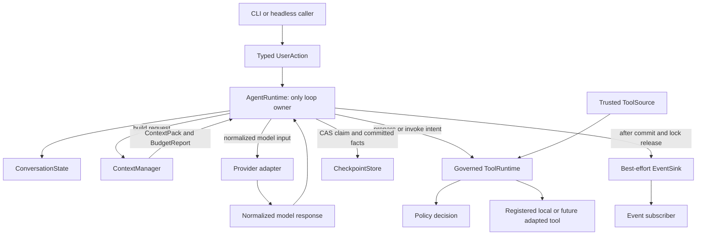
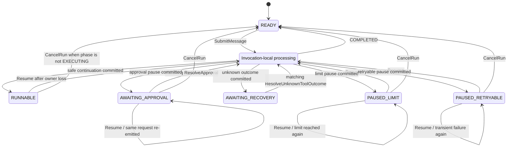

# Rebuild Minimal Runtime Kernel - Plan

## Goal Capsule

- **Objective:** Replace the current feature-entangled runtime with one small, testable Agent Runtime Kernel whose first-class context management, governed tool loop, durable pause/resume, and typed interfaces can support later capabilities without adding a second loop.
- **Authority:** This plan and the user's explicit choice of “彻底切除” govern the rebuild. Root safety and quality rules still apply. The closed S-series, productization documents, and old architecture records are evidence only and cannot restore deleted scope or force compatibility.
- **Execution profile:** Deep, destructive refactor in eight dependency-ordered units. New behavior contracts are proved before old production paths, dedicated tests, and obsolete documentation are deleted.
- **Stop conditions:** Stop if tracked dirty changes not created by the implementation are found in a target file, if a step would read or delete private runtime data, if a real provider/MCP call becomes necessary, or if replacement tests cannot prove the tool-pairing, approval, and recovery invariants before cutover.
- **Tail ownership:** The implementation workflow owns code, tests, deletion, documentation, and verification. Commit, push, tag, release, and external publishing remain outside this plan unless separately authorized.

---

## Product Contract

### Summary

`my-first-agent` keeps a local-first general Agent as its trajectory, but Kernel v1 is deliberately a smaller local task-agent foundation. Future breadth must compose through stable ports; it no longer means that Memory, Skill, MCP, SubAgent, Scheduler, TUI, Evidence, Planner, and compatibility lifecycles all participate directly in the main loop.

The rebuilt product has one mutable runtime entry, one model loop owner, one governed tool execution path, one durable conversation state, one context-selection authority, and one event protocol.
The first release after this rebuild is a minimal local task-agent Kernel foundation, not yet a broadly validated general Agent release. It provides plain CLI and headless use, text/tool turns, human approval, deterministic bounded context, checkpoint/resume, deterministic fake-provider testing, two HTTP provider protocol adapters, and a small local file-tool set. “General Agent” remains the intended trajectory, proved later by adding capabilities through the Kernel rather than by claiming breadth in v1.

### Problem Frame

The existing code contains valuable runtime semantics, but they are distributed across `agent/core.py`, `agent/loop.py`, `agent/context_builder.py`, `agent/tool_runtime_mediator.py`, `agent/tool_executor.py`, `agent/runtime_integration/`, confirmation handlers, optional capability packages, and UI bridges.
`agent/core.py` is a service locator with module-global state and pre-loop early returns; `LoopDependencies` carries optional subsystems; the Context Builder hard-codes Plan, Memory, Skill, and one provider protocol; tool governance is split across mediator, dispatcher, executor, and confirmation recovery; output travels through return strings and several event/callback systems.

Continuing to wrap or extend that shape would preserve the coupling that caused the project to become hard to reason about.
This plan therefore preserves behavior only where it is a kernel invariant, reimplements that behavior behind a small interface, and then deletes the old shape.

### Actors

- A1. **User/operator:** Sends messages, approves or rejects a specific tool action, resolves an unknown tool outcome after a crash, resumes or cancels a paused run, and sees safe events.
- A2. **Headless caller:** Drives the same typed actions and receives the same state transitions and event kinds without depending on stdin/stdout.
- A3. **CLI adapter:** Converts terminal input into typed actions and renders events/results. It owns no runtime decision.
- A4. **Model provider adapter:** Converts canonical model input into one provider protocol and normalizes the response. It cannot advance state or execute tools.
- A5. **Tool implementation:** Exposes metadata and one callable through the Tool Runtime. It cannot approve itself or write runtime state directly.
- A6. **Future extension author:** May contribute trusted tools, events, checkpoint storage, provider adapters, or an external caller, but cannot own another model loop. A future context-source seam requires separate authorization.

### Requirements

**Kernel ownership and state**

- R1. All state-changing user interactions enter through typed actions handled by `AgentRuntime.run_turn`; no CLI command, optional capability, or compatibility shortcut may advance runtime state directly.
- R2. `AgentRuntime` is the only production owner allowed to call a model provider and advance the model/tool loop.
- R3. Conversation state contains a stable `conversation_id`, monotonic revision, `next_action_seq`, `replay_floor`, bounded durable conversation facts/replay records, a reserved safety-capacity budget, optional active-run state, pending request state, tool-batch cursor, and last safe result metadata; it contains no provider client, callable, sink, registry, UI object, or optional-capability state.
- R4. Each action carries a conversation-scoped monotonic `action_seq`, canonical action digest, and expected state revision. Runtime checks replay before revision: a retained sequence with the same digest returns its recorded result; same sequence/different digest conflicts; `action_seq < replay_floor` returns expired `CONFLICT`; only `action_seq == next_action_seq` may be new; gaps conflict. Replay eviction advances `replay_floor`, so expired actions can never be mistaken for new effects.
- R5. `conversation_id` remains stable across messages; `run_id` remains stable across approval/recovery/limit/retry pauses for one logical run; each invocation of `run_turn` receives a new `invocation_id` and fresh invocation budget.

**First-class context management**

- R6. A Context Manager is the sole authority over what the model sees. It consumes canonical state, current action, visible tool specifications, and provider limits, then returns an immutable Context Pack plus a Budget Report. Kernel v1 has no executable Context Contributor plugin surface.
- R7. The Context Pack always reserves output capacity and accounts for system policy, current input, bounded history, pending facts, tool schemas, and tool results under one input budget.
- R8. System policy, current user action, unresolved approval/recovery facts, the active tool batch, and the most recent relevant tool results are pinned core blocks and cannot be evicted.
- R9. Assistant tool calls and their tool results are indivisible context units. Context reduction cannot split a multi-call assistant response from completed results or lose the cursor for unresolved results.
- R10. Context reduction in Kernel v1 is deterministic: clip oversized tool results, exclude oldest non-pinned atomic groups, and rebuild once. It never calls or requests a provider-generated summary. If pinned core plus output reserve cannot fit, Runtime returns a typed limit result before a provider call. Semantic compaction is deferred until real context-pressure evidence requires it.
- R11. Provider serialization belongs to provider adapters. Canonical facts retain only protocol-neutral continuity IDs required for tool-result turns; v1 adapters reject provider modes that require opaque reasoning/encrypted continuity metadata. UI events, checkpoint objects, and raw optional-capability objects never enter model context.
- R12. Every Context build produces included, excluded, clipped, and estimated-token metadata. Oversized tool output is reduced according to the Tool Result policy before it can consume the entire context.

**Governed tools and human authority**

- R13. Every model-requested tool follows one path: resolve `ToolSpec`, validate schema, evaluate `ALLOW | DENY | REQUIRE_APPROVAL`, prepare an immutable `ExecutionIntent`, persist the matching `EXECUTING` record, invoke at most once, normalize `ToolResult`, persist the fact, and rebuild context. Preparing an intent never invokes the callable.
- R14. `ToolSpec` includes name, version/identity digest, description, input schema, risk, side-effect class, output policy, approval policy, and tool-specific safety policy. Policy decisions use structured metadata, not tool-name string guessing. Kernel v1 has no hidden-tool or capability-routing branch.
- R15. `DENY` and user rejection execute no callable, create provider-visible Tool Results, and allow the model to choose a safer alternative. File-tool policy unconditionally denies `.env*`, credential/key material, VCS credential stores, protected state/config paths and inode aliases, and configured private roots for both read and listing; denied names/content never enter Tool Results, events, checkpoints, or provider context.
- R16. An approval request binds request ID, run ID, tool-call ID, ToolSpec/policy identity, normalized-arguments digest, tool-specific target/precondition/new-content digest, risk/effect preview, and state revision. Approval is one-time, exact-scope human authority and cannot override a newly evaluated `DENY`; any implementation, policy, path identity, or precondition change requires a new request. The CLI must show tool name, safe canonical argument/change preview, risk/effect, short request ID, and rejection semantics before accepting an explicit ID-bound decision.
- R17. A provider may return several tool calls, but Kernel v1 processes them serially in provider order. The first approval pause stores the batch cursor; later calls are neither gated nor executed until resume reaches them.
- R18. Kernel v1 has no structured `request_user_input` control, `ProvideInput` action, or `AWAITING_INPUT` state. A model question is ordinary final assistant text; the user's next answer is a new `SubmitMessage`. Text accompanying tool calls is preamble, not completion. Unsupported provider control/continuity blocks fail closed and execute no tool.

**Durability, limits, cancellation, and errors**

- R19. Durable state and `RunResult` have separate status vocabularies. `COMPLETED` ends one logical run and returns the conversation to ready; it does not terminate the conversation.
- R20. Persistent active-run states are `RUNNABLE` (safe continuation owned only while the invocation lock is held), `AWAITING_APPROVAL`, `AWAITING_RECOVERY`, `PAUSED_LIMIT`, and `PAUSED_RETRYABLE`. `RUNNING` is invocation-local. A `RUNNABLE` checkpoint found after its owner disappears is resumed explicitly; it is never returned as a healthy invocation result.
- R21. `RunResult` statuses are `COMPLETED`, `AWAITING_APPROVAL`, `AWAITING_RECOVERY`, `CANCELLED`, `LIMIT_REACHED`, `CONVERSATION_LIMIT_REACHED`, `FAILED_RETRYABLE`, `FAILED_FATAL`, and `CONFLICT`. Conversation-limit is terminal for the current conversation and directs the caller to start a new one; it is not resumable invocation budget exhaustion.
- R22. `CheckpointStore.load` returns immutable state plus an opaque snapshot token/base digest exactly once to the caller before `run_turn`; Runtime never silently reloads, retries, or overwrites it. A non-blocking cross-process conversation lock is acquired before effects and held for one invocation; contention returns `CONFLICT` immediately. The initial CAS binds conversation ID, revision, and snapshot token and commits the accepted action plus `RUNNABLE` continuation before provider/tool calls. Provider calls have finite timeouts and v1 file tools are bounded, so mutation ownership cannot wait indefinitely. A loser makes zero provider/tool calls; `run_turn` returns the newest state/revision for the caller's next action.
- R23. Runtime persists a stable checkpoint before emitting an actionable approval/recovery event, after a tool result, at a limit/retry pause, on cancellation, and at logical-run completion. If the required save fails, it cannot report a durable pause.
- R24. Tool execution is a two-phase handshake: Tool Runtime prepares an immutable intent containing tool-call ID, ToolSpec identity, normalized-arguments digest, side-effect class, stable idempotency key, and tool-specific preconditions; Runtime CAS-persists the matching `EXECUTING` record; only then may Tool Runtime invoke it; Runtime then CAS-persists the bound result and cursor. CAS failure means callable count zero. A crash after `EXECUTING` persistence and before a durable result transitions on explicit resume to `AWAITING_RECOVERY`; Kernel v1 never retries it automatically.
- R25. `ResolveUnknownToolOutcome` is exact-scope human recovery authority with `MARK_SUCCEEDED | MARK_FAILED`; it binds the pending recovery request and records a provider-visible synthetic Tool Result before the run continues. Once state is `AWAITING_RECOVERY`, this exact classification is the only progressing action: neither `CancelRun` nor another `Resume` may discard or bypass the unknown effect. Caller reloads render the durable request without manufacturing an action. The Kernel does not promise exactly-once external effects or checkpoint rollback.
- R26. Invocation budgets separately cap model calls, tool calls, input tokens, and output tokens. Reaching one yields resumable `PAUSED_LIMIT`. Durable-state quotas reserve enough space for the worst-case admitted provider/tool result, recovery, cursor, terminal, and replay record; admission fails before an effect if that reserve cannot be maintained. Exhaustion yields terminal `CONVERSATION_LIMIT_REACHED`, clears the active run at a readable checkpoint, and never strands post-effect safety facts.
- R27. Kernel v1 cancellation applies only to an already durable non-recovery pause or an ownerless `RUNNABLE` continuation whose phase is not `EXECUTING`; a still-owned `RUNNABLE`, any `RUNNABLE/EXECUTING`, and `AWAITING_RECOVERY` all reject `CancelRun` with unchanged `CONFLICT`. Ownerless `RUNNABLE/EXECUTING` accepts only `Resume` to create the bound recovery request. There is no injected in-flight cancellation signal or promise to interrupt synchronous I/O/reverse effects. Adapter-local exit/interrupt never masquerades as `CancelRun`.
- R28. Tool domain errors become Tool Results; policy errors fail closed; core context/invariant/checkpoint failures are fatal; transient provider errors are retryable pauses; invalid provider output has a bounded repair allowance and then fails fatal.

**Events, interfaces, extensions, and convergence**

- R29. One typed Runtime Event protocol reports model progress, tool requests/results, approval/recovery requests, limits, warnings, completion, cancellation, and failure. State-referential events are emitted only after their CAS commit and after releasing the checkpoint lock; they carry committed revision, stable `event_id`, `run_id`, and causation. Progress without a committed fact is explicitly advisory. Events cannot mutate policy or state, and sinks cannot synchronously re-enter Runtime or submit actions.
- R30. Kernel v1 Event Sinks are best-effort, zero-or-more delivery; duplicate delivery may occur but there is no durable outbox or at-least-once guarantee. `RunResult` plus checkpoint are authoritative. Sink failure becomes `delivery_warnings` without changing the committed result. Explicit `Resume` may re-emit a pending approval request with the same request/event identity；recovery request is rendered directly from authoritative `AWAITING_RECOVERY` state and only exact resolution is legal. Other missed events are not replayed automatically, and consumers deduplicate by `event_id`.
- R31. CLI and headless calls have action/state/event parity. The v1 CLI is one REPL: new in-memory conversation by default with a non-durable warning. `--state PATH` is create-only (`O_EXCL`, target must be missing); `--resume PATH` is load-only (target must exist and be exact v1); the flags are mutually exclusive and every mismatch exits nonzero without mutation. Reserved commands are `/approve ID`, `/reject ID`, `/resolve-success ID`, `/resolve-failed ID`, `/resume`, `/cancel`, and `/exit`; normal text is accepted only in `READY`. `/exit`, EOF, and idle Ctrl-C exit without cancelling. Events uniquely own progress/actionable/warning rendering; `RunResult` uniquely owns final assistant text and terminal status. Event replay deduplicates by ID. `CONFLICT` exits the stale loop with restart guidance, retryable pauses offer `/resume`, conversation-limit directs a new conversation, and fatal/load failures exit nonzero without overwrite. The CLI never calls tools or writes checkpoints directly.
- R32. Kernel v1 supports operator-trusted, explicitly composed Python `ToolSource`, `EventSink`, `CheckpointStore`, provider adapters, and external callers of `run_turn`; these are architecture seams, not a sandbox, and there is no dynamic discovery/loading of untrusted Python. Future Memory needs a separately authorized immutable context-source seam; Skill/MCP/SubAgent must enter as governed tools; Scheduler remains an external caller; TUI remains an action/event adapter; Evidence remains an event subscriber. Extensions may not own another loop or durable cursor. Untrusted extension isolation/RPC and credential separation are deferred to a separate security design.
- R33. Fake and real providers share the same Context Manager, Agent Runtime, Tool Runtime, policy, checkpoint, and event path. A fake may replace only an injected port.
- R34. After replacement behavior and architecture tests pass, all old optional capability code, old orchestration, compatibility paths, dedicated tests, sample skills, tracked TUI code, productization governance, and obsolete docs are deleted. Git history is the only preservation; no `legacy/`, new archive, dormant feature flag, or second runtime remains.
- R35. U8 deletes only exact tracked files from an immutable, repo-relative, NUL-safely generated manifest pinned to a reviewed baseline Git object, blob ID, and mode. Immediately before deletion every entry must still be tracked, unchanged, and non-traversing; any dirty/mode/path mismatch stops the unit. Deletion walks from an opened repository root through no-follow directory descriptors, revalidates the final entry, and unlinks relative to its parent descriptor; directory-recursive deletion, parent/final symlink traversal, and enumeration or content reads of ignored/untracked children are prohibited. The cutover must not read or delete `.env`, real config, logs, sessions/runs, real Memory data, real MCP/Skill/SubAgent directories, `.ua/`, or other ignored/private runtime artifacts.
- R36. The new local POSIX-filesystem store uses an explicit path outside every tool workspace and never discovers, migrates, overwrites, or deletes legacy state. Its directory is mode `0700`; state/lock/temp files are owned by the current user, link-count one, mode `0600`, opened no-follow, and replaced atomically. Protected device/inode identities are denied to file tools even through hard-link aliases. Load outcomes distinguish missing, malformed/truncated, semantic invariant violation, and unsupported version/schema; only missing may create ready state, every other failure leaves original bytes unchanged, and unknown fields fail closed. The load snapshot digest is a CAS token for change detection, not a cryptographic authenticity claim.
- R37. Package dependencies form a one-way DAG: leaf contracts import no loop or adapters; the state reducer imports only leaf types; ports depend only on leaf types; context and tool domains implement their own semantics behind ports; the loop imports ports; concrete provider/checkpoint/event/tool adapters import ports, never the loop; CLI/composition root alone assembles them. `contracts.py` is not a miscellaneous dependency bucket.

### State and Action Contract

Persistent state and invocation result are intentionally separate:

| Persistent `active_run` | Meaning | Legal progressing actions |
|---|---|---|
| absent (`READY`) | No logical run is paused | `SubmitMessage` |
| `RUNNABLE` | Safe continuation is owned or was interrupted | owner continues；after owner loss: phase `EXECUTING` only `Resume`, other phases `Resume` / `CancelRun` |
| `AWAITING_APPROVAL` | Exact tool request awaits human authority | `ResolveApproval`, `Resume`, `CancelRun` |
| `AWAITING_RECOVERY` | Unknown tool outcome awaits human classification | matching `ResolveUnknownToolOutcome` only |
| `PAUSED_LIMIT` | Invocation budget ended with work preserved | `Resume`, `CancelRun` |
| `PAUSED_RETRYABLE` | Provider/transient failure ended at a safe point | `Resume`, `CancelRun` |

All states allow idempotent replay of a retained processed `action_seq` with the same action digest; sequences below `replay_floor` fail closed as expired `CONFLICT`.
Every other action/state combination returns `CONFLICT` without effects.
`Resume` on an approval wait re-emits the same pending request and does not approve, call the model, or execute a tool；on `AWAITING_RECOVERY` it is illegal，because reload already exposes the durable request and only exact classification may progress.

### Key Flows

- F1. **Normal text or tool turn**
  - **Trigger:** A1 or A2 submits a non-empty message against the current revision while the conversation is ready.
  - **Steps:** Runtime records the user fact, builds bounded context, calls the provider, persists the assistant response, serially resolves any tools through governance, rebuilds context after results, and stops only on final text or a defined pause/error.
  - **Outcome:** The logical run returns `COMPLETED`, or a typed resumable/failure status with no hidden second path.
  - **Covers:** R1-R15, R17-R21, R26, R28-R33.

- F2. **Approval pause and continuation**
  - **Trigger:** Policy returns `REQUIRE_APPROVAL` for the current tool-call cursor.
  - **Steps:** Runtime stores the exact request and cursor, checkpoints, emits the approval event, and returns. A matching approval/rejection is consumed once, policy is re-evaluated, the Tool Result is recorded, and the same run continues.
  - **Outcome:** No tool runs before approval; rejection and stale/replayed decisions never execute; the model sees the result.
  - **Covers:** R13-R17, R22-R24, R29-R31.

- F3. **Unknown tool-outcome recovery**
  - **Trigger:** Explicit `Resume` finds an `EXECUTING` intent without a durable result after the previous owner disappeared.
  - **Steps:** Runtime CAS-transitions to `AWAITING_RECOVERY`, checkpoints and emits the bound recovery request. Reload renders that request directly from authoritative state. A matching `ResolveUnknownToolOutcome` records the operator's success/failure classification as a synthetic Tool Result, advances the cursor once, and continues the same run；`Resume`/`CancelRun` at this state both return unchanged conflict.
  - **Outcome:** Unknown effects are never repeated automatically or silently treated as success; the transcript regains a complete tool-call/result pair under explicit human authority.
  - **Covers:** R20-R25, R29-R31.

- F4. **Limit, retry, cancel, and interrupted continuation**
  - **Trigger:** Runtime reaches an invocation limit, gets a transient provider error, cancels a durable pause, or reloads a `RUNNABLE` continuation whose owner disappeared.
  - **Steps:** Runtime persists the corresponding safe state/result. Explicit resume continues only from the recorded phase; a repeated provider request after a pre-response crash is allowed and does not claim billing-level exactly-once behavior.
  - **Outcome:** Work is preserved without false completion, hidden reload, or fake rollback.
  - **Covers:** R22-R30, R36.

- F5. **Destructive convergence**
  - **Trigger:** The new headless, CLI, provider, tool, context, approval, checkpoint, and architecture suites are green and the production entry points use only the new Kernel.
  - **Steps:** Delete the old paths and their dedicated tests, rewrite the small authoritative documentation set, refresh the generated graph, and run all quality gates.
  - **Outcome:** The repository has one live runtime and no compatibility or archive-based shadow architecture.
  - **Covers:** R32-R37.

### Acceptance Examples

- AE1. **Text-only completion:** Given a ready conversation and a FakeProvider final-text response, when `SubmitMessage` is handled, then the provider is called once, a final assistant fact is stored, the active run clears, and the result is `COMPLETED`.
- AE2. **Approval integrity:** Given a write tool requiring approval, when the first invocation reaches it, then callable count is zero and state is durable `AWAITING_APPROVAL`; only a matching fresh approval executes it once.
- AE3. **Approval conflict:** Given an approval with the wrong request ID, argument digest, run ID, revision, or a replayed action sequence, when it is handled, then the result is `CONFLICT` or idempotent replay as appropriate and callable count does not increase.
- AE4. **Three-call batch:** Given three tool calls where the second requires approval, when the batch runs, then the first completes once, the third does not start before the second is resolved, and the next model call sees results in declaration order.
- AE5. **Pause-before-event:** Given an approval or recovery request, when checkpoint CAS fails, then no actionable event is emitted and the result is fatal; after a successful commit, sink failure changes only `delivery_warnings`.
- AE6. **Context pressure:** Given history, large tool output, and many tool definitions, when context builds, then pinned facts remain, older atomic groups are deterministically excluded, output reserve remains intact, and Budget Report explains every decision.
- AE7. **Crash window:** Given a restored tool call marked `EXECUTING` without a result, when `Resume` is handled, then state becomes durable `AWAITING_RECOVERY`, callable count stays zero, and only a matching `ResolveUnknownToolOutcome` records a synthetic result and advances the cursor.
- AE8. **CLI/headless parity:** Given the same initial state and typed actions, when driven through the CLI adapter and a headless caller, then state revisions, result statuses, and event kinds match and user-visible assistant text is not duplicated.
- AE9. **Cutover proof:** Given U1-U7 are green, when U8 finishes, then production imports contain no old loop/dispatcher/optional-capability paths, tracked legacy tests and docs are absent, and the full new suite passes without reading private artifacts or making real external calls.
- AE10. **Concurrent ownership:** Given two processes loaded revision N and race the same conversation behind a barrier, when both call `run_turn`, then exactly one commits mutation ownership; the loser returns `CONFLICT` and its provider/tool counters remain zero.
- AE11. **Checkpoint integrity:** Given synthetic malformed, semantically invalid, unsupported-version, or unknown-field files, when Kernel v1 loads them, then it returns the typed failure, performs no event/provider/tool call, and leaves the file byte-identical.
- AE12. **Event delivery failure:** Given a sink throws or attempts synchronous re-entry after a committed approval pause, when `run_turn` returns, then the pause/revision remain authoritative, the result contains a delivery warning, and `Resume` re-emits the same deduplicable request without another provider/tool call.
- AE13. **Exact destructive cutover:** Given a pinned manifest fixture containing tracked targets, an ignored sentinel, an untracked sentinel, and a symlink, when deletion runs, then only unchanged exact tracked targets are removed; a changed target stops the unit and no sentinel or symlink target is read or modified.
- AE14. **Representative user journey:** Given a fresh REPL, FakeProvider, injected workspace, and explicit state file outside that workspace, when the operator asks to inspect and edit a file, restarts at approval, resumes, sees the bound preview, approves, and continues, then the file changes once, the final answer is shown once, and the conversation remains usable.

### Scope Boundaries

**Included in Kernel v1**

- Plain headless Python use and a plain terminal CLI.
- Non-streaming provider calls only; streaming is absent from Kernel v1.
- Deterministic FakeProvider plus `anthropic_compatible` and `openai_compatible` HTTP adapters behind one protocol.
- Local `read_file`, `list_files`, `write_file`, and `edit_file`; writes/edits always require explicit approval in v1.
- Deterministically bounded context, durable pause/resume/recovery, sequential tool batches, and safe Runtime Events.

**Removed and deferred for later reimplementation**

- Long-term Memory, Memory consolidation/extraction/review, Skill selection/lifecycle/install/update, MCP, SubAgent, Scheduler/DAG execution, separate Planner/Plan confirmation, task ledger, productization evidence system, Textual/Node TUI, capability-status/maintenance surfaces, demo skills/tools, web fetching, and durable audit products.
- Semantic/provider-generated compaction, structured user-input control, executable Context Contributors, streaming, shell execution, in-flight cancellation, parallel tool execution, concurrent approvals, server/deployment APIs, remote checkpoint backends, cost accounting, durable event delivery, state migration, and exactly-once external side effects.
- Old Python interfaces, old non-core CLI commands/options, old checkpoint schemas, and historical productization ratings.

### Success Criteria

- One public runtime mutation entry and one production provider-call owner exist.
- Context budget behavior, deterministic clipping/eviction, tool-call/result atomicity, pending facts, and exclusion reasons are covered by behavior tests.
- Read-only, denied, approval, rejection, stale/replayed approval, multi-call cursor, tool failure, and unknown-outcome paths are covered without a second executor.
- Cross-process mutation ownership, checkpoint token/CAS, typed invalid-state outcomes, pause-before-event ordering, best-effort delivery failure, interrupted continuation, unknown-outcome recovery, limits, retryable failures, paused-run cancellation, and strict schema rejection are covered.
- CLI and headless paths produce equivalent actions, statuses, and event kinds using FakeProvider.
- AE14's inspect/edit/approval/restart journey passes end to end; this proves a Kernel foundation, not real-provider dogfood or a broad general-Agent release.
- Four selected local file tools and both HTTP protocol adapters satisfy their contracts without real network calls; shell execution is not part of Kernel v1.
- Old orchestration, optional capability packages, compatibility callbacks, tracked TUI, dedicated legacy tests, and obsolete docs are absent after cutover.
- `git diff --check`, Ruff, the focused Kernel/provider/tool/CLI suites, and the complete pytest suite all pass.

---

## Planning Contract

### Key Technical Decisions

- KTD1. **Replace the runtime; do not wrap it** `(session-settled: user-directed — chosen over legacy isolation: the user chose option 1, “彻底切除”)`. `AgentRuntime.run_turn` must directly own the provider/context/tool/checkpoint/event workflow. Calling `core.chat()` from the new Runtime is prohibited.
- KTD2. **Git history is the only legacy preservation** `(session-settled: user-directed — chosen over a legacy directory or feature flags: the user explicitly accepted destructive convergence)`. Old tracked code, tests, TUI, and docs are deleted after replacement proof; private ignored runtime data is never part of that deletion.
- KTD3. **Context management is Kernel, long-term Memory is not** `(session-settled: user-approved — chosen after the user raised context-management risk: every turn needs bounded working context even when Memory is absent)`. Context selection, budgeting, tool-result clipping, deterministic atomic-group eviction, and pending-fact preservation stay first-class; provider-generated semantic compaction does not.
- KTD4. **Canonical facts are durable; Context Packs are projections.** Conversation state stores normalized facts and active-run state. Context Manager selects a view; provider adapters serialize it; Runtime Events present it. None of those projections is written back as the source of truth.
- KTD5. **One typed action/state machine replaces string-driven branches.** `SubmitMessage`, `ResolveApproval`, `ResolveUnknownToolOutcome`, `Resume`, and `CancelRun` have an explicit legality matrix, replay-before-revision checks, and action deduplication. CLI exit remains adapter-local because it is not a runtime action.
- KTD6. **Tools are sequential and governed in Kernel v1.** Multiple provider tool calls use a persistent cursor and are processed in declaration order. This is simpler to reason about, prevents mutation races, and leaves concurrency for a future external scheduler or Tool Runtime policy.
- KTD7. **Human approval is exact-scope and cannot be delegated.** Agents and extensions may request approval but cannot submit it. Approval binds normalized action, ToolSpec/policy identity, target preconditions, and intended new content; any change invalidates it before execution.
- KTD8. **Context reduction is deterministic in Kernel v1.** Context Manager clips oversized results and evicts oldest non-pinned atomic groups; if the core cannot fit, Runtime stops before a provider call. Semantic/provider-generated summaries are deferred until real pressure proves this insufficient.
- KTD9. **Checkpoint load and save ownership are distinct.** Caller/adapter loads immutable state plus a snapshot token once; `run_turn` receives both; Runtime alone coordinates token/revision CAS saves and returns the newest revision. Runtime cannot consume store internals as a hidden reload or silently retry a conflict.
- KTD10. **Tool effects use prepare-persist-invoke-persist ordering.** Tool Runtime prepares an immutable intent without invocation. Runtime persists `EXECUTING` before invocation and the result afterward. Missing results enter `AWAITING_RECOVERY`; only exact-scope human classification may synthesize the result and continue. Checkpoints cannot transact or roll back arbitrary external effects.
- KTD11. **Events observe committed transitions with best-effort delivery.** Actionable events follow successful persistence and lock release. Stable identity supports deduplication/re-emission; sink failure is a delivery warning and cannot change policy or destroy state. Checkpoint plus `RunResult`, not the sink, are authoritative.
- KTD12. **Kernel v1 is non-streaming only.** Current `stream -> tool request -> create` behavior can issue a silent second model call, so the streaming path is deleted rather than conditionally retained.
- KTD13. **Keep a small local tool and provider adapter surface.** Fake plus two HTTP protocol families and four workspace-scoped file tools prove the local task-agent Kernel, not broad product generality. Shell is deliberately deferred because its side effects and cancellation/crash semantics are too broad for the minimal baseline. SDK-native facades, legacy provider clients, web tools, demo/meta tools, and capability-specific tools are removed.
- KTD14. **Use plain Python composition, not a framework migration.** Constructor-injected protocols and typed data are sufficient. LangGraph or another orchestration framework would add a migration while the immediate problem is ownership and boundaries.
- KTD15. **Freeze a dependency DAG and semantic owners.** State reduction owns legal transitions; Context Manager owns projection/budgeting; Tool Runtime owns prepare/policy/invocation; provider adapters own wire translation; CheckpointStore owns durable CAS mechanics; AgentRuntime owns only effect ordering. Leaf contracts and ports may not import adapters or the loop.
- KTD16. **Serialize each conversation before effects with bounded ownership.** A fail-fast cross-process guard plus initial token/revision CAS prevents stale contenders from calling provider/tools. Provider timeouts and bounded v1 tools cap ownership; only Runtime advances the durable cursor. Kernel v1's durability guarantee is scoped to supported local POSIX filesystems, not network filesystems or arbitrary platforms.
- KTD17. **Fail closed on storage ambiguity and isolate namespaces.** Kernel v1 accepts only its exact schema at an explicit protected path outside tool workspaces. Missing is distinct from invalid or unsupported state. No automatic discovery, quarantine, migration, overwrite, or authentication claim is allowed.

### High-Level Technical Design





`PROCESS` is invocation-local; every effect is preceded by a durable `RUNNABLE` continuation. A fail-fast store-backed mutation guard and initial snapshot-token CAS establish the sole owner before provider/tool effects. After owner loss, the persisted phase makes explicit `Resume` legal; it is not reported as a healthy `RUNNING` result.

The tool-batch boundary is a half-open durable transaction: the assistant response and all call descriptors are stored before execution; Tool Runtime prepares an immutable intent; Runtime persists `EXECUTING`; Tool Runtime invokes; Runtime persists the result against the cursor. The next provider request is not built until every call has a result or the run is paused.

### Output Structure

```text
agent/
  runtime/
    __init__.py
    contracts.py
    state.py
    ports.py
    context.py
    tools.py
    loop.py
    checkpoint.py
    events.py
  provider/
    protocol.py
    config.py
    factory.py
    normalize.py
    fake_provider.py
    anthropic_http.py
    openai_http.py
  tools/
    file_ops.py
    write.py
    edit.py
    path_safety.py
  cli/
    __init__.py
    app.py
    render.py
main.py
tests/
  kernel/
  provider/
  tools/
  cli/
  architecture/
docs/
  architecture/
    KERNEL_ARCHITECTURE.md
    EXTENSION_CONTRACTS.md
  plans/
```

The exact internal class/file split may tighten during implementation, but the ownership boundaries and deleted scope may not expand or invert without user approval.

### Replacement and Deletion Map

| Keep as behavior, not shape | New owner | Old tracked paths removed after proof |
|---|---|---|
| Provider-neutral blocks/response and Fake/Real parity | `agent/provider/protocol.py`, `agent/runtime/loop.py` | `agent/model_call.py`, `agent/provider/legacy_adapter.py`, SDK facade and streaming fallback code |
| Tool-call/result pairing and model-valid ordering | Context Manager + canonical tool-batch facts | `_project_to_api` repair/placeholder behavior and response-handler pairing code |
| Risk, confirmation, capability, visibility, output-policy metadata | `agent/runtime/tools.py` | `agent/tool_registry.py`, `agent/tool_runtime_mediator.py`, `agent/tool_executor.py`, dispatcher tool handlers |
| Revisioned checkpoint, schema rejection, bounded tool output | `agent/runtime/checkpoint.py` | `agent/checkpoint.py`, checkpoint integration handlers, optional-capability checkpoint sections |
| Runtime-to-interface event separation | `agent/runtime/events.py` | `DisplayEvent`, old RuntimeEvent, trace, observer, evidence, and callback bridges |
| Explicit injected dependencies | `AgentRuntime` construction | module-global `core.state`, import-time prompt refresh, `LoopContext`, `ConfirmationContext`, giant `LoopDependencies` |
| Bounded recent-history projection | `agent/runtime/context.py` | Memory runtime/extraction/consolidation/review packages and prompt injection |
| Thin interface adapter | `agent/cli/`, `main.py` | tracked Node TUI, Textual backends, maintenance/meta-command shortcuts, CLI capability routing |

Deletion groups in U8 include the old runtime files, all of `agent/runtime_integration/`, `agent/confirmation/`, Memory/Skill/MCP/SubAgent/Scheduler/Planner/task-ledger/evidence modules, sample `skills/`, tracked `tui/`, old provider compatibility modules, old dedicated tests, `docs/current/`, `docs/history/`, and `docs/archive/`.
Only the explicitly retained provider adapters, local tools, new runtime, new tests, README, root instructions, and two architecture documents remain live.

### System-Wide Impact

- **Users:** Lose plan confirmation, Memory, Skill, MCP, SubAgent, Scheduler, Textual TUI, maintenance/status commands, and historical CLI options. They receive a fresh-start local task-agent REPL with multi-turn text/file tools, exact approval, recovery, and resume; old state is neither discovered nor migrated.
- **Library callers:** Must replace `agent.core.chat()` and global-state access with typed actions and explicit state/dependencies. Breaking changes are intentional.
- **Providers:** Use one normalized non-streaming baseline. Provider-specific request formatting remains isolated; no adapter may create a second loop.
- **Tools:** Selected local functions remain, but registration and policy move to the new Tool Runtime. Direct invocation from handlers is removed.
- **Persistence:** Kernel v1 reads only an explicit protected v1 state path and accepts only its exact schema. It does not discover, validate, migrate, quarantine, overwrite, or delete old/private checkpoints. Git rollback covers tracked code/docs only, never new runtime state.
- **Testing:** Large source-shape/import-inventory and capability-specific suites disappear after replacement contract tests pass. Architecture tests enforce boundaries, not an exhaustive module snapshot.
- **Documentation:** Old maturity claims and staged governance are deleted instead of archived again. README, AGENTS, Kernel architecture, extension contract, and this plan form the small authority set.

### Risks and Mitigations

| Risk | Mitigation |
|---|---|
| Deleting behavior that looked optional but carries a kernel invariant | Map each preserved invariant to an acceptance example and new test before deleting its old owner; keep old code as oracle only until U8 gates are green. |
| Recreating a new monolith in `loop.py` | Keep state transitions, context projection, tool governance, checkpoint I/O, and event delivery behind separate deep interfaces; test ownership boundaries with AST/import tests. |
| Context reduction loses instructions or tool pairs | Pin core blocks, evict only complete non-pinned atomic groups, store a Budget Report, and fail before provider call when the pinned minimum cannot fit. |
| Approval replay or stale state causes a side effect | Bind approval to request/call/digest/revision, use action dedupe and CAS, re-evaluate policy before execution, and fail closed. |
| Two stale callers both create effects before a late CAS | Acquire a cross-process mutation guard and commit the action/safe continuation before provider/tool calls; concurrency tests require the loser to make zero external calls. |
| Crash window duplicates an external effect | Use prepare → persist `EXECUTING` → invoke → persist result; transition any persisted-without-result intent to `AWAITING_RECOVERY`, never auto-retry it, and require exact-scope human classification. |
| Corrupt or non-v1 state is mistaken for a new conversation | Use an explicit protected path, version-first strict decoding and typed load failures; never overwrite a non-missing failure. |
| Sink failure is mistaken for runtime failure or durable delivery | Emit outside the store lock, return delivery warnings, retain stable IDs for deduplication, and make checkpoint plus `RunResult` authoritative. |
| Provider continuity needs opaque state the Kernel discards | Reject unsupported reasoning/encrypted continuity modes and round-trip both retained HTTP tool-result protocols through checkpoint fixtures. |
| Approved file path changes before invocation | Bind ToolSpec/path/precondition/content digests, resolve relative to an opened workspace root without symlinks, reject multi-link mutation targets, and require fresh approval on mismatch. |
| Checkpoint is exposed through file tools or loose permissions | Require state path outside workspaces, deny runtime/config roots, create `0700`/`0600` objects with no-follow opens, and test overlap/symlink/umask cases. |
| Durable state grows without bound | Configure maximum checkpoint/fact/replay sizes; return a typed limit requiring a new conversation rather than silently pruning active recovery facts. |
| New and old runtimes coexist indefinitely | U8 has a hard prerequisite and an absence test; no feature flag, fallback, compatibility package, or `legacy/` is permitted after cutover. |
| Destructive glob or TOCTOU reaches user/private data | Pin an exact tracked-file manifest to baseline blob/mode, revalidate immediately, delete files non-recursively without following symlinks, and stop on any mismatch. Test ignored/untracked sentinels in a temporary fixture. |
| Current Ruff scans untracked `.ua/` generated code | Add explicit tool exclusions for ignored/generated/private directories instead of deleting user-owned `.ua/`. |
| Packaging omits new subpackages | Replace the fixed `packages = ["agent"]` declaration with package discovery and verify the installed console entry in an isolated local environment. |

### Sources and Research

Repo evidence that shapes the plan:

- `agent/core.py:781`, `agent/core.py:1346`, `agent/core.py:1795`, `agent/core.py:1900` — global entry, separate planner call, loop façade, and model-call/tool-visibility coupling.
- `agent/loop.py:678`, `agent/loop.py:940` — explicit-dependency pattern and optional-subsystem intrusion into the loop.
- `agent/context_builder.py:64`, `agent/context_builder.py:208` — real tool-pairing protocol bug fixes and the existing state-to-model projection seam.
- `agent/state.py:101`, `agent/state.py:192`, `agent/state.py:277` — runtime, conversation, Memory, and Task fields mixed into one state schema.
- `agent/tool_registry.py:13`, `agent/tool_runtime_mediator.py:187`, `agent/tool_executor.py:204` — useful ToolSpec/governance semantics split across deep, coupled owners.
- `agent/checkpoint.py:127`, `agent/checkpoint.py:305`, `agent/checkpoint.py:486` — bounded results and schema guards mixed with optional-capability persistence.
- `agent/provider/protocol.py:50` — the strongest existing thin interface.
- `main.py:52`, `main.py:195`, `main.py:659` — two UI paths, partial adapter extraction, and an oversized application entry.
- `tests/test_context_builder.py`, `tests/test_tool_pairing.py`, `tests/test_checkpoint_roundtrip.py`, `tests/test_provider_contract.py` — behavioral oracles to translate, not preserve wholesale.
- `docs/current/PRODUCTIZATION_ROADMAP.md:48` and `docs/current/PRODUCTIZATION_RELEASE_SUMMARY.md:24` — contradictory maturity authority that justifies documentation convergence.
- Git history around `c730a55`, `e7895e8`, `6714ce7`, `b759e62`, `bcaacec`, `0c2f21c`, `d465385`, and `d10abdb` — repeated extraction and repair of context, provider pairing, checkpoint, pending-tool, and policy boundaries.

External primary sources that shape the ownership model:

- [OpenAI Agents SDK: Running agents](https://openai.github.io/openai-agents-python/running_agents/) — a central Runner owns model calls, tool execution, continuation, turn limits, state strategy, and model-input filtering.
- [LangGraph overview](https://docs.langchain.com/oss/python/langgraph/overview) — separates low-level orchestration runtime from higher-level agent harness and observability products; this plan keeps those layers separate without adopting LangGraph.
- [Claude Agent SDK: Agent loop](https://code.claude.com/docs/en/agent-sdk/agent-loop) — treats system/tool/history/output as shared context budget, compacts older history, scopes tool permissions, and feeds rejection back as tool results.
- [MCP architecture](https://modelcontextprotocol.io/docs/learn/architecture) — MCP discovers typed tool metadata and calls tools through a client; it supports the future mapping of MCP to a ToolSource/adapter instead of a second Runtime.

The repository has no `CONCEPTS.md`, `docs/solutions/`, or critical-patterns corpus. No institutional-learning claim is inferred from absent files.

---

## Implementation Units

### U1. Establish the authorized rebuild boundary

- **Goal:** Make this plan executable under repo governance and freeze the old behaviors that are oracles versus the capabilities that will be deleted.
- **Requirements:** R34-R35; F5; AE9, AE13.
- **Dependencies:** None.
- **Files:** Modify `AGENTS.md`; inspect `README.md`; use `docs/plans/2026-07-18-001-refactor-minimal-runtime-kernel-plan.md` as the new direction authority; no production source deletion yet.
- **Approach:** Replace the now-conflicting “preserve existing architecture / no broad refactor” rule with a narrow rebuild authorization that points to this plan, preserves safety and Red/Green gates, forbids private-data deletion, and makes U8 conditional on replacement proof. Require an exact tracked-file manifest pinned to the cutover baseline blob/mode, non-recursive deletion, stop-on-dirty behavior, and Graphify execution only after its inputs are proven to exclude private/ignored paths. Do not create an archive, legacy package, feature flag, or compatibility goal.
- **Patterns to follow:** Existing AGENTS precedence that user instructions authorize new direction; existing Red-first and quality-gate rules.
- **Test scenarios:** None; this is a governance-only unit. Verification is a contradiction scan showing that a coding agent can follow this plan without violating another live instruction.
- **Verification:** Root instructions identify this plan as the authorized new direction, keep the safety boundaries, and do not present closed S/productization docs as current routing authority.

### U2. Define Kernel contracts and state transitions

- **Goal:** Create the small typed vocabulary that all later units share, with no implementation dependency on the old Runtime.
- **Requirements:** R1-R5, R19-R22, R24-R28, R31, R33, R37; F1, F3-F4; AE1, AE3, AE7, AE10.
- **Dependencies:** U1.
- **Files:** Create `agent/runtime/__init__.py`, `agent/runtime/contracts.py`, `agent/runtime/state.py`, `agent/runtime/ports.py`, `tests/kernel/test_contracts.py`, `tests/kernel/test_state_transitions.py`, `tests/kernel/test_action_legality.py`, and `tests/architecture/test_dependency_dag.py`.
- **Approach:** Define narrow leaf types for actions, immutable loaded snapshots, durable conversation/active-run facts, tool-batch cursor, pending approval/recovery records, bounded replay records, limits/errors, Runtime Event envelope, and RunResult. Put injected behavior protocols in `ports.py`, not durable contracts. The pure state reducer owns action legality, replay-before-revision checks, safe continuation phases, recovery resolution, and terminal clearing; CLI handlers do not. `RUNNING` remains invocation-local while `RUNNABLE` is the persisted next-effect phase. Freeze the package DAG before domain implementations appear.
- **Execution note:** Write the state/action matrix tests first and confirm they fail because the new contracts do not exist. Do not implement compatibility constructors from `agent.state.AgentState`.
- **Patterns to follow:** Frozen provider response blocks in `agent/provider/protocol.py`; explicit status/invariant helpers in `agent/state.py`, without copying its mixed Task/Memory schema.
- **Test scenarios:**
  1. Ready plus non-empty `SubmitMessage` creates one run, increments revision, and records the action.
  2. Every legal state/action pair in the Product Contract succeeds; every illegal pair returns `CONFLICT` with unchanged state.
  3. Same-sequence/same-digest replay returns the original result before revision checking; same-sequence/different-digest, skipped sequence, unseen stale action, and sequence below `replay_floor` conflict without effects.
  4. Completion clears active run while a later new message remains legal in the same conversation.
  5. Runtime dependencies/callables/provider objects cannot serialize as conversation state.
  6. Contracts, state, and ports obey the declared dependency DAG and `contracts.py` contains no service implementation or adapter import.
  7. Every `EXECUTING` continuation can transition only to a bound result or `AWAITING_RECOVERY`; Cancel leaves state unchanged. Each exact recovery resolution restores tool-call/result pairing once，and `AWAITING_RECOVERY` itself cannot be cancelled/resumed around classification.
- **Verification:** Tests prove one unambiguous state machine and one acyclic package direction before any model, tool, CLI, or checkpoint implementation is added.

### U3. Build the first-class Context Manager

- **Goal:** Make model-visible context a budgeted, inspectable projection of canonical state, independent of long-term Memory and provider wire format.
- **Requirements:** R6-R12, R28, R37; F1; AE6.
- **Dependencies:** U2.
- **Files:** Create `agent/runtime/context.py`, `tests/kernel/test_context_manager.py`, and `tests/kernel/test_context_budgeting.py`. Add provider-neutral model-input types to new leaf contracts; do not modify the old provider path before U7 cutover.
- **Approach:** Implement pinned core blocks, atomic conversation/tool groups, deterministic priority rules, tool-schema budget, output reserve, bounded result projection, Budget Report, and oldest-non-pinned-group eviction. Context Manager never calls a provider, requests semantic compaction, loads plugins, or mutates durable state. Provider adapters later own wire serialization.
- **Execution note:** Translate the invariants behind `tests/test_context_builder.py`, `tests/test_api_projection.py`, and `tests/test_tool_pairing.py`; do not port Plan/Skill/Memory prompt text or placeholder-repair implementation.
- **Patterns to follow:** State-to-model projection boundary in `agent/context_builder.py`; checkpoint result-size controls in `agent/checkpoint.py`.
- **Test scenarios:**
  1. System policy, current input, pending approval/recovery, active batch, and recent result survive pressure from history.
  2. Output reserve and total input budget are never exceeded under a deterministic estimator.
  3. A multi-call assistant response and corresponding results are included or excluded atomically; unresolved cursor data is pinned.
  4. Large tool output is deterministically clipped with preview/hash/size/reason metadata; no semantic summarizer is called.
  5. UI events/checkpoint objects never appear in the Context Pack.
  6. Eviction is deterministic, never splits a pinned/tool atomic group, and reports every excluded block.
  7. Core minimum larger than provider capacity fails before any provider call.
- **Verification:** A caller can inspect exactly why each block was included, clipped, or excluded, and Context behavior remains complete with no Memory/Skill/MCP package installed.

### U4. Build the governed Tool Runtime

- **Goal:** Collapse registry, policy, approval preparation, two-phase invocation, result normalization, idempotency, and batch progression into one deep tool boundary without letting it persist state.
- **Requirements:** R13-R17, R24-R25, R32-R33, R37; F2; AE2-AE4, AE7.
- **Dependencies:** U2.
- **Files:** Create `agent/runtime/tools.py`, `tests/kernel/test_tool_runtime.py`, `tests/kernel/test_tool_batch.py`, and `tests/kernel/test_tool_policy.py`.
- **Approach:** Register immutable Tool Specs with injected callables. `prepare` resolves and validates only the current batch cursor, evaluates policy, and returns denial, approval request, or immutable `ExecutionIntent` without invoking. After Runtime has CAS-persisted the matching `EXECUTING` fact, `invoke(intent)` is the sole production callable site and returns a bound normalized result. Tool Runtime does not call providers, save checkpoints, emit UI output, mutate conversation state, or advance the durable cursor; AgentRuntime owns that ordering.
- **Execution note:** Use injected counter tools to prove invocation counts before adapting real local tools. Unknown names, invalid schema, policy failure, and stale approval all fail closed.
- **Patterns to follow:** Metadata fields from `agent/tool_registry.py`; governance semantics from `agent/tool_runtime_mediator.py`; tool-call ID caching and rejection feedback from `agent/tool_executor.py`, without copying their dispatcher/evidence/Memory/child coupling.
- **Test scenarios:**
  1. Allowed read-only tool preparation invokes zero callables; invoking the returned intent once returns a bounded typed result.
  2. Approval-required tool returns a bound request with callable count zero.
  3. Matching approval re-evaluates policy and executes once; stale/digest-mismatched/replayed approval does not execute.
  4. Denial and user rejection create model-visible results and advance the batch.
  5. Three calls pause on the second, preserve the cursor, and never start the third early.
  6. Tool exception becomes a structured Tool Result; policy exception becomes denial.
  7. Kernel v1 has no hidden-tool/capability-routing path; every registered tool is either visible under policy or absent from composition.
  8. An `EXECUTING` intent is never invoked by `prepare`; Runtime recovery, not Tool Runtime, decides the unknown-outcome transition.
  9. Invalid/stale intent or an intent whose persisted digest/key does not match invokes zero callables.
- **Verification:** AST/behavior tests identify exactly one production callable invocation owner, prove preparation is effect-free, and show that an observer/sink cannot cause execution.

### U5. Implement the single Agent Runtime loop

- **Goal:** Own the complete model/context/tool feedback loop and every defined stop condition without optional capability hooks.
- **Requirements:** R1-R2, R5-R30, R33, R37; F1-F4; AE1-AE7, AE10, AE12.
- **Dependencies:** U2, U3, U4.
- **Files:** Create `agent/runtime/loop.py`, `agent/cli/__init__.py`, `agent/cli/app.py`, `agent/cli/render.py`, `tests/kernel/fakes.py`, `tests/kernel/test_runtime_turn.py`, `tests/kernel/test_runtime_approval.py`, `tests/kernel/test_runtime_recovery.py`, `tests/kernel/test_runtime_limits.py`, `tests/kernel/test_runtime_errors.py`, and `tests/cli/test_walking_skeleton.py`.
- **Approach:** Constructor-inject provider, Context Manager, Tool Runtime, checkpoint port, event sink, limits, and provider timeout. For each invocation: fail-fast acquire mutation ownership; snapshot-token/revision CAS the accepted action and `RUNNABLE` continuation before effects; deterministically build context; perform worst-case durable-capacity admission before each provider/tool effect; call the provider; persist normalized assistant facts; process text/tools; for each executable tool perform prepare → CAS `EXECUTING` → invoke → CAS result/cursor; rebuild context; and stop on final, approval/recovery pause, limit, paused/ownerless-run cancel, or classified error. Release checkpoint locks before callbacks and release mutation ownership at the defined terminal/pause. U5 uses in-memory contract fakes and exposes a minimal FakeProvider REPL module as the early walking skeleton; production entry cutover waits for U7.
- **Execution note:** Start with text-only FakeProvider, then one read-only tool, the headless driver, and the thinnest REPL before approval/recovery/limit/error flows. Do not call `agent.core.chat`, old loop/dispatcher/planner/Memory code, or direct tool callables.
- **Patterns to follow:** The four-step skeleton of `agent/loop.py:940`; provider-neutral response blocks in `agent/provider/protocol.py`; no optional fields from current `LoopDependencies`.
- **Test scenarios:**
  1. Text-only FakeProvider completes with one provider call and one final durable assistant fact.
  2. Tool response executes through Tool Runtime, appends result, rebuilds Context, and reaches final on the next provider response.
  3. Approval/recovery pauses occur only after successful checkpoint port calls and resume the same run.
  4. Rejection and tool error appear in the next Context Pack and allow a model fallback.
  5. Text plus tool call does not complete early; unsupported provider control/opaque continuity output executes zero callables.
  6. Model/tool/token limits preserve state as `PAUSED_LIMIT`; resume uses a fresh invocation budget.
  7. Transient provider error pauses retryably; invalid output exhausts bounded repair then fails fatal.
  8. `CancelRun` applies only to a durable non-recovery pause or ownerless non-`EXECUTING` `RUNNABLE`; still-owned, `RUNNABLE/EXECUTING`, and `AWAITING_RECOVERY` all conflict unchanged，and no injected in-flight cancellation path exists.
  9. Fake and a second protocol-compatible fake run the same parametrized loop suite.
  10. A stale concurrent caller loses before provider/tool counters change; a CAS failure before `EXECUTING` leaves callable count zero.
  11. FakeProvider plus one read tool completes through the headless driver and minimal REPL before U6/U7 breadth; the user-visible final answer appears once.
- **Verification:** Production code has one provider invocation owner, one effect-ordering owner, and one loop owner; optional packages cannot be imported by the runtime package.

### U6. Add durable checkpoint and event implementations

- **Goal:** Make every pause/recovery boundary revision-safe and every interface event ordered after committed state.
- **Requirements:** R3-R5, R19-R30, R36-R37; F2-F4; AE2-AE5, AE7, AE10-AE12.
- **Dependencies:** U5.
- **Files:** Create `agent/runtime/checkpoint.py`, `agent/runtime/events.py`, `tests/kernel/test_checkpoint_store.py`, `tests/kernel/test_checkpoint_recovery.py`, `tests/kernel/test_checkpoint_corruption.py`, `tests/kernel/test_effect_ordering.py`, `tests/kernel/test_event_ordering.py`, `tests/kernel/test_revision_conflicts.py`, and `tests/kernel/test_multiprocess_ownership.py`.
- **Approach:** Implement the local JSON store against the U5 in-memory contract fake. On supported local POSIX filesystems, acquire a fail-fast no-follow lock, validate conversation/revision/snapshot token under lock, write a `0600` same-directory temporary file, flush/fsync it, atomic-replace, and fsync the parent. Require a `0700` state directory outside every tool workspace. Use version-first strict decoding with typed missing, malformed, invariant-invalid, and unsupported-schema outcomes; non-missing failures never create ready state or overwrite/quarantine the source. Implement collecting/callback sinks with stable identity/causation, advisory progress, post-commit callbacks, zero-or-more delivery warnings, and re-entry rejection. No outbox, migration, or authenticity claim is added.
- **Execution note:** Fault-inject save and sink failures at every actionable boundary. Use only `tmp_path`; do not inspect or migrate real checkpoint/session data.
- **Patterns to follow:** Version rejection, path injection, bounded tool-result and checkpoint-size controls in `agent/checkpoint.py`; Runtime/UI separation documented in `agent/display_events.py`.
- **Test scenarios:**
  1. Durable active states (`RUNNABLE`, approval, recovery, limit, retryable), plus READY snapshots after cancellation/completion, bounded replay, and tool-batch facts round-trip under the schema.
  2. Threaded and multi-process barrier races against one revision produce exactly one CAS/mutation owner; losers make zero provider/tool calls.
  3. Checkpoint failure prevents approval/recovery events and produces fatal result.
  4. Sink failure or synchronous re-entry after a committed pause leaves state authoritative；approval `Resume` may re-emit the same request/event identity，while recovery reload renders the durable pending request and accepts only exact classification；no duplicate effect occurs.
  5. Fault injection before `EXECUTING` save, after its save/before invoke, and after invoke/before result save proves only the first window is retryable; the latter windows enter `AWAITING_RECOVERY` with no automatic tool call.
  6. Missing, truncated, invalid enum/revision/cursor, unsupported version, and unknown-field fixtures return the declared outcomes; every non-missing source stays byte-identical.
  7. Provider/tool/sink/callable/config objects never serialize.
  8. Event order follows committed state revision; callbacks run outside locks; completion/pause remains authoritative when delivery fails.
  9. State/workspace overlap, symlinked store, permissive umask, legacy sentinel, and unsupported filesystem/platform fixtures fail safely without reading private contents.
  10. Worst-case admission plus reserved safety capacity ensures result/recovery/terminal facts always fit after an admitted effect; quota exhaustion returns `CONVERSATION_LIMIT_REACHED` before effects and requires a new conversation.
- **Verification:** New local persistence is safe, deterministic, cross-process serialized, isolated behind an explicit v1 path/schema boundary, and independently swappable; recovery and delivery claims match their deliberately narrow boundaries.

### U7. Rewire providers, local tools, and plain CLI

- **Goal:** Prove the Kernel through real adapters without network calls, then make it the only product entry path before deletion.
- **Requirements:** R1-R2, R11, R13-R18, R29-R33, R36-R37; F1-F3; AE1-AE4, AE7-AE8, AE14.
- **Dependencies:** U5, U6.
- **Files:** Modify `agent/provider/protocol.py`, `agent/provider/config.py`, `agent/provider/factory.py`, `agent/provider/normalize.py`, `agent/provider/fake_provider.py`, `agent/provider/anthropic_http.py`, `agent/provider/openai_http.py`, `agent/tools/file_ops.py`, `agent/tools/write.py`, `agent/tools/edit.py`, `agent/tools/path_safety.py`, `agent/cli/__init__.py`, `agent/cli/app.py`, `agent/cli/render.py`, `main.py`, and `pyproject.toml`; create/migrate tests under `tests/provider/`, `tests/tools/`, and `tests/cli/`.
- **Approach:** Cut provider-neutral types over from new leaf contracts, delete streaming/legacy clients, normalize both HTTP families into the same supported text/tool/usage blocks, and reject modes that require opaque continuity metadata. Keep FakeProvider as a port substitute. Adapt four file tools around an opened workspace root: descriptor-relative/no-follow opens, bounded regular files, multi-link mutation refusal, approval-bound path/precondition/new-content digests, revalidation, and atomic replacement where applicable. Guarantee no symlink traversal and fail closed on changes observed before invocation; hostile same-UID mutation after final validation is explicitly outside portable v1 guarantees. Deny sensitive path classes and protected path/device/inode identities to read/list/write/edit, redacting denied names from listings. Replace main entry with the U5 REPL, create-only `--state`, load-only `--resume`, dependency construction, and one render matrix. Provider credentials are injected/resolved only at composition, never persisted, logged, emitted, or sent as context.
- **Execution note:** Use local fixtures and mocked HTTP transports only. Prove `read_file` and `write_file` through the same Tool Runtime before adapting `list_files` and `edit_file`.
- **Patterns to follow:** Existing provider contract tests and HTTP normalization tests; path safety and file-tool safety tests; the adapter-only intent of `_run_chat_for_backend` without its evidence/session logic.
- **Test scenarios:**
  1. Fake, Anthropic-compatible HTTP, and OpenAI-compatible HTTP adapters return the same normalized text/tool/usage shapes under mocked transport; checkpoint reload preserves required call IDs and unsupported opaque-continuity modes fail closed.
  2. One logical provider request produces one external HTTP request; no stream-to-create replay exists.
  3. Deterministic symlink/parent swap, hard-linked mutation/protected-read alias, state-root overlap, sensitive-path, and pre-invocation precondition changes deny or require fresh approval before target I/O; no test or doc claims portable atomic CAS against a hostile same-UID race after final validation.
  4. Tool output is bounded before persistence/context use.
  5. CLI implements exactly the reserved commands in R31, state-specific prompts, literal/empty-input handling, and exact IDs without direct state/tool/checkpoint mutation. `--state` refuses existing targets with create-race safety; `--resume` refuses missing/invalid targets; the flags are mutually exclusive and durable state must not overlap the workspace.
  6. Headless execution with `input`/`print` patched to fail still completes.
  7. CLI and headless driver produce equivalent state revisions, result statuses, and event kinds. A render matrix makes events own progress/actionable/warning displays and `RunResult` own final assistant text/terminal status; replay dedupes by `event_id`.
  8. Installed `first-agent` entry discovers all `agent.*` subpackages, uses only the explicit v1 state path/schema boundary, and runs the fake-provider smoke.
  9. Approval view shows tool name, canonical safe argument/change preview, risk/effect preview, short request ID, and rejection semantics; wrong/empty/repeated responses re-prompt without execution.
  10. `CONFLICT` instructs restart/reload and exits the stale loop; retryable pause offers `/resume`; conversation-limit directs a new conversation; fatal/load failure exits non-zero without overwrite; `/exit`, EOF, and idle Ctrl-C never submit `CancelRun`.
  11. AE14 passes with a process restart at approval and exactly one file mutation/final answer.
- **Verification:** `main.py` and the console script use only the new Runtime; no production entry calls the old core, old loop, dispatcher, or old CLI/TUI backend.

### U8. Delete the old product and converge documentation

- **Goal:** Remove every replaced path and leave a small, internally consistent repository whose docs describe only the new Kernel.
- **Requirements:** R32-R37; F5; AE9, AE13.
- **Dependencies:** U1-U7, with all focused replacement suites green.
- **Files:** Delete old runtime/orchestration/confirmation/dispatcher modules under `agent/`; delete optional Memory/Skill/MCP/SubAgent/Scheduler/Planner/task-ledger/evidence modules and their tests; delete non-retained tools (including shell)/provider compatibility modules; delete exact tracked files under `tui/`, sample `skills/`, obsolete `scripts/`, `config/` examples, `docs/current/`, `docs/history/`, and `docs/archive/`; rewrite `README.md`, `AGENTS.md`, and `pyproject.toml`; delete obsolete `CLAUDE.md` and `requirements.txt`; create `docs/architecture/KERNEL_ARCHITECTURE.md` and `docs/architecture/EXTENSION_CONTRACTS.md`; keep the frozen cutover manifest outside the repository and retain this plan under `docs/plans/`.
- **Approach:** Pin the cutover baseline commit and generate a normalized repo-relative manifest from `git ls-files -s -z` (or an equivalent NUL-safe index API), recording exact path bytes, blob ID, and mode; fail closed if JSON/deletion cannot represent a path. Review the retain set, freeze the manifest hash, and immediately recheck tracked status/blob/mode/dirty state. Delete from an opened repository root by no-follow parent descriptors, final `lstat` revalidation, and descriptor-relative unlink; never recursively traverse directories or ignored/untracked children. Any mismatch/race stops U8. Delete old code and dedicated tests in the same unit; do not leave imports, re-exports, tombstones, feature flags, legacy schema readers, or empty package shells. Replace the test tree with only new Kernel/provider/tool/CLI/architecture coverage. Simplify dependencies and package discovery. Exclude ignored/generated/private directories from Ruff without deleting them. Rewrite docs in present tense and label v1 a fresh-start breaking Kernel foundation: enumerate removed entry points/state incompatibility, state legacy bytes remain untouched, and reserve “validated usable/general Agent” until a separately authorized real-provider dogfood task passes.
- **Execution note:** U8 starts only after the new production entry and all U2-U7 suites are green. After deletion, use only the new suites as authority; do not weaken them to accommodate old behavior.
- **Patterns to follow:** Baseline Git objects as code/doc recovery; root safety rules. Run Graphify refresh only after a documented input audit proves it excludes `.ua/` and all private/ignored runtime paths; if that cannot be proven, skip it and report the safety-boundary caveat instead of scanning those paths.
- **Test scenarios:**
  1. Architecture tests find one provider owner, one tool callable owner, one checkpoint writer, and no optional package import from Kernel.
  2. Production imports contain no `agent.core`, old `agent.loop`, RuntimeAction dispatcher, ToolRuntimeMediator, ProviderBackedClient, old callbacks, scheduler branch, or optional capability packages.
  3. Tracked files under `tui/`, `skills/`, `docs/current/`, `docs/history/`, and `docs/archive/` are absent.
  4. Synthetic non-v1 checkpoints fail closed while explicit create/load paths never discover, read, migrate, overwrite, or delete legacy/private runtime data.
  5. README quickstart and architecture docs match the installed fake-provider CLI behavior and extension ports.
  6. Ruff ignores `.ua/`, generated graph output, and private runtime directories without deleting them.
  7. Full tests and packaging smoke pass from the converged tree.
  8. A temporary-repository fixture proves NUL-safe handling of whitespace/tab/newline/leading-dash filenames, exact deletion, dirty-target stop, mode/blob revalidation, parent-symlink-swap refusal, and untouched external/ignored/untracked sentinels.
  9. The final evidence records the cutover baseline, manifest hash/object IDs, and the boundary that Git recovery covers tracked code/docs only—not runtime state or uncommitted user edits.
  10. `EXTENSION_CONTRACTS.md` states trusted-code boundaries and shows one test-only ToolSource plus EventSink added outside `agent/runtime/` with zero Runtime edits; it does not promise a v1 Context Contributor or untrusted-plugin sandbox.
  11. README states the fresh-start/breaking boundary, removed capabilities, non-migration policy, and Kernel-foundation validation level without claiming real-provider dogfood.
- **Verification:** The diff contains no abandoned adapter or compatibility experiment; the repository describes and executes one Kernel only. Graph freshness is required only when the exclusion audit makes the refresh safe; otherwise the skipped check and reason are explicit.

---

## Verification Contract

### Proof order

1. Each feature-bearing unit starts with its focused Red tests and ends with those tests Green.
2. U3-U7 translate only the kernel invariants from old oracle tests; an old test is not retained merely because it pins old source shape.
3. U8 may begin only after all new focused suites pass with `main.py` using the new Runtime.
4. After U8 deletes legacy paths, the complete suite and architecture absence checks run from the converged tree.

### Commands and observable outcomes

| Check | Command | Required outcome |
|---|---|---|
| Contract/state | `.venv/bin/python -m pytest tests/kernel/test_contracts.py tests/kernel/test_state_transitions.py tests/kernel/test_action_legality.py -q` | Typed actions, revision conflicts, replay, and status transitions pass. |
| Context | `.venv/bin/python -m pytest tests/kernel/test_context_manager.py tests/kernel/test_context_budgeting.py -q` | Budget, pinned blocks, atomic tool groups, clipping, deterministic eviction, and core-too-large failure pass. |
| Tool Runtime | `.venv/bin/python -m pytest tests/kernel/test_tool_runtime.py tests/kernel/test_tool_batch.py tests/kernel/test_tool_policy.py -q` | Effect-free preparation, one invocation owner, approval/rejection, cursor, intent binding, and unknown outcome pass. |
| Runtime loop | `.venv/bin/python -m pytest tests/kernel/test_runtime_turn.py tests/kernel/test_runtime_approval.py tests/kernel/test_runtime_recovery.py tests/kernel/test_runtime_limits.py tests/kernel/test_runtime_errors.py tests/cli/test_walking_skeleton.py -q` | Text/tool loop, early vertical slice, durable recovery, and every stop state pass. |
| Durability/events | `.venv/bin/python -m pytest tests/kernel/test_checkpoint_store.py tests/kernel/test_checkpoint_recovery.py tests/kernel/test_checkpoint_corruption.py tests/kernel/test_effect_ordering.py tests/kernel/test_event_ordering.py tests/kernel/test_revision_conflicts.py tests/kernel/test_multiprocess_ownership.py -q` | Snapshot-token ownership, protected POSIX persistence, prepare/persist/invoke/recover ordering, zero-or-more delivery, bounds, resume, and strict schema rejection pass. |
| Adapters | `.venv/bin/python -m pytest tests/provider tests/tools tests/cli -q` | Fake and mocked HTTP providers, selected tools, CLI/headless parity, and packaging smoke pass. |
| Architecture | `.venv/bin/python -m pytest tests/architecture -q` | Only the declared owners call provider/tool/checkpoint; no optional or legacy path is reachable. |
| Diff hygiene | `git diff --check` | No whitespace or patch-format errors. |
| Lint | `.venv/bin/ruff check .` | Exit code 0 without scanning/deleting private or generated data. |
| Full regression | `.venv/bin/python -m pytest -q -rx` | Exit code 0; any remaining xfail is explicitly justified by the new product, not inherited compatibility. |
| Graph input safety | implementation-time static/config audit plus temporary sentinels | Proves Graphify will not enumerate `.ua/` or private/ignored runtime paths; otherwise refresh is marked skipped. |
| Graph refresh (conditional) | `graphify update . --force` | Runs only after Graph input safety passes; then contains no stale `docs/current/` references. |

No verification step may use a real provider credential, real network endpoint, real MCP server, real runtime session, real Memory store, or private config.
A timeout, truncated run, or partial subset is not evidence for U8 or Definition of Done.

### Architecture assertions

- `AgentRuntime` is the only production model-loop owner and the only caller of provider generation.
- `AgentRuntime` is the only effect-ordering and durable-cursor owner; Tool Runtime is the only production owner that calls registered tool functions and cannot persist or advance state.
- Checkpoint implementation is the only production writer of durable conversation state.
- CLI, providers, tools, sinks, and future extensions cannot import runtime loop internals; contract-only imports are allowed.
- Leaf contracts import no loop/adapters; state and ports depend only on leaf types; context/tool domains depend on leaf/ports; loop depends on leaf/ports/domain interfaces; concrete adapters depend on leaf/ports but never loop; composition root alone imports both loop and adapters.
- Kernel imports no Memory, Skill, MCP, SubAgent, Scheduler, TUI, Planner, ledger, evidence, or legacy compatibility module.
- No fallback calls the old runtime or bypasses policy when a dependency is absent.
- Architecture tests inspect stable calls/import boundaries; they do not freeze full file inventories or count source strings.

---

## Definition of Done

### Global completion

- All R1-R37 requirements and AE1-AE14 examples are covered by passing tests or explicit architecture checks.
- `main.py` and installed `first-agent` execute the new Kernel with FakeProvider without real external calls.
- Context Manager is first-class, budget-aware, provider-neutral, inspectable, and complete without long-term Memory.
- Approval, sequential multi-tool batches, deterministic context reduction, limits, retry, paused-run cancellation, checkpoint resume, cross-process snapshot ownership, bounded action replay, and unknown-outcome resolution match the frozen state contract.
- A concurrent CAS loser makes zero provider/tool calls; every tool effect follows prepare → persist `EXECUTING` → invoke → persist result.
- Missing, malformed, semantically invalid, and unsupported checkpoint outcomes are distinct; every non-v1 source fails closed and remains byte-identical. No historical-state migration, compatibility, arbitrary-filesystem guarantee, or authenticity claim is made.
- Event delivery is explicitly best-effort: sink failure leaves committed state/result authoritative, emits a warning when possible, and stable IDs support deduplication without claiming a durable outbox.
- File approvals bind ToolSpec identity plus canonical path/precondition/new-content digests. File tools never traverse symlinks; hard-link aliases, workspace/state overlap, and changes observed before invocation fail closed. Kernel v1 makes no claim against a hostile same-UID mutation after final validation. State storage is protected and outside tool workspaces.
- The representative FakeProvider inspect/edit/approval/restart journey passes, but documentation labels the output a Kernel foundation and does not claim real-provider dogfood or broad general-Agent validation.
- Provider, tool, checkpoint, and event dependencies are injected; durable state contains no live dependency object or optional-capability field.
- Old Runtime, optional capability packages, compatibility paths, dedicated tests, tracked TUI, sample skills, productization governance, and obsolete docs are deleted rather than hidden.
- Private/ignored runtime data and real configuration were not read, migrated, or deleted.
- README, AGENTS, Kernel architecture, extension contracts, package metadata, and console behavior agree.
- Focused suites, architecture tests, `git diff --check`, Ruff, full pytest, and packaging smoke succeed with complete outputs and zero exit codes. Graphify refresh also succeeds only if its private-input exclusion audit passes; otherwise it is safely skipped and reported.
- The cutover manifest is pinned to baseline Git blob IDs/modes, exact-file deletion is revalidated immediately, private sentinels remain untouched, and no unknown tracked dirty deletion target exists.
- Rollback evidence is limited to restoring/reverting exact tracked code/doc blobs from the recorded Git baseline. It does not promise recovery of new Kernel state, compatibility with old state, or preservation of uncommitted target edits (which must stop U8 before deletion).
- The final diff contains no dead-end implementation, unused adapter, temporary flag, commented-out old path, empty compatibility package, or plan-progress mutation.

### Per-unit completion

- **U1:** Live instructions authorize exactly this rebuild, retain safety/quality gates, and make deletion conditional on replacement proof.
- **U2:** Typed state/action/result/port contracts, legality/revision/replay tests, and the package dependency DAG are Green without importing old Runtime.
- **U3:** Budgeted Context Pack tests are Green, including pinned facts, atomic tool groups, clipping, deterministic eviction, and no semantic-compaction path.
- **U4:** Governed Tool Runtime tests prove effect-free preparation, one invocation owner, exact approval, serial cursor, denial feedback, intent binding, and unknown-outcome safety.
- **U5:** The Agent Runtime loop and early FakeProvider walking skeleton handle every normal/approval/recovery/error/limit/cancel flow through one provider owner and enforce durable effect ordering.
- **U6:** New checkpoint/event implementations prove snapshot-token CAS, fail-fast cross-process ownership, protected local POSIX persistence, schema failure, bounded state/replay, safe recovery, tool crash windows, and zero-or-more delivery behavior.
- **U7:** Mocked non-streaming provider adapters, four no-symlink-traversal file tools with fail-closed pre-invocation validation, explicit CLI contract, headless parity, isolated v1 storage, and package entry all use the Kernel; shell, streaming, structured input, and semantic compaction are absent.
- **U8:** Replacement deletion is complete through a pinned exact-file manifest, private sentinels remain untouched, rollback boundaries are recorded, minimal docs/config/dependencies remain, and all safe quality/graph checks pass.

## Appendix

### Implementation-time deletion allowlist

U8 must pin a baseline commit and derive exact path bytes plus blob IDs/modes through `git ls-files -s -z` or an equivalent NUL-safe index API. The reviewed manifest and its hash become `docs/plans/2026-07-18-001-cutover-manifest.json`; unrepresentable paths fail closed. Immediately before deletion, every entry is revalidated, its parents are walked with no-follow descriptors from an opened repo root, and the final entry is unlinked relative to its verified parent descriptor. Directory-recursive commands and parent/final symlink traversal are prohibited. Any dirty/blob/mode/path/race mismatch stops the unit.

Only manifest entries matching the reviewed groups below may be deleted:

- Old Runtime/control: `agent/core.py`, old `agent/loop.py`, `agent/loop_context.py`, `agent/core_contexts.py`, `agent/model_call.py`, model-output/response/transition/pending/confirmation modules, planner/task/action-scheduler modules, old state/context/prompt/checkpoint/event modules, and all of `agent/runtime_integration/`.
- Optional capabilities: `agent/memory*.py`, `agent/skill_system/`, capability-specific `agent/skill*.py`, `agent/mcp*.py`, `agent/subagent_system/`, `agent/subagents/`, capability-specific `agent/subagent*.py`, task-ledger/replay/audit/productization/evidence/trace/health modules.
- Replaced tool/provider paths: legacy registry/mediator/executor, demo/meta/Memory/Skill/install/update/web/noop tools, provider legacy adapter, native SDK facades, streaming fallback, diagnostics/productization surfaces, and any empty compatibility exports.
- Interfaces and samples: tracked `tui/`, Textual/input backend code, legacy CLI command/render/session/maintenance modules, sample `skills/`, obsolete provider-readiness scripts, and YAML config examples.
- Tests: every legacy test not explicitly migrated into `tests/kernel/`, `tests/provider/`, `tests/tools/`, `tests/cli/`, or `tests/architecture/`.
- Docs: `docs/current/`, `docs/history/`, and `docs/archive/` after their kernel invariants have been represented by this plan and the new architecture docs.

The deletion allowlist never includes untracked or ignored `.ua/`, `.env`, real config, logs, sessions/runs, Memory data, real Skill/MCP/SubAgent directories, graph caches, virtual environments, or user workspace data. Their safety is established from Git/index/exclusion metadata and synthetic sentinels, not by reading real contents. Git objects are recovery evidence for tracked code/docs only; persistent state is outside rollback scope.
