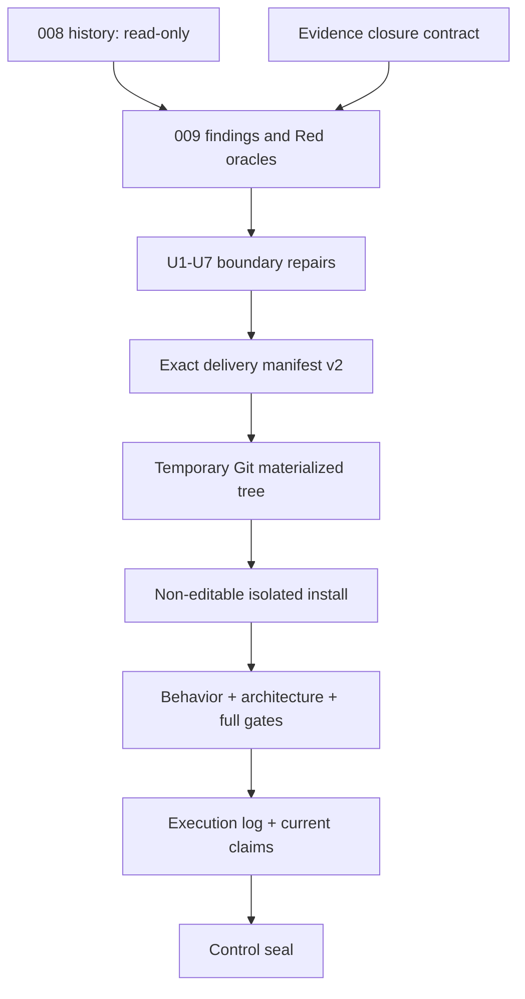

# Capability Evidence Closure - Plan

## Goal Capsule

- **Objective:** 保留 Minimal Runtime Kernel 与六项现有 seam，关闭 `docs/audits/2026-07-20-capability-evidence-closure-audit.md` 的 F1-F9，并让每项 capability 获得与真实证据一致的 claim。
- **Authority:** `AGENTS.md` > Kernel/extension architecture > `docs/architecture/CAPABILITY_EVIDENCE_CLOSURE_CONTRACT.md` > capability design > 本计划。008 plan/log/manifest 是历史输入，不是当前完成证明。
- **Execution profile:** 按 U1-U8 串行执行。每个 unit 先运行目标行为测试得到准确 Red，再做最小 Green；禁止用 test name、源码字符串、总 pass count 或安全拒绝替代 boundary journey。
- **Stop conditions:** 需要第二套 loop、动态 plugin/service locator、真实 secret/private data、真实外部调用、不可终止 helper thread、broad-add、读取 denied runtime paths 或改变本计划产品范围时停止并报告。
- **Tail ownership:** Coding Agent 负责本地代码、测试、content gate 与 provisional verdict；非本轮实现执行器负责 promotion review、最终 claims 与 control seal；用户独占 E3 authorization、accepted 决策、commit 与 push。

---

## Product Contract

### Summary

009 不再重复 008 的架构设计，而是给现有设计增加不可伪造的 behavior、boundary 和 materialized-delivery closure。
008 保留为失败历史；新的 verifier、execution log 和 current-status claims 只接受 009 证据。

### Problem Frame

当前 286 个测试与 Ruff 均可通过，但 delivery final modes 未实现，008 manifest 自动吸收了 runtime-state 文件，多项命名为 strict/closure 的测试实际只覆盖 happy path、source shape 或相反语义。
如果继续在 008 log 上追加 `verified`，廉价执行器会沿用错误 oracle，最终得到更多“绿灯”而不是更可信的 Agent。

### Requirements

**Evidence and delivery**

- R1. `docs/plans/2026-07-19-008-stabilize-capability-reintroduction-plan.md`、`docs/implementation/008_STABILIZATION_EXECUTION_LOG.md` 与 `docs/implementation/008_INTENDED_TREE_MANIFEST.json` 保持只读历史；009 不回填、重标或继续封存它们。
- R2. 新 `docs/implementation/009_DELIVERY_MANIFEST.json` 使用 `my-first-agent/delivery-manifest/v2`，精确列出 baseline commit、add/modify/delete、ordered owner units 与 final digest；manifest 不自我哈希，且 verifier 没有自动写 manifest 的 mode。
- R3. tracked changes 可从 pinned baseline 枚举；untracked path 只能由显式 product/test/package/doc allowlist admission 进入。add/modify entry 在读取或 hash 前必须 descriptor-relative no-follow 验证为 owner-controlled、link count 为 1 的 regular file，并复验声明的 Git mode/type；symlink、hardlink、特殊文件和未知 untracked path fail closed。runtime logs/state、credential/private roots、`.ua/`、`graphify-out/`、`tui/agent_log.jsonl` 与 `tui/memory/` 只按 path 拒绝，禁止读取或 hash 内容。
- R4. 009 的每个 finding 都先有一个因目标行为缺失而失败的准确 Red。进入 `verified` 的 finding 必须修复后以同一 observable oracle Green 并完成 boundary verification；进入 evidence-backed `blocked` 的 finding 必须保留 Red command/body evidence、具体 blocker、未晋级 claim 与安全最终行为，且不能把安全拒绝冒充目标 Green。source-shape assertion、测试名、docstring、总 pass count 或直接绕过 production boundary 的 helper call 不能独立关闭 finding。
- R5. final content gate 从 exact manifest 创建 temporary index/tree，non-editable 安装到临时环境，从 neutral cwd 清除 import injection 后运行；product module 与 console entrypoint origin 必须指向临时安装。安装、Ruff、pytest、entrypoint 及 descendants 必须在 verifier-owned OS deny-network boundary 内，且 DNS/TCP 负向探针先证明发送前阻断；当前 Darwin target 使用 `/usr/bin/sandbox-exec`，不可用或探针失败则 E2M fail closed。content gate 后，executor 只能向 execution log 写 provisional gate receipt/verdict；随后只有独立 reviewer 可完成 review receipt、final log/status 与 manifest control digests，再授权 control seal。

**MCP closure**

- R6. MCP preview 完整展示并绑定 server、tool、executable、cwd、credential profile、safety generation 与完整 canonical arguments；escaped preview overflow 在 spawn 前 known-not-executed，不能截断后执行完整对象。
- R7. environment value 与 executable/cwd identity 在 composition/prepare 时冻结，spawn 前通过 no-follow identity+digest 复验；invoke 不重新读取 global environment，same-content replacement 也算 drift。
- R8. bridge 在 call bytes 可能写出后，只有 matching terminal response、typed result classification 与 process-group cleanup receipt 都满足对应 design 时才能离开 unknown；stdout、stderr、result 与 error 全部 bounded，stderr 持续 drain 且不进入 model/checkpoint。
- R9. `isError`、unsupported completed content 与其他已确认 terminal failure 映射为 known-executed error；timeout、wrong ID、partial/malformed response 或 cleanup uncertainty 不能降级为 success 或 known-not-executed。latch recovery 的 process/rotation/generation attestations 默认均为否定，必须显式肯定。

**Memory closure**

- R10. Memory durable load 严格拒绝 unknown fields、类型强制转换、content/store digest mismatch、revision/timestamp/record invariant 破坏；读取通过 stable lock + no-follow opened handle 且有 byte cap，失败不覆盖源文件。
- R11. remember/update/forget preview 与 execution 绑定同一 store revision 和 record preconditions；remember 显示完整 content，update 显示 bounded before/after，forget 显示删除前内容，无法完整显示时 effect count 为零。
- R12. `MemoryContextSource` 每次 build 从 fresh revision-consistent snapshot 产生 candidates；排序为 score desc、updated_at desc、record_id asc，candidate 要么完整纳入，要么以正确 digest/原长记录 excluded/clipped。
- R13. Memory boundary tests 从 governed tool/approval/`EXECUTING` 进入 mutation，再由新 conversation 与真实 provider request projection 观察 recall；直接 `store.remember()` 只可作 store unit test，不能作为 capability closure。两个 workspace/store instance 还要证明 scope isolation 与 stale snapshot 不串域。

**SubAgent closure**

- R14. `ChildProfile` 明确绑定 provider trust identity、bounded-return/deadline support 与 call-scoped receipt contract；composition 对 unsupported provider fail closed，但不得用 class-name check 冒充 contract verification。
- R15. objective/handoff 在 schema/prepare 阶段按 limit/limit+1 精确拒绝，不静默切片；approval 显示完整 executable handoff 与 destination，child 仍是同一 `AgentRuntime`、独立 state、零 tools/sources、最多一次 model call。
- R16. runner 在解释 child `RunResult` 前先消费 receipt。只有 `COMPLETED` + confirmed terminal receipt 是 success；confirmed nonterminal 是 known-executed error；unconfirmed provider outcome 覆盖 child normalization并使 parent 进入 recovery。当前 HTTP adapters 若不满足 contract，且没有 positive supported provider E2，SubAgent 必须保持 `implemented-candidate + safe-unavailable + E3-blocked`，不能标 `locally-verified` 或写“可用”。

**Scheduler, Skill and TUI closure**

- R17. Scheduler 的 UTC identity 必须 calendar-valid、canonical round-trip；`conversation_busy` 与 `checkpoint_conflict` 都只允许一次 reload + exact same action reconciliation，第二次冲突原样结束。最终 report 来自最新 authoritative state。
- R18. Skill activation/resource read 对 catalog 冻结的 ancestor/file identity 与 digest 同时复验；same-content inode replacement fail closed。bounded metadata 进入 model-visible ToolDefinition/activation contract，同时保持 READ_ONLY、无 scripts/prompt hook/default scan。
- R19. TUI 纯键盘表达 submit、approve、reject、mark succeeded、mark failed、Resume 与合法 paused Cancel；startup/reopen 从 checkpoint 投影 pending/interrupted state，events 只 advisory，所有 action 绑定当前 authoritative revision/request/digest。
- R20. CLI、TUI、Scheduler 共用 composition lifecycle；TUI 不把 background events 写到 terminal renderer，active worker close 显示 `closing_requested`，不能安全收口时保持 `shutdown_blocked` 且不提前关闭 resources。

**Claims and non-regression**

- R21. A15 private-root casefold、A16 stale approval nonfatal、A17 provider context projection、A19 strict frontmatter allowlist 作为 retained regression 重新从 009 materialized tree 验证；不重写已正确的实现。
- R22. `designed`、`implemented-candidate`、`locally-verified`、`accepted` 严格遵守 evidence ladder；E3 未独立完成时不出现“重接完成”，SubAgent unsupported provider limitation 必须可见。
- R23. Graphify 与 Understand Anything 仍是 Coding Agent 辅助；它们的 graph/index 不能进入 product manifest、runtime、tests 或 acceptance claim。
- R24. 本轮 Coding Agent 只能记录 provisional per-capability verdict。非同一 agent/session 的 reviewer 必须核对 exact manifest admission、F1-F9 observable-oracle test body 与 residual limitations，并在修改任何 review/status/control 前独立重跑 `--content`，亲自观察未截断 exit、origin 与 deny-network evidence，再写入 `docs/implementation/009_INDEPENDENT_REVIEW.md`。单项 E1/E2/E2M 不完整只阻止该 capability 晋级；review receipt 缺失、distinct-actor attestation 失败、reviewer-owned content rerun 失败、admission/private-path/dirty-tree/network-boundary 不确定、普通文件漂移或未处置的全局 P0/P1 才阻止整个 control seal。

### Key flows

- KF1. **Red-to-Green finding closure**
  - **Trigger:** Executor starts one U-ID.
  - **Steps:** Run named behavior test → capture intended Red → implement minimum change → rerun same test → run unit boundary suite.
  - **Outcome:** Execution log links one finding to observable Red and Green evidence.
- KF2. **Approval-bound external effect**
  - **Trigger:** MCP、Memory 或 SubAgent prepares an effect.
  - **Steps:** Build full display projection and canonical binding → human decision → persist `EXECUTING` → invoke exact object → classify from owner receipt.
  - **Outcome:** Preview, digest, effect and result are one traceable intent.
- KF3. **Authoritative adapter recovery**
  - **Trigger:** Scheduler duplicate or TUI reopen observes paused/interrupted state.
  - **Steps:** Load checkpoint → project available actions → submit one exact typed action when allowed → reload after conflict.
  - **Outcome:** No provider/effect retry; report/view matches latest state.
- KF4. **Materialized delivery and independent promotion**
  - **Trigger:** U1-U7 each reaches `verified` or an evidence-backed terminal `blocked` verdict.
  - **Steps:** Validate exact manifest → executor materializes and records provisional verdicts → independent reviewer audits oracles and reruns deny-network content gate → update controls → control seal.
  - **Outcome:** Another checkout receives the same candidate without private runtime artifacts or dirty-tree imports；a blocked capability does not prevent independently proven siblings from truthful promotion.

### Acceptance examples

- AE1. Given untracked product Python files plus `tui/agent_log.jsonl` and `tui/memory/checkpoint.json`, when the 009 inventory is checked, then product paths require explicit admission and both runtime-state paths remain unread and absent from the manifest/materialized tree.
- AE2. Given canonical MCP arguments whose escaped preview exceeds the cap, when prepare runs, then spawn/call count is zero; no prefix preview can be approved and followed by full execution.
- AE3. Given an approved MCP intent and a changed environment variable, when invoke runs, then the child receives the frozen approved value or the intent fails before spawn; it never receives the late global value.
- AE4. Given a Memory record whose content changes while its stored digest remains stale, when the store loads, then load fails closed and the original bytes are not rewritten.
- AE5. Given a Memory update preview at revision N and a concurrent mutation to N+1, when the old approval resolves, then mutation count is zero and a new approval is required.
- AE6. Given a supported fake child provider whose call outcome receipt is unconfirmed, when child Runtime returns nonterminal, then receipt precedence drives the parent to `AWAITING_RECOVERY`; it is not a success string.
- AE7. Given `2026-99-99T99:99:99Z` and a barrier-controlled `conversation_busy`, when Scheduler handles them, then invalid UTC is rejected and the conflict path performs at most one exact-action reconciliation.
- AE8. Given a scanned Skill resource replaced by identical bytes on a new inode, when activation/resource read runs, then it returns known-not-executed without disclosing replacement content.
- AE9. Given a durable approval checkpoint, when TUI starts, then the approval form is keyboard-focused without provider/tool calls and approve/reject submits the same action digest as CLI.
- AE10. Given the final 009 manifest, when content verification runs from a neutral cwd, then all product imports/entrypoints originate from the temporary non-editable install and all tests run without reading original dirty-tree modules.

### Success criteria

- F1-F9 each has accurate Red evidence；verified findings also have same-oracle Green and boundary evidence，while blocked findings retain a concrete blocker, non-promotion and safe final behavior.
- U1-U7 each reaches `verified` or a concrete terminal `blocked` record before U8 begins；a blocked capability does not suppress U8 evidence for its siblings.
- U8A content mode and reviewer-owned U8B control-seal mode each pass with known exit 0 and untruncated summaries.
- Current status independently describes each capability；no `locally-verified` promotion exists without R24 review，and none is `accepted` without E3.

### Scope boundaries

Deferred: real E3 runs、new provider termination contract、MCP HTTP/OAuth/resources/prompts/tasks、Memory semantic retrieval、SubAgent tools/multi-call/parallelism、Scheduler CRUD/timers、TUI dashboard/editor/streaming。

Permanently excluded: second model/tool loop、agent self-approval、implicit cwd/workspace、dynamic plugin discovery、service locator、compatibility fallback、event-authoritative state、broad Git add。

### Sources

- `docs/audits/2026-07-20-capability-evidence-closure-audit.md`
- `docs/architecture/CAPABILITY_EVIDENCE_CLOSURE_CONTRACT.md`
- `docs/plans/2026-07-19-008-stabilize-capability-reintroduction-plan.md`
- `docs/acceptance/CAPABILITY_REFERENCE_TASK_PROTOCOL.md`
- MCP tools: `https://modelcontextprotocol.io/specification/2025-11-25/server/tools`
- MCP transports: `https://modelcontextprotocol.io/specification/2025-11-25/basic/transports`
- Python subprocess: `https://docs.python.org/3.11/library/subprocess.html`
- Textual workers/testing: `https://textual.textualize.io/guide/workers/`, `https://textual.textualize.io/guide/testing/`
- Agent Skills: `https://agentskills.io/specification`

---

## Planning Contract

### Key Technical Decisions

- KTD1. **Create 009 and preserve 008 unchanged.** (session-settled: user-directed — chosen over rewriting 008: the old artifacts must remain inspectable evidence of why false Green occurred.)
- KTD2. **Repair proof and boundary closure, not the Kernel topology.** The unique production loop and owner seams passed the follow-up architecture audit; another rewrite would add risk without addressing the false oracle.
- KTD3. **Verifier never generates its own truth.** Inventory may report candidates, but only an exact reviewed manifest admits paths; verifier is read-only with respect to manifest and real Git index.
- KTD4. **Observable behavior outranks named tests.** A required test name is navigation, not evidence; state, receipts, counts and reload behavior are the oracle.
- KTD5. **Safe rejection and usable capability are separate facts.** An unsupported provider can prove fail-closed composition, but it cannot prove SubAgent value or E3 eligibility.
- KTD6. **Capability claims remain independent.** U1-U7 may terminate as verified or evidence-backed blocked；U8 still materializes the whole candidate and the independent reviewer promotes only capabilities with complete E1/E2/E2M. One blocked capability does not hold back a sibling, and one passing suite cannot promote another.

### High-Level Technical Design



This diagram defines ownership and sequence, not implementation classes.
The existing Runtime contracts remain authoritative.

### Sequencing

U1 must finish first because every later Green depends on trustworthy evidence and delivery admission.
MCP and Memory follow because they have the highest external-effect and durable-data risk.
SubAgent follows shared outcome closure; Scheduler and Skill are independent smaller closures.
TUI is last among behavior units because it consumes the finalized action/outcome/lifecycle semantics.
U8A is the executor-owned materialized content proof；U8B is the independent-reviewer-owned promotion and control seal. The executor may not perform U8B in the same agent/session.

### System-wide impact

- `scripts/verify_materialized_tree.py` changes from generator-plus-checker to a verifier of an external exact manifest.
- `agent/runtime` should change only where a retained regression exposes a real shared bug; capability-specific fixes stay in their packages.
- `agent/composition.py` and `main.py` remain the only place to bind resources, event sink and close stack.
- post-gate control docs must never become runtime, package, build or test-discovery inputs.
- no new dependency is expected; existing optional extras remain optional.

### Risks and mitigations

| Risk | Mitigation |
|---|---|
| Cheap executor renames a test and preserves the false oracle | Execution log records observable assertions and counts; review reads test body, not only name |
| Exact manifest is tedious and executor broad-admits paths | Verifier has no generate mode; denied/unknown untracked paths are negative tests |
| Allowed path hides a symlink/hardlink or special file | Validate no-follow regular-file identity, link count and Git mode/type before any read/hash |
| A test or child process reaches the network during final gates | Run the whole materialized command tree under an OS deny-network boundary and require a negative preflight probe |
| MCP process cleanup cannot prove escaped descendants | Keep unknown + quarantine/latch; document absence of process sandbox |
| Memory plaintext is mistaken for confidentiality | Preserve owner-only/plaintext limitation and use only synthetic test data |
| SubAgent remains unusable with current providers | Only a positive supported-provider E2 journey permits `locally-verified`; otherwise keep `implemented-candidate + safe-unavailable + E3-blocked` |
| TUI thread close blocks indefinitely | No force-cancel claim; project `shutdown_blocked`, preserve resources and recovery state |
| Final log/status changes invalidate prior content proof | Treat them as non-executable controls, hash after content gate, then run control seal |
| Executor changes implementation, oracle and its own claim | Executor writes provisional verdicts only; a distinct reviewer owns R24 promotion and the final seal |

---

## Implementation Units

### U1. Replace false evidence and delivery admission

- **Goal:** Satisfy R1-R4 and establish the admission, evidence and retained-regression prerequisites for R5 and R21-R23 before changing capability behavior.
- **Requirements:** R1-R4; prerequisites for R5 and R21-R24; AE1.
- **Files:** `scripts/verify_materialized_tree.py`, `docs/implementation/009_DELIVERY_MANIFEST.json`, `docs/implementation/009_EXECUTION_LOG.md`, `tests/architecture/test_delivery_manifest_v2.py`, `tests/architecture/test_capability_claims.py`, `.gitignore`; 008 artifacts are read-only.
- **Approach:** Remove manifest-writing/generate behavior from the verifier. Add read-only inventory classification, exact v2 schema validation, denied/unknown untracked handling, temporary-index materialization scaffolding and retained regression tests. Populate manifest with exact paths only after path-only inventory review.
- **Test scenarios:** runtime-state and private paths never read/hash/admit; allowed-path symlink/hardlink/special file fails before content read; unknown untracked fails; missing/extra/hash/mode/type/owner/order/baseline drift fails; real index unchanged; module-origin injection fails; deny-network wrapper and DNS/TCP negative probe fail closed; A15/A16/A17/A19 remain Green; old 008 evidence cannot promote claims.
- **Verification:** `tests/architecture/test_delivery_manifest_v2.py` and retained kernel/tools/provider/skill tests pass; capture Red and Green with exact exit codes in `009_EXECUTION_LOG.md`.

### U2. Close MCP prepared effect, transport and recovery

- **Goal:** Satisfy R6-R9 with one exact approval-to-receipt journey.
- **Requirements:** R6-R9; AE2-AE3.
- **Files:** `agent/mcp/contracts.py`, `agent/mcp/catalog.py`, `agent/mcp/tools.py`, `agent/mcp/bridge.py`, `agent/mcp/safety.py`, `agent/composition.py`, `tests/fixtures/mcp/stdio_server.py`, `tests/mcp/test_catalog.py`, `tests/mcp/test_tools.py`, `tests/mcp/test_bridge.py`, `tests/mcp/test_safety.py`, `tests/mcp/test_integration.py`.
- **Approach:** Reuse `ExecutionIntent` and typed callable outcomes. Freeze env/identity before approval, reject preview overflow, revalidate opened identities before spawn, let transport owner produce bounded receipt, and make cleanup uncertainty override terminal classification.
- **Test scenarios:** limit/limit+1 canonical/escaped arguments; env changes after approval; same-content executable/cwd/ancestor replacement; timeout before/after call byte; partial write; wrong ID; JSON-RPC error; `isError`; unsupported/oversized result; stderr flood/secret; grandchild/cleanup uncertainty; latch recovery missing/false/stale attestations.
- **Verification:** every matrix cell asserts spawn/call count, `McpBridgeOutcome`, parent status, latch and quarantine; no real MCP/network call.

### U3. Close Memory strict durability and governed recall

- **Goal:** Satisfy R10-R13 without adding retrieval features.
- **Requirements:** R10-R13; AE4-AE5.
- **Files:** `agent/memory/contracts.py`, `agent/memory/store.py`, `agent/memory/source.py`, `agent/memory/tools.py`, `agent/runtime/context.py`, `agent/composition.py`, `tests/memory/test_store.py`, `tests/memory/test_tools.py`, `tests/memory/test_source.py`, `tests/memory/test_integration.py`, `tests/provider/test_memory_context_projection.py`.
- **Approach:** Replace coercive decode with strict bounded validation, load immutable snapshot under stable lock/handle, bind prepare display to exact revision/preconditions, and make source/projection evidence derive from a governed write journey.
- **Test scenarios:** unknown/type/digest/revision/timestamp violations; symlink/hardlink/ancestor and same-content replacement; lock/temp/fsync/replace failures; concurrent CAS; complete remember/update/forget preview; stale preview zero mutation; fresh external update visible next build; ranking and candidate digest/clipping; no-Memory baseline.
- **Verification:** invalid paths never reach `EXECUTING`; governed conversation A write and conversation B recall pass through provider request builders without network.

### U4. Make SubAgent bounds and availability honest

- **Goal:** Satisfy R14-R16 while preserving one Runtime implementation and zero child tools.
- **Requirements:** R14-R16; AE6.
- **Files:** `agent/subagent/contracts.py`, `agent/subagent/runner.py`, `agent/subagent/tools.py`, `agent/provider/protocol.py`, supported fake provider test doubles, `agent/composition.py`, `main.py`, `tests/subagent/test_runner.py`, `tests/subagent/test_tools.py`, `tests/subagent/test_integration.py`, focused provider contract tests.
- **Approach:** Make provider capability and receipt structural, not class-name based. Add exact input bounds, consume receipt before child status, keep current HTTP adapters fail closed unless they can satisfy the written contract without helper threads.
- **Test scenarios:** objective/handoff limit/limit+1; provider/destination mismatch; unsupported/missing/soft-only deadline; completed confirmed receipt; confirmed nonterminal; unconfirmed receipt overriding nonterminal into parent recovery; full parent ToolDefinition → approval → child → parent result → next ContextPack journey for a supported fake; duplicate intent no second child; no child sources/tools/workspace.
- **Verification:** `AgentRuntime.run_turn` is the only child loop; no background thread remains. Without the positive supported-provider E2, the unit may verify safe rejection but SubAgent remains `implemented-candidate` and the independent reviewer cannot promote it.

### U5. Complete Scheduler validation and reconciliation

- **Goal:** Satisfy R17 without adding timer or retry loop.
- **Requirements:** R17; AE7.
- **Files:** `agent/scheduler/contracts.py`, `agent/scheduler/caller.py`, `tests/scheduler/test_contracts.py`, `tests/scheduler/test_caller.py`, `tests/scheduler/test_cli.py`.
- **Approach:** Parse and canonical-round-trip UTC; share a one-shot exact-action reconciliation branch for `conversation_busy` and `checkpoint_conflict`; always map the report from reloaded authoritative state.
- **Test scenarios:** invalid month/day/leap/hour/fractional/offset forms; completed duplicate; pause → human seq-2 resolution → duplicate terminal; barrier-controlled busy/conflict; second conflict no loop; replay-floor fallback and identity drift.
- **Verification:** provider/effect count remains unchanged on duplicate/reconciliation; Scheduler never resolves pending human action.

### U6. Close Skill identity and disclosure

- **Goal:** Satisfy R18 while preserving the strict read-only subset.
- **Requirements:** R18, R21.
- **Files:** `agent/skill/catalog.py`, `agent/skill/tools.py`, `tests/skill/test_catalog.py`, `tests/skill/test_tools.py`, `tests/skill/test_integration.py`.
- **Approach:** Preserve opened `FileIdentity` for body/resources and compare identity+digest at activation/read. Project bounded display metadata through existing ToolDefinition/result surfaces without exposing absolute roots.
- **Test scenarios:** same-content inode replacement; ancestor/resource replacement; metadata visible and bounded; content drift; duplicate/unknown YAML; scripts/default roots remain rejected; zero configured roots unchanged.
- **Verification:** drift is known-not-executed with open/read count bounded; no prompt hook, execution or private path disclosure.

### U7. Complete TUI action parity and shared lifecycle

- **Goal:** Satisfy R19-R20 for one conversation.
- **Requirements:** R19-R20; AE9.
- **Files:** `agent/tui/adapter.py`, `agent/tui/render.py`, `agent/tui/app.py`, `agent/cli/actions.py`, `agent/composition.py`, `main.py`, `tests/tui/test_actions.py`, `tests/tui/test_adapter.py`, `tests/tui/test_render.py`, `tests/tui/test_app.py`, related CLI/lifecycle tests.
- **Approach:** Use one pure authoritative projection and shared action builders, inject one queue EventSink into the same Runtime composition, keep Textual as the only worker thread owner, and route every main exit through one close-stack owner.
- **Test scenarios:** full projection matrix; keyboard approve/reject/recovery/resume/cancel; pending restart with zero provider/tool calls; RUNNABLE/EXECUTING Resume-only; event loss/duplicate/reorder; busy/conflict reload; preview escape overflow; active-worker close and `shutdown_blocked`; normal/startup-error reverse close exactly once.
- **Verification:** Textual `App.run_test()`/Pilot asserts actual key presses, focus, enabled actions, action digest and final checkpoint parity with CLI; submit-only smoke is insufficient.

### U8. Materialize, independently review and seal truthful claims

- **Goal:** Satisfy R5, R22 and R24 by proving the final candidate from a new tree and separating executor evidence from claim promotion.
- **Requirements:** R5, R21-R24; AE10.
- **Files:** `scripts/verify_materialized_tree.py`, `docs/implementation/009_DELIVERY_MANIFEST.json`, `docs/implementation/009_EXECUTION_LOG.md`, `docs/implementation/009_INDEPENDENT_REVIEW.md`, `docs/architecture/CURRENT_CAPABILITY_STATUS.md`, `README.md`, `docs/architecture/CAPABILITY_REINTRODUCTION_ROADMAP.md`, `docs/implementation/CAPABILITY_REINTRODUCTION_WORKLOG.md`; behavior files are frozen before U8.
- **Approach:** U8A executor freezes ordinary digests, runs the content gate and records provisional per-capability verdicts without promotion. U8B distinct reviewer reads no denied/private content, inspects manifest admission and F1-F9 oracle test bodies, then independently reruns `--content` before changing controls. Only after personally observing that receipt does the reviewer write the independent review, update exact claims/status controls, record their digests and mark control seal authorized. The read-only control-seal command is then the final command; its exit/result remain only in the out-of-repository terminal report so no post-seal edit invalidates a control digest.
- **Test scenarios:** temporary index exactness; OS deny-network preflight and inherited child blocking; non-editable install; neutral cwd/import origin; base and optional-extra imports; architecture/focused/full suites; ordinary-content drift between content/seal; missing/changed reviewer control or missing distinct-actor attestation; blocked SubAgent with verified siblings; post-gate controls are not runtime/build/test inputs. Distinct-actor identity is a procedural trust receipt, not a cryptographic guarantee the verifier can manufacture.
- **Verification:** executor content mode exits 0 with an untruncated summary；after an independent review receipt, control-seal exits 0 and claims match per-capability evidence without fabricated E3.

---

## Verification Contract

Each unit runs its named Red first, then its focused suite.
Before U8 content materialization, run:

```bash
git diff --check
.venv/bin/ruff check .
.venv/bin/ruff check agent/memory tests/memory
.venv/bin/python -m pytest -q tests/architecture tests/kernel tests/tools tests/provider
.venv/bin/python -m pytest -q tests/mcp tests/memory tests/subagent tests/scheduler tests/skill tests/tui tests/cli
.venv/bin/python -m pytest -q -rx
```

The implementation executor then runs:

```bash
.venv/bin/python scripts/verify_materialized_tree.py --content
```

The content mode owns temporary-index materialization, OS-enforced deny-network preflight/boundary, non-editable no-deps install, neutral-cwd origin assertions, Ruff and pytest execution.
Before editing any review/status/control, the independent reviewer reruns:

```bash
.venv/bin/python scripts/verify_materialized_tree.py --content
```

After reviewing that fresh receipt and freezing the controls, the independent reviewer runs:

```bash
.venv/bin/python scripts/verify_materialized_tree.py --control-seal
```

The control-seal mode revalidates all ordinary digests, the independent review receipt and post-gate controls without rerunning product tests.
Its exit code and untruncated summary are terminal output only；hashed repository controls record authorization, not the later command result.

No command may read real private paths or call real provider/MCP/network.
Timeout、truncated output、missing exit code、skip/xfail、ignored test、dirty-tree import 或 test-double-only proof 都不是 pass。

---

## Definition of Done

- 008 artifacts remain unchanged and are labeled historical/untrusted for completion claims.
- 009 manifest excludes runtime/private artifacts by admission design, not only by a growing blacklist.
- Every F1-F9 finding has intended Red evidence in `009_EXECUTION_LOG.md`；verified findings also have same-oracle Green/boundary evidence，while blocked findings record the concrete blocker, safe final behavior and unchanged non-promoted claim.
- MCP approval, frozen inputs, receipt classification, bounded transport and cleanup/latch recovery satisfy R6-R9.
- Memory strict decode, durable snapshot, revision-bound mutation preview and governed cross-conversation recall satisfy R10-R13.
- SubAgent exact handoff and receipt precedence satisfy R14-R16; without a positive supported-provider E2 its final claim remains `implemented-candidate + safe-unavailable + E3-blocked`.
- Scheduler invalid UTC, busy/conflict reconciliation and human-resolution duplicate journey satisfy R17.
- Skill same-content identity drift and bounded metadata disclosure satisfy R18.
- TUI completes every existing human action by keyboard, rebuilds pending/recovery views from checkpoint and shares composition lifecycle per R19-R20.
- Retained Kernel regressions pass from the materialized install; no second loop、service locator、compatibility fallback or new capability appears.
- Executor-owned Verification Contract commands through `--content` pass with known exit codes and untruncated output；the OS deny-network negative probe is part of that evidence.
- A distinct reviewer completes R24, including a reviewer-owned `--content` rerun, then `--control-seal` passes；current status independently marks each capability as `implemented-candidate` or `locally-verified` according to E1/E2/E2M plus review receipt，and none is `accepted` without E3.
- Abandoned experiments、source-shape-only tests、dead imports and unused compatibility paths introduced during execution are removed before sealing.
