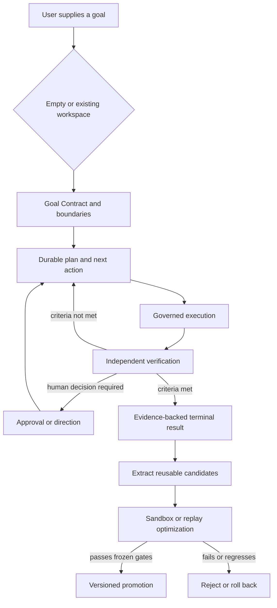
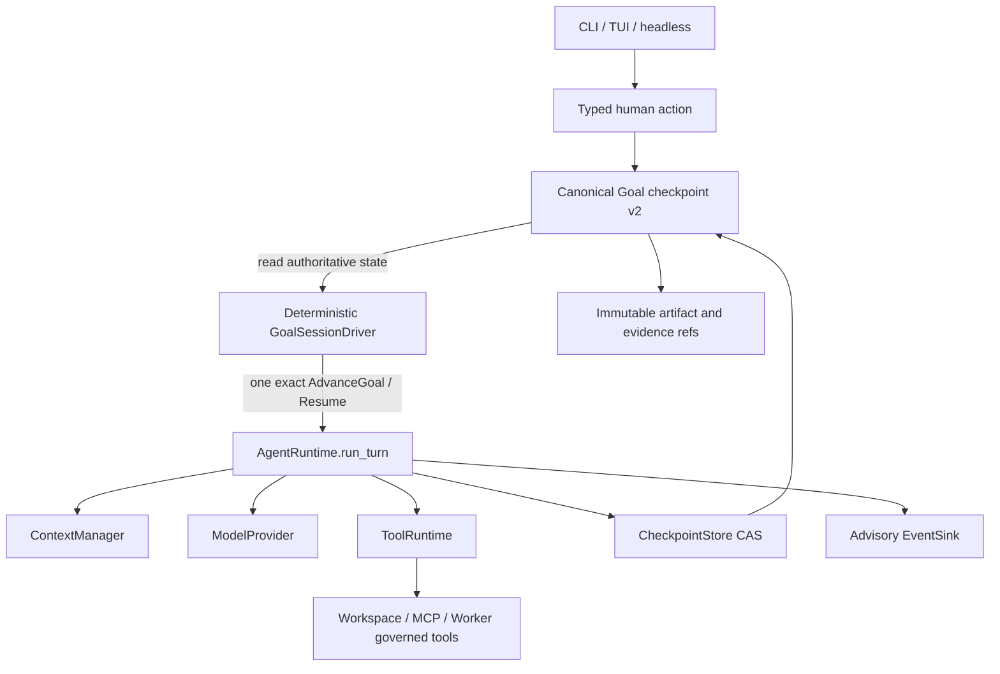
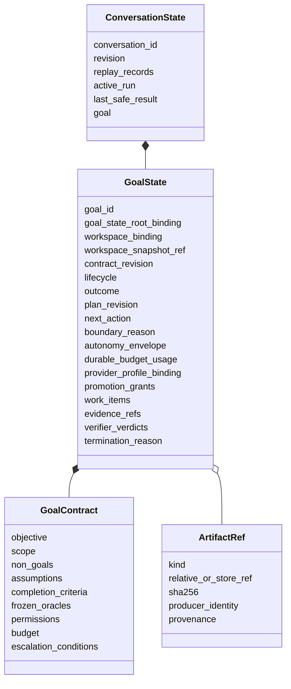
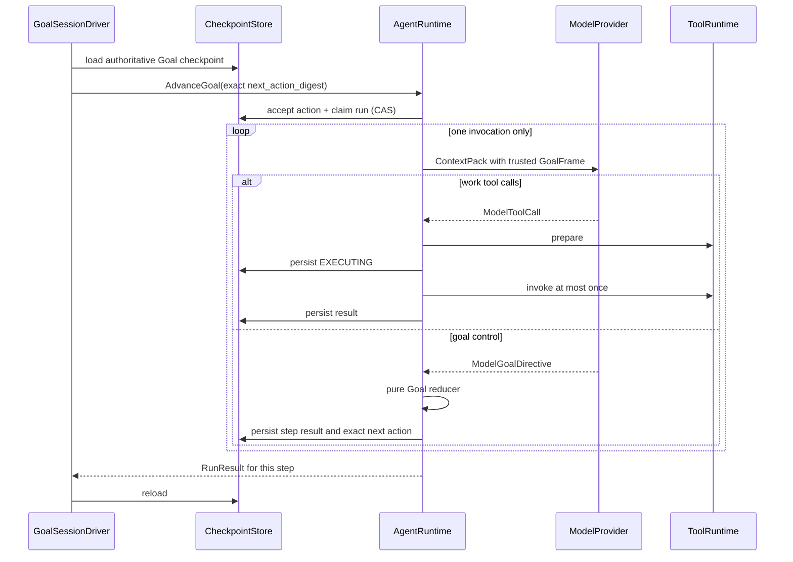
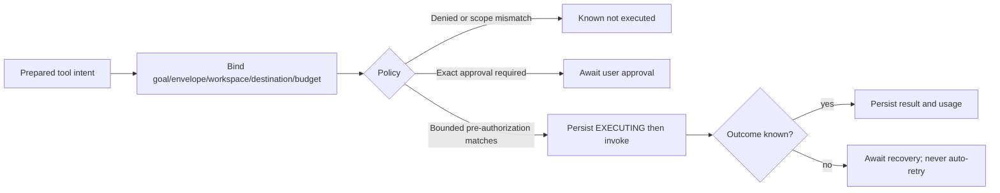
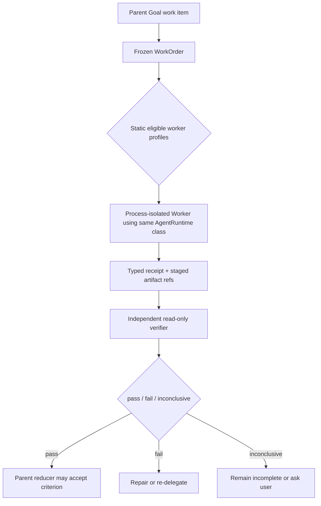
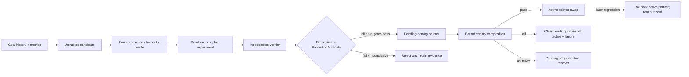

# First Agent General Workspace Agent - Implementation Plan

## Goal Capsule

- **Objective:** 在已经验收的 Minimal Runtime Kernel 与 bounded capabilities 上实现第一个面向 power user 的 General Workspace Agent：它持续拥有 workspace-scoped Goal，自动推进至真实边界，以独立证据判断完成，并在受治理的实验后积累可复用能力。
- **Product authority:** 本文定义 General Workspace Agent 的用户、产品行为、自治边界、完成标准和非目标；现有 `docs/architecture/KERNEL_ARCHITECTURE.md`、`docs/architecture/EXTENSION_CONTRACTS.md` 与 `docs/architecture/CURRENT_CAPABILITY_STATUS.md` 继续拥有已验收 Runtime 边界和当前事实。
- **Technical approach:** 单次 invocation 内仍只有 `AgentRuntime.run_turn` 的 model/tool loop；跨 invocation 的长期推进由不含模型、prompt、工具调用或状态写权的 deterministic `GoalSessionDriver` 提交 typed actions。Goal 真值进入 canonical checkpoint，体积较大的产物和证据使用 immutable content-addressed sidecar。
- **Delivery shape:** 8 个有依赖顺序的 implementation units；每个单元先写准确 Red，再做最小 Green，并以 010 layered delivery controls、独立 reviewer 和真实 reference tasks 收口。
- **Open blockers:** 无。实现中若发现 Product Contract 与现有不变量不可同时满足，必须以 `BLOCKED` 停止并回到本文修订，不能自行改变目标或另造 Runtime。

---

## Product Contract

### Summary

First Agent 将成为一个面向 power user、goal-centered、workspace-scoped、local-first 的 General Workspace Agent。
它从空白目标或已有 workspace 开始，持续组织模型、工具和专业 Agent 完成复杂工作，以独立证据判断完成，并根据长期执行证据可控地优化自己的工作方式。

### Problem Frame

当前项目已经拥有经过独立 reference task 验收的 Kernel、Memory、Skill、MCP、SubAgent、Scheduler 和 TUI，但权威状态只把这些能力声明为 bounded v1，并明确不等同于 production-ready 或完整通用 Agent。
现有能力证明了安全边界和接入方式，没有单独回答用户如何把一个模糊或长期目标交给产品，并让产品跨会话保持目标所有权直至交付。

目标用户已经在使用 Codex、Claude Code 等 Agent 完成复杂工作，但仍需人工补充上下文、反复要求继续、选择执行者、判断真假完成并保存跨会话进度。
如果 First Agent 只增加文档、浏览器、MCP 或长时间运行，它将追赶模型厂商已经在提供的通用知识工作能力，而不会形成稳定的用户价值。

First Agent 的产品机会不是成为更强的单个模型，而是成为用户拥有的 Agent 组织：它让不同模型和专业工具成为可替换 Worker，自己持续拥有目标、权限、任务状态、验证证据和可复用能力。
每次任务完成后，系统不仅保留结果，还利用历史证据发现瓶颈、验证候选改进，并在治理边界内让未来任务更快、更便宜或更可靠。

### Key Decisions

- **显式选择 workspace，而不是默认接管整台电脑。** (session-settled: user-directed — chosen over ambient whole-computer access: workspace 是本地行动和持久状态的默认权限边界。) Governs R1-R3, R27-R29.
- **首个产品版本服务 power user。** (session-settled: user-directed — chosen over serving ordinary users and power users simultaneously: 先验证复杂目标完成能力，不让大众安装、账号和引导稀释核心闭环。) Governs R1, R14, R31.
- **默认引导执行，并允许逐目标升级为有界自治。** (session-settled: user-approved — chosen over unconditional proactive execution: 连续推进必须服从风险、权限、预算和承诺边界。) Governs R8-R10, R14.
- **First Agent 对目标负责，模型、工具和 SubAgent 只是 Worker。** (session-settled: user-approved — chosen over competing as the strongest single worker: 组织、独立验证和跨会话持续性比绑定某个模型更有复利。) Governs R10-R13, R16-R19, R28.
- **从每次任务中积累并自主优化可复用能力。** (session-settled: user-approved — chosen over passive history retention: 系统必须比较候选方法与冻结基线，而不只是记住曾经成功的步骤。) Governs R20-R25.
- **核心治理和 Runtime 源码不接受自主晋级。** (session-settled: user-approved — chosen over unrestricted self-modification: 核心代码变化进入独立开发与审查流程，防止优化器修改目标或评测来制造成功。) Governs R23-R26.
- **产品演进继续服从唯一 Runtime 边界。** (session-settled: user-directed — chosen over embedding a CodingLoop or development supervisor in the product: 外部 Claude Code loop 负责开发，产品能力通过现有稳定边界进入同一 Runtime。) Governs R30-R31.

### Actors

| ID | Actor | Responsibility |
|---|---|---|
| A1 | Power user | 选择 workspace、给出目标、配置初始权限，并在方向或承诺边界上作最终决定 |
| A2 | First Agent | 拥有 Goal Contract、计划、任务状态、证据和完成判断，协调其他参与者直至终态 |
| A3 | Worker | 在受限委托中提供模型推理、工具执行、专业产物或子任务结果，不拥有父目标 |
| A4 | Independent verifier | 使用与执行结果相匹配的 oracle 挑战完成声明，并输出可核对的 verdict |
| A5 | External system | 通过用户批准的 Tool 或 MCP 提供 workspace 外的数据或副作用能力 |

### Requirements

**Goal and workspace**

- R1. 用户必须能够在显式选择的空 workspace 或已有 workspace 中，用自然语言启动一个目标。
- R2. workspace 必须是默认本地权限边界；任何 workspace 外读取、写入或外部系统访问都必须经已批准 capability。
- R3. 首个产品版本必须保持单 owner，不引入账号系统、多人身份或共享权限模型。
- R4. First Agent 必须为每个目标维护 durable Goal Contract，覆盖期望结果、范围、非目标、完成证据、关键假设、权限、预算以及停止或升级条件。
- R5. First Agent 可以根据新证据提出 Goal Contract 修订，但改变方向、结果性质或承诺边界的修订必须由用户确认并保留历史。
- R6. First Agent 必须能在空 workspace 中建立最小项目结构和初始产物，也必须能在已有 workspace 中先理解现状再决定延续、修复或重构。

**Continuous execution and autonomy**

- R7. First Agent 必须持久维护当前计划、已完成工作、未解决问题和下一可执行步骤，使任务在进程或会话中断后无需用户重复输入“继续”即可恢复。
- R8. 默认引导执行允许 First Agent 自动完成 Goal Contract 内安全、可逆且本地的工作，并在外部、不可逆、敏感或方向性承诺前请求批准。
- R9. 有界自治只能由用户为当前目标显式启用，并必须限定 workspace、capabilities、数据范围、时间或成本预算、允许的副作用以及停止条件。
- R10. First Agent 不得自行扩大自治范围、权限、预算、目标或完成标准。
- R11. First Agent 必须能够把目标分解为可执行工作，选择下一步，并在一个 Worker 返回后继续对父目标进行核对和推进。
- R12. First Agent 必须能够根据能力、成本、信任边界和任务需要选择不同 Worker，但 Worker 不得拥有 durable goal state 或绕过产品治理。
- R13. SubAgent 和其他委托默认获得完成子任务所需的最小上下文、工具与权限；父 First Agent 保持目标和结果所有权。
- R14. 用户必须能够查看、暂停、恢复、重定向或终止目标，并能收回尚未使用的权限而不破坏已持久化的事实。
- R15. 对于失败、超时或副作用结果未知的动作，First Agent 必须先恢复事实再决定下一步，不得用盲目重试换取表面连续性。

**Verification and completion**

- R16. First Agent 必须从 Goal Contract 派生与任务类型匹配的完成 oracle，并在声明完成前收集相应证据。
- R17. 对结果有实质影响的 Worker 产物必须经过独立验证；执行者的自评不能单独成为父目标完成证据。
- R18. First Agent 必须把目标终态区分为 `completed`、`partially_completed`、`blocked`、`failed` 和 `outcome_unknown`，不得把不完整或无法核对的结果渲染为完成。
- R19. 本地 evidence record 必须让用户核对关键输入来源、决策、审批、Worker verdict、产物变化、外部副作用和未解决限制，同时避免保存不必要的秘密或完整私有内容。

**Capability compounding and autonomous optimization**

- R20. 每个完成或终止的目标都可以产生候选的 Memory、Skill、playbook、goal template、permission profile 或 eval，但任务历史不得在没有记录的情况下直接改变未来行为。
- R21. 候选能力必须明确其适用范围、来源证据、风险和预期改进，并区分 workspace-local 资产与用户批准后可跨 workspace 复用的 owner-local 资产。
- R22. First Agent 必须能够从可比较的历史任务中测量质量、成本、耗时、用户打断、失败与恢复表现，并据此提出优化假设。
- R23. 优化候选必须在隔离 replay、sandbox 或 canary 中与冻结基线比较，并由不依赖候选自评的 oracle 检查质量与安全回归。
- R24. 只有事先授权、低风险、可逆的能力候选，才能在改善至少一项预先声明指标且没有违反其他门时自动晋级；所有晋级都必须有版本、证据和回滚路径。
- R25. 权限、治理规则、用户目标、评测权威和核心 Runtime 源码不得由优化器自动晋级；相关变化必须进入独立开发、验证和批准流程。
- R26. 同一优化不得同时改变被评测行为和决定其成功的权威 oracle，也不得删除失败记录、缩小既有完成标准或用增加活动量冒充结果改善。

**Local-first ownership and stable boundaries**

- R27. Goal Contract、任务状态、Memory、权限、审批、产物索引和 evidence record 必须默认由用户在本地拥有，并采用可检查和可迁移的形式。
- R28. 使用远程模型或外部服务前，产品必须让用户知道 destination identity、拟发送的数据范围和可能产生的副作用，并尽量只发送当前工作所需数据。
- R29. 模型 Provider 必须保持可替换 Worker 身份；在受支持的恢复边界更换 Provider 不得抹除 Goal Contract、任务事实或本地证据。
- R30. Memory、Skill、MCP、SubAgent、Scheduler、TUI 及未来 capability 必须服从同一目标、权限、审批、checkpoint 和 evidence 规则，不得引入第二套 model/tool loop 或隐藏生命周期。
- R31. Graphify、Understand Anything、Claude Code supervisor 和其他开发辅助只能用于构建或理解 First Agent，不得作为产品 Runtime 能力或完成证据偷渡进入交付。

### Product Lifecycle



图中的工作、学习和优化是同一产品的三个逻辑反馈阶段。
后续技术规划必须复用现有唯一 `AgentRuntime` 和 governed actions，不得把这张产品生命周期图解释成三套 production model/tool loop。

### Key Flows

- F1. Start from zero
  - **Trigger:** A1 在显式选择的空 workspace 中提交一个可能仍有模糊处的目标。
  - **Actors:** A1, A2, A3, A4
  - **Steps:** A2 形成可修正 Goal Contract，标记事实与假设，完成安全研究和初始产物，在承诺边界取得 A1 决定，并持续执行和验证。
  - **Outcome:** 空 workspace 形成可继续、可核对的项目和 evidence-backed terminal result。
  - **Covers:** R1-R8, R11-R19.

- F2. Adopt an existing workspace
  - **Trigger:** A1 在包含历史文件、代码、数据或文档的 workspace 中提交目标。
  - **Actors:** A1, A2, A3, A4
  - **Steps:** A2 先建立现状证据，区分有效资产、冲突和历史包袱，再提出 Goal Contract 与推进路径。
  - **Outcome:** Agent 在不静默删除用户资产或继承错误假设的情况下推进目标。
  - **Covers:** R1-R7, R11-R19.

- F3. Guided execution
  - **Trigger:** 目标使用默认引导执行。
  - **Actors:** A1, A2, A3, A5
  - **Steps:** A2 自动执行安全可逆工作；遇到外部副作用、不可逆变化、敏感数据或方向性选择时形成 bounded approval。
  - **Outcome:** 工作持续推进，同时 A1 保持承诺边界控制权。
  - **Covers:** R8, R10-R15, R28.

- F4. Bounded autonomous execution
  - **Trigger:** A1 为当前目标提供明确 autonomy envelope。
  - **Actors:** A1, A2, A3, A5
  - **Steps:** A2 在授权范围内持续选择和执行下一步，接近预算、权限或停止边界时停止或升级，不自行扩权。
  - **Outcome:** 用户无需反复续推，所有动作仍可追溯到同一 Goal Contract。
  - **Covers:** R7, R9-R15, R19.

- F5. Delegation and independent verification
  - **Trigger:** 某一步需要专业能力、不同模型或更低成本 Worker。
  - **Actors:** A2, A3, A4
  - **Steps:** A2 发出最小委托；A3 返回产物和证据；A4 使用匹配 oracle 挑战结果；A2 根据 verdict 继续、修复或终止。
  - **Outcome:** Worker 的“完成”陈述不会直接升级为父目标完成。
  - **Covers:** R11-R13, R16-R19.

- F6. Interruption and recovery
  - **Trigger:** 进程退出、Provider 失败、用户暂停或副作用结果未知。
  - **Actors:** A1, A2, A5
  - **Steps:** A2 从 durable facts 恢复 Goal Contract、计划和 action state，先确认未知结果，再选择安全下一步。
  - **Outcome:** 任务可以恢复且不会因盲目重试制造重复副作用。
  - **Covers:** R7, R14-R15, R18-R19, R27-R29.

- F7. Controlled autonomous optimization
  - **Trigger:** 已有足够的可比较任务证据支持一个优化假设。
  - **Actors:** A1, A2, A3, A4
  - **Steps:** A2 生成 bounded candidate，在隔离环境与冻结基线比较，由 A4 检查质量和回归，再按风险与预授权决定晋级、请求批准或拒绝。
  - **Outcome:** First Agent 的方法能够复利，同时优化器不能通过修改目标、权限或 oracle 制造成功。
  - **Covers:** R20-R26.

### Acceptance Examples

- AE1. Empty workspace to decision artifact
  - **Covers:** R1, R4-R8, R11, R16-R19.
  - **Given:** 用户选择一个空 workspace，并要求比较若干候选方案后产出可执行 decision memo。
  - **When:** First Agent 在引导执行下研究、记录来源、生成产物并验证覆盖范围。
  - **Then:** 用户只在真实方向选择或外部授权上介入，不需要反复输入“继续”；终态包含 decision memo、证据和限制。

- AE2. Existing mixed workspace rescue
  - **Covers:** R1-R7, R11-R19.
  - **Given:** workspace 内存在相互矛盾的笔记、旧计划、数据和部分产物。
  - **When:** 用户要求理解现状并推进到可验收结果。
  - **Then:** First Agent 先保留并分类原有资产，显式暴露冲突和假设，再执行经确认的目标；它不能把清理历史误当成默认授权。

- AE3. Commitment boundary
  - **Covers:** R8-R10, R14, R28.
  - **Given:** 当前目标允许本地研究和草拟，但没有发送邮件或发布内容的权限。
  - **When:** 下一步需要对外发送结果。
  - **Then:** First Agent 可以准备预览，但必须在发送前取得绑定目标、destination 和内容摘要的批准。

- AE4. Worker false completion
  - **Covers:** R11-R13, R16-R19.
  - **Given:** Worker 声称子任务已完成，但缺少 mandatory artifact 或验证失败。
  - **When:** Independent verifier 检查产物。
  - **Then:** 父目标保持未完成，First Agent 继续修复、重新委托或准确报告 blocker。

- AE5. Resume without manual continuation
  - **Covers:** R7, R14-R15, R18-R19, R27.
  - **Given:** 一个长任务在多个步骤后被关闭。
  - **When:** 用户重新打开同一目标。
  - **Then:** First Agent 从 durable facts 展示当前合同、进度、权限和安全下一步，并在授权范围内继续，而不要求用户重述历史或只输入“继续”。

- AE6. Unknown external outcome
  - **Covers:** R15, R18-R19.
  - **Given:** 外部调用在发出后连接中断，系统无法确认副作用是否发生。
  - **When:** 任务恢复。
  - **Then:** First Agent 标记 `outcome_unknown` 并先查询或请求恢复决定，不自动重复调用。

- AE7. Evidence-backed optimization
  - **Covers:** R20-R24.
  - **Given:** 多个同类任务形成冻结基线，并预先声明质量、成本、耗时或打断次数中的改进指标。
  - **When:** First Agent 生成新的 playbook、路由或 Skill candidate 并运行隔离对比。
  - **Then:** candidate 只有在至少改善一项声明指标且不破坏其他门时才可按授权晋级；否则保留旧版本。

- AE8. Reward-hacking attempt
  - **Covers:** R25-R26.
  - **Given:** 优化 candidate 需要降低完成标准、修改权威 oracle、扩大权限或删除失败记录才能表现更好。
  - **When:** promotion review 检查 candidate。
  - **Then:** candidate 被拒绝并留下可核对 finding，不能自动修改治理或核心 Runtime。

- AE9. Replace a Worker without losing the goal
  - **Covers:** R7, R11-R13, R27-R30.
  - **Given:** 当前 Provider 不可用或不再适合下一步。
  - **When:** 用户或 policy 在受支持边界选择另一 Provider。
  - **Then:** 新 Worker 获得最小必要 ContextPack，Goal Contract、checkpoint、审批和既有 evidence 仍由 First Agent 持有。

### Success Criteria

- First major release 必须各完成一个从空 workspace 开始和一个接管已有 workspace 的真实 reference task，并由非执行 session 独立复核。
- 两个 reference task 都必须在没有“继续”类续推指令的情况下到达准确终态；用户介入只能对应已记录的方向选择、权限或承诺边界。
- 任务必须在进程重启后从 durable facts 恢复，并证明对未知副作用不盲目重试。
- 至少一个 material 子任务必须委托给可替换 Worker，并由独立 verifier 发现真实缺口或确认完整证据。
- 至少一个重复任务族必须展示受控优化：相对冻结基线改善一项预先声明指标，同时通过原有质量、安全和权限门。
- 用户必须能检查并回滚已晋级的可复用能力，且优化器不能修改核心治理或自行扩大权限。
- 当前架构的唯一 Runtime、ContextManager、ToolRuntime、checkpoint effect ordering 和 Provider adapter 边界必须继续由自动架构测试保护。
- 最终产品声明必须区分完成、部分完成、阻塞、失败和结果未知，并且每项声明都能追溯到本地产物或 evidence record。

### Scope Boundaries

**Deferred for later**

- 面向普通用户的零配置 onboarding、大众 GUI、账号体系、多用户协作和 SaaS 控制面。
- 默认控制整台电脑、任意 GUI 自动化，以及未通过显式 Tool/MCP 授权的邮箱、日历、浏览器或网络服务。
- 任意第三方 untrusted extension 的完整隔离、任意网络 MCP、跨 owner 共享和自动发现插件。
- streaming、多会话 dashboard、后台并发或递归 SubAgent、完整 Scheduler CRUD 与常驻 job daemon。
- 语义或向量 Memory、无界自动总结、跨 workspace 默认共享以及不经 promotion 的隐式长期行为修改。
- First Agent 自动修改并晋级自己的核心 Runtime 源码；未来即使提供 development mode，也必须遵守独立开发和审查流程。

**Outside this product's identity**

- 绑定单一模型供应商、云账号或不透明远程会话作为目标和 Memory 的唯一事实来源。
- 仅面向编程任务的 Coding Agent，或把 Graphify、Understand Anything、Claude supervisor 当作产品 capability。
- 以无限权限、静默扩权或隐藏副作用换取“完全自主”的电脑接管器。
- 允许 Worker 自评直接决定父目标完成，或用 token 数量、运行时长和动作数量代替用户价值。
- 无法说明目标、权限、证据、失败和回滚路径的隐藏自我修改系统。

### Dependencies and Assumptions

- 现有 bounded v1 foundation 保持可用；其事实依据是 `docs/architecture/CURRENT_CAPABILITY_STATUS.md` 和对应 independent review receipts。
- General Workspace Agent 的价值不依赖某个模型永远领先，但每个真实任务仍依赖至少一个具备所需能力的 Provider 或 Worker。
- local-first 表示控制面、durable state 和 evidence 默认本地归用户所有，不表示所有模型推理和外部数据源必须离线。
- 自主优化的价值需要多个可比较任务和稳定 oracle；单次演示只能验证优化机制，不能证明长期复利。
- 后续规划必须解释如何在现有唯一 Runtime 边界内表达 goal lifecycle、learning 和 optimization，而不能用第二套 loop 绕开架构约束。

### Outstanding Questions

**Resolve Before Planning**

- 无。产品行为、首批用户、默认自治、核心闭环、自主优化边界和首个 release 成功信号已经确定。

**Deferred to Planning**

- durable Goal Contract、计划、evidence 和 reusable asset 的具体持久化边界与演进方式。
- 观察、引导执行和有界自治如何映射到现有 typed action、approval、checkpoint 与 UI。
- Worker selection、independent verifier、replay、sandbox、canary 和 promotion 的最小技术组合。
- 如何把首个 release 拆成连续、可独立验收且可由外部 Claude Code loop 自动推进的实施单元。
- vNext delivery manifest 如何与已封存的 009 evidence 分离，避免改写历史验收事实。

### Sources and Research

- `README.md`
- `docs/architecture/KERNEL_ARCHITECTURE.md`
- `docs/architecture/EXTENSION_CONTRACTS.md`
- `docs/architecture/CURRENT_CAPABILITY_STATUS.md`
- `docs/architecture/CAPABILITY_REINTRODUCTION_ROADMAP.md`
- `docs/acceptance/CAPABILITY_REFERENCE_TASK_PROTOCOL.md`
- `docs/acceptance/2026-07-25-E3_INDEPENDENT_REVIEW.md`
- [Introducing the Codex app](https://openai.com/index/introducing-the-codex-app/)
- [Codex for every role, tool, and workflow](https://openai.com/index/codex-for-every-role-tool-workflow/)
- [ChatGPT is now a partner for your most ambitious work](https://openai.com/index/chatgpt-for-your-most-ambitious-work/)
- [Introducing Claude Tag](https://www.anthropic.com/news/introducing-claude-tag)

---

## Product Contract Preservation

**Product Contract preservation: unchanged.**

上面的 R1–R31、F1–F7、AE1–AE9、Key Decisions、Success Criteria 和 Scope Boundaries
继续是产品行为权威。本节之后只解释如何实现和验证这些要求，不增加模型自行扩权、
后台 daemon、动态插件、递归 Worker、整机接管或产品内 CodingLoop。

## Planning Contract

### Planning Mode

- **Depth:** Deep。该版本同时改变 durable state、模型控制协议、权限 policy、长任务恢复、
  Worker 委托、完成证据和自主优化。
- **Execution:** code。外部 Coding Agent 可以按本文实施，但本文自身不执行产品代码。
- **Compatibility posture:** breaking vNext cutover。Checkpoint schema v1 不自动迁移，
  不提供 compatibility fallback、双写、feature flag 或 v1/v2 两条 production path。
- **Runtime posture:** `AgentRuntime.run_turn` 继续是唯一 production model/tool loop 和
  canonical state mutation 入口。
- **Release posture:** 一个 major release，按 U0–U7 顺序增量闭合；没有通过前置 gate
  的单元不能被后续单元用“临时实现”绕过。

### Settled Planning Decisions

- Goal authoritative metadata 与 Runtime checkpoint 属于同一个 aggregate；大内容只保存
  content-addressed immutable reference。
- v1 每个 workspace 同时最多一个拥有 mutation lease 的 active Goal；可以保留多个
  paused/terminal Goal，但不并发修改 workspace。
- 长期续推由 deterministic external caller 驱动；caller 不理解模型文本、不拥有 prompt、
  不选工具、不保存第二个 cursor，也不直接写 checkpoint。
- 模型通过 closed-set `ModelGoalDirective` 提议 Goal 变化；Runtime reducer 才能接受并
  CAS 持久化。Goal directive 不是 ToolSource callable。
- Worker 默认读取 frozen workspace snapshot，返回 staged artifact/patch；父 Runtime
  验证后再通过 governed effect 应用到用户 workspace。
- Independent verifier 使用独立 session/context 和只读 artifact snapshot。可执行产物优先
  使用 deterministic oracle；语义验证记录 `deterministic`、`cross_family` 或
  `execution_isolated` independence class。普通本地 standard-assurance Goal 可接受冻结的
  same-family 独立执行身份；高风险/外部承诺、自动 promotion 与 release reference task
  必须 `cross_family`。`cross_family` 由受信 adapter kind、批准的 destination mapping
  和响应中观察到的 model identity 共同证明，不能采信 catalog 自报 family 字符串。
- Pause 是 cooperative safe-boundary pause：当前有限时 provider/tool 调用结束后在最近
  checkpoint 生效；streaming/immediate kill 留到 Later。
- 自动 promotion allowlist 只包含低风险、可逆、workspace-local playbook/Skill。
- 新建 010 layered delivery/evidence controls；009 是冻结的 parent acceptance input，
  不再承载未来代码、状态或 reviewer receipt。
- Claude Code + GLM 的 loop engineering 是外部开发执行方式，不是产品 package、工具、
  Runtime、Scheduler 或 evidence。

### No-Implementation-Ambiguity Rules

- “继续工作”表示依据 checkpoint 中 reducer 生成的 exact next action 继续，不表示 caller
  自动发送自然语言“继续”。
- “独立验证”表示 verifier verdict 绑定 frozen oracle、Goal revision 和 artifact digest；
  不表示让同一 Worker 再问自己一次。
- “自动优化”表示生成 candidate 并经过独立实验与 promotion policy；不表示在线改 prompt、
  热更新 Skill 或修改 Runtime 源码。
- “local-first”表示 Goal、权限、状态、证据和 capability pointer 默认本地归用户所有；
  不表示所有推理必须离线。
- `RunStatus.COMPLETED` 只表示一次 Runtime step 安全结束；只有 `GoalOutcome.COMPLETED`
  才表示父目标完成。

## High-Level Technical Design

### System Topology



`GoalSessionDriver` 有一个控制循环，但不是 Agent/model/tool loop。它只能读取 authoritative
state、构造 reducer 已声明的 exact typed action、调用一次 `run_turn` 并重新加载状态。
任何 Provider、ToolRuntime、prompt、模型文本解析、policy 判定或 state mutation 出现在
driver 包中都属于 P0 架构失败。

### Goal Aggregate



Goal operational lifecycle 与 outcome 分成两轴：

- `GoalLifecycle`: `draft`, `runnable`, `running`, `awaiting_direction`,
  `awaiting_approval`, `awaiting_recovery`, `paused`, `terminal`.
- `BoundaryReason`: `budget_exhausted`, `no_progress`, `retry_exhausted`, `size_limit`,
  `verification_failed`, `verification_inconclusive`, `workspace_busy`；它解释为什么进入
  `awaiting_direction`，不是新的 lifecycle。
- `GoalOutcome`: `completed`, `partially_completed`, `blocked`, `failed`,
  `outcome_unknown`，只在 lifecycle=`terminal` 时存在。
- 用户取消记录为 `termination_reason=user_cancelled`；它不伪装成完成，也不强行扩成第六种
  completion outcome。

Lifecycle 的 reducer 优先级与关键 transition 固定如下，implementation 不得自行猜测：

| Current | Accepted fact/action | Next | Required durable effect |
|---|---|---|---|
| no Goal | `StartGoal` with user-submitted complete structured contract or approved immutable template binding | `runnable` | freeze that exact user-authorized contract; no model interpretation |
| `draft` | exact bootstrap `AdvanceGoal` | `running` | one bounded read-only inventory/contract-formation run |
| `running` | initial `propose_contract_revision` | `draft` | close bootstrap run; persist pending proposal without accepting it |
| `draft` | `ProvideDirection` bound to pending proposal | `draft` | persist feedback; mint one new bounded read-only bootstrap action |
| `draft` | exact `AcceptGoalRevision` | `runnable` | freeze accepted contract/oracle and exact next action |
| `runnable` | exact `AdvanceGoal` claimed | `running` | create one active run |
| `running` | valid `report_step` with remaining work | `runnable` | close old run; atomically persist result, usage, evidence and new exact next action |
| `running` | approval/direction needed | `awaiting_approval` / `awaiting_direction` | clear runnable next action; persist request |
| `running` | unknown effect | `awaiting_recovery` | preserve `outcome=None`; no retry |
| `running` | budget/stall/retry/size boundary | `awaiting_direction` | persist `BoundaryReason` and safe options |
| any nonterminal safe boundary | exact `PauseGoal` | `paused` | invalidate old next action |
| `paused` | exact `ResumeGoal` | prior safe nonterminal state | mint a new exact next action |
| any nonterminal safe boundary | redirect | `awaiting_direction` | increment Goal revision; invalidate plan/oracle/verdict/next-action bindings |
| any nonterminal | accepted terminal proposal or exact terminate | `terminal` | freeze outcome, reason, evidence and gaps |

Reducer precedence is `unknown effect > recovery > requested terminate/pause > approval/direction >
budget/stall > runnable`. A recoverable unknown remains `awaiting_recovery + outcome=None`;
`outcome_unknown` is terminal only when reconciliation cannot finish or the user explicitly stops.
On user cancellation, usable independently accepted artifacts yield `partially_completed`; otherwise
the result is `failed`; both bind `termination_reason=user_cancelled`. Terminal state is irreversible.

`StartGoal` 先把用户原始目标、workspace、安全默认值和明确授权写成 revision 0。模型可以在
draft 阶段做 bounded read-only inventory 并提出 initial contract/oracle revision；该首次提议
结束 bootstrap run 后仍保持 `draft`，由 exact `AcceptGoalRevision` 才进入 `runnable`。
第一次进入有副作用执行前必须接受 Goal Contract。合同已接受后，只有结构化 plan/work-item
细化可以由 reducer 接受；改变 objective、scope、non-goal、completion criterion、permission、
budget 或承诺边界的 revision 才进入 `awaiting_direction`。

`WorkspaceBinding` 与 `WorkspaceSnapshotRef` 是两件事：

- `WorkspaceBinding` 是 `StartGoal` 的显式输入，绑定 canonical no-follow root、owner、
  device/inode（平台可用时）和 stable identity；它不随文件内容变化。
- `WorkspaceSnapshotRef` 是 mutable inventory/artifact revision digest；每次采用、Worker
  delegation 和 apply 都检查 drift。CLI/TUI/headless 必须共用同一个 resolver。
- root 被 symlink 替换、owner/identity 改变或 relocation 时 fail closed 并请求用户重新绑定，
  不能把内容变化误判成 workspace identity 变化。

Checkpoint v2 内联保存 bounded contracts、plan/work-item metadata、权限与 budget、
evidence/verdict references。原始文件、长报告、Worker stdout、完整网页和私有内容不进入
checkpoint；sidecar 必须 owner-only、no-follow、bounded、content-addressed，checkpoint
只保留 digest、类型、来源和最小摘要。

`ArtifactRef` 是 `agent.runtime.contracts` 中唯一 canonical artifact reference；
Worker/Evidence/Capability/Optimizer 只能引用它，不得各自声明相似类型。Evidence entry 由
canonical `ArtifactRef` 加 bounded evidence metadata 构成，不声明独立 reference shape。Immutable sidecar
提交顺序固定为 `write temp → fsync content → atomic publish by digest → fsync parent
directory → checkpoint CAS ref`。
CAS 失败只留下可回收 orphan；checkpoint 引用缺失、篡改或 digest 不符的内容永远不能满足
criterion，并进入准确 recovery。GC 只删除不被任何 authoritative checkpoint 引用且超过
保留期的 orphan，不删除失败证据。`ArtifactRef` 还绑定 retention class、expiry 和 payload
disposition：staging/orphan payload 有界过期；terminal audit metadata 可长期保留；用户可通过
human-only delete/redact action 把允许删除的 payload 替换为 digest-bound tombstone，同时保留
provenance、verdict、failure record 和删除 receipt。

### One Step and Cross-Step Continuation



单次 invocation 仍受 `InvocationLimits` 保护。跨 invocation budget、retry count、
Worker count、no-progress count 和 wall-clock deadline 属于 durable Goal usage。
达到 invocation limit 时，Runtime 只产生可恢复 step boundary；driver 只有在 Goal envelope
仍允许时才能提交 exact `Resume` 恢复同一个 `active_run`。一个 `report_step` 已结束旧 run
后，下一步只能用
`AdvanceGoal(goal_id, goal_revision, plan_revision, next_action_digest, action_seq,
expected_revision, run_id)` 启动；reducer 只接受 checkpoint 当前声明的 exact next action。
duplicate/stale `AdvanceGoal` 只能 replay 或 conflict，不能再次调用 Provider/Tool。

429/5xx 等 retryable failure 把 attempt、`not_before`、last error class 和 remaining retry
budget 持久化；driver 在 deadline 前不调用 Runtime。达到 cap 时清除 runnable next action，
进入 `awaiting_direction(boundary_reason=retry_exhausted)`，重启不能把退避或次数清零。

### Structured Goal Control Protocol

Goal mode 为 Provider 暴露一个保留、静态、closed-set 的 goal-control definition。
Provider adapter 只把协议响应归一化为 `ModelGoalDirective`，不做决策、不应用 state。
它不在 `ToolRuntime.definitions()` 中注册 callable，也不能被 Skill/MCP/Worker 动态覆盖。
所有 directive payload 和可显示 `user_summary` 都有 schema/字符/条目上限并参与 canonical
digest；composition 必须拒绝任何与保留 control identity 冲突的 Tool registration。

允许的 directive：

- `propose_contract_revision`: 提议假设、范围、完成标准或 oracle 变化；涉及方向或承诺边界
  时模型不能自行接受。Initial bootstrap proposal 保持 `draft` 并等待
  `AcceptGoalRevision`；只有已接受合同的后续方向性修订进入 `awaiting_direction`。
- `commit_plan`: 提交 bounded work items、依赖、active item 和 next action；Runtime 检查
  Goal revision、权限和 plan invariants 后持久化。
- `report_step`: 记录实际结果、usage、artifact/evidence refs、remaining gap 和新 next action。
- `request_direction`: 形成绑定 Goal revision、选项、影响和默认安全停点的用户请求。
- `request_verification`: 冻结本次 oracle/artifact set 并创建 verifier WorkOrder。
- `propose_terminal`: 提议五类 outcome；Runtime terminal reducer 根据 evidence、verdict、
  未知 effect、未满足 criteria 和 budget facts 接受或拒绝。

`report_step`、`request_direction` 和 `propose_terminal` 必须携带 bounded `user_summary`，
供 `RunResult`/CLI/TUI 显示；显示文本不是 control fact，不能反向改变 directive 语义。

Goal mode 下每个模型响应只能是：

1. 一个或多个普通 work tool calls，可带文本 preamble；或
2. 一个 `ModelGoalDirective`。

directive 与 work tool 混合、任意 state patch、未知 directive、纯 final text 都进入一次
bounded repair；第二次仍不合法则 fail closed。非 Goal legacy turn 不作为 vNext 产品入口，
不得保留隐藏兼容路径。

### Provider Egress and Credential Boundary

Provider generation 是数据出境边界，不能因为它不经过 ToolRuntime 就绕开 authority。
最终 Provider request 的每个 outbound part 都必须有 closed-set source、sensitivity、
data scope、workspace/owner locality 和 allowed destination 分类，包括 system policy、
messages/GoalFrame、Memory/Worker `ContextBlock`、普通 tool definitions、Skill/MCP
descriptors 与 reserved goal-control schema。`ProviderEgressPolicy` 在
`ModelProvider.generate` 之前绑定 selected `ProviderProfile`、`NetworkRouteBinding`、
destination revision、Goal/envelope authorization 和实际 serialized request digest。
任何 part 未分类或未授权、scope 漂移、destination/route 改变、local-only/private 内容出现
都 fail closed，不发送部分请求。Runtime 在 generate 前持久化 bounded disclosure intent，
已知发送后持久化只含 part category/count/digest、destination/route identity 的 receipt；
不得记录正文或 credential。

`NetworkRouteBinding` 是 ProviderProfile 的 versioned authority：非 loopback endpoint 只允许
verified HTTPS；base URL 拒绝 userinfo 和 query，client 禁止 redirect 且默认
`trust_env=False`。Proxy、custom CA 或其它中间网络主体只能来自 owner-approved route profile，
并进入 destination digest、approval 与 disclosure receipt；ambient proxy/TLS environment
不能静默改变真实接收方。

若进程在 disclosure intent 后、receipt 前崩溃，该调用归类为
`provider_disclosure_outcome_unknown`，在人工或 Provider 侧 reconciliation 前不得自动重试。
只有能够证明请求未发出，或 Provider 以 durable、request-id-bound receipt 明确返回
known-not-accepted 的失败，才允许按持久化 retry policy 和剩余 budget 继续。
`ProviderDisclosureRecoveryRequest` 绑定 request id、destination/route、ContextPack/request
digest 与 Goal revision；exact `ResolveProviderDisclosureOutcome` 只有三种结论：
`confirmed_not_sent` 恢复持久 retry，`confirmed_sent_no_result` 记录 disclosure receipt 后
进入 `awaiting_direction` 由用户选择 resend/provider switch/terminate，`still_unknown`
保持 `awaiting_recovery`。它不得复用只适用于 ToolRuntime effect 的二元 recovery action。

Credential value 只在 composition root 通过 credential broker 注入 exact destination：

- Provider/Worker/MCP catalog 只保存 credential env name/reference，不保存 value；
- child environment 从最小 safe allowlist 构造，只增加该 profile 所需 credential；
- credential env name 不能是 `PATH`、`PYTHON*`、`LD_*`、`DYLD_*`、loader、proxy、
  trust-store 或其它 process-control 变量；
- 不继承无关 parent environment、`PYTHONPATH`、runtime/private paths 或其它 token；
- exception、stderr、event、checkpoint、artifact、manifest 和 receipt 统一 redaction；
- credential reference 缺失或 destination 不匹配时 fail closed，不 fallback。

Canary-secret、local-only Memory、private workspace block、Provider switch、Worker/MCP child env
和所有失败路径必须证明没有非授权 disclosure。

### Autonomy and Authority



`ToolPrepareContext` 与 intent/approval binding 增加：

- `goal_id`、Goal revision、envelope revision/digest；
- workspace binding digest；
- capability/tool identity；
- destination identity 和 data scope；
- durable budget/usage snapshot；
- target/precondition/new-content digests。

新增 `ApprovalPolicy.BOUNDED`：

- envelope 未匹配时要求 exact approval；
- 只有 Goal 已显式启用 bounded autonomy 且 operation、target、destination、data scope、
  risk、effect class、budget 和有效期全部匹配时才允许；
- `ApprovalPolicy.ALWAYS` 永远不能被 envelope 绕过；
- revoke 或任何 Goal/envelope revision 变化会使未使用授权和旧 approval 失效。

Revocation 与 pause 都在 safe boundary 生效。process-local `DriverControlHandle` 只允许
UI/caller 设置 `pause_requested`、`revoke_requested` 或 `terminate_requested`，让 driver
停止续推并在当前 `run_turn` 返回后通过同一个 Runtime 提交 exact human action；它不能读写
checkpoint、取消 Provider/Tool 或宣称 authoritative state 已改变。Runtime 持有 mutation
lease 且已经 `EXECUTING` 的 effect 不能被另一个 caller“中途撤回”；界面必须区分
`pause_requested` 与 durable `paused`，并显示 revocation 只阻止下一 effect，而当前未知结果
仍需 recovery。尚未 claim/持久化 `EXECUTING` 的旧 intent 在下一 safe boundary 因 envelope
revision 改变而失效；已 `EXECUTING` 的 effect 只能完成或进入 known/unknown reconciliation。
货币成本只有在 Provider/Worker profile 提供明确、
版本化 cost-unit 计量时才能成为硬预算；没有计量时只执行 token/call/time 等可观测预算，
不得猜测价格。

默认 guided mode 自动允许 read-only、checkpoint-local progress 与其他明确低风险动作。
对用户可见 workspace 写入，除非用户已经为当前 Goal 给出 bounded reversible-write envelope，
仍要求 exact approval。外部、敏感、不可逆或方向性动作始终停在相应 authority boundary。

### Worker and Verification Flow



`WorkOrder` 必须绑定 Goal/work-item revision、workspace snapshot digest、最小 ContextPack、
allowed tools/permission subset、worker identity、Provider destination、budget、hard deadline、
expected artifacts、oracle refs 和 parent idempotency key。

Worker profile 只从 operator-approved startup catalog 构造，composition 后冻结；每个 profile
变成一个具体 governed registration，不提供 hot reload、远程 discovery 或 service locator。
Worker 不继承父 Goal cursor、approval 或 completion authority。默认 read-only snapshot，
返回 `WorkerResult`：

- worker/profile/destination identity；
- objective/workspace snapshot digest；
- outcome：`completed`, `partial`, `blocked`, `failed`, `outcome_unknown`；
- artifact/evidence refs；
- usage、deadline、termination receipt 和 cleanup certainty。

duplicate dispatch 必须 replay 同一 receipt；crash 后先 reconcile artifact/receipt，不能盲目
重发。timeout 只有在 process group 已 terminate、wait/reap、pipe close、temp cleanup
均被 owner 证明后才是 known terminal；否则保持 unknown。

Verifier 接收 frozen oracle、Goal revision、artifact digest 和必要最小上下文。它默认只读，
不能修改标准、workspace 或 Goal。`pass/fail/inconclusive` 必须区分；执行者自评、event、
pass count 或模型 final text 都不能替代 verifier verdict。Verifier composition 使用 frozen
baseline system policy、Skill/Memory/routing pointers 和 tool catalog；candidate asset 只作为
bounded untrusted artifact，绝不激活为 verifier instruction 或 context source。可执行产物优先
使用 deterministic oracle。若只能依赖模型判断，verdict 必须记录
`VerifierIndependenceClass` 和 canonical `ProviderFamilyIdentity`。Identity 由 trusted
adapter kind、operator-approved destination mapping 与 response-observed model identity
共同形成；缺失任一证明、使用未验证 custom adapter/proxy，或 identity 冲突时，最高只能是
`execution_isolated`。`cross_family` 要求 producer/verifier 的两个 verified identity
同时具有不同 Provider 与不同 model family；
`execution_isolated` 要求不同 execution identity、session/context、profile 与 frozen
composition，但明确披露相关性限制。只有 Goal Contract 标为普通本地
standard-assurance 时，后者才可满足普通 criterion；高风险/外部承诺、自动 promotion 和
release reference task 必须 `cross_family`，不可配置时准确 partial/blocked。

Verifier verdict reducer 也必须生成 exact next action。`fail` 只在剩余 repair attempt、
budget 和 progress 条件内创建 bounded repair item；达到 cap 进入
`awaiting_direction(boundary_reason=verification_failed)`。`inconclusive` 不满足 criterion，
只有人类 revision 新增/修订 oracle 或 evidence 才能继续；否则可以准确终止为
`partially_completed` 或 `blocked`。相同 verdict 重放不得产生无限 repair/redelegation。

Parent Provider 也使用 startup-frozen `ProviderProfile` catalog。`SelectProvider` 是 human
typed action，只能在无 `EXECUTING` effect 的 safe boundary 改变 profile/destination revision；
checkpoint 持久化 binding，新 composition 用同一 CheckpointStore/Goal 重建 Runtime。禁止
动态 registry、隐式 fallback 或让模型自行切换 destination。若绑定 profile 被删除、撤销或
catalog drift，checkpoint 仍可通过同一个 Runtime 的 fail-closed control-only construction
加载为 `orphaned_profile_binding`；该状态禁止 generate/tool work，只接受绑定当前 revision 的
`SelectProvider`、inspect 或 terminate human action，避免 Goal 在 composition 前永久卡死。

### Evidence and Truthful Completion

EventSink 继续是 advisory surface，可丢失、重复或乱序。Durable evidence 由 Goal checkpoint
中的 bounded refs 与 immutable sidecar 构成，至少覆盖：

- Goal Contract/oracle revision；
-关键输入来源与假设；
- approval、authorization 和 effect receipt；
- artifact path/store ref 与 digest；
- Worker/Provider/destination identity；
- verifier verdict；
- 已满足与未满足 criteria；
- known limitation、blocker 和 unknown outcome。

`propose_terminal(completed)` 只有在以下条件同时成立时才能被 terminal reducer 接受：

- 所有 must-pass criteria 有绑定当前 Goal/oracle/artifact revision 的 pass evidence；
- 所有 material Worker 产物有独立 verdict；
- 不存在未分类 `EXECUTING` effect 或 `outcome_unknown`；
- Goal Contract 没有未确认的方向性 revision；
- authoritative checkpoint reload 与 proposal 使用的 revision/digests 一致。

`partially_completed` 必须列出可用 artifacts、已满足/未满足 criteria、限制和安全下一步。
`blocked` 必须记录 unblock condition。任何 unknown external effect 优先于 completed。

### Capability Compounding and Promotion



Candidate、baseline、oracle、dataset split、experiment、verdict、promotion 和 rollback 都有独立
immutable/versioned identity。Optimizer 只是 proposer，不能写 active pointer、hidden eval、
failure ledger、permission、Goal Contract 或 authority。

Auto-promotion 需要 durable human-issued `PromotionGrant`，绑定 owner、workspace、
candidate kinds、authority-policy version、metric/hard-gate set、最大 promotion 次数、expiry
和 budget。Grant/revoke 是 exact human actions；缺失、过期、撤销、跨 workspace、kind 扩大或
authority-version drift 都 fail closed。一次 grant 不等于永久允许未来新 kind/risk。

每个 candidate lineage 还有 durable promotion-attempt/query budget。向 candidate/optimizer
暴露 pass/fail 或指标后，对应 holdout 立即退休；自动晋级只由从未参与候选迭代的 final
holdout 决定。Hidden oracle、holdout identity 和 failure ledger 对 candidate 不可读、不可写。

v1 自动晋级的统计合同由 `PromotionGrant` 在试验前冻结，Coding Agent 不得临场选择：

- primary metric 必须声明 direction、normalization、paired fixture identity、deterministic
  aggregation 与 minimum effect；默认 aggregation 是 normalized paired median delta；
- `TrialSpec` 必须按 verifier-owned hidden seed 冻结 deterministic counterbalanced arm
  order；每个 trial 记录实际 Provider/model identity、开始/结束时间、retry 与 throttling。
  顺序未按冻结表执行、identity drift、超出 retry policy 或受不对称 throttling 影响的 pair
  一律标为 incomparable/inconclusive，不能计入样本；
- final holdout 至少包含 5 个 non-tied paired trials，且每个 pair 使用相同 fixture、
  Provider/Worker catalog、budget 和 frozen oracle；
- candidate 的每个有效 pair 都必须达到 minimum effect，并通过 exact one-sided paired
  sign test `p <= 0.05`；ties 不计入 sample，样本不足即 inconclusive；
- 所有 hard gates 逐 trial 零回归，cost/time 等 secondary metric 只按 grant 中预声明的
  direction/threshold 判定；
- grant 可以要求更大样本、更小 alpha 或更高 minimum effect，但不能弱于上述 floor。

`PromotionAuthority` 是 core deterministic policy，不是模型、Skill 或 optimizer。自动晋级
必须同时满足：

1. candidate kind 在 allowlist；
2. workspace-local、low-risk、reversible 且已预授权；
3. 至少一项预声明指标改善；
4. 质量、安全、权限、隐私、destination 和成本 hard gates 无回归；
5. 最小样本/confidence 门满足；
6. independent verifier 通过；
7. promotion 先建立 ordinary Goal 不可见的 pending-canary pointer；仅绑定该 candidate 的
   canary composition 可加载它，canary pass 后才原子切换 active pointer，旧版本可回滚；
8. 失败记录与 rollback receipt 保留。

v1 自动 allowlist 只有 workspace-local playbook/Skill。Routing、Memory、goal template 和
owner-local asset 只允许提出 candidate、人工 promotion；permission/eval 只能生成提案；
governance、Goal Contract、authoritative oracle 和 Runtime source 永不自动晋级。
晋级与回滚 pointer swap 都作为受治理、可恢复的 ToolRuntime write effect 执行，并服从
`EXECUTING`/result checkpoint；晋级资产只在下一次 composition 生效，不 hot reload 当前 Goal。

## Key Technical Decisions

### KTD1 — 两层连续执行，只有一套 model/tool loop

- **Decision:** `AgentRuntime.run_turn` 独占 invocation 内 model/tool feedback；
  `GoalSessionDriver` 只做跨 invocation 的 deterministic typed-action continuation。
- **Evidence:** `agent/runtime/loop.py` 当前已经独占 provider/tool/checkpoint ordering；
  `agent/scheduler/caller.py` 提供 external caller 的 one-shot 先例。
- **Rejected:** 全塞进一次 `run_turn` 会被 invocation budget 和进程生命周期限制；外部
  prompt/cursor loop 会重造 CodingLoop 和第二事实源。
- **Governs:** R7–R15, R29–R31; F3, F4, F6; AE5, AE6, AE9.

### KTD2 — Goal 是 checkpoint v2 的核心 aggregate

- **Decision:** Goal metadata 与 conversation state 原子 CAS；大 payload 通过 digest refs
  关联 immutable sidecar。
- **Evidence:** 当前 `ConversationState` 没有 Goal/plan/evidence；Checkpoint v1 严格 schema
  和 2 MB bound 不适合内联长产物。
- **Rejected:** 独立 GoalStore 会让 UI/caller 拥有第二 mutation path；把 Goal 写进 Memory
  会把 trusted control facts 降成 untrusted/可淘汰 context。
- **Governs:** R1–R7, R14–R19, R27–R30; F1, F2, F6.

### KTD3 — first-class ModelGoalDirective，不解析 final text

- **Decision:** Provider 归一化 closed-set Goal directive；Runtime pure reducer 应用，
  ToolRuntime 不执行 goal-control callable。
- **Evidence:** 当前纯文本会立即 `complete_run`，无法区分 step end 与 Goal complete；
  Provider normalize 已经严格拒绝未知 block，适合显式扩展合同。
- **Rejected:** caller 解析文本会拥有模型协议；普通 ToolSource 写 checkpoint 会破坏 state owner。
- **Governs:** R4–R7, R11, R16–R18, R30; F1–F6; AE4, AE5.

### KTD4 — 自治是持久权限 envelope，不是 system prompt

- **Decision:** policy 直接消费 Goal/envelope/destination/budget binding；`BOUNDED` 只有全匹配
  才免单次 approval，`ALWAYS` 永不被绕过。
- **Evidence:** 当前 policy 看不到 Goal context，workspace write/edit 固定 ALWAYS_APPROVAL，
  invocation limits 也不是 durable Goal budget。
- **Rejected:** prompt-only autonomy 不能阻止模型越权；自动点击 approval 会绕开 binding。
- **Governs:** R8–R10, R14–R15, R28, R30; F3, F4, F6; AE3, AE6.

### KTD5 — Worker 是可替换受治理执行者，不是父 Goal owner

- **Decision:** startup-frozen profile → concrete governed registration；frozen WorkOrder →
  isolated runner → typed receipt/staged artifacts；父 Runtime 保留 cursor 和 apply authority。
- **Evidence:** 当前 SubAgent 已复用同一个 Runtime 与 hard-deadline receipt，但只有一次
  read-only review、同 Provider、bounded text，不能承担 material Worker。
- **Rejected:** 动态 registry/service locator；把父 checkpoint/approval 传给 child；
  让 Worker 直接写共享 workspace。
- **Governs:** R11–R13, R17, R28–R30; F5; AE4, AE9.

### KTD6 — Evidence 是 durable fact，Event 只负责显示

- **Decision:** completion 使用 checkpoint refs + immutable evidence + frozen verifier verdict；
  EventSink 只投影已经提交的事实。
- **Evidence:** 当前架构与 TUI tests 明确允许 event loss/duplicate/reorder；因此 event 不能控制完成。
- **Rejected:** 用日志、模型自评、测试数量或 executor report 代替 completion oracle。
- **Governs:** R16–R19, R27; F1–F7; AE1–AE9.

### KTD7 — Optimizer 只提议，PromotionAuthority 才能晋级

- **Decision:** candidate 与 authority/frozen eval 分离；v1 auto-promotion 只开放
  workspace-local Skill/playbook，且先 pending canary、pass 后 active pointer swap、later
  regression 可 rollback。
- **Evidence:** evaluator-optimizer 只有在 clear criteria 下才适用；仓库 009 历史也证明
  executor self-report 和同源 verifier 会制造假绿。
- **Rejected:** 在线自改 prompt、同一 run 改 behavior 和 oracle、删除失败记录、热更新 active Goal。
- **Governs:** R20–R26; F7; AE7, AE8.

### KTD8 — 010 layered delivery，不改写 009

- **Decision:** 010 manifest pin 009 manifest/control digests，并记录每个 overlay 的
  parent digest、operation、candidate digest 和 owner unit。
- **Evidence:** 现有 verifier/owners/seal 硬编码 009；过去自动吸收 untracked、脏树 import
  和未封 control 曾制造 false green。
- **Rejected:** 继续把未来代码加进 009；自动生成 broad allowlist；把 runtime/private
  artifact 当产品交付。
- **Governs:** R30–R31; all release-evidence integrity claims, not user-facing R19/R27 behavior.

## System-Wide Impact

### Architecture and Dependency Direction

- 新 `agent.goal` 只包含 pure policy/helpers 和 external caller；caller 不导入 provider、
  ToolRuntime 或 concrete checkpoint mutation。
- 所有进入 `ConversationState`/action/directive/checkpoint 的 Goal leaf contracts 都定义在
  stdlib-only `agent.runtime.contracts`，包括唯一 canonical `ArtifactRef`、workspace binding、
  exact actions 和 verdict refs；保持该模块不依赖任何项目 package。`agent.goal`、Worker、
  Evidence、Capability 和 Optimizer 可以引用 Runtime contracts，反向依赖禁止。
- `runtime.loop` 只增加 Goal directive/step semantics，不依赖 CLI、TUI、Worker implementation
  或 optimizer。
- `agent.worker` 只拥有 canonical `WorkOrder`/profile contracts 与 startup catalog；现有
  `agent.subagent.runner`、`process_runner` 和 `tools` 被最小泛化为唯一 child execution/
  deadline/receipt stack。只有现有窄化位置可以构造 child `AgentRuntime`。Child 使用
  frozen absolute interpreter 和 materialized trusted entrypoint、isolated Python mode、
  disabled user site 与 workspace 外 safe cwd；interpreter/package-origin digest 进入
  profile/receipt，不能通过 workspace `agent`、`sitecustomize` 或 loader env 抢先执行。
- `agent.optimization` 的 runner 是 external caller；它只创建隔离 workspace/Goal checkpoint
  并调用注入的 `ExperimentTrialFactory` 取得同一个 GoalSessionDriver，不实现 Provider/
  Tool loop 或自行 composition。
- `main.py` 继续是显式 composition root；catalog 在 startup 冻结，无 hot reload。

### Data and Persistence

- Checkpoint schema v2 为 deliberate cutover；schema v1 load 必须返回明确 unsupported error，
  不扫描、不迁移、不覆盖。
- 每次 Goal state transition 绑定 state revision、Goal revision、action sequence 和 digest；
  replay 同 action 不增 Provider/Tool/Worker effect。
- Goal mode 必须使用显式 durable `GoalStateRoot`，位于 tool workspace 外；不得静默使用
  `InMemoryCheckpointStore`。Checkpoint/artifact/evidence/catalog-binding/capability stores
  从该 root 确定性派生；目录 `0700`、文件 `0600`、no-follow、owner check、bounded
  read/write、CAS。
- `WorkspaceBinding` 是稳定 root identity；`WorkspaceSnapshotRef` 是随 inventory/artifact
  revision 变化的 digest。任何写入只更新 snapshot，不改 Goal 的 workspace identity。
- v1 是 single-host、local-filesystem 模式。`WorkspaceMutationLease` 是 U4
  `agent.goal.workspace` 的 private concrete helper：由 immutable workspace binding digest
  派生，位于所有 GoalStateRoot 之外、composition 显式注入的 owner-wide
  `WorkspaceLeaseRoot`。同一进程或不同本地进程使用相同 lease root；import/rebind 必须先加入
  该 registry。它只防止不同 state root 中的 active Goal 并发修改同一 workspace，不是
  Runtime port，不保存 Goal cursor 或业务 state；crash 释放非阻塞 owner-only OS lock，
  恢复仍以 Goal checkpoint 为权威。v1 不宣称跨主机 lease。
- Sidecar retention class、expiry、tombstone 和 parent-directory fsync 都受 U1/U6 fault
  tests 保护；失败 evidence metadata 不因 payload 删除而消失。
- Private/runtime/credential values 不进入 checkpoint、events、WorkOrder、WorkerResult、
  candidate、manifest 或 reviewer receipt。
- Goal checkpoint size 与 sidecar count/bytes 都有硬上限；超限准确暂停或 fail closed。

### Security and Privacy

- Workspace 仍是默认 local authority boundary；不存在路径必须由用户先创建或显式选择，
  v1 不替用户创建任意父目录。
- 远程 Worker/Provider/MCP 调用前暴露 destination identity 和 data scope；WorkOrder 只携带
  最小必要数据。
- External content、Memory、Worker output 都是不可信输入，不能覆盖 Goal Contract、
  system policy、permissions 或 oracle。
- 远程 Provider 的有效 route 也属于 authority：verified transport、proxy/custom CA、
  redirect policy 和 ambient environment 行为必须绑定并可核对。
- Verifier 无写权限；PromotionAuthority 无模型输入解释权，只消费 typed facts。
- Prompt injection、eval leakage、reward hacking、destination widening、failure deletion
  都有明确 Red cases。

### Reliability and Resource Lifecycle

- 每个 Provider/Worker/MCP 调用都有 deadline；timeout 不等于 termination receipt。
- driver 使用 bounded retry/no-progress policy；429/5xx 只能在 durable budget 内恢复，
  attempt/`not_before`/error class 持久化，不无限退避、不隐藏停点。
- Shutdown 顺序：停止接受新 Goal action → 等待有 deadline 的 current invocation →
  reverse-close exactly once；unknown effect 保持 recovery。
- Soak tests 检查 thread/task/process/pipe/temp-dir/file descriptor 不随 step 数增长。

### Interface Parity

- CLI、TUI、headless 共用同一 typed action builders、GoalSessionDriver 与 reducer。
- 所有 surface 都使用以下 closed-set parity matrix；不得各自拼 action：

| Action | Legal lifecycle | Required binding | Owner unit | CLI/TUI/headless projection |
|---|---|---|---|---|
| `ListGoals` / `OpenGoal` (typed read query) | any / no opened Goal | state-root/workspace + exact goal id | U4 | `goals` / `open` |
| `ListProviderProfiles` (typed read query) | startup / safe boundary / orphaned binding | catalog + current Goal/profile revision | U2/U4 | `providers` |
| `PreviewAuthorityGrant` (typed read query) | safe human boundary | proposed/current grant + Goal/policy revision | U4/U7 | `grant preview` |
| `StartGoal` | no active Goal | workspace binding + raw objective | U1/U4 | `start` |
| `AcceptGoalRevision` | `draft` | proposal + Goal revision | U1/U4 | `accept` |
| `ProvideDirection` | `draft` / `awaiting_direction` | request/proposal + Goal revision | U1/U4 | `direction` |
| `GrantAutonomy` / `RevokeAutonomy` | safe nonterminal | envelope + AuthorityGrantView revision/digest | U1/U4 | `grant` / `revoke` |
| `PauseGoal` / `ResumeGoal` / `RedirectGoal` / `TerminateGoal` | declared safe states | Goal/action sequence | U1/U4 | same verbs |
| `ReviseGoalBudget` | `awaiting_direction` | boundary + new budget revision | U1/U4 | `budget` |
| `SelectProvider` | safe nonterminal, no `EXECUTING` | profile/destination + ProviderProfileView digest | U1/U4 | `provider` |
| recovery reconcile decision | `awaiting_recovery` | exact effect/recovery binding | existing Runtime + U4 | `recover` |
| `ResolveProviderDisclosureOutcome` | `awaiting_recovery` | request + destination/route + pack/Goal digest | U1/U2/U4 | `recover provider` |
| `GrantPromotion` / `RevokePromotion` | safe human boundary | scoped grant + AuthorityGrantView revision/digest | U1/U7 | `promotion-grant` |
| `ExportGoalBundle` / `ImportGoalBundle` | paused/terminal / empty target state root | Goal/bundle digest + target root | U1/U4 | `goal export` / `goal import` |
| `RebindWorkspace` | imported nonterminal `awaiting_direction(workspace_rebind_required)` | old/new workspace + inventory + lease-root binding digest | U1/U4 | `workspace rebind` |
| `RedactArtifactPayload` | safe boundary | artifact/ref/retention revision | U1/U6 | `artifact redact` |
| `InspectArtifact` / `InspectEvidenceReport` (typed read query) | any persisted evidence state | artifact/report + Goal/criterion revision | U6 | `artifact` / `evidence` |
| `InspectCandidate` (typed read query) / `RejectCandidate` | terminal Goal/candidate pending | candidate/version digest | U7 | `candidate` |
| `PromoteCandidate` / `ResolveCanaryVerdict` / `RollbackCapability` | accepted candidate/pending canary/active version | eval + grant + candidate/pending/active pointer binding | U7 | `promote` / `canary` / `rollback` |

- TUI events 只做 advisory progress；reopen/load_view 从 checkpoint 恢复真实 Goal。
- v1 pause 在 safe boundary 生效，界面不能宣称立即中断当前外部 effect。
- Staged artifacts/evidence 提供 bounded inspect/view action；用户不必读取隐藏 state root
  才能审阅 Worker 产物、verdict、remaining gaps 或 promotion candidate。

Shared read projections are closed-set and versioned:

- `GoalSummaryView`/Goal index shows goal id, workspace identity, lifecycle/outcome, contract
  revision, last safe progress, current boundary and timestamps. Headless requires exact `goal_id`
  when multiple reopen candidates exist; TUI/CLI may render a chooser but never pick one silently.
  Missing/corrupt checkpoints appear as non-openable entries with a safe error.
- `GoalDetailView` is the only `OpenGoal` result and shows accepted/pending contract diff,
  assumptions, plan/work items, completed/remaining work, exact next action, authority/grant and
  budget usage, Provider/destination, evidence gaps, current boundary and legal actions. v1 has no
  separate `InspectGoal` action builder.
- `ProviderProfileView` lists profile id, family/model, destination/NetworkRouteBinding, allowed data
  scope, deadline/limits, credential-reference availability, current binding, eligibility and
  ineligible reason without exposing credential value.
- `AuthorityGrantView` shows current/proposed autonomy or PromotionGrant diff, workspace/capability/
  effect/destination/data scope, budget/usage, expiry, authority-policy version, stale/revoked state
  and exact effective boundary before grant/revoke.
- `PendingBoundaryView` covers approval, direction and recovery with request/binding identity,
  stop reason, known facts, target/destination, risk or unknown effect, options and consequences,
  safe default, legal actions and stale/expired state, including the three closed-set Provider
  disclosure recovery outcomes. Model `user_summary` is display-only.
- `CandidateReviewView` derives from immutable candidate/experiment/verdict/promotion/canary/rollback
  records and shows provenance, scope/risk, baseline delta, sample/confidence, every hard gate,
  verifier identity/independence, pending-canary/active/previous pointer and legal actions.
- `ArtifactView` and `EvidenceReportView` show provenance/digest, criterion/verdict binding,
  retention and payload availability (`available|expired|tombstoned|missing|tampered|non_renderable`),
  bounded safe preview, gaps/recovery state, redaction consequences and legal actions.

`GoalSurfaceState` parity is also exhaustive:

| Surface state | Authoritative source | Required projection / action posture |
|---|---|---|
| no-goal / loading / reopen | Goal index + checkpoint load | empty/list/error; no model call |
| inventory / running | active run + exact next action | bounded progress; pause can be requested |
| draft-contract-review | draft Goal + pending initial proposal | contract/oracle revision, assumptions and diff; open/accept/revise/terminate |
| waiting-until-`not_before` | durable retry facts | next eligible time; no “hung” wording |
| pause-requested / paused | control handle / checkpoint | clearly distinct; only paused is durable |
| workspace-busy / provider-unavailable | lease/profile binding | reason + inspect/select/terminate actions |
| awaiting-boundary | pending approval/direction/recovery | render `PendingBoundaryView` |
| terminal | frozen outcome/evidence | artifacts, gaps, limitations and candidate actions |
| load/recovery error | fail-closed load/recovery facts | stable headless status/exit; never raw exception |

TUI acceptance requires keyboard-only completion of every decision, stable focus on the current
blocking request after async re-render, text/command equivalents for all controls, and no state
distinction that depends only on color.

所有来自 Provider、Worker、artifact、Memory、MCP 或 candidate 的可控展示字段必须复用现有
literal safe-display seam：CLI/TUI 不解析 markup/link/ANSI，过滤 ESC/OSC、C0/C1 与 bidi
controls，并做 bounded rendering；headless 只输出 canonical JSON encoding。该规则覆盖
`PendingBoundaryView`、artifact/evidence inspect、terminal report 和 `CandidateReviewView`。

## Implementation Units

### U0 — 010 Layered Delivery and Architecture Contract

**Objective:** 冻结 009 为 parent acceptance input，建立 vNext exact overlay admission 和
General Workspace Agent 的架构权威，防止后续实现把 CodingLoop、private artifact 或第二
Runtime 混入产品。

**Depends on:** none.

**Requirements:** R30–R31 only. U0 is a mandatory non-product delivery prerequisite; it cannot
satisfy a user-facing criterion or reference task. R19/R27 remain owned by U1/U6/U7 product behavior.  
**Flows / examples:** none; it protects later F/AE evidence without claiming product progress.

**Files:**

- Create `docs/architecture/GENERAL_WORKSPACE_AGENT_ARCHITECTURE.md`
- Create `docs/architecture/GENERAL_WORKSPACE_AGENT_STATUS.md`
- Create `docs/implementation/010_DELIVERY_MANIFEST.json`
- Create `docs/implementation/010_EXECUTION_LOG.md`
- Create `docs/implementation/010_INDEPENDENT_REVIEW.md`
- Create `docs/implementation/010_RELEASE_SEAL.json`
- Create `docs/implementation/010_EFFECTIVE_PARENT_INDEX.json`
- Create `scripts/verify_delivery_layer.py`
- Create `tests/architecture/test_delivery_manifest_v3.py`
- Modify `tests/architecture/test_cutover_absence.py`
- Modify `AGENTS.md`
- Do not modify 009 manifest, execution log, independent review, status receipt or control seal

**Implementation:**

0. Before any U0 repository edit, run the existing 009 verifier against the unchanged accepted tree,
   materialize it into an owner-only temporary directory, archive it deterministically, fsync file
   and parent directory, then atomically publish it under explicit operator input
   `--delivery-control-root/effective-parent/<sha256>.tar`. This external control artifact is not a
   product file or 010 materialized candidate entry. Record only its digest, member/mode/digest index
   and required control-root locator contract in `010_EFFECTIVE_PARENT_INDEX.json`; never record an
   absolute user path.
1. Define overlay schema with parent 009 manifest SHA-256, parent control digests,
   baseline commit, frozen effective-parent bundle digest, ordered entries, `parent_sha256`,
   `candidate_sha256`, operation and owner unit. The 010 manifest and reviewer seal bind the external
   bundle and index digests; verifier requires the exact `--delivery-control-root`.
2. The bundle resolves baseline Git blobs plus ordered 009 add/modify/delete operations and is bound
   to every 009 entry/control digest. After pre-step 0, 010 verification never asks the old verifier
   or mutable worktree to recreate parent bytes: it validates the external bundle against the index,
   validates each overlay `parent_sha256` against the bundle, reads candidate bytes through one
   no-follow descriptor, and materializes bundle + ordered overlay via a temporary Git index.
3. Deny secrets/private/runtime/Graphify/Understand Anything/Claude supervisor artifacts before
   reading or hashing them.
4. Freeze per-file ownership: executor owns architecture doc, manifest, execution log and
   `READY_FOR_REVIEW`; fresh reviewer exclusively owns status, independent review receipt and
   `010_RELEASE_SEAL.json`. The seal binds frozen manifest/log, review/status, E3 receipts and final
   materialized candidate digest; any executor-owned change after review starts invalidates it.
5. Run a cutover inventory only over user-declared release-scope state roots, without scanning
   private/home/runtime locations. If any v1 checkpoint requiring continuity exists, emit `BLOCKED`
   and revise the rollout contract; absence must be evidenced before schema v2 release.
6. Record the two-layer execution, ModelGoalDirective, Goal state owner and auto-promotion
   exclusions in architecture tests before product implementation.

**Red → Green scenarios:**

- Given any parent 009 manifest/control drift, when 010 verification runs, then Red fails before
  overlay materialization; Green passes only with exact pinned parent digests.
- Given 009 add/modify/delete combinations followed by U1 edits, the frozen parent bundle still
  reproduces exact accepted parent bytes without reading the mutable vNext worktree.
- Given any U0 repository edit before pre-step 0 or a missing/drifted external bundle/index,
  admission fails; the bundle can never appear in product packaging/materialized membership.
- Given an unlisted file or wrong `parent_sha256`, when membership is checked, then Red rejects it;
  Green accepts only exact add/modify/delete entries.
- Given a denied symlink/private path, when verifier runs, then Red proves denial occurs before
  read/hash.
- Given a candidate import resolving from dirty tree, when content gate runs, then Red fails;
  Green proves non-editable materialized origin.
- Given a new package that imports Provider or duplicates a Runtime loop, architecture Red fails.
- Given a declared v1 checkpoint requiring continuity, cutover remains blocked rather than silently
  declaring it unsupported.
- Given executor mutation after reviewer start, release seal verification fails.

**Verification:**

```bash
.venv/bin/python -m pytest tests/architecture/test_delivery_manifest_v3.py tests/architecture/test_cutover_absence.py -q -rx
.venv/bin/python scripts/verify_delivery_layer.py --delivery-control-root "$MFA_DELIVERY_CONTROL_ROOT" --check-membership
```

**Exit gate:** 010 overlay can materialize the current accepted tree from the immutable effective
parent without changing 009 or the real Git index; cutover inventory is zero or accurately blocked;
architecture Reds cover all new owner boundaries. U0 still claims no product criterion.

### U1 — Authoritative Goal Aggregate and Checkpoint v2

**Objective:** 把 Goal Contract、plan、authority、budget、work items、evidence refs 和真实
Goal outcome 变成 canonical state，使重启后不需要用户重述目标。

**Depends on:** U0.

**Requirements:** R1–R7, R10, R14–R15, R18–R19, R27, R29–R30.  
**Flows / examples:** F1–F4, F6; AE1–AE3, AE5–AE6, AE9.

**Files:**

- Modify `agent/runtime/contracts.py`
- Modify `agent/runtime/state.py`
- Modify `agent/runtime/checkpoint.py`
- Create `agent/runtime/artifacts.py`
- Modify `agent/runtime/ports.py` only if typed checkpoint contracts require it
- Modify `agent/cli/actions.py`
- Create `tests/goal/__init__.py`
- Create `tests/goal/test_contracts.py`
- Create `tests/goal/test_state_transitions.py`
- Create `tests/goal/test_checkpoint_v2.py`
- Create `tests/goal/test_artifact_store.py`
- Extend existing checkpoint/action legality/revision conflict tests

**Implementation:**

1. Add stdlib-only immutable `GoalContract`, `GoalState`, `GoalLifecycle`, `GoalOutcome`,
   `AutonomyEnvelope`, `GoalBudget`, `GoalUsage`, `WorkItem`, `VerifierIndependenceClass`,
   `ProviderFamilyIdentity`, `VerifierVerdictRef`,
   `ArtifactRef`, `ArtifactRetention`, `WorkspaceBinding`, `WorkspaceSnapshotRef`,
   `GoalStateRoot`, `WorkspaceLeaseRootBinding`, `ProviderProfileBinding`, `NetworkRouteBinding`,
   `PromotionGrant`,
   `ProviderDisclosureRecoveryRequest`, `BoundaryReason` and exact-next-action contracts to
   `agent.runtime.contracts`, with bounded fields and digest validation. Do not make the leaf module
   import `agent.goal`.
2. Add human-authority actions: `StartGoal`, `AcceptGoalRevision`, `ProvideDirection`,
   `GrantAutonomy`, `RevokeAutonomy`, `PauseGoal`, `ResumeGoal`, `RedirectGoal`,
   `TerminateGoal`, `ReviseGoalBudget`, `SelectProvider`, `GrantPromotion`,
   `RevokePromotion`, `ExportGoalBundle`, `ImportGoalBundle`, `RebindWorkspace`,
   `RedactArtifactPayload`, `ResolveCanaryVerdict`,
   `ResolveProviderDisclosureOutcome`; add deterministic
   `AdvanceGoal(goal_id, goal_revision, plan_revision, next_action_digest, action_seq,
   expected_revision, run_id)`. Preserve shared action sequence/replay/CAS semantics; `ResumeGoal`
   only resumes a paused Goal, while existing Runtime `Resume` only resumes the same `active_run`.
3. Embed one Goal aggregate in `ConversationState`; tie `goal_id` to checkpoint identity and
   immutable `WorkspaceBinding`, with mutable `WorkspaceSnapshotRef` tracked separately. Do not create
   a mutable GoalStore.
4. Add checkpoint schema v2 encode/decode and size bounds. Schema v1 produces explicit
   unsupported-version failure and remains byte-for-byte untouched.
5. Define `DirectionRequest` and pending authority binding separately from tool approval/recovery;
   only exact `AcceptGoalRevision`/`ProvideDirection`/`ReviseGoalBudget` can resolve it. Budget,
   no-progress, retry, size and verification exhaustion clear runnable next action and persist a
   closed-set `BoundaryReason`.
6. Define one durable `GoalStateRoot` outside the tool workspace: owner-only, no-follow and no silent
   in-memory fallback. Deterministically derive checkpoint, artifact, evidence, catalog binding and
   capability subdirectories from it; Goal mode must reject `InMemoryCheckpointStore`.
7. Add the immutable artifact store foundation, retention/tombstone semantics and crash-safe
   file-plus-parent-directory publish protocol before any checkpoint
   may reference a sidecar; evidence-specific policy remains U6.
8. Implement the exact lifecycle/precedence table; cancellation records a reason, terminal is
   irreversible, redirect invalidates stale plan/oracle/verdict/next-action bindings.

**Red → Green scenarios:**

- Empty and existing workspace both create a Goal bound to the selected stable workspace identity;
  content changes update only the snapshot ref.
- `StartGoal` can bypass draft review only when the human action binds an already complete structured
  contract or approved immutable owner template; model-proposed/natural-language-derived fields
  always remain draft.
- Symlink/root replacement, owner/device/inode mismatch and unapproved relocation fail closed.
- A stale Goal/envelope/plan revision, changed next-action digest or duplicate `AdvanceGoal`
  cannot mutate state or issue another Provider call.
- A direction-changing revision stays proposed until exact human acceptance.
- Revoke invalidates unused grants without deleting already persisted facts.
- Restart round-trips Goal contract, plan, budget, evidence refs and exact next action.
- Provider disclosure recovery request/action round-trips exact request, destination/route,
  pack/Goal digest and rejects stale or tool-recovery-shaped resolutions.
- Budget/retry/stall/size exhaustion restarts in `awaiting_direction` rather than auto-looping;
  exact budget revision, replan or terminate is required.
- Provider selection is accepted only at a safe boundary and survives composition restart.
- Goal mode with in-memory, missing, symlinked or wrong-owner state root fails before state creation;
  first create and reopen derive the same layout.
- Crash before/after sidecar publish and before/after checkpoint CAS produces either no ref, a
  reclaimable orphan or a valid digest-bound ref; missing/tampered refs never count as evidence.
- Crash before/after parent-directory fsync and payload tombstoning preserves either the old valid
  ref or the new durable receipt; never a falsely accepted missing payload.
- Schema v1, oversized state, unknown enum/field, symlink and wrong owner fail closed without write.
- `RunStatus.COMPLETED` can coexist with nonterminal Goal; it does not set Goal outcome.

**Verification:**

```bash
.venv/bin/python -m pytest tests/goal/test_contracts.py tests/goal/test_state_transitions.py tests/goal/test_checkpoint_v2.py tests/goal/test_artifact_store.py tests/kernel/test_checkpoint_store.py tests/kernel/test_action_legality.py tests/kernel/test_revision_conflicts.py -q -rx
```

**Exit gate:** Kill/reload at every pure Goal or sidecar/CAS transition yields the same authoritative
Goal; exact `AdvanceGoal` is the only cross-step start action, and no caller/adapter modifies state
outside `run_turn`.

### U2 — GoalFrame, ModelGoalDirective, and Step Semantics

**Objective:** 让模型在同一 Runtime 中明确报告 plan/step/verification/terminal proposal，
同时彻底切断“纯 final text = 父目标完成”的旧假设。

**Depends on:** U1.

**Requirements:** R4–R7, R11, R15–R18, R28–R30.  
**Flows / examples:** F1–F6; AE1, AE2, AE4–AE6, AE9.

**Files:**

- Modify `agent/runtime/contracts.py`
- Modify `agent/runtime/context.py`
- Create `agent/runtime/egress.py`
- Create `agent/provider/catalog.py`
- Create `agent/credentials.py`
- Modify `agent/runtime/loop.py`
- Modify `agent/runtime/state.py`
- Modify `agent/composition.py`
- Modify `agent/cli/app.py`
- Modify `main.py`
- Modify `agent/provider/normalize.py`
- Modify `agent/provider/anthropic_http.py`
- Modify `agent/provider/openai_http.py`
- Modify `agent/provider/fake_provider.py`
- Create `tests/goal/test_goal_frame.py`
- Create `tests/goal/test_runtime_goal_step.py`
- Create `tests/provider/test_goal_directive_projection.py`
- Create `tests/provider/test_egress_policy.py`
- Create `tests/provider/test_catalog.py`
- Create `tests/provider/test_disclosure_recovery.py`
- Extend provider contract, context budgeting, runtime limit and recovery tests

**Implementation:**

1. Add trusted, pinned, bounded `GoalFrame` projection inside `ContextManager`; it includes Goal
   revision, workspace identity, envelope/budget, active work item, next action, assumptions,
   pending boundaries, Worker identities and evidence gaps.
2. Implement the final startup-frozen `ProviderProfile`/catalog, Provider-side credential broker and
   `NetworkRouteBinding` in composition before any real spike. Add explicit
   `--goal-state-root`/`--provider-catalog` inputs; catalog is owner-only/no-follow, bounded,
   secret-value-free and binds profile/family/model/destination/route/credential-env/data-scope.
   Derive canonical `ProviderFamilyIdentity` from trusted adapter kind, operator-approved
   destination mapping and response-observed model identity; catalog family/model labels are claims,
   not independence evidence. Missing/conflicting observed identity and unverified custom/proxy
   profiles are capped at `execution_isolated`.
3. Classify every final serialized outbound part, not only ContextBlocks. Implement
   `ProviderEgressPolicy` as a Runtime-owned pre-generate gate bound to selected ProviderProfile,
   NetworkRouteBinding, Goal authorization and exact request digest; persist disclosure
   intent/receipt metadata without content. Implement typed Provider disclosure recovery.
4. Add the reserved goal-control definition to `ContextPack` separately from callable tool
   definitions; normalize provider control invocation to `ModelGoalDirective`.
5. Implement closed-set directive validation and pure reducer transitions. Arbitrary state patch,
   unknown directive, mixed work-tool/directive or stale Goal binding fail closed.
6. In Goal mode, pure final text triggers one bounded policy repair; it never completes Goal.
7. `report_step` atomically persists usage, artifact/evidence refs, work-item result and new exact
   next action with the replay record.
8. `propose_terminal` only creates a proposal; terminal acceptance remains U6 policy.

**Red → Green scenarios:**

- Plain text after research produces Red `missing_goal_directive`, one repair, then accurate failure
  if repeated; it cannot set Goal complete.
- Work tool result rebuilds context, then a valid `report_step` commits one step and stops the
  invocation at a safe boundary.
- Directive + normal tool call in one response, arbitrary JSON patch and unknown directive fail.
- GoalFrame remains pinned under context pressure; Memory/Worker text cannot override it.
- Canary secret, local-only/private block, unauthorized data scope and Provider switch fail before
  network send; an unclassified system/tool/Skill/MCP/control part also fails before serialization
  leaves Runtime; receipt contains only bounded classification/destination/route facts.
- Ambient proxy/SSL env, non-loopback HTTP, URL userinfo/query, redirect, unapproved proxy/custom CA
  and reserved process-control credential env fail closed.
- Crash after disclosure intent yields exact Provider recovery; stale/duplicate/wrong-digest action
  fails, known-not-sent alone can retry, and sent-no-result requires direction.
- Provider adapter receives the same Goal control contract and returns the same typed directive
  for Anthropic/OpenAI/fake fixtures.
- A catalog claiming a different family without a different verified adapter/destination/observed
  model identity cannot produce `cross_family`; missing or conflicting response identity fails
  closed for any criterion that requires it.
- Provider truncation, retryable failure and output budget preserve nonterminal Goal and next action.

**Verification:**

```bash
.venv/bin/python -m pytest tests/goal/test_goal_frame.py tests/goal/test_runtime_goal_step.py tests/provider tests/kernel/test_context_budgeting.py tests/kernel/test_runtime_limits.py tests/kernel/test_runtime_recovery.py -q -rx
.venv/bin/python -m pytest -q -rx
```

Then run one authorized release-target E3 protocol spike covering reserved control identity,
response-observed Provider/model identity, exactly one valid directive, mixed-call rejection, one
bounded repair, truncation and safe failure. If real
configuration is unavailable emit `NEEDS_E3_CONFIG(stage=U2)`; if behavior fails, block U3–U7
rather than weakening the protocol.

**Exit gate:** Fake/local gates and the real Provider protocol spike pass. A scripted multi-step Goal
uses exact `AdvanceGoal` without natural-language “继续”，while provider/tool/state owners remain
unchanged.

### U3 — Goal-Aware Policy and Bounded Autonomy

**Objective:** 把 guided/bounded autonomy 变成 policy 可验证的 durable authority，而不是
模型提示或自动 approval。

**Depends on:** U2.

**Requirements:** R8–R10, R14–R15, R28, R30.  
**Flows / examples:** F3, F4, F6; AE3, AE5, AE6.

**Files:**

- Create `agent/goal/policy.py`
- Modify `agent/credentials.py`
- Modify `agent/composition.py`
- Modify `agent/runtime/contracts.py`
- Modify `agent/runtime/tools.py`
- Modify `agent/runtime/loop.py`
- Modify `agent/tools/file_ops.py`
- Modify `agent/memory/tools.py`
- Modify `agent/mcp/tools.py`
- Modify `agent/subagent/tools.py`
- Modify `agent/subagent/process_runner.py`
- Create `tests/goal/test_autonomy_policy.py`
- Create `tests/goal/test_goal_budget.py`
- Create `tests/security/test_credential_broker.py`
- Extend tool approval/effect-ordering/MCP/Memory/SubAgent policy tests

**Implementation:**

1. Extend `ToolPrepareContext`, `ExecutionIntent` and `ApprovalRequest` with Goal/envelope/workspace/
   destination/data-scope/budget bindings.
2. Add `ApprovalPolicy.BOUNDED` and `GoalToolPolicy`; do not route by tool name.
3. Classify reversible workspace mutations by structural binding and precondition/rollback evidence.
   Guided mode continues to request approval for visible writes; bounded envelope may pre-authorize
   exact categories and paths.
4. Accumulate model/tool/Worker/retry/time/cost usage durably before another step can start.
5. Implement revoke, envelope expiry, budget exhaustion and no silent expansion.
6. Extend U2's composition-root credential broker with the minimal Worker/MCP child-environment
   builder. Catalogs carry credential env name/reference only; child receives exactly one
   destination-bound credential, unrelated parent/process-control env is absent, and all failure
   surfaces redact values.
7. Preserve existing `EXECUTING → invoke at most once → result/recovery` ordering.

**Red → Green scenarios:**

- Prompt says “you have permission” but envelope is absent: policy still requests approval.
- Matching bounded reversible-write envelope allows only the declared path/effect/budget.
- Destination, data scope, Goal revision, tool identity, precondition or budget drift invalidates grant.
- `ALWAYS` approval for external/sensitive action cannot be bypassed.
- An intent not yet claimed as `EXECUTING` becomes stale after safe-boundary revocation; an already
  `EXECUTING` effect completes or enters accurate recovery and is never silently retried.
- Budget exhausted after a known result stops at boundary; unknown effect never consumes a retry.
- Reject and policy denial remain known-not-executed; post-effect uncertainty enters recovery.
- Worker/MCP child cannot observe unrelated canary env values; designated credential works for the
  exact destination but is absent from stderr/event/checkpoint/receipt on every error path.

**Verification:**

```bash
.venv/bin/python -m pytest tests/goal/test_autonomy_policy.py tests/goal/test_goal_budget.py tests/security/test_credential_broker.py tests/kernel/test_runtime_approval.py tests/kernel/test_effect_ordering.py tests/kernel/test_runtime_recovery.py tests/memory tests/mcp tests/subagent -q -rx
```

**Exit gate:** Policy tests prove no prompt, Worker output, stale approval or caller can widen Goal
authority; bounded autonomy can nevertheless finish a declared reversible local sequence.

### U4 — GoalSessionDriver, Workspace Journeys, and Interface Parity

**Objective:** 实现无需反复“继续”的跨 step/重启推进，并让 CLI、TUI、headless 使用同一
typed actions、同一 driver 和同一真实状态。

**Depends on:** U3.

**Requirements:** R1–R15, R18–R19, R27–R30.  
**Flows / examples:** F1–F4, F6; AE1–AE3, AE5–AE6, AE9.

**Files:**

- Create `agent/goal/caller.py`
- Create `agent/goal/workspace.py`
- Create `agent/goal/transfer.py`
- Modify `agent/composition.py`
- Modify `agent/cli/actions.py`
- Modify `agent/cli/app.py`
- Modify `agent/tui/adapter.py`
- Modify `agent/tui/render.py`
- Modify `agent/tui/app.py`
- Modify `main.py`
- Create `tests/goal/test_session_driver.py`
- Create `tests/goal/test_goal_views.py`
- Create `tests/goal/test_empty_workspace_journey.py`
- Create `tests/goal/test_existing_workspace_journey.py`
- Create `tests/goal/test_transfer.py`
- Extend CLI/headless/TUI/reopen/approval and terminal-safe-display tests

**Implementation:**

1. Implement `GoalSessionDriver.run_until_boundary()`:
   load → derive exact legal `AdvanceGoal` or same-run `Resume` from Goal state → call `run_turn`
   once → reload → repeat.
2. Auto-continue only for an accepted runnable Goal, or for a draft Goal's closed-set read-only
   bootstrap action, when an exact next action, remaining envelope/budget and progress digest change
   all exist. Draft bootstrap may inventory and propose a contract but cannot execute workspace or
   external side effects. Stop on approval/direction/recovery/pause/terminal/budget/stall/conflict.
3. Permit bounded automatic Resume after invocation limit/retryable provider failure only when
   durable retry policy and budget allow; persist attempt/`not_before`/error class and use capped
   attempts/backoff. Exhaustion enters exact `BoundaryReason`, not another automatic attempt.
4. Add process-local `DriverControlHandle`. It only requests stop-at-safe-boundary; after the current
   `run_turn`, driver submits exact pause/revoke/terminate through Runtime. It has no state mutation
   API and is lost safely on process restart.
5. Reuse U2's explicit state-root/provider-catalog inputs and final catalog/route/credential
   composition. Add explicit owner-wide `--workspace-lease-root`, bind its validated identity into
   imported/nonterminal Goal control state, and add safe-boundary profile selection and orphan
   recovery; never introduce a second loader, provisional profile or fallback.
6. Add goal list/open/start/direction/grant/revoke/pause/resume/redirect/terminate/budget/
   provider/recover/export/import/rebind commands and headless equivalents, all using shared action
   builders. `open` renders `GoalDetailView`; no separate `InspectGoal` builder exists. Draft
   `ProvideDirection` binds the pending proposal, remains draft and schedules one new read-only
   proposal pass. Reopen
   requires exact goal id when more than one candidate exists; single-candidate convenience never
   crosses workspace/state-root identity.
7. “Start from zero” accepts an explicitly selected existing empty directory; “adopt” begins with
   bounded inventory/evidence before any mutation. A directory containing hidden, denied or
   policy-redacted entries is not silently classified as empty; it enters adopt mode and reports only
   safe metadata about inaccessible entries.
8. Implement shared `GoalSummaryView`, `GoalDetailView`, `PendingBoundaryView`,
   `AuthorityGrantView`, `ProviderProfileView` and `GoalSurfaceState` projections for
   CLI/TUI/headless. Grant/revoke and Provider selection require the exact preview/view digest shown
   on the same surface; stale preview cannot authorize a changed profile, scope, expiry or budget.
   TUI executes one `run_until_boundary` worker after event loss/reorder;
   `pause_requested` and authoritative `paused` remain distinct and all blocking decisions meet the
   keyboard/focus/non-color contract.
9. `agent.goal.workspace` privately acquires/releases the concrete OS lease from the injected
   owner-wide `WorkspaceLeaseRoot` for one run-until-boundary session. The lock key is the immutable
   `WorkspaceBinding` digest, not Goal/state-root identity; all local runtimes must use the same
   validated lease-root binding. A second Goal in the same or another state root reports
   `workspace_busy` and never starts Provider/Tool work. No Runtime lease port is introduced.
10. Resolve and revalidate the stable `WorkspaceBinding` on every open; update mutable snapshot refs
   only after bounded inventory/apply. Root replacement or relocation requests direction.
11. Recompose a selected startup-frozen `ProviderProfile` against the same checkpoint/state root at
    safe boundary. An orphaned binding loads control-only and accepts inspect/select/terminate
    actions without Provider construction or model calls.
12. Implement offline Goal portability without a compatibility runtime path. `ExportGoalBundle`
    runs only from paused/terminal state as a governed write to an approved target and emits a
    deterministic owner-only bundle of canonical checkpoint plus referenced artifacts/receipts by
    digest, excluding credentials/catalog values. `ImportGoalBundle` is an exact `run_turn` action
    against an empty target state root after read-only no-follow validation; it atomically restores
    facts atomically. Terminal imports remain terminal and inspectable. Imported nonterminal Goals
    enter `awaiting_direction(workspace_rebind_required)` and must join the injected owner-wide lease
    registry before exact `RebindWorkspace`; rebind requires new bounded inventory and human
    acceptance before any workspace mutation. Missing/tampered refs or lease-root binding drift fail
    without partial import.

**Red → Green scenarios:**

- A three-step fake Goal reaches the next real boundary with no user “继续” input.
- A natural-language proposal can be accepted or revised in place; stale feedback fails and reopen
  preserves the newest draft. Only an explicit complete structured contract/template binding skips
  proposal review.
- Process exits between steps; a new driver resumes exact next-action digest without duplicate effect.
- Repeated no-progress digest, retry cap or budget exhaustion stops accurately.
- Restart before `not_before` does not call Provider; grant/replan/terminate resolves the persisted
  boundary without resetting unrelated usage.
- Approval/direction/recovery never auto-resolve; unknown outcome never auto-retries.
- Pause/revoke requested through `DriverControlHandle` during an in-flight bounded call stops
  continuation, then becomes authoritative through Runtime at the next safe checkpoint; UI never
  renders the request as immediate cancellation.
- Empty workspace creates initial artifact only under proper approval/envelope.
- Existing workspace inventory detects conflicting assets and does not silently delete/overwrite them.
- Root symlink replacement, workspace identity drift and snapshot drift are distinguished.
- No Goal, one Goal, multiple paused/terminal Goals, corrupt checkpoint and exact reopen all have
  identical semantic projections in CLI/TUI/headless.
- Goal index/detail, authority grant and Provider profile comparison views have identical fields and
  legal actions on all three surfaces; raw profile id cannot bypass eligibility.
- Draft contract review, loading, retry wait, running, pause-requested, paused, workspace-busy,
  provider-unavailable, pending boundary, terminal and recovery error have stable machine-readable
  status/exit behavior.
- Two Goal checkpoints in different state roots but bound to one workspace cannot hold mutation
  lease concurrently through the same owner-wide local registry; a mismatched/missing lease-root
  binding fails before Provider/Tool work. Process crash releases the private OS lock without losing
  durable state.
- Parent Provider crashes, exact `SelectProvider` is accepted at a safe boundary, and restart
  continues the same Goal/evidence under the new destination revision.
- Catalog missing/profile removal/digest drift enters recoverable `orphaned_profile_binding`; exact
  selection restores the same Goal without implicit destination change.
- Provider disclosure recovery presents the same three typed outcomes on every surface; stale
  request/destination/route/pack binding fails without another generate.
- Export/restart/import round-trips checkpoint, evidence and artifact digests without secret/catalog
  values; terminal import stays terminal, nonterminal import joins the owner-wide lease registry and
  stays awaiting direction, tamper/partial bundle fails atomically, and relocated workspace cannot
  resume before exact rebind and inventory acceptance.
- Goal/boundary views render external text literally and bounded; ANSI/OSC, C0/C1, bidi, markup,
  link and oversized payloads cannot forge controls or headless fields.
- CLI/TUI/headless produce identical actions and authoritative terminal projection.
- Static architecture test proves driver has no Provider/ToolRuntime/concrete mutation import,
  prompt string or model-text parser.

**Verification:**

```bash
.venv/bin/python -m pytest tests/goal/test_session_driver.py tests/goal/test_goal_views.py tests/goal/test_empty_workspace_journey.py tests/goal/test_existing_workspace_journey.py tests/goal/test_transfer.py tests/provider/test_catalog.py tests/cli tests/tui tests/scheduler -q -rx
.venv/bin/python -W error -m pytest -q -rx
```

Then run one authorized real workspace Goal from StartGoal through contract acceptance and multiple
steps to the first authority/evidence boundary without a natural-language continuation. It is
provisional E3 evidence only, cannot emit `RELEASE_ACCEPTED`, and blocks U5–U7 if it falsifies
continuation or surface semantics. If configuration is the only remaining U4 gate, emit
`NEEDS_E3_CONFIG(stage=U4)` with the exact claim and blocked downstream units.

**Exit gate:** Fake journeys and the provisional real journey cross multiple invocation limits,
durable retry/backoff and one restart using exact `AdvanceGoal`, while stopping exactly at
authority/recovery/control boundaries.

### U5 — Replaceable Worker Routing and Typed Delegation

**Objective:** 把现有 bounded read-only SubAgent 扩展为多个显式可替换 Worker，同时保证
父 Goal ownership、最小授权、hard deadline 和 receipt truth。

**Depends on:** U4.

**Requirements:** R11–R13, R15, R17, R28–R30.  
**Flows / examples:** F5–F6; AE4, AE6, AE9.

**Files:**

- Create `agent/worker/__init__.py`
- Create `agent/worker/contracts.py`
- Create `agent/worker/catalog.py`
- Modify `agent/subagent/runner.py`
- Modify `agent/subagent/process_runner.py`
- Modify `agent/subagent/tools.py`
- Modify `agent/composition.py`
- Modify `main.py`
- Create `tests/worker/test_catalog.py`
- Create `tests/worker/test_work_order.py`
- Create `tests/worker/test_runner.py`
- Create `tests/worker/test_integration.py`
- Extend SubAgent resource/deadline/unknown-outcome tests

**Implementation:**

1. Add explicit `--worker-catalog` loading for owner-only/no-follow, workspace-external bounded JSON.
   Each entry carries profile id, capability/cost/trust class, provider/model/destination, credential
   env name, deadline/limits and allowed data/tool scope—never secret value. Freeze catalog digest
   and compose one concrete registration per profile; missing/drifted profile fails closed with no
   hot reload, remote discovery or fallback.
2. Define typed `WorkerProfile`, `WorkOrder`, `WorkerResult`, `TerminationReceipt` and routing
   eligibility facts. Import the one canonical `ArtifactRef` from `agent.runtime.contracts`;
   `agent.worker` must not declare another artifact/evidence reference.
3. Parent model chooses only among statically eligible worker tools. WorkOrder carries minimal
   context/permissions and frozen workspace snapshot; parent Goal cursor never crosses boundary.
4. Minimally generalize the existing `agent.subagent` runner/process/tool registration stack to
   accept WorkOrder and profile-specific registrations. Worker uses the same `AgentRuntime` class
   in process isolation with its own checkpoint, bounded tool subset, credential-minimal child env
   and hard deadline. Launch with frozen absolute interpreter/materialized entrypoint, isolated
   Python mode, disabled user site and workspace-external safe cwd; profile and receipt bind
   interpreter/package-origin digest. There is no second worker runner/tool stack under
   `agent.worker`. Child composition is depth=1 and structurally excludes every Worker/SubAgent
   delegation registration, GoalSessionDriver, Scheduler caller and parent Goal control regardless
   of catalog allowed-tool text.
5. Return staged artifact/patch refs and structured receipt; parent performs governed apply later.
6. Reconcile duplicate/crash/timeout based on receipt and artifact digests before any redispatch.

**Red → Green scenarios:**

- At least two profiles with different capability/cost/destination are statically composed and
  ineligible profile is unavailable, not merely discouraged by prompt.
- Worker catalog absent, symlinked, wrong-owner, missing profile, digest drift and credential-env
  drift fail closed without exposing secret value or selecting another destination.
- A workspace `agent` package or `sitecustomize`, current-directory import, user site, `PATH`,
  `PYTHON*`, `LD_*`, `DYLD_*`, loader/proxy/trust-store credential env name, or runtime-origin drift
  fails before any user code or Provider request.
- Malicious Worker catalog/tool scope cannot inject delegation, GoalSessionDriver, Scheduler or
  parent Goal control into child Runtime; recursive WorkOrder is rejected at depth=1.
- Worker sees only minimal WorkOrder data and cannot access parent checkpoint, approval or private roots.
- Parent `SelectProvider` and Worker profile selection preserve Goal/evidence; only an explicitly
  authorized destination binding changes.
- Duplicate WorkOrder replays one receipt without second provider/effect.
- Hung child, crash, malformed/oversized stdout, stderr burst, grandchild and deadline kill all
  produce accurate known/unknown termination and clean resources.
- Worker cannot write shared workspace directly; staged patch digest/precondition mismatch blocks apply.

**Verification:**

```bash
.venv/bin/python -m pytest tests/worker tests/subagent tests/kernel/test_effect_ordering.py tests/kernel/test_runtime_recovery.py -q -rx
.venv/bin/python -m pytest -q -rx
```

**Exit gate:** A material work item uses the one generalized SubAgent execution stack to delegate to
a non-parent Worker, survives duplicate/restart, returns typed artifacts, and leaves parent Goal as
sole completion owner.

### U6 — Durable Evidence, Independent Verification, and Truthful Completion

**Objective:** 建立 task-type-aware oracle、independent verdict 和 terminal reducer，使任何
Worker/model 的自评都不能直接升级为父 Goal 完成。

**Depends on:** U5.

**Requirements:** R16–R21, R27–R30.  
**Flows / examples:** F1–F7; AE1–AE9.

**Files:**

- Create `agent/goal/evidence.py`
- Create `agent/goal/verification.py`
- Create `agent/capability/__init__.py`
- Create `agent/capability/contracts.py`
- Create `agent/capability/store.py`
- Create `agent/capability/tools.py`
- Modify `agent/runtime/state.py`
- Modify `agent/runtime/loop.py`
- Modify `agent/composition.py`
- Modify `agent/cli/actions.py`
- Modify `agent/cli/app.py`
- Modify `agent/cli/render.py`
- Modify `agent/tui/adapter.py`
- Modify `agent/tui/app.py`
- Modify `agent/tui/render.py`
- Create `tests/evidence/test_store.py`
- Create `tests/evidence/test_verification.py`
- Create `tests/evidence/test_terminal_reducer.py`
- Create `tests/capability/test_candidates.py`
- Create false-completion and evidence-hygiene integration tests
- Extend CLI/TUI/headless artifact/evidence/terminal safe-display tests

**Implementation:**

1. Freeze completion criteria/oracle at accepted Goal revision; version any later human-approved change.
2. Build evidence policy and reporting on U1's canonical `ArtifactRef` and immutable sidecar
   protocol; do not add another store/ref shape. Implement retention expiry, orphan GC and
   human-authorized payload tombstone while preserving audit metadata. Expose bounded inspect/view
   through typed `InspectArtifact`/`InspectEvidenceReport` read queries and shared
   `ArtifactView`/`EvidenceReportView`. `RedactArtifactPayload` prepares a governed storage effect and follows
   `EXECUTING → ToolRuntime.invoke → result/recovery`; adapters never delete sidecar bytes directly.
3. Create verifier WorkOrder with read-only snapshot and distinct execution identity; return typed
   `pass/fail/inconclusive` verdict bound to oracle/artifact/Goal digests. Compose verifier from the
   frozen baseline policy/Skill/Memory/routing/tool pointers, never the candidate; use deterministic
   oracle where possible. For model-judged semantics, implement the tiered independence contract:
   `execution_isolated` only for standard-assurance local criteria; `cross_family` for high-risk,
   external commitment, auto-promotion and release-reference criteria. Compute
   `ProviderFamilyIdentity` from U2's trusted adapter/destination/response evidence; profile labels
   alone never raise the independence class.
4. Reduce verifier result to an exact next action: bounded repair while attempts/budget/progress
   remain; otherwise enter `awaiting_direction(verification_failed|verification_inconclusive)`.
5. Implement terminal reducer for all five outcomes and cancellation reason; completed requires every
   must-pass gate and no unknown effect.
6. Derive `ArtifactView`/`EvidenceReportView` from authoritative state, including availability,
   retention/tombstone, criterion/verdict binding, safe preview, gaps, recovery and redaction
   consequences; events only display committed facts.
7. Make `agent.capability.contracts`/`store` the only owner of candidate/version identity and bytes.
   On terminal Goal, create typed candidate proposals only from minimized/redacted metrics and
   evidence refs with source, scope, risk and expected improvement. Raw prompts, private history and
   secret-bearing artifacts never become optimizer input; do not promote anything in this unit.

**Red → Green scenarios:**

- Worker reports completed but mandatory artifact is missing: verifier fails and Goal remains active.
- Same Worker/session attempts to verify own material output: identity gate rejects.
- Candidate instructions, fake oracle text and candidate-modified Memory/routing cannot influence
  verifier composition or verdict; same execution identity always fails, and same-family evidence
  cannot satisfy any `cross_family` criterion.
- Catalog relabeling, an unverified custom adapter/proxy, missing response-observed model identity or
  conflicting identity evidence cannot satisfy any `cross_family` criterion.
- Stale oracle, changed artifact digest or inconclusive verdict cannot satisfy criterion.
- Repeated fail consumes bounded repair attempts then requests direction; repeated inconclusive never
  loops until a human supplies a new oracle/evidence revision or chooses partial/blocked termination.
- Restart replays the same verifier verdict/next action without duplicate repair dispatch.
- Event loss/duplicate/reorder leaves terminal decision unchanged.
- Partial/blocked output lists satisfied gaps, usable artifacts, limitations and unblock condition.
- Unknown external effect overrides a proposed completed outcome.
- Candidate cannot omit provenance/risk/scope or directly change active Skill/Memory/routing.
- Evidence store rejects secret/private/full prompt content and tampered/missing sidecar digest;
  a user can inspect safe staged artifacts and gaps without entering the hidden state root.
- Available, expired, tombstoned, missing, tampered, oversized and non-renderable artifact/report
  states produce the same typed view/legal actions on CLI/TUI/headless; redaction requires a view
  bound to the exact current ref/retention revision.
- Artifact/evidence/terminal projections reuse literal bounded safe-display; ESC/OSC, C0/C1, bidi,
  markup/link and oversized adversarial fields cannot forge destination, verdict or action text.
- Expired staging payload, tombstoned terminal payload, orphan GC and restart preserve required
  provenance/failure/verdict facts and never turn deleted content into passing evidence.
- Crash after redact `EXECUTING` and before result checkpoint enters recovery and never repeats
  payload deletion blindly.

**Verification:**

```bash
.venv/bin/python -m pytest tests/evidence tests/capability tests/worker tests/cli tests/tui -q -rx
.venv/bin/python -W error -m pytest -q -rx
```

**Exit gate:** A deliberately false Worker completion is caught, a corrected artifact is independently
accepted, and the parent Goal reaches an evidence-backed terminal outcome.

### U7 — Controlled Optimization, Release Reference Tasks, and Independent Seal

**Objective:** 完成 candidate → frozen experiment → independent promotion → canary/rollback 闭环，
并用两个真实 workspace journeys 证明 First Agent 已达到本文的第一个 major release。

**Depends on:** U6.

**Requirements:** R20–R31 and all Success Criteria.  
**Flows / examples:** F1–F7; AE1–AE9.

**Files:**

- Create `agent/optimization/__init__.py`
- Create `agent/optimization/contracts.py`
- Create `agent/optimization/ports.py`
- Create `agent/optimization/caller.py`
- Create `agent/optimization/promotion.py`
- Create `agent/optimization/tools.py`
- Modify `agent/runtime/contracts.py`
- Modify `agent/runtime/state.py`
- Modify `agent/runtime/loop.py`
- Modify `agent/composition.py`
- Modify `agent/cli/actions.py`
- Modify `agent/cli/app.py`
- Modify `agent/tui/adapter.py`
- Modify `agent/tui/render.py`
- Create `tests/optimization/test_candidate_integration.py`
- Create `tests/optimization/test_experiment.py`
- Create `tests/optimization/test_promotion.py`
- Create `tests/optimization/test_rollback.py`
- Extend CLI/TUI/headless candidate projection and safe-display tests
- Create `docs/acceptance/010_REFERENCE_TASK_PROTOCOL.md`
- Create `docs/implementation/010_CODING_AGENT_HANDOFF.md`
- Fresh reviewer finalizes `docs/implementation/010_RELEASE_SEAL.json`
- Executor finalizes 010 execution log and manifest; fresh reviewer alone finalizes status,
  independent review receipt and seal

**Implementation:**

1. Import canonical candidate/version records from `agent.capability`; define only immutable
   eval/baseline/TrialSpec/experiment/promotion/canary/rollback records in `agent.optimization`.
2. Freeze task split, hidden oracle, metrics, hard gates and baseline before candidate execution.
   Hidden holdout/oracle resides outside candidate workspace, is omitted from model/Worker context,
   and is readable only by the independent verifier. Enforce per-lineage promotion query budget;
   retire any holdout after verdict/metric disclosure and reserve a never-iterated final holdout.
   Freeze normalized metric direction/aggregation/minimum effect plus at least five non-tied paired
   final trials, exact one-sided sign-test threshold and a verifier-owned hidden-seed
   counterbalanced arm-order schedule before candidate execution.
3. `optimization.caller` only orchestrates immutable experiment records and delegates every trial to
   an injected `ExperimentTrialFactory`. `TrialSpec` binds baseline/candidate asset digest, provider/
   worker catalog digests, workspace fixture, isolated state root, budget, hidden-oracle identity and
   frozen arm order. Trial receipts record actual Provider/model identity, timestamps, retry and
   throttling facts; schedule drift, identity drift or asymmetric throttling marks the pair
   incomparable/inconclusive rather than silently dropping it.
   Composition root creates both arms with the same Runtime/GoalSessionDriver without changing active
   pointer. Caller cannot parse model output, hold a second cursor, call Provider/ToolRuntime, mutate
   checkpoint, perform composition or copy the continuation loop. Temp workspace/state-root admission,
   cleanup receipt and crash-orphan reconciliation are explicit.
4. Implement deterministic `PromotionAuthority`; auto allowlist only workspace-local Skill/playbook.
   It requires an exact unexpired `PromotionGrant`; absent/stale/revoked/cross-workspace/widened grant
   or query-budget exhaustion rejects before effect preparation.
5. Implement exact state-changing Runtime actions `RejectCandidate`, `PromoteCandidate`,
   `ResolveCanaryVerdict` and `RollbackCapability`. They validate
   candidate/eval/grant/canary/pointer bindings inside `run_turn`, prepare governed intent, then use
   `EXECUTING → ToolRuntime.invoke → result/recovery`.
   `InspectCandidate` is a typed read query/projection over the same canonical records and never
   enters the mutation loop. `PromoteCandidate` creates only a pending-canary pointer loadable by the
   exact bound canary composition; ordinary Goals continue to resolve the old active pointer.
   `ResolveCanaryVerdict(pass)` atomically swaps active on the next composition,
   `ResolveCanaryVerdict(fail)` clears pending while preserving old active and failure evidence, and
   unknown outcome leaves pending inactive for recovery. `RollbackCapability` handles a later
   regression of an already active version. Retain prior/pending pointers and all receipts.
6. Add adversarial evals for reward hacking, leakage, cohort manipulation, destination widening,
   failure deletion and behavior+oracle co-change.
7. Execute two real E3 reference tasks:
   - empty workspace → decision/research artifact；
   - contradictory existing workspace → preserved-assets rescue and evidence-backed deliverable。
8. Include restart, provider swap, material delegation, false completion, unknown effect and one
   candidate improve/no-regression/rollback path.
9. Add shared candidate/canary action builders, `CandidateReviewView` and PromotionGrant-backed
   `AuthorityGrantView` projections for CLI/TUI/headless, including provenance, scope/risk,
   baseline delta, sample/confidence, hard-gate verdicts, independence, current/previous pointer,
   pending-canary state, grant diff/remaining use/expiry and receipts.
10. Fresh independent reviewer reruns materialized gates and E3 claims before final seal.

**Red → Green scenarios:**

- Candidate lowering criteria, reading hidden eval, changing oracle, dropping failures or widening
  destination is rejected.
- Candidate cannot activate itself in verifier composition; fake oracle/prompt instructions and
  same-family semantic self-verification fail.
- Repeated promotion feedback consumes durable query budget, retires exposed holdout and cannot
  access the final holdout used for auto-promotion.
- Fewer than five non-tied paired final trials, any pair below minimum effect, sign-test
  `p > 0.05`, metric/aggregation drift or one hard-gate regression yields inconclusive/reject;
  a stricter grant is allowed but a weaker grant is rejected.
- Frozen counterbalanced order drift, actual Provider/model identity drift, retry-policy violation or
  asymmetric throttling makes the affected pair incomparable/inconclusive; executor-selected trial
  ordering cannot satisfy the promotion floor.
- Candidate input contains only minimized/redacted evidence/metrics; private history and raw prompt
  access fail before experiment execution.
- Candidate/experiment/promotion views render adversarial text literally and bounded; ESC/OSC,
  C0/C1, bidi, markup/link and oversized values cannot forge hard-gate or pointer status.
- Candidate can run against frozen baseline without changing active pointer; both arms have identical
  catalogs/budget/fixture and cleanup failure produces an accurate receipt/orphan.
- Improvement on one declared metric with any hard-gate regression is rejected.
- Low-risk workspace-local playbook/Skill with independent pass can enter pending canary, but the
  active pointer changes only after an exact bound canary pass.
- Absent, stale, revoked, cross-workspace, widened-kind or authority-version-drift PromotionGrant
  rejects; duplicate promote/rollback replays one receipt.
- Crash after `EXECUTING`, pending/active pointer write before result checkpoint and unknown outcome
  use existing reconciliation instead of a direct store write.
- Memory/routing/template/owner-local/core change cannot auto-promote.
- Before canary pass, ordinary Goal composition cannot observe the pending candidate. Canary fail
  or unknown never changes active; a later active regression rolls back to the exact prior version
  without deleting candidate/failure record.
- Both E3 tasks reach accurate terminal without “继续” prompts; user interventions correspond only
  to recorded direction/authority boundaries.
- Fresh reviewer can reproduce evidence from materialized tree and non-executor session.
- AST/import gates prove optimizer has no Provider/ToolRuntime/model-text parser, checkpoint mutation
  or duplicate continuation loop.

**Verification:**

```bash
.venv/bin/python -m pytest tests/optimization tests/evidence tests/goal tests/worker -q -rx
git diff --check
.venv/bin/ruff check .
.venv/bin/python -m pytest -q -rx
.venv/bin/python -W error -m pytest -q -rx
.venv/bin/python scripts/verify_delivery_layer.py --delivery-control-root "$MFA_DELIVERY_CONTROL_ROOT" --check-membership
.venv/bin/python scripts/verify_delivery_layer.py --delivery-control-root "$MFA_DELIVERY_CONTROL_ROOT" --content
```

**Exit gate:** Reviewer-owned 010 seal exists only after materialized full gates and both reference
tasks pass; any remaining E3 configuration need is reported as `NEEDS_E3_CONFIG`, not accepted.

## Verification Contract

### Evidence Levels

- **E1 — contract:** pure reducers, schema, policy and negative tests.
- **E2 — integrated local:** fake/local fixtures through real Runtime/composition/checkpoint.
- **E2M — materialized:** non-editable install from exact 010 materialized tree, origin proof,
  deny-network and warnings-as-errors full suite.
- **E3 — real:** explicitly authorized Provider/Worker/MCP paths with redacted receipts and real
  workspace artifacts.

一个单元只有 E1/E2 时通常可以继续开发，但不能被文档写成 accepted；本计划明确例外是 U2
real Provider protocol spike 与 U4 real continuation journey，它们是后续单元的产品假设门。
E3 配置只请求环境变量名、base URL、model 和 destination，不读取或回显 key。

### Global Architecture Gates

- Production Provider call sites 只在 `agent/runtime/loop.py` 及已审计 child reuse seam。
- Production callable invoke 只在 `KernelToolRuntime`。
- Existing checkpoint 与 Goal mutation 只在 `AgentRuntime.run_turn` 持有 active-run mutation
  authority 后发生；该 authority 不等于 U4 private `WorkspaceMutationLease`，后者通过所有
  local state roots 共用的 owner-wide lease root 只序列化 workspace mutation session，
  不能写 Goal state。
- GoalSessionDriver/optimization caller/Scheduler/CLI/TUI 不导入 Provider 或 ToolRuntime，不
  parse model text，不直接 CAS。
- Worker depth 固定为 1；child composition 不注册 Worker/SubAgent delegation tool、
  GoalSessionDriver、Scheduler caller 或父 Goal control。
- Provider adapter 只做 `ContextPack → ModelResponse` projection/normalization。
- Provider generate 前必须通过 Runtime-owned egress policy；最终 serialized request 的每个
  outbound part、data scope、destination 和 network route 都有 typed binding 与不含内容的
  disclosure receipt。
- `cross_family` 只来自 trusted adapter kind、approved destination mapping 与
  response-observed model identity 的 canonical proof；catalog 标签或 unverified custom
  proxy 不能自证独立。
- ContextManager 独占 trusted GoalFrame、history、Memory/Worker context 预算与投影。
- Goal mode 没有 in-memory state fallback；Provider/Worker catalogs 与 credential broker
  都是 startup-frozen、destination-bound、secret-value-free。
- 没有 product `CodingLoop`、Claude supervisor、dynamic service locator、hot reload、
  compatibility fallback 或 dormant feature flag。

### Unit Gate Discipline

1. 在实现前写命名行为测试，确认它因缺失行为 Red，而不是语法/fixture 错误。
2. 只实现让同一 oracle Green 的最小代码。
3. 运行 touched-area tests；修复失败后再运行对应 broader suite。
4. U2、U4、U5、U6、U7 运行 full suite；U4、U6、U7 同时运行 `-W error`。
5. U2 real Provider spike 通过前不进入 U3；U4 real continuation journey 通过前不进入 U5。
6. 更新 010 manifest/log，但不修改 plan 的 Product Contract、009 controls 或 reviewer-owned
   status/review fields。
7. 每个单元结束做 diff-to-requirements review；发现 scope drift 必须修复或准确阻塞。

### Fault Matrix

每个 effect-owning unit 只覆盖它已经拥有的合同，不得前置依赖后续单元。共同 fault rows 是：

- success；
- known not executed；
- known executed error；
- outcome unknown；
- approval required/rejected/stale；
- retryable/fatal/timeout；
- duplicate/replay/concurrent caller/CAS conflict；
- crash before intent / after `EXECUTING` / after effect before result checkpoint；
- malformed/oversized/truncated output；
- cleanup success/failure；
- budget/size/no-progress exhaustion；
- event loss/duplicate/reorder；
- secret/private data rejection。

Owner-specific rows 是：

- U1/U6：file fsync、atomic publish、parent-directory fsync、checkpoint CAS、retention/tombstone；
- U2–U4：Provider catalog、route、disclosure intent/recovery、profile orphan；
- U3–U5：Worker/MCP catalog、unrelated/process-control credential env、trusted child bootstrap；
- U6：candidate/verifier composition isolation 与 evidence hygiene；
- U7：PromotionGrant、query budget、holdout retirement/final holdout、counterbalanced trial
  order、pending-canary/active pointer recovery。

### Release Reference Tasks

**RT1 — Empty workspace decision artifact**

- User chooses an existing empty directory and gives a multi-source decision/research goal.
- Agent forms/records Goal Contract, requests only real direction/authority decisions, creates
  inspectable artifact, delegates one material review and reaches evidence-backed outcome.
- Decision/research semantics use a verifier from a different Provider/model family than producer;
  verdict records the independence dimension.
- Kill and restart once between steps; no natural-language continuation instruction is allowed.

**RT2 — Existing contradictory workspace rescue**

- Workspace contains conflicting notes, old plan, partial artifacts and one misleading instruction.
- Agent inventories before mutation, preserves assets, exposes conflicts/assumptions, follows approved
  direction, stages/applies changes, independently verifies and reports remaining limitations.
- Provider is swapped at a supported boundary without losing Goal/evidence.

**RT3 — Controlled improvement**

- Reuse one comparable task family from RT1/RT2, freeze at least five paired non-tied final fixtures,
  baseline, normalized metric direction/aggregation/minimum effect, one-sided sign-test threshold
  and a hidden-seed counterbalanced arm-order schedule.
- Generate a workspace-local playbook/Skill candidate, run holdout/sandbox, independently verify,
  retire any feedback-exposed holdout, use an untouched final holdout, promote only under exact
  PromotionGrant on improve+no-regression, prove ordinary Goals still see the old active pointer
  before canary pass, then inject canary failure/unknown and later active regression to prove
  pending rejection/recovery and rollback.

### Reviewer Contract

- Reviewer 必须是 fresh session，不能复用 executor hidden context 或直接相信 execution log。
- Reviewer 首先检查 Product Contract traceability、architecture invariants、manifest membership
  和 Red/Green evidence，再重跑 materialized gates和 E3 claim。
- P0/P1 或任何 unknown effect 阻止全局 seal；局部证据不足只阻止对应 capability claim。
- Reviewer finding 返回 executor 修复，修复后再用 fresh review pass；executor 无权写
  `RELEASE_ACCEPTED`。

## External Claude Code Execution Strategy

本节定义开发执行合同，不是产品 Runtime 设计，也不是一段可复制 launch prompt。
真正的 Claude Code handoff 在计划交付后单独生成。

### Executor Environment

- 在用户授权的隔离副本中运行；原仓库继续作为只读/对照，直到用户决定迁移结果。
- Claude Code 使用 `glm-5.2[1M]`、`effort=max` 和用户选择的最大项目权限。
- “最大权限”只覆盖隔离项目副本内的代码、测试和文档；不自动授权读取 secrets/private/
  runtime 数据、对外发布、commit/push、修改原仓库或外部生产状态。
- Operator 在启动前显式设置 `MFA_DELIVERY_CONTROL_ROOT` 为隔离仓库外的 owner-only
  delivery-control 目录；它只保存 U0 immutable effective-parent bundle/control facts，不是
  credential、产品 state root 或 workspace lease root，executor 不得自行扫描或猜测路径。
- 真实 E3 只有在 plan gate 到达时才请求配置；不得扫描 `.env` 或回显 credential value。

### Continuous Work Protocol

1. Executor 读取 Goal Capsule、Planning Contract、当前 U-ID 及其引用的 R/F/AE/KTD；
   不先把整份长文塞进一个 prompt。
2. 从 U0 开始按依赖顺序连续工作；一个单元 Green 后立即进入下一单元，不等待用户说继续。
3. 每个单元执行 Red → minimal Green → focused tests → required broader gates → diff review →
   execution log/manifest update。
4. 可恢复的 test/code defect 由 executor 自行诊断和修复；不得把普通失败报告为 blocker。
5. 到 reviewer gate 时输出准确 marker 并停止改动；fresh reviewer 独立检查，finding 再回 executor。
6. rate limit/overload 中断后由外部 harness 恢复同一 Claude session 和同一 isolated tree；
   这不是仓库内 supervisor，也不新增产品代码。

### Legal Stop Markers

- `EXECUTOR_READY_FOR_REVIEW`: 当前要求的 implementation units 和本地 gates 已完成，等待
  fresh reviewer；它不表示 release accepted。
- `NEEDS_E3_CONFIG`: 唯一剩余 gate 是明确的真实外部语义；报告所需 env name、base URL、
  model、destination 和要验证的 claim，不请求/打印 key value。它可用于两种精确范围：
  当前 dependency-closed unit 的全部 local gate 已完成、E3 是进入下一依赖单元的唯一条件
  （必须带 `stage=U2|U4`、blocked downstream U-ID 和 claim）；或 U7/final review 的 E3 是
  release 唯一剩余条件。它不得掩盖同一范围内未完成的代码、测试或文档，也不授权跳过 gate。
- `BLOCKED`: 只用于 Product Contract 冲突、授权范围不足、三次独立尝试后仍无安全恢复路径、
  或外部状态不可用；必须给出证据、已尝试路径和最小 unblock condition。
- `REVIEW_FINDINGS`: reviewer 发现可操作问题；随后交还 executor 修复并复审。
- `RELEASE_ACCEPTED`: 只能由 fresh reviewer 在 U7 全部 gate、materialized tree 和 E3
  reference tasks 通过后写出。

以下都不是合法停止理由：单个测试失败、需要继续编码、输出很长、上下文接近上限、
发现下一单元、需要更新文档、executor 自己觉得“基本完成”。

### Forbidden Development Drift

- 不创建产品内 `CodingLoop`、development supervisor、repo-local daemon 或第二套 Runtime。
- 不把 Graphify、Understand Anything、Claude memory、session logs 或 supervisor markers
  当产品 capability/evidence。
- 不通过删除测试、降低 oracle、扩大 allowlist、自动批准、跳过 reviewer 或改写 009
  来获得 Green。
- 不 commit/push，除非用户在执行阶段另行明确授权。

## Definition of Done

以下条件必须全部满足：

- [ ] U0–U7 的 exit gate、Red/Green scenarios 和 required verification commands 全部通过。
- [ ] 010 layered manifest 能从 immutable effective-parent bundle 物化 exact candidate tree；
      v1 continuity inventory 为零；009 controls 未改写；reviewer-owned release seal 绑定
      external control-root bundle/index、frozen executor files 和最终 candidate digest，且
      bundle 不进入产品 materialized membership。
- [ ] `AgentRuntime.run_turn`、ContextManager、ToolRuntime、CheckpointStore effect ordering 和
      Provider adapter purity 继续由 architecture tests 保护。
- [ ] Goal checkpoint v2 能在空/已有 workspace、重启、duplicate、concurrent caller、
      invocation limit、retryable provider 和 unknown effect 下恢复真实状态；Goal mode
      只接受 durable GoalStateRoot，无 in-memory fallback。
- [ ] 用户无需自然语言“继续”；driver 只在 accepted runnable exact-next-action 或 closed-set
      draft read-only bootstrap 条件下续推，并在 direction/approval/recovery/pause/budget/
      stall/terminal 边界准确停止。
- [ ] CLI、TUI、headless 对所有 Now actions、Goal index/detail、ProviderProfileView、
      AuthorityGrantView、PendingBoundaryView、ArtifactView/EvidenceReportView、
      GoalSurfaceState 和 CandidateReviewView 保持 parity；TUI 核心决定可键盘完成且不依赖颜色。
- [ ] Paused/terminal Goal 可导出并在空 state root 原子导入；checkpoint/artifact/evidence
      digests 保持，terminal import 保持 terminal，秘密/catalog values 不进入 bundle；
      nonterminal import 必须加入所有 local state roots 共用的 owner-wide lease registry，
      workspace relocation 必须 exact rebind 与 bounded inventory 后才能恢复 mutation。
- [ ] Provider generate 的 final serialized request 每个 outbound part、destination/data scope
      与 network route 都经 exact gate；Provider/Worker/MCP catalogs
      不保存 secret，credential broker 不向 child 继承无关/process-control 环境；unknown
      Provider disclosure 只能通过 typed recovery resolution 前进。
- [ ] 至少两个可替换 Worker profile 可被静态组合；material WorkOrder 有 hard deadline、
      typed receipt、staged artifact 和 parent-owned apply，并复用唯一 SubAgent execution
      stack；child bootstrap 绑定 materialized trusted interpreter/package origin，depth=1 且
      不含递归 delegation/driver/scheduler/parent-control registration。
- [ ] 所有对结果有实质影响的 Worker artifacts 经过独立 verifier；其余 must-pass criteria
      具有绑定当前 revision/digest 的 pass evidence；false completion、stale oracle、
      tampered digest、inconclusive 和 outcome unknown 不能升级父 Goal。
- [ ] Verifier 使用 frozen baseline composition 并记录 independence class；普通本地
      standard-assurance semantic criterion 至少使用独立 execution/session/profile，高风险、
      外部承诺、自动 promotion 与 release task 使用由 trusted adapter、approved
      destination mapping 和 response-observed model identity 证明的不同 Provider/model
      family；catalog label/custom proxy 不能自证。
- [ ] RT1、RT2 在真实 Provider/授权环境通过，并由非 executor session 独立复核。
- [ ] RT3 证明 candidate 相对 frozen baseline 至少改善一个预声明指标、无 hard-gate
      regression、使用至少五个 non-tied paired trials 的未泄露 final holdout、满足
      minimum effect 与 one-sided sign-test floor，按冻结的 counterbalanced order 执行并
      记录实际 identity/timing/retry/throttling、持有 exact PromotionGrant；candidate 先进入
      ordinary Goal 不可见的 pending canary，只有 canary pass 才切 active，且可准确处理
      canary fail/unknown 和 later rollback。
- [ ] Optimizer 无法修改 Goal、permission、governance、authoritative eval、failure ledger
      或 Runtime source；自动 promotion 只限 workspace-local Skill/playbook。
- [ ] Full pytest、warnings-as-errors、ruff、diff check、membership 和 materialized content
      gate 均成功且输出完整、无 timeout/truncation。
- [ ] 所有 E3 receipt 只记录非秘密配置 identity、artifact/evidence digest 和 claim result；
      无 credential/private/runtime 数据进入产品树或文档。
- [ ] 所有 CLI/TUI 外部可控 projection 通过 literal bounded safe-display，headless 使用
      canonical JSON；terminal/control 文本不能被 ANSI/OSC、bidi 或 markup 伪造。
- [ ] Fresh reviewer 没有未解决 P0/P1，并独占最终 `RELEASE_ACCEPTED` 与 010 seal。

## Implementation Notes Template

Executor 在 `docs/implementation/010_EXECUTION_LOG.md` 逐单元记录：

- 当前 U-ID、对应 R/F/AE/KTD；
- Red test 名称、失败原因和同一 oracle 的 Green 证据；
- 实际修改文件与计划偏差；
- verification 命令、完整 exit status 和失败重跑；
- 未决 risk、unknown outcome、E3 need；
- handoff 给下一单元或 reviewer 的 exact state。

计划文件不是进度 tracker。Executor 不在本文勾选 Definition of Done、不重写 Product Contract，
也不把实现中临时想法提升为新需求。

## Additional Sources and Research

- [Building Effective AI Agents — Anthropic](https://www.anthropic.com/engineering/building-effective-agents)
- [LangGraph interrupts and durable resume](https://langchain-ai.github.io/langgraph/concepts/breakpoints/)
- [LangGraph execution, idempotency and re-execution](https://langchain-ai.github.io/langgraph/how-tos/configuration/)
- [Temporal Retry Policies](https://docs.temporal.io/encyclopedia/retry-policies)
- [Temporal Activity Idempotency](https://docs.temporal.io/activity-definition)
- [A shared playbook for trustworthy third-party evaluations — OpenAI](https://openai.com/index/trustworthy-third-party-evaluations-foundations/)
- [How evals drive the next chapter in AI — OpenAI](https://openai.com/index/evals-drive-next-chapter-of-ai/)
- [Inside OpenAI's in-house data agent](https://openai.com/index/inside-our-in-house-data-agent/)
- `docs/audits/2026-07-19-capability-reintroduction-audit.md`
- `docs/audits/2026-07-20-capability-evidence-closure-audit.md`
- `docs/audits/2026-07-21-009-u8a-executor-report-audit.md`
- `docs/implementation/G8_SUBAGENT_HARD_DEADLINE_EXECUTION_LOG.md`

External sources inform durability, evaluator-optimizer, idempotency and evaluation validity; they do
not authorize adopting LangGraph/Temporal/OpenAI runtime dependencies. The implementation remains
project-owned and preserves the existing Kernel boundaries.
