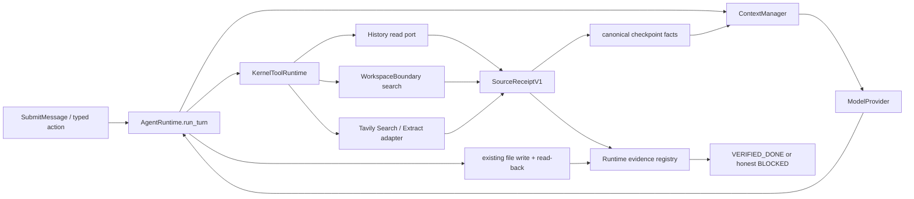
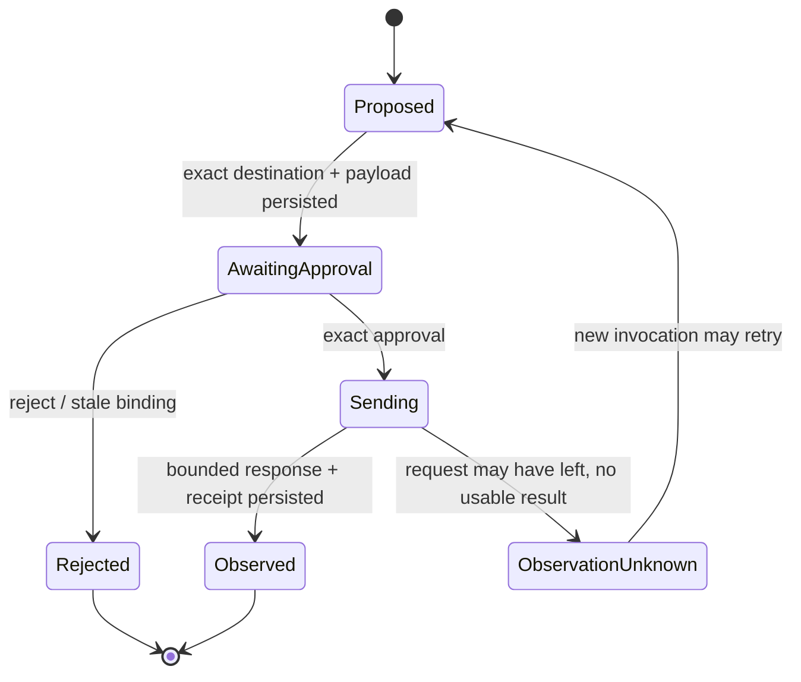

# 014 Grounded Workspace Knowledge Agent

## Goal Capsule

把 013 已验证的日常 workspace Agent 扩展为一个有依据的当前 workspace 知识 Agent：它能按需找回当前
workspace 中与用户共同经历过的 First Agent 历史，安全检索当前 workspace，经过精确外发批准查询
公开 Web，并始终通过唯一 `AgentRuntime.run_turn` production 入口产出带可核对来源的本地结果。旅程可由
多次 typed action、approval 和跨重启调用组成。它仍从当前目录和最小权限
开始，不观察 First Agent 之外的活动，不创建第二套 research/history loop。

成功必须由一条跨重启纵向旅程证明：旧决定、当前文件约束和公开时效信息都来自 durable、bounded、
带 provenance 的 source receipt；写入产物经过现有审批和 read-back；`VERIFIED_DONE` 只证明已接纳的
结构化验收条件，而不是模型自报或“文中出现 URL”。

交付边界是 014 的全部 Implementation Units、离线 E1/E2/E2M、真实 Model + Web E3、完整回归和 fresh
review 全部通过。阶段性 Green、缺真实配置、额度中断、截断输出或 executor 自报都不是完成。

## Product Contract

### Summary

014 增加当前 workspace 历史检索、workspace intelligence、受治理的公开 Web search/extract、统一来源回执、
带引用的 research-to-artifact 和只读 outcome projection。所有能力都通过现有 Runtime、ContextManager、
ToolRuntime、approval、checkpoint 和 evidence 边界组合，用户不需要选择 chat/research/task 模式。

### Problem Frame

013 已经能自然聊天并完成 bounded workspace 文件任务，但它无法主动找到旧会话里的决定，无法高效搜索
较大的 workspace，也无法核对会变化的外部事实。结果是用户仍要复述背景、手工找文件、另开浏览器后把
信息复制回来；Agent 即使写出报告，也只能证明“文件写成功”，不能证明来源确实在本次受治理旅程中被
读取。

简单地加入一个 Web client 或把所有历史塞进 prompt 会破坏已经稳定的边界：历史会变成第二套 Memory，
网页会带来隐式外发和 prompt injection，搜索结果会被误当作权威，checkpoint 也会被大段网页撑爆。
014 因而以 just-in-time primitive tools、closed provenance、精确外发批准和独立 citation oracle 为核心，
而不是建立一个新的“研究 Agent”。

### Requirements

- **R1 — 同一自然语言入口。** 用户继续只通过 `first-agent` 提问、讨论和委托任务；不得增加
  chat/research/code 模式选择、pre-runtime 模型分类器或第二个 Runtime。
- **R2 — 当前 workspace 历史。** `history_search` / `history_get` 只检索当前 exact workspace 中由 First
  Agent canonical checkpoint 保存的会话、Goal、决定、证据和终态。它们不得读取其他 workspace、
  TUI/event log、Graphify、`.ua/`、Claude/Codex 会话或环境活动。
- **R3 — 历史不是当前权威。** 历史用户陈述、assistant prose、Goal、evidence、blocked/cancelled outcome
  必须区分来源。历史只能证明过去发生过什么，不能授予当前权限、Goal scope、Memory admission 或完成
  条件；当前用户输入和当前 Goal 始终优先。匹配到修订、撤销或先后关系无法证明的冲突历史时，必须同时
  展示相关状态/顺序并标注冲突，不能静默挑一条当成当前决定。
- **R4 — 有界 workspace intelligence。** Agent 能按相对路径/名称查找、全文检索和有界分段读取普通文本；
  必须复用 `WorkspaceBoundary` 的 no-follow、private/sensitive denial、protected inode 和 workspace-relative
  规则，并限制遍历项、文件数、总字节、深度、匹配数、片段长度和 deadline。
- **R5 — 显式公开 Web 外发。** `web_search` 与 `web_fetch` 只在 non-secret Web profile 已启用时注册；每个
  exact bounded query 或 URL batch 在第一次网络发送前展示固定 destination、成本类别和完整 payload，
  第三方数据处理边界和现有 approval。拒绝、stale binding 或配置变化时 network call count 必须为零。
- **R6 — 固定远端获取边界。** 014 只调用一个明确的官方 JSON Search/Extract API destination；不直接从
  用户机器连接模型生成的任意 host，不抓搜索引擎 HTML，不继承 proxy/cookie/Authorization/ambient env，
  不允许登录、表单、上传、JS/browser、crawl 或 authenticated Web。
- **R7 — Closed source provenance。** history、workspace、Web 的成功结果都必须生成 Runtime 可验证的
  `SourceReceiptV1`：source kind、stable source ID、origin locator、observed time、bounded content digest、
  truncation 状态和 receipt digest。Web locator 不保存 query/fragment；完整 approved URL 只保留 digest。
  search snippet 与 extracted page 必须是不同 receipt kind。
- **R8 — 不可信内容隔离。** 历史 assistant prose、workspace 文本、search snippet 和 extracted Web 内容都以
  untrusted tool result/context 进入模型；其中“忽略规则、扩大权限、修改文件、记住、确认完成”等文本不能
  改变 policy、approval、Goal、criterion、Memory 或 source authority。
- **R9 — 来源级远程披露。** ContextManager 根据受验证的结果元数据投影
  `first_agent_history`、`workspace_excerpt`、`public_web_content` 等 closed data classes。新增类别或模型
  destination 变化时，旧 provider disclosure receipt 失效；不得按工具名或正文猜类别。
- **R10 — 可核对的研究产物。** 同一 Runtime 能把当前 workspace 历史、文件和公开 Web 组合成 Goal，经过
  文件写审批产出本地 artifact 与 canonical citation sidecar，再分别 read-back 并验证 manifest 与本次 durable
  source receipts 一一对应。模型自造 URL、旧 receipt、只搜索未 extract 的伪引用或被修改后的 artifact/sidecar
  都不能通过。
- **R11 — 诚实的 grounded 退出。** 014 的 closed citation oracle 只证明 artifact digest、引用映射、source
  observation 和 Goal/revision binding；它不宣称每个自然语言论断都被语义蕴含。凡回答声称过去决定、当前
  workspace 事实或时效性 Web 事实，必须先取得相应有效来源。来源缺失、stale、truncated/incomplete 或互相
  冲突时，必须展示限制并拒绝伪造引用、确定性结论或内容正确性的承诺。语义质量只能由冻结 E3 oracle 或
  明确用户确认验收。
- **R12 — Outcome projection。** 结果历史从 canonical Goal、evidence 和 tool facts 确定性派生，明确区分
  `verified_delivery`、`blocked`、`cancelled`、`failed` 和 `acceptance_unknown`。无纠正不等于满意，模型
  自报不等于成功；不得新增 outcome ledger、optimizer loop 或自动 Memory/Skill 晋级。
- **R13 — 可恢复。** 检索、网络 observation、artifact write 和 citation verification 的安全下一步必须跨
  重启可重建；结果未知的外部 observation 不得成为 evidence，可用新 request 重新观察；现有文件 effect
  的 unknown-outcome 语义不得被弱化或重复执行。
- **R14 — 易用且可见。** 普通本地问答仍不制造 Goal；需要 Web 时只询问精确外发边界，复杂研究才建立
  durable Goal。默认输出展示来源、时间、截断/失败、批准、进展和最终证据，不暴露内部 digest/ID 噪音，
  也不要求用户反复输入“继续”。Everyday 任务不得因累计 model/tool/token 数量停止；单次资源边界继续有限，
  只有连续独立 model response 重复相同停滞才消耗紧急熔断 allowance，同一 tool batch 不能重复计数。
- **R15 — 兼容与交付证据。** 012/013 reference journeys、provider adapters、Memory、Skill、MCP、SubAgent、
  Scheduler、TUI 与 materialized install 不回归。helper 直调、FakeProvider 或 MockTransport 不能冒充
  production-boundary E2、materialized E2M 或真实 E3。

### Key Product Decisions

- **PD1 — 历史默认严格 workspace-scoped（Governs R2, R3, R13）。** 选择当前 exact workspace，而不是
  “搜索用户全部 First Agent 历史”。跨 workspace task fact 在现阶段仍是 stop-ship privacy leak；稳定 owner
  preference 继续由既有 owner-preference seam 提供。新目录、不同 workspace 或被安全排除的 legacy history
  必须明确显示当前作用域，014 不用“个人全局记忆”措辞透支承诺。
- **PD2 — Web 每次精确批准（Governs R5, R6, R14）。** 选择 query/URL batch 级 approval，而不是隐式联网
  或 session-wide 网络权限。初版多一次确认，换取可审计外发；可撤销 Goal/session grant 留待真实 dogfood
  证明需求后再设计。
- **PD3 — 研究结果默认写回当前 workspace（Governs R10, R14）。** 014 只产出用户可拥有、可检查的本地
  artifact 与 citation sidecar，不发布、发消息或写外部服务。两个 exact targets 分别复用现有 file approval
  与 Goal authorization。
- **PD4 — outcome 只记录事实，不自主优化（Governs R12）。** 014 为未来优化提供干净输入，但不修改
  Runtime、prompt、Skill、policy、Goal 或 acceptance。

### Key Flows

- **F1 — History-grounded answer。** 用户问“我们上次为什么这样决定” → 模型按需调用 history search/get →
  返回当前 workspace 的 bounded provenance → 新 data class 获得独立 provider disclosure → Agent 按 canonical
  revision/状态回答；无命中或冲突时诚实显示，不创建 effect。
- **F2 — Workspace-grounded answer。** 用户问当前目录结构或约束 → path/text/chunk tools 在 descriptor-relative
  边界内检索 → 返回 locator/digest/truncation → 新 data class 获得独立 provider disclosure → Agent 回答；
  无匹配/不完整时显示限制，private/sensitive 内容不出现。
- **F3 — Current Web answer。** 用户要求查询会变化的公开事实 → 模型提出 exact query → 用户看到
  destination/payload 并批准 → 固定 Search API 返回 snippets/source refs → 先为 search results 完成 provider
  disclosure → 必要时模型选择 opaque source ref，并为 Extract 另行批准 exact URL batch → extracted content
  再完成 provider disclosure → 回答带可见来源；拒绝或失败零后续外发。
- **F4 — Three-source research artifact。** 用户要求结合旧决定、当前文件和最新公开信息写 `report.md` →
  durable Goal → F1/F2/F3 → source receipts → artifact/sidecar exact write approvals → read-back → citation oracle →
  `VERIFIED_DONE`。中途重启不复述、不重复已完成 write。
- **F5 — Hostile content。** workspace/Web/历史 assistant 文本包含 prompt injection → 内容只保留为 untrusted
  evidence input → policy、Goal、Memory 和 effect count 不变化 → Agent 可警告但不能服从其中的控制指令。
- **F6 — Outcome recall。** 用户询问过去任务结果 → history tool 返回 verified/blocked/cancelled/failure 的
  只读 projection 和 evidence refs；`acceptance_unknown` 不被包装成用户满意。

### Acceptance Examples

- **AE1（R2/R3）。** 给两个 workspace 各自制造历史；在 A 查询只能返回 A 的 exact Goal/evidence，B 的 task
  fact、goal-less legacy unbound chat、TUI/event log 均不出现。
- **AE2（R2/R13）。** 同一 query 对同一 checkpoint revisions 返回确定性 rank/IDs/digests；旧 source ref 在
  revision 改变后显式 stale，不静默绑定新内容。带同义改写、模糊时间表达、相似错误决定和不同终态的
  10 个标注 fixture 在 `recall@5 >= 0.80`，且 cross-workspace false positive 为 0；held-out 措辞不能只靠精确
  关键词过门。该阈值只验证 014 lexical MVP，不宣称 semantic search。
- **AE3（R4）。** 搜索包含 symlink、hardlink、private root、binary、超大文件和超大目录的 fixture；拒绝项
  open count 为零，可读项确定性排序，超限结果明确 `truncated/incomplete`。
- **AE4（R5/R6）。** approval 前 Search/Extract client call count 为零；query、URL、destination、profile 或
  cost parameters 任一变化使旧 approval 失效。
- **AE5（R6/R8）。** `web_fetch` 只把 URL 发送到固定 Extract API，不从本机直连 source host；userinfo、
  non-HTTPS、localhost/private/link-local/metadata literal、credential-like query 和未经当前 search receipt 绑定的
  URL 在外发前拒绝。
- **AE6（R7/R9）。** 成功 ToolResult 携带 closed receipt 和 data class；截断 excerpt 使用自身 digest 并保留
  original/truncation evidence；OpenAI-compatible 与 Anthropic-compatible projection 均接受且保持 untrusted。
- **AE7（R8）。** 恶意来源要求写文件、记忆内容、扩大权限或弱化验收；未得到当前 user fact/approval 时，
  Goal/authority/Memory/effect count 均不变化。
- **AE8（R10/R11）。** 交换 source digest、伪造 URL、只引用 search snippet、删除 citation、修改 artifact
  或使用 fake receipt 后，citation oracle 全部 fail；正确 read-back artifact 才能生成 passed evidence。
- **AE9（R12）。** `VERIFIED_DONE`、BLOCKED、CANCELLED、fatal failure 和未终结会话投影为不同 outcome；
  assistant 说“用户满意”或没有 correction 都不能生成 `user_confirmed_acceptance`。
- **AE10（R13/R15）。** 在 search 前、外发后未得结果、fetch 后、write `EXECUTING` 后分别中断；恢复后
  observation 可新取但旧未知响应不作证，文件 effect 不重复，012/013 回归仍 Green。
- **AE11（R11/R14）。** F1/F2 直接回答不要求模式或“继续”；search-only 恰好一次 Web approval，
  Search+Extract 恰好两次互不复用的 exact approval，provider disclosure 不计入 Web approval。No-match、
  incomplete、search-only、extract-failed、stale、approval-rejected 和 source-conflict 均有确定用户可见状态；
  普通回答给有限结论/可选改写，citation-required Goal 在证据不足时诚实 BLOCKED。
- **AE12（R15）。** intended Git tree 的 clean-room install 从 neutral cwd 运行 reference journeys；源码工作树
  helper、editable import、未跟踪 `tui/`、Graphify 或 host credential 不能进入证据。

### Scope Boundaries

#### Now

- 当前 exact workspace 的 First Agent history search/get 与 bounded outcome projection。
- workspace path/text/chunk intelligence。
- 一个固定官方 Search/Extract API 的 public Web search/fetch。
- typed source receipts、来源级 context disclosure、citation/read-back evidence。
- history-only、workspace-only、Web-only 与跨重启 three-source artifact 旅程。

#### Deferred to Follow-Up Work

- 显式跨 workspace history、vector/semantic index、物理删除、retention/export/backup/encryption。
- 本机直连任意 URL、浏览器、authenticated Web、cookies/forms/OAuth、PDF/多媒体、crawl/cache。
- 临时 multi-root、shell/process、外部服务写入、后台 scheduler/daemon。
- outcome 驱动的 improvement proposal、benchmark/canary/promotion 和任何自主修改。

#### Never in 014

- 观察或记录 First Agent 之外的电脑活动。
- 自动注入全量历史或自动联网。
- 把网页、文件、tool output、assistant prose 或模型推断晋级为 owner preference/admission authority。
- 新建 history/research/Web agent loop、dynamic registry、durable cursor、第二份事实权威或 provider-side workflow。
- 登录、付款、发布、消息发送、内网/metadata 访问或扩大整机权限。

## Planning Contract

### Context & Research

- `agent/runtime/loop.py` 已是唯一 model/tool loop，并在 effectful tool 前要求 durable Goal；014 的 Web read
  需要把“domain side effect”与“network egress”正交建模，不能直接伪装为普通本地 read，也不能让简单 Web
  问答被迫成为文件任务。
- `agent/runtime/context.py` 已支持 `ContextPack.data_classes` 和 provider disclosure，但当前多数 tool result
  只归类为 `tool_results`；014 必须从受验证 metadata 投影 closed source classes。
- `agent/continuity/sessions.py` 严格、bounded、no-follow 地加载 checkpoint，但当前总 checkpoint 上限会被
  terminal history 撞满；014 需要把 active startup candidate 上限与只读 history horizon 分离。
- `agent/tools/path_safety.py` 是 workspace filesystem authority；递归搜索必须在 descriptor-relative walker
  内实现，不能 shell-out `rg`。现有 `list_entries()` 只限制返回量、不限制扫描量，不能直接复制。
- `agent/memory/source.py` / `agent/runtime/context.py` 的 source scope、candidate validation、token/item budget 与
  priority 需要先补 production composition 证据，避免新 history 放大旧 seam 的隐患。
- 既有 evidence registry 能重算 filesystem/tool/user evidence，但不能证明 artifact citation 与本次 source
  receipts 的 linkage；014 需要一个 closed、Runtime-owned oracle。
- Tavily 官方 Search/Extract API 提供固定 HTTPS JSON destination、structured results 和 source extraction；
  初版选它可以避免从本机直连模型任意 URL。实现只用 `/search` 与 `/extract`，关闭 answer、raw-content
  search、images、auto parameters、crawl 和 research endpoint。
- OWASP SSRF 指南仍用于 URL admission：即使实际 fetch 由远端 Extract 服务完成，本机也必须拒绝 non-HTTPS、
  userinfo、localhost/private/link-local/metadata literal，防止把明显危险或敏感 URL 外发给第三方。

### Key Technical Decisions

- **KTD1 — 所有新增能力是静态 governed tool registrations。** History、workspace、Web callable 都进入唯一
  `KernelToolRuntime`；research-to-artifact 只是现有 Runtime 的多步旅程。拒绝 ContextSource 自动联网、
  history daemon、planner/executor 双 loop 和 dynamic provider registry。**Governs R1, R5, R10, R13。**
- **KTD2 — 新会话获得 immutable workspace binding。** `open_workspace_session` 用已解析的
  `WorkspaceIdentityV1` 构造带 binding 的初始空 state，并由 `LocalCheckpointStore.initialize` 一次写入；
  `build_composition` 只校验 session identity 与 binding，不修改 checkpoint。Checkpoint v3 decoder 严格识别
  v2/v3：v2 映射为 `binding=None`；新 checkpoint 只写 v3；goal-bound v2 仅在 Goal exact identity 匹配时由首次
  `AgentRuntime.run_turn` CAS 填入 binding，goal-less v2 永不猜测或重写并标为 `legacy_unbound`。升级中断可由
  原 v2 重试，v3 不承诺被旧二进制读取。**Governs R2, R3, R13。**
- **KTD3 — History 是 canonical checkpoint 的只读 bounded projection。** 不复制到 Memory、不维护 cursor 或
  index authority。每个 workspace state directory 的 v1 safety capacity 为 256 个 canonical checkpoint files
  （每个 conversation 一个）：startup
  在容量内检查全部 checkpoint，再最多展示 16 个 active candidates；terminal checkpoint 不再挤占 active
  candidate 上限。达到容量时现有 session 仍可启动和查询，创建第 257 个 conversation 明确
  `history_capacity_exceeded`，不删除历史。History tool 在结果/byte budget 内返回 bounded results +
  `incomplete`，只阻断要求“完整历史”的任务。Search receipt 绑定完整 catalog snapshot；get ref 绑定同 catalog
  本轮签发的 immutable record snapshot，避免 Runtime 保存 search result 时让 ref 自我失效，同时对记录修改/删除
  fail stale。**Governs R2, R3, R12, R13。**
- **KTD4 — Workspace search 扩展 `WorkspaceBoundary`。** Descriptor-relative walker 在 open 前执行 private/
  sensitive/no-follow/hardlink checks，扫描与输出分别有 hard cap；不 subprocess `rg`。**Governs R4, R8。**
- **KTD5 — `EgressClass` 与 `SideEffectClass` 正交。** Web observation 保持 domain `READ_ONLY`，同时绑定
  `PUBLIC_NETWORK` egress、ALWAYS approval、exact destination/payload 和 retry metadata。Crash 后未知响应永远
  不作 evidence；`RecoverUnknownObservation` 只在 Runtime 内把遗留 PUBLIC_NETWORK executing 变成无 receipt 的
  durable unknown result，绝不发送网络；允许用新 invocation 重新观察。**Governs R5, R6, R13, R14。**
- **KTD6 — Tavily 是 014 唯一 Web adapter。** 使用 injected `httpx.Client(trust_env=False)` 调固定
  `https://api.tavily.com/search` 与 `/extract`；key 只从显式 env name 在 composition root 注入。`web_fetch`
  只消费当前 conversation durable search receipt 的 opaque source ref；v1 不接受任意 user/model URL，永不本机
  直连 target host。
  **Governs R5, R6, R15。**
- **KTD7 — Kernel 铸造结构化来源结果。** source-producing 工具全集是 `history_search`、`history_get`、
  `list_files`、`read_file`、`search_paths`、`search_text`、`read_file_chunk`、`web_search`、`web_fetch`；它们只能
  返回 bounded `ToolExecutionOutput`。Kernel 校验 metadata，追加 conversation/run/Goal/revision/tool/intent identity
  （无 Goal 时显式 null）并生成/验证 `SourceReceiptV1`
  后作为普通 ToolResult fact 持久化。既有非来源工具继续使用显式稳定的普通输出与 `Known*` outcome union，
  不提供隐式 compatibility fallback。任何 callable 都不能伪造 ToolResult、evidence 或 data class。
  **Governs R7, R8, R9。**
- **KTD8 — ContextManager 独占来源选择与披露。** Source/tool 只声明 closed metadata；ContextManager 验证
  scope/digest/truncation、执行 source priority 和 token/item caps，再投影 untrusted blocks/data classes。
  **Governs R3, R7, R8, R9。**
- **KTD9 — Citation oracle 从 raw durable facts 重算。** `RESEARCH_PROVENANCE` 只接受当前 Goal/revision 的
  source receipts、exact artifact read-back、同目录 canonical `CitationManifestV1` JSON sidecar 和 admitted
  predicate；manifest 固定 artifact path/digest、Goal/revision、citation marker、source/receipt digest 和自身
  digest。它验证 linkage/minimum/freshness，不验证自然语言语义；UI 只能称其为 `verified_delivery`，不能称
  结论正确或用户已接受。**Governs R10, R11, R12。**
- **KTD10 — Outcome 是 projection，不是 ledger。** `OutcomeProjector` 只读 checkpoint；用户接受只有明确
  user-confirmation evidence 才成立，其他终态保持准确分类。**Governs R3, R11, R12。**

### Assumptions

- **A1（未由用户单独确认）。** 014 的 first live Web backend 采用 Tavily，因为它同时提供官方 Search 与
  Extract JSON API，并把任意 source host 访问隔离在固定第三方 destination。公开条款允许 Tavily 处理
  Customer Input，因此 014 只允许用户看见并批准的公开 query/URL，不承诺 third-party zero retention/deletion，
  operator 文档必须准确披露。若官方合同、数据处理边界或 API 形状不再满足 R5/R6，executor 输出
  `014_IMPLEMENTATION_BLOCKED(reason=web_contract_drift|web_trust_policy_unaccepted)`，不能静默替换 provider。
- **A2（未由用户单独确认）。** 256 conversation files 是 workspace state directory 的初版 safety capacity，
  不是“长期记忆无限”承诺。U3 必须用 013/014 journeys 记录每任务/会话的文件密度和可理解覆盖范围；容量内
  普通启动与 bounded history 始终可用，达到容量只阻止创建新 conversation。后台索引、retention 和归档属于
  后续里程碑。
- **A3（未由用户单独确认）。** Citation closed oracle 的通用最低保证只包含 provenance linkage；每个 Goal
  需要的来源数、新鲜度和语义质量由 admitted criteria 与 E3 决定。

### High-Level Technical Design



Web approval 与结果状态：



`ObservationUnknown` 不进入现有 effectful `ResolveUnknownToolOutcome` 用户猜测流程；它没有可用于完成的
source receipt，也不能被引用。新观察具有新的 invocation/time/digest，旧 request 只作为失败事实保留。

### System-Wide Impact

- **Contracts/checkpoint：** 新增 conversation workspace binding、egress metadata、typed execution output、
  source receipt、research evidence kind；所有字段 strict encode/decode、size bounded、CAS/replay safe。
- **Runtime/ToolRuntime：** prepare/approval/intent/invoke/result 必须携带 exact egress 和 source metadata；仍由
  Runtime 在 invoke 前后 checkpoint，失败分类不得削弱现有 write/external unknown-outcome。
- **ContextManager/providers：** 验证来源 metadata，执行 per-source budget/priority，按 closed data class 触发
  disclosure；两类 provider adapter 只序列化统一 ContextPack，不增加业务分支。
- **Continuity/history：** 只读 catalog 复用 strict checkpoint loader，区分 256 total safety capacity、16 active
  display cap 和 result budget；坏 checkpoint、identity drift、unbound legacy、超限都 fail closed 或诚实 incomplete。
- **Filesystem：** 新 walker 复用现有 descriptor boundary；对扫描量和输出量分别计数，拒绝时不得 open 目标。
- **Web：** profile 是 non-secret metadata；API key 只在 composition 内存。Search/Extract client 不继承 host
  proxy/env，在 decode 前限制 response bytes，不记录正文/header/key/query；tool result 只存 bounded excerpts/
  query-free locators/receipts。用户看见并批准第三方数据处理边界。
- **Evidence/UI：** CLI/TUI/headless 只渲染 typed approval/source/outcome/evidence view；不能在 adapter 中核验
  citation 或自行推进状态。
- **Delivery：** materialized verifier 以 013 seal 为 parent，覆盖新增源码、测试、脚本与文档；未跟踪 `tui/`
  和开发辅助产物永不进入 manifest。

### Risks & Dependencies

- **历史成为第二权威。** Mitigation：KTD2/KTD3/KTD10；只读 canonical projection，命中后回查 exact
  checkpoint，任何旧内容低于当前用户/Goal authority。
- **ContextSource 旧 seam 放大。** Mitigation：U1 先修 scope split、candidate validation、budget 和 priority，
  用真实 composition 测试而非手工同值 fixture。
- **网络数据泄露/成本。** Mitigation：KTD5/KTD6；fixed destination、exact approval、bounded payload、无 ambient
  credentials、profile drift 使 approval 失效。
- **Web prompt injection。** Mitigation：R8、来源级 untrusted projection、authority/admission negative tests 和
  fresh security review。
- **Citation laundering。** Mitigation：KTD7/KTD9；search/fetch receipt kind 分离，raw facts 重算，fake/旧/
  tampered receipt mutation tests。
- **Checkpoint/context 膨胀。** Mitigation：不保存整页 cache，只存 bounded excerpt + receipt；hard byte/item
  caps、clipping digest 和 E2M capacity tests。
- **Live Web 波动。** Mitigation：deterministic local fixture 是主 E2 oracle；live E3 只验证真实 destination、
  approval、source availability 和用户价值，记录 observed time/limitations，不替代离线门。
- **Tavily 外部依赖。** Dependency：官方 `/search`、`/extract`、API key 和可接受的数据处理条款；任何 drift
  用准确 blocked reason 停止，不添加 compatibility fallback。

### Sources & References

- `STRATEGY.md`
- `docs/architecture/KERNEL_ARCHITECTURE.md`
- `docs/architecture/EXTENSION_CONTRACTS.md`
- `docs/architecture/012_TRUSTED_CONTINUITY_DESIGN.md`
- `docs/architecture/013_EVERYDAY_WORKSPACE_AGENT_DESIGN.md`
- `docs/architecture/CAPABILITY_EVIDENCE_CLOSURE_CONTRACT.md`
- `docs/acceptance/CAPABILITY_REFERENCE_TASK_PROTOCOL.md`
- Tavily Search API: <https://docs.tavily.com/documentation/api-reference/endpoint/search>
- Tavily Extract API: <https://docs.tavily.com/documentation/api-reference/endpoint/extract>
- Tavily API introduction: <https://docs.tavily.com/documentation/api-reference/introduction>
- Tavily Platform Terms（reviewed 2026-08-04）: <https://www.tavily.com/terms>
- Tavily Privacy Policy（reviewed 2026-08-04）: <https://www.tavily.com/privacy>
- OWASP SSRF Prevention Cheat Sheet:
  <https://cheatsheetseries.owasp.org/cheatsheets/Server_Side_Request_Forgery_Prevention_Cheat_Sheet.html>

## Implementation Units

### U0 — Freeze baseline and 014 contract

**Traces:** R1-R15; F1-F6; AE1-AE12; KTD1-KTD10.

**Files:** `STRATEGY.md`, `docs/architecture/014_GROUNDED_PERSONAL_KNOWLEDGE_AGENT_DESIGN.md`,
`docs/acceptance/014_GROUNDED_PERSONAL_KNOWLEDGE_AGENT_E3.md`,
`docs/implementation/014_EXECUTION_LOG.md`, `tests/architecture/`, `tests/reference/`.

**Approach:** 记录 HEAD、工作树类别、现有 full gates 和 013 seal；用 architecture/reference Red tests 冻结
唯一 loop、当前 workspace history、无自动联网、Tavily fixed destination、source receipt/citation oracle 和
stop markers。不得读取或纳入未跟踪 `tui/`。

**Test scenarios:** baseline 完整通过；删除/改变任一 stop-ship invariant 时相应 architecture test 准确 Red；
旧 012/013 claims 仍由原测试拥有，不复制断言。

**Exit:** execution log 保存命令、exit code、测试数、pre-existing 状态和第一条准确 Red。

### U1 — Context scope and source boundary hardening

**Traces:** R3, R8, R9, R15; AE6; KTD8.

**Files:** `agent/runtime/context.py`, `agent/composition.py`, `main.py`, `agent/memory/source.py`,
`tests/kernel/test_context_manager.py`, `tests/kernel/test_context_budgeting.py`,
`tests/memory/test_integration.py`, `tests/cli/test_everyday_entrypoint.py`, provider projection tests.

**Approach:** 分离 exact `workspace_identity_digest` 与 Memory/history 使用的 `context_scope_digest`；验证 source/
candidate name、scope、digest、snapshot、item/token cap 和 truncation；显式 source priority 为当前输入/Goal >
workspace source > owner preference。ContextManager 继续是唯一纳入/裁剪 owner。除 scope 混用和 R9 metadata/
data-class 路径外，每项 hardening 必须先有一个 014 production composition Red；不能复现的通用加固记录为 deferred，
不得借本单元重写既有 Memory 行为。

**Test scenarios:** 真实 `main → composition → MemoryContextSource` 能召回同 scope；scope mismatch 零召回；
oversized/lying snapshot、wrong digest/name/scope fail closed；clipped excerpt 有独立 digest/provenance；两个 provider
adapter 保持 untrusted/data-class projection。

**Exit:** focused Memory/context/provider suites Green；没有 source 能绕过 ContextManager budget。

### U2 — Typed source, egress and recovery foundations

**Traces:** R5-R9, R13; AE4, AE6, AE10; KTD5, KTD7, KTD8.

**Files:** `agent/runtime/contracts.py`, `agent/runtime/tools.py`, `agent/runtime/context.py`,
`agent/runtime/checkpoint.py`, `agent/runtime/state.py`, `agent/runtime/loop.py`, restart view、kernel/provider/checkpoint tests.

**Approach:** 新增 closed `EgressClass`、仅供 KTD7 明列 source-producing tools 使用的 bounded `ToolExecutionOutput`、
`SourceReceiptV1`、`SourceAuthorityBinding` 和 observation outcome；prepare/intent/approval/result/replay 全链绑定
exact metadata。Runtime 从当前 canonical search fact 解析 opaque ref，生成包含 fact/receipt/conversation/request/
canonical URL 的 immutable authority binding，callable 不读 checkpoint。`ExecutingIntentRecord` 持久化 side effect、
egress/operation/request identity；`RecoverUnknownObservation` 必须绑定 conversation/action_seq/expected_revision/
tool_call_id/intent_digest，只允许处理 persisted PUBLIC_NETWORK executing，确定性且恰好一次追加无 receipt/evidence
的 `observation_unknown`、推进 cursor 并生成 replay result，绝不发网络；WRITE/EXTERNAL recovery 不变。Kernel
铸造 durable source fact，
ContextManager 从 receipt kind 映射 data class。

**Test scenarios:** source callable 伪造 ToolResult/evidence/data class、ordinary legacy output parity、metadata oversized/
non-JSON、receipt digest mutation、forged/stale/cross-conversation source ref、approval payload/destination/cost drift、
approval bookkeeping revision 不自我失效、crash before/after egress、typed recovery stale/replay/exactly-once、retry
新 identity、old unknown response zero evidence、checkpoint round-trip/
capacity、provider disclosure resend。

**Exit:** kernel E1/E2 与 checkpoint/provider suites Green；网络 observation 可批准但不被误当 domain mutation。

### U3 — Conversation binding and bounded history tools

**Depends on:** U2。

**Traces:** R2, R3, R12, R13; F1, F6; AE1, AE2, AE9; KTD2, KTD3, KTD10.

**Files:** `agent/runtime/contracts.py`, `agent/runtime/checkpoint.py`, `agent/continuity/sessions.py`,
`agent/history/contracts.py`, `agent/history/catalog.py`, `agent/history/tools.py`, `agent/history/outcomes.py`,
`agent/composition.py`, `main.py`, `tests/history/`, continuity/checkpoint tests.

**Approach:** 按 KTD2 实现 v2/v3 decode 与 Runtime-owned lazy binding CAS；新 checkpoint 初始化即带 immutable
binding。实现只读 catalog、`history_search`、`history_get`、OutcomeProjection；只加载当前 scope + exact identity
可证明的 canonical checkpoint。校准 256 total safety capacity、16 active display cap 与 result budget；rank 使用
canonical revision/conversation/fact position，不使用 mtime/model time。当前 conversation 已由 ContextManager 直接
提供，production HistoryCatalog 排除它，防止本轮问题命中自身并伪装成旧证据。不得写 index/Memory。

**Test scenarios:** history answer、同义改写/干扰决定 top-k recall、两个 workspace 隔离、workspace replacement、
v2 goal-bound lazy migration、v2 goal-less exclusion/visible count、migration interruption/retry、corrupt/oversized/
unknown entry、17+ terminal sessions、256 capacity、stale ref、current correction/conflict precedence、五类 outcome、
raw tool inventory 不泄露。

**Exit:** history E1 与 model-tool-Runtime E2 Green；startup 不再因 terminal history 误失败；记录 checkpoint
density、可理解覆盖范围和 held-out retrieval verdict。

### U4 — Descriptor-relative workspace intelligence

**Depends on:** U2。

**Traces:** R4, R7, R8; F2; AE3; KTD4, KTD7.

**Files:** `agent/tools/path_safety.py`, `agent/tools/search.py`, `agent/tools/file_ops.py`, `agent/composition.py`,
`tests/tools/test_workspace_search.py`, path/file/composition tests.

**Approach:** 增加 `search_paths`、`search_text`、`read_file_chunk` primitive registrations；统一 walker 在
descriptor boundary 内对扫描与输出独立计数，返回 deterministic locator、excerpt/content digest、encoding、
truncation。既有 `list_files` / `read_file` 同步进入 U2 source receipt/data-class 合同，`write_file` / `edit_file`
及纯 effect result 保持普通输出。不要 subprocess、watcher 或索引服务。

**Test scenarios:** 正常路径/文本/分段、Unicode/invalid UTF-8、binary、symlink/hardlink、ancestor swap、private root、
protected inode、deep/wide tree、deadline/bytes/matches cap、deterministic ordering 和 zero-open denial。

**Exit:** workspace E1/E2 Green，四个旧 file tools 行为不回归。

### U5 — Fixed Tavily Search/Extract tools

**Depends on:** U2。

**Traces:** R5-R8, R13-R15; F3, F5; AE4, AE5, AE7, AE10; KTD1, KTD5-KTD7.

**Files:** `agent/web/profile.py`, `agent/web/contracts.py`, `agent/web/client.py`, `agent/web/safety.py`,
`agent/web/tools.py`, `agent/composition.py`, `main.py`, `tests/web/`, CLI/profile/composition tests.

**Approach:** 实现 strict non-secret `WebProfileV1` 与一个 Tavily adapter；固定 base destination 和 `/search`、
`/extract`，key 仅从 profile 指定 env name 注入，`httpx` client 不继承 host env。Search 返回 opaque source refs；
fetch 只接受 current durable search ref。URL admission 拒绝 credential-like query；receipt locator 去除 query/
fragment，只保存完整 approved URL digest。Client 在 JSON decode 前 streaming 限制 decompressed bytes，并严格
校验 Content-Type、JSON depth/result/field caps。关闭 Tavily answer/raw-content search、images/auto/crawl/research。
Operator 文档明确：query/URL 会发送给 Tavily 并受其条款处理，First Agent 不承诺第三方 zero retention/deletion。

**Test scenarios:** profile strict/atomic/no-secret、未配置不注册且零网络、exact approval、auth/rate/protocol/timeout
分类、query/URL bounds、signed/token URL rejection、unsafe URL preflight、source-ref tamper/stale/cross-conversation、
wrong/missing content type、compressed/unknown-length oversized response、deep/oversized JSON、malicious content、client
request shape；全部离线使用 injected transport。

**Exit:** Web E1 与真实 model → Runtime → approval → client → result → next-context E2 Green；无 direct target-host
transport path。

### U6 — Provenance-aware context and research evidence

**Depends on:** U2-U5。

**Traces:** R7-R12; F4-F6; AE6-AE9; KTD7-KTD10.

**Files:** `agent/runtime/evidence.py`, `agent/runtime/contracts.py`, `agent/runtime/state.py`, 必要时
`agent/runtime/loop.py`, `agent/runtime/context.py`, `tests/continuity/test_research_evidence.py`, verified/context tests.

**Approach:** 增加 Runtime-owned `RESEARCH_PROVENANCE` admitted predicate/oracle；从当前 Goal/revision 的 raw
ToolResult receipts、artifact read-back 和 canonical `CitationManifestV1` sidecar 重算 citation linkage、minimum
sources、required kinds 和 freshness。Outcome projector 只消费同一 canonical facts。Provenance-only criterion 只能
生成 `verified_delivery`；事实结论被接受还需要冻结语义 oracle 或明确 user-confirmation evidence。系统提示和 UI
准确说明 semantic-support caveat 与 injection boundary。

**Test scenarios:** valid three-source artifact；fake/old/stale/swapped receipt、search-only citation、invented URL、
missing citation、artifact mutation、wrong Goal/revision、insufficient/freshness failure、assistant self-report；
`verified_delivery` 与 user acceptance 分离。

**Exit:** mutation oracle 全部 Red→Green；只有 correct read-back + receipts 能 `VERIFIED_DONE`。

### U7 — Everyday composition, UX and reference journeys

**Depends on:** U1-U6。

**Traces:** R1-R15; F1-F6; AE1-AE11; KTD1-KTD10.

**Files:** `main.py`, `agent/composition.py`, `agent/cli/`, `agent/tui/`（仅已跟踪产品代码）, system policy，
`tests/reference/test_014_grounded_personal_knowledge.py`, CLI/TUI/headless tests.

**Approach:** 在默认 composition 中静态拼接已配置能力；CLI/TUI 只翻译 typed action 和渲染 source/approval/
outcome/evidence。统一 `SourceView` 展示 source kind、可读 locator/title、observed state、完整/截断/失败以及
search-only/extracted 区别，advanced view 才显示 opaque ref。实现 source provider-disclosure、no-match/partial/error
和 resume typed-state matrix：持久化 observation 继续、awaiting approval 恢复 exact preview、observation unknown
只允许新 request、WRITE 复用既有 recovery、完成 write 不重放。建立 deterministic fixtures 跑 history-only、
workspace-only、Web-only、three-source artifact、restart、injection、false-completion journeys。任何 adapter 都不能
调用模型或工具。

**Test scenarios:** 六条 F flow；no mode/no continue；search-only 一次、Search+Extract 两次 exact Web approval；
provider disclosure/Web/write approval 不混淆；no-match/incomplete/search-only/extract-failed/stale/rejected/conflict/
restart states；CLI/TUI/headless 的 Web approval 都显示 third-party handling notice，notice version/digest drift 使
profile、pending approval 失效且 network count=0；quiet output 不隐藏 destination/source kind/truncation/blocker；
surface parity；012/013 regression。

**Exit:** 014 reference E2 全通过；一次完整 journey 证明唯一 Runtime 内的纵向价值。

### U8 — Materialized delivery and operator documentation

**Depends on:** U7。

**Traces:** R14, R15; AE12.

**Files:** `README.md`, `STRATEGY.md`, packaging metadata，`scripts/verify_014_materialized_tree.py`,
`docs/implementation/014_DELIVERY_SEAL.json`, architecture/acceptance/implementation docs and tests.

**Approach:** 从 intended Git tree 构造 closed overlay，parent 绑定 013 seal；neutral cwd、non-editable install 跑
deny-network 默认与 controlled local fixture journeys。文档只声明已验证能力，明确 Web config、外发、成本、
history scope 和 deferred boundaries。

**Test scenarios:** base install 无额外 browser/search SDK 依赖（复用 `httpx`）；未跟踪/ignored/private/loop 临时
文件 membership mutation；content/control seal；README 命令实际可运行；Web 未配置时普通 013 能力照常工作。

**Exit:** E2M membership/content/control gates Green，ordinary files 全受 seal 控制。

### U9 — Real Model + Web E3

**Depends on:** U8。

**Traces:** R1-R15; F3, F4, F5; AE4-AE12.

**Files:** `scripts/run_014_e3.py`, `docs/acceptance/014_GROUNDED_PERSONAL_KNOWLEDGE_AGENT_E3.md`,
secret-free receipt path, E3 harness tests.

**Approach:** 使用五个显式配置变量中的两个 credential values（Model、Tavily），临时 home/state/workspaces，走无参数 product
composition 和真实 adapters。冻结非敏感公开主题、bounded request/tool/write counts、timeout、来源数和 artifact
oracle；连续三次通过才作为 live receipt。不得读取 `.env` 或 host Claude/Codex 配置。

**Test scenarios:** zero sends before provider disclosure/Web approval、真实 Search+Extract、cross-workspace isolation、
three-source artifact/restart/citations、malicious public fixture、secret-free receipt、offline baseline comparison。

**Exit:** 三次 receipt claims 全 true；失败使用 Verification Contract 的准确 blocked marker，不伪造完成。

### U10 — Full gates and fresh independent review

**Depends on:** U9。

**Traces:** R1-R15; AE1-AE12.

**Files:** 全部本轮 diff、execution log、delivery seal、E3 receipts。

**Approach:** 运行未截断 full gates；fresh reviewer 不信任 executor，主动攻击第二 loop、history leak、scope
confusion、network-before-approval、profile/key leak、source/citation forgery、prompt injection、false completion、
restart duplication 和 E2M contamination。固定 E3 通过后，reviewer 另选未写入 fixture 的 history 释义和不同
公开 Web 主题，运行一次同预算 production value journey，防止只对已知措辞过拟合。P0/P1/P2 findings 必须回到
对应 U-ID Red→Green，再 fresh review；P3 作为 advisory 记录，不阻止 pass。

**Test scenarios:** complete suite、materialized suite、manifest mutation suite、真实 receipts 和 architecture search；
reviewer 输出结构化 finding 或 exact pass marker。

**Exit:** 只有 `014_REVIEW_PASS` 结束 loop。

## Verification Contract

### Layered gates

- **E0 — Source shape：** closed contracts、static composition、无第二 loop/registry/direct target fetch。
- **E1 — Component：** history/workspace/Web/source/evidence 的确定性 happy/error/mutation tests。
- **E2 — Production boundary：** 模型可见 tool call → Runtime → policy/approval → checkpoint → callable →
  ToolResult → next ContextPack；禁止 helper 直调替代。
- **E2M — Materialized：** intended Git tree、neutral cwd、non-editable install、closed overlay/seal。
- **E3 — Accepted value：** 真实模型 + Tavily、临时 workspace、公开主题、three-source artifact、跨重启、真实
  citations、secret-free receipt。

### Required commands

完成前至少运行以下未截断命令并记录 exit code 与测试数：

```bash
git diff --check
.venv/bin/ruff check .
.venv/bin/python -m pytest -q -rx
.venv/bin/python scripts/verify_014_materialized_tree.py --check-membership
.venv/bin/python scripts/verify_014_materialized_tree.py --content
.venv/bin/python scripts/verify_014_materialized_tree.py --control-seal
```

E3 的唯一权威命令由 acceptance 文档定义。Timeout、截断、无 exit code、只跑 focused tests 或先前 run 的
结果都不能替代当前完整 gate。

### Stop-ship conditions

- 未经批准的 Model/Web/write send/effect 或重复 effect 非零。
- 任意跨 workspace task/history fact 泄漏，或 legacy unbound chat 被猜测召回。
- Web/历史/文件内容改变 Goal、authority、Memory admission、criterion 或 completion。
- source receipt、citation、outcome 或 `VERIFIED_DONE` 可由模型/fixture伪造。
- 自动联网、自动全量历史注入、direct target-host fetch、第二 loop/Runtime/durable cursor/dynamic registry。
- secret、完整敏感正文、private path、untracked `tui/`、Graphify/UA artifact 进入 checkpoint/context/receipt/seal。
- 012/013 frozen reference、provider parity、materialized install 或 full tests 回归。

### Loop stop markers

- 离线与 E2M 全 Green、五项真实配置全部缺失：
  `NEEDS_014_E3_CONFIG(required=FIRST_AGENT_014_E3_PROVIDER,FIRST_AGENT_014_E3_BASE_URL,FIRST_AGENT_014_E3_MODEL,FIRST_AGENT_014_E3_API_KEY,FIRST_AGENT_014_E3_WEB_API_KEY)`
- 真实 bounded attempt 失败：
  `014_E3_BLOCKED(reason=<incomplete_config|model_auth|model_endpoint|web_auth|web_rate_limit|web_protocol|source_unavailable|provider_protocol|product_no_progress|product_invalid_provider_response|product_invalid_model_control|product_invalid_model_output|product_output_truncated|product_conversation_capacity|timeout>)`
- 实现阶段遇到无法由代码解决的已冻结合同变化：
  `014_IMPLEMENTATION_BLOCKED(reason=<web_contract_drift|web_trust_policy_unaccepted|architecture_contract_conflict>)`
- executor 闭合 U0-U9 与 full gates：`014_EXECUTOR_READY_FOR_REVIEW`
- reviewer 有 P0/P1/P2：`014_REVIEW_FINDINGS`
- fresh review 无 P0/P1/P2（可附 P3 advisory）：`014_REVIEW_PASS`

Claude/Codex quota、429、overloaded、正常退出无 marker、阶段性 Green 和单个 unit 完成都不是 product marker；
外部 Loop Engineering 从 execution log 第一个未闭合 gate 接力。

## Definition of Done

- R1-R15 每项都有至少一个 E2 证据，F1-F6 和 AE1-AE12 有可复现 verdict。
- history 只读、current-workspace、bounded、identity-safe；current correction/Goal 高于历史。
- workspace search 走 descriptor-relative boundary，扫描与输出都受限，private/sensitive 零泄漏。
- Web 只走固定 Tavily Search/Extract destination，每次 exact approval，零 ambient secret/proxy/direct fetch；用户
  明确知道 query/URL 由第三方处理，产品不承诺远端 retention/deletion。
- 所有 grounded results 有 Runtime-validated SourceReceipt 和 untrusted/context data-class 语义。
- three-source artifact 与 `CitationManifestV1` sidecar 在跨重启 production journey 中分别经 write approval、
  read-back、citation oracle 后才 `VERIFIED_DONE`；mutation oracle 无漏网；默认 UI 只称
  `verified_delivery`，不把 provenance 说成内容真理或用户接受。
- outcome projection 不夸大用户满意，不自动修改任何产品能力。
- 012/013、full source suite、materialized suite、Ruff、diff check 全部未截断 Green。
- 真实 Model + Web E3 连续三次 claims 全 true，receipt 不含 key、正文、绝对 private path 或 host config。
- fresh independent reviewer 输出 `014_REVIEW_PASS`；execution log、acceptance evidence 与 delivery seal 一致。
- 未 commit/push/tag/改 remote，除非用户在完成后另行明确授权。

## Appendix

### Executor reading order

1. `AGENTS.md`
2. `STRATEGY.md`
3. `docs/architecture/KERNEL_ARCHITECTURE.md`
4. `docs/architecture/EXTENSION_CONTRACTS.md`
5. 本计划的 Goal Capsule、当前 U-ID、Verification Contract、Definition of Done
6. `docs/architecture/014_GROUNDED_PERSONAL_KNOWLEDGE_AGENT_DESIGN.md`
7. `docs/acceptance/014_GROUNDED_PERSONAL_KNOWLEDGE_AGENT_E3.md`
8. `docs/implementation/014_EXECUTION_LOG.md`
9. 当前 status/diff 和当前 U-ID 引用的代码/测试

### Planning-owned resolved questions

- History v1 只查 current exact workspace；跨 workspace 延后。
- Web v1 选择固定 Tavily Search/Extract，不从本机 direct fetch source host。
- Web 使用 per-call exact approval；session/Goal grant 延后。
- Citation oracle 证明 provenance linkage，不伪称 semantic entailment。
- Outcome 只读派生，不创建 optimizer 或 promotion。
