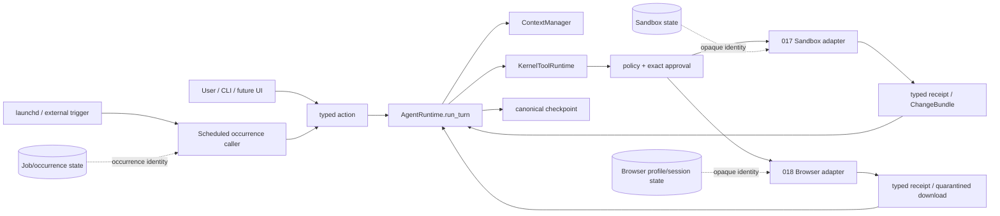

# 017–019 Governed Execution Program

> **Design correction 2026-08-27（用户裁决，仅 017）**：本 program design
> 中 017 的 Docker/container 方向（§4 的 environment/snapshot/ChangeBundle/
> proxy 细节、state-face 表中 Sandbox store 的 snapshot/ChangeBundle 列、
> 「先建立 sandbox 才能给下载…边界」的容器化叙述）已被 corrected native
> sandbox 设计取代——见
> `docs/superpowers/specs/2026-08-27-native-sandbox-design.md`。用户已批准
> 撤销 Docker 方向并重做 native design；书面 spec 当前为
> proposed-for-user-review，批准后另轮冻结。018/019 章节不受影响。既有
> Docker 017 artifacts 全部 superseded。

## 1. 决策摘要

First Agent 下一阶段不直接追求“接管整台电脑”，而是连续交付三项可组合、可恢复、可审计的能力：

1. **017 Sandboxed Workspace Execution**：在真实隔离环境中完成命令、代码、测试和构建任务。
2. **018 Governed Browser Tasks**：在 First Agent 专用浏览器身份中完成有界网页任务。
3. **019 Durable Background Runs**：由系统触发器唤醒一次性 Runtime occurrence，持续完成前两类有界任务。

三项能力采用 **local control plane + governed execution environments**：Goal、checkpoint、权限、审批和
evidence 仍由本机 First Agent 拥有；sandbox、browser 和 scheduler 只是受治理的执行环境或 external caller，
不得拥有第二套 model/tool loop。

本设计推翻以下捷径：

- 不把现有 same-UID `local_process` 称为 sandbox。
- 不把 Tavily Search/Extract 称为 browser automation。
- 不把现有 occurrence adapter 称为后台常驻调度器。
- 不默认接管用户日常 Chrome、cookies、鼠标、键盘或整个桌面。
- 不用一个“万能 environment manager”同时拥有浏览器、进程、凭据、调度和 Agent 状态。

## 2. 为什么按 017 → 018 → 019 排序

浏览器任务会下载文件、生成产物、运行校验器，也会遇到不可信网页内容；后台任务又必须安全地复用浏览器和
命令能力。先建立 sandbox，才能给下载、代码执行和产物交付一个不直接污染主机的边界。浏览器能力稳定后，
后台调度才能复用已经验证的权限、恢复和 receipt，而不是把风险藏进 daemon。

箭头表达的唯一行动路径是：

`typed action → AgentRuntime → ToolRuntime policy/approval → EXECUTING checkpoint → adapter effect → result checkpoint`。

## 3. 不可破坏的共同合同

### 3.1 唯一 owner

- `AgentRuntime.run_turn` 仍是唯一 production model/tool loop 和 checkpoint mutation owner。
- `ContextManager` 仍独占模型上下文选择和预算。
- `KernelToolRuntime` 仍独占 callable admission、policy、approval 和 invoke。
- provider adapter 仍只做 `ContextPack → ModelResponse`。
- Browser、Sandbox 和 Scheduler 都不能自行调用模型、修改 Goal、批准自己、保存 Agent cursor 或声明
  `VERIFIED_DONE`。

### 3.2 三个状态面必须分离

| 状态面 | 保存什么 | 不保存什么 |
| --- | --- | --- |
| Conversation checkpoint | Goal、phase、approval、effect/result、evidence reference | cookie、sandbox filesystem、job secret |
| Sandbox store | environment identity、snapshot、resource usage、ChangeBundle | Goal authority、provider credential |
| Browser store | profile/session identity、browser-owned login state、site binding | raw login secret、Agent transcript |
| Job store | schedule definition、occurrence identity、expiry、concurrency key | model cursor、预先伪造的 effect receipt |

checkpoint 只保存外部状态的 opaque identity、revision 和 digest。外部状态丢失、版本漂移或身份不匹配时，
Runtime 必须暂停并重新验证，不能按当前代码为旧状态重新签名。

### 3.3 State 不是 authority

- 已存在 browser profile 不等于允许在该账号上执行任意操作。
- 已存在 sandbox 不等于允许联网或把修改写回主机。
- 已存在 schedule 不等于预先批准未来的外部提交、购买、发送、删除或 host merge。
- approval 必须绑定当前 Goal/revision、environment/profile/job identity、exact action 和 bounded policy。

### 3.4 Unknown outcome 不自动重放

adapter 一旦可能已经产生 effect，但无法确认结果，必须进入现有 unknown-outcome recovery。恢复只能通过读取
可信状态、重新观察或用户分类来完成；不能因为 retryable transport error 就盲目重复点击、提交、命令或 merge。

### 3.5 凭据与不可信内容

- credential 只在 composition root 注入，永不进入模型上下文、checkpoint、event、receipt 或 execution log。
- 网页、命令输出、下载文件和 sandbox 产物都是 untrusted data，不能授予权限或修改 system policy。
- login、2FA、CAPTCHA 和支付验证由 user takeover 完成；模型不观察用户输入的秘密。

## 4. 017 — Sandboxed Workspace Execution

### 4.1 用户结果

用户可以要求 First Agent 在当前 workspace 的隔离副本中运行 shell、脚本、测试、构建和代码生成。命令即使
写坏依赖或文件，也不能直接修改主机 workspace；产物通过可审查的 `ChangeBundle` 返回，用户批准后才由现有
governed file path 应用到主机。

“任意 shell 命令”只在 sandbox 内成立，不代表 host shell、sudo、TTY、后台 daemon 或宿主机任意路径权限。

### 4.2 深模块边界

017 新增一个小而深的 `SandboxEnvironment` port。它只负责：

- 按冻结 spec 创建隔离 environment；
- 在 environment 内执行 exact request；
- 捕获 bounded output、resource usage 和 filesystem delta；
- 输出 typed execution/cleanup receipt；
- 销毁或按显式 TTL 暂存 environment。

它不认识 Goal、Memory、Provider、ContextPack 或 approval。`sandbox_exec` 等 governed tool 的 callable 只把
ToolRuntime 已批准的请求交给该 port。production 初期只有一个合格 adapter；测试 fake 是依赖注入替身，不是
第二条产品路径。

### 4.3 Environment contract

每个 environment 至少绑定：

- backend kind/version 与 immutable image digest；
- source workspace snapshot manifest/digest；
- writable sandbox root 与只读 base image；
- CPU、memory、process count、disk、wall-clock、output 和 command-count limits；
- network policy identity；
- environment TTL、created-at、last-used-at 和 cleanup state。

默认不挂载 host home、SSH agent、Docker socket、cloud metadata、系统 keychain、父进程 environment 或 provider
credential。workspace 使用 copy-in snapshot，不使用默认 host read-write mount。

### 4.4 命令和 shell

底层 request 始终保存 exact executable、argv、cwd 和 environment policy。用户明确要求 shell 语义时，可以把
`/bin/sh -lc <script>` 作为 sandbox 内的 exact argv 执行；UI 必须展示完整脚本摘要和 digest。不得把 shell
字符串传给 host `local_process`，也不得因 sandbox 隔离而省略资源与网络限制。

在同一 sandbox lease 和冻结 policy 内，低风险的内部文件修改、测试和构建不逐条询问。以下边界需要新的
exact approval 或暂停：

- 扩大 network policy；
- 导入新的 host 路径或敏感输入；
- 导出/merge ChangeBundle 到主机；
- environment identity、image digest 或 workspace revision 漂移；
- 请求突破资源上限。

### 4.5 Network policy

017 v1 只提供 closed union：

1. `OFF`：默认；无外部网络。
2. `PACKAGE_REGISTRY`：仅访问产品冻结的 package registry preset，绑定 ecosystem、domain、port 和 TLS。
3. `EXACT_ALLOWLIST`：用户批准的 exact HTTPS domain + port 集合。

每次 DNS resolution、redirect 和 connection 都重新核对 policy；默认拒绝 raw IP、localhost、LAN、link-local、
cloud metadata 和未列出的 redirect target。v1 不做通用 credential broker，也不把代理变量偷偷注入 sandbox。

### 4.6 ChangeBundle

Sandbox 只能输出 `ChangeBundle`，至少包含：

- base workspace digest；
- added/modified/deleted path manifest；
- per-file size/digest 和 bounded diff summary；
- generated artifact metadata；
- producing command/environment/network receipt digests。

应用 ChangeBundle 是一个独立的主机 effect：先验证 base 没漂移，再展示 exact paths 和冲突，经过现有 approval、
`EXECUTING` checkpoint 和 read-back evidence。bundle 本身不是完成证据；只有主机 read-back 或明确交付的 sandbox
artifact receipt 才能满足对应 criterion。

### 4.7 Backend qualification gate

设计不假设用户已经安装 Docker，也不把 Python subprocess 当隔离。017 的 U0 首先用同一合约评估 macOS 上
可分发的 local container/VM backend，必须实证：filesystem/process/network 隔离、deterministic image、资源上限、
crash cleanup、无 ambient secret、可重复安装。只选择一个 production adapter进入实现；若没有候选满足合同，017
停在 `BLOCKED_BACKEND_QUALIFICATION`，不能降级为 same-UID execution。

### 4.8 017 reference journeys

- 隔离副本中运行测试并生成 report，主机在 merge 前零变化。
- 经 `PACKAGE_REGISTRY` 安装依赖，访问任意其他 domain 被拒。
- shell pipeline 只能在 sandbox 内运行，不能读取 host home 或 socket。
- ChangeBundle preview、批准、base drift 冲突与 read-back。
- timeout/OOM/process-limit、adapter crash、cleanup unknown 和 restart recovery。
- 伪造 environment/receipt、旧 snapshot、redirect/DNS policy escape 全部 fail closed。

## 5. 018 — Governed Browser Tasks

### 5.1 用户结果

用户可以让 First Agent 打开网页、读取页面、填写表单、下载文件，并在明确批准后完成发送、提交或其他后果性
动作。它使用 First Agent 专用浏览器身份，不默认接管用户日常 Chrome。

018 v1 使用 **Chromium + Playwright**，因为 BrowserContext、storage state、structured locator 和真实浏览器行为均
有成熟合同。浏览器 automation 与页面语义留在 `agent/browser/`；通用 sandbox 不认识 DOM、cookie 或网页动作。

### 5.2 Profile 模式

018 提供两个明确模式，由 Runtime 根据任务风险选择并向用户展示：

- `EPHEMERAL`：未知站点、公开读取、一次性任务；关闭后删除 session state。
- `PERSISTENT_SITE_ACCOUNT`：用户明确选择的 site + account identity；用于需要登录的重复任务。

持久 profile 按 `site trust root + account label` 隔离，一份 profile 同时只允许一个 writer session。profile store
使用 owner-only 权限，checkpoint 只保存 opaque profile ID/revision/digest。用户可查看、停用和清除 profile。

v1 不支持 attach 到个人 Chrome、复制整个用户 profile、读取现有 cookies 或跨站共享 login state。这类能力未来
若出现，必须成为独立高风险模式和新验收合同。

### 5.3 Login 与 user takeover

需要登录、2FA、CAPTCHA、密码或支付验证时：

1. Runtime 暂停 Agent action；
2. 打开受控、可见的浏览器窗口；
3. 用户完成输入并显式交还控制；
4. Browser adapter 只记录登录状态 revision/digest，不读取或保存输入内容；
5. 页面重新 observe 后才允许后续 Agent action。

用户 takeover 不能自动批准之后的发送、购买、删除或账号变更。

### 5.4 Observation 与 action

主要 observation 是 bounded accessibility/DOM snapshot，截图只用于视觉补充。v1 只开放 typed actions：

- navigate / back / reload；
- observe / find；
- click / select / scroll；
- fill（secret field 除外）；
- upload sandbox artifact；
- download 到 sandbox quarantine；
- close session。

不开放任意 JavaScript evaluation、browser extension、DevTools filesystem、系统级 file picker 或任意下载执行。

### 5.5 Domain 与后果性 action policy

018 v1 只提供两个 closed navigation policy：

1. `PUBLIC_READ_EPHEMERAL`：仅限未登录的 ephemeral session；可自主访问通过 SSRF 检查的公开 HTTPS origin，
   但不能 fill、upload、submit、下载后执行或携带 persistent profile state。
2. `SITE_BOUND_INTERACTIVE`：绑定 exact origin 集合和一个 persistent/ephemeral profile；每次 navigation、popup、
   iframe target 和 redirect 都核对最终 origin，新 origin 必须批准。

两种 policy 不能在 session 中静默切换。任何 credentialed action 都使用 `SITE_BOUND_INTERACTIVE`，不能用公开读取
policy 自动扩域。

低风险观察和站内导航在已批准 policy 内自主执行。以下 final commit 必须 exact approval：

- 发送消息、邮件、评论或表单；
- 发布、购买、预订、转账、接受法律条款；
- 删除、覆盖、取消、账号/权限/隐私设置变更；
- 上传用户文件或披露新的敏感数据；
- 任何模型无法可靠判断后果的操作。

approval 绑定 profile/site/origin、observation digest、target locator、action、parameters 和可见后果摘要。页面 revision、
target 或 origin 漂移会使 approval 失效。

### 5.6 Prompt injection 与下载

网页内容永远只是 untrusted source。页面要求“忽略规则”“读取本机秘密”“访问其他网站”“授权插件”时，不能改变
Goal、policy 或 tool authority。若页面内容与用户目标冲突或诱导高风险 action，Runtime 暂停并给出 bounded 风险摘要。

download 先进入 017 sandbox quarantine，记录 URL/origin、MIME、size、digest 和 scan/result metadata；不能直接
打开、执行或写入 host workspace。上传只能选择 sandbox 中已批准的 exact artifact。

### 5.7 Browser receipt 与恢复

每个 action receipt 至少绑定：session/profile revision、pre/post observation digest、origin、typed action、target、
network attempts、download/upload digest 和 outcome class。

- 已知未执行：可以安全重新规划。
- 已知执行：重新 observe/read-back，不能盲目重复。
- 结果未知：进入 recovery，用户或可信页面状态分类。
- profile/session 丢失：保留 Goal，要求重新登录或重建，不伪称延续。

### 5.8 018 reference journeys

- 公开站点检索、跨页面整理并生成带 provenance 的结果。
- test account 的 user takeover 登录，重启后复用 site/account profile。
- 填写表单草稿自主完成，final submit 前 exact approval。
- 用户拒绝 submit 后继续可用的只读分析，零提交。
- prompt-injection fixture、跨域 redirect、popup/iframe 和 stale locator fail closed。
- 下载进入 sandbox quarantine，校验后形成 ChangeBundle；未批准前 host 零变化。
- click 后 crash/unknown outcome 通过重新 observe 或用户分类恢复，不重复 effect。

## 6. 019 — Durable Background Runs

### 6.1 用户结果

用户可以创建一个有开始时间、截止时间、次数、资源和权限上限的后台任务。到点后系统只唤醒一次
`first-agent-schedule` occurrence；它打开独立 checkpoint，调用同一个 `AgentRuntime.run_turn`，完成一段有界工作后
退出。后台能力不是常驻自治 Agent。

019 v1 的系统触发器是 **macOS launchd**。跨平台、云队列或多机 worker 不在 v1 承诺中。

### 6.2 Job definition

`ScheduledJobV1` 至少冻结：

- job identity/revision、owner workspace 和自然语言任务；
- schedule expression 的已解析触发集合或明确 next occurrences；
- starts-at、expires-at、required `max_occurrences`；
- per-occurrence deadline、model/tool/action budgets；
- allowed sandbox policy 与 browser profile/site policy references；
- concurrency key；
- completion/needs-human notification policy。

v1 不允许无限 occurrence。`schedule_create/update/pause/resume/cancel` 是独立的 governed tools：模型只能提出
typed candidate，`KernelToolRuntime` 展示完整 schedule/policy/expiry 并取得 exact approval 后，才能调用静态注入的
JobStore/launchd adapter。CLI/TUI 仍只翻译 typed action，不直接写 job。只读 list/status 可以在无需新 authority 时
执行。批准 job definition 只允许 §6.4 的后台 envelope，不是对未来任意 effect 的空白授权。

### 6.3 Trigger 与 durable occurrence

launchd plist 只保存非秘密的 job locator，并调用一次 CLI。真正语义仍由现有 Scheduler external-caller seam拥有：

- `job_id + job_revision + occurrence_id + scheduled_for` 确定唯一 checkpoint；
- duplicate fire 只 replay，不重复 provider/effect；
- waiting、approval、recovery 和 limits 都是 durable state，不靠存活进程；
- worker 完成一轮、进入等待或达到 budget 后退出，释放并发槽位。

系统时间回拨、missed fire 和 overlapping fire 必须有 deterministic policy；默认不补跑过期 occurrence，除非用户在
job definition 中显式选择 bounded catch-up count。

### 6.4 后台可做与不可做

019 v1 可预授权的 envelope 只有：

- 已批准站点 policy 内的浏览器只读观察；
- 已批准 sandbox policy 内的命令、测试、构建和 artifact 生成；
- 写入 job-owned result/artifact store；
- 产生待用户审阅的 BrowserAction candidate 或 ChangeBundle。

019 v1 不预授权：对外发送/提交/购买/删除、账号设置变更、扩大网络/文件范围、host workspace merge。遇到这些
动作，occurrence 保存 `needs_human` 并退出；用户批准后由同一个 Runtime typed action 恢复。

### 6.5 Retry、并发与取消

- 只对明确 known-not-executed 的 read-only/idempotent action做 bounded retry。
- effect 可能发生或 outcome unknown 时不自动 retry。
- 同一 browser profile 只能一个 active writer；同一 workspace merge、job 或 concurrency key 串行。
- cancel 阻止未来 occurrence，并通过既有 Runtime 语义处理当前 occurrence；不伪称撤销已发生 effect。
- expiry、max occurrence、resource budget 任一到达即停止新工作并产生 bounded 状态摘要。

### 6.6 通知

本地通知只包含 job label、状态、时间和一条安全 next action，不包含网页正文、credential、命令原始输出或用户文件
内容。通知是 advisory；checkpoint 和 receipt 始终是权威事实。

### 6.7 019 reference journeys

- 定时运行 sandbox tests，生成 artifact，不自动 merge host。
- 定时读取已批准网站，生成变化摘要，不执行后果性网页动作。
- duplicate/overlap fire 不重复 provider、browser action 或 sandbox command。
- worker crash 后从 checkpoint 恢复，已执行 effect 不重放。
- 等待 browser submit 或 ChangeBundle merge approval 时 worker 已退出；批准后准确恢复。
- max-occurrence、expiry、deadline、cancel、missed-fire/catch-up 全部 bounded。
- profile/environment/job revision 漂移导致 needs-human，不静默切换。

## 7. 跨阶段 authority 矩阵

| 操作 | 默认 | 可由一次 session/job policy 覆盖 | 始终 exact approval |
| --- | --- | --- | --- |
| Sandbox 内文件/测试/构建 | 在冻结 environment 内允许 | 是 | 扩 scope/network/resource 时 |
| Sandbox network | OFF | registry 或 exact domain policy | 新 domain/credential |
| ChangeBundle 应用到 host | 禁止 | 019 v1 不允许预批 | 是 |
| Browser 公开观察 | 已批准 origin 内允许 | 是 | 新敏感 origin |
| Browser 填写草稿 | 已批准 origin 内允许 | 是 | 新敏感数据披露 |
| Browser send/publish/purchase/delete | 禁止 | 019 v1 不允许预批 | 是 |
| Login/2FA/CAPTCHA | Agent 不输入 | 否 | user takeover |
| Job occurrence 启动 | 仅有效 job | 是 | job create/change |

批准不是按每一次低风险 click 或 sandbox file write机械弹窗；它按稳定 policy envelope监督。只有扩大用户意图、
数据范围、权限或产生不可逆/对外后果时才再次询问。

## 8. 失败与恢复矩阵

| 情况 | Runtime 结论 | 自动动作 |
| --- | --- | --- |
| adapter 在 effect 前明确失败 | known-not-executed | 可重新规划，bounded retry |
| effect 已执行且 receipt 完整 | known-executed | read-back / verify，不重复 |
| effect 可能执行、receipt 不完整 | unknown-outcome | 暂停，重新观察或用户分类 |
| environment/profile/job identity 漂移 | authority invalid | 重新绑定/批准，不重签旧数据 |
| browser prompt injection | untrusted conflict | 不授权；安全摘要/必要时询问 |
| sandbox cleanup 无法证明 | cleanup unknown | 禁止 reuse，保留诊断，needs-human |
| schedule 重复触发 | replay | 返回同一 occurrence result |
| budget/TTL/expiry 到达 | bounded stop | 保存恢复点或终止未来 occurrence |

## 9. 交付与验收程序

三个 milestone 分别拥有 frozen design、implementation plan、E3 acceptance、execution log 和独立 review；不能用
一个总 receipt 模糊跨阶段缺口。

每阶段采用以下 gate：

1. **U0 Design/feasibility**：冻结 owner、authority、identity、failure taxonomy 和 backend qualification。
2. **U1 Deterministic**：Red→Green 的 codec/policy/state/effect-ordering/mutation oracle；Fake 只能证明合同。
3. **U2 Materialized real E3**：从 sealed source 构建安装物，在真实 adapter 上连续三轮 reference journeys；receipt
   绑定 source root、verifier、install artifact、environment/browser/trigger identity。
4. **U3 Fresh review**：没有参与实现的 reviewer 独立检查产品旅程、架构唯一 owner、权限和 false-completion oracle。

测试节奏固定为：

- 每个 Red/Green 原子单元只跑 focused tests、touched Ruff 和 `git diff --check`；
- 一个稳定 milestone 实现结束后跑一次完整 source suite；
- materialized tree 跑一次完整离线 gate，再跑真实 E3；
- review 修复只重跑受影响 focused gate，最终冻结前再跑一次完整 gate。

不在每修一个小问题后重复全量测试，也不把超时、截断输出、旧 receipt 或部分 Green 当作完成。

最终集成旅程必须证明：launchd 唤醒一个后台 occurrence，在专用 browser profile 中读取任务信息，在 sandbox
中处理并生成 ChangeBundle，遇到 host merge 或后果性网页 action 时持久等待用户批准，重启后从同一 Runtime
恢复且零重复 effect。

## 10. Claude Code / Codex Loop Engineering 协作

实现阶段遵循用户指定的执行策略：

- Claude Code（配置好的 GLM 5.3、`effort=max`）是主实现者；不修改其配置。
- Codex 负责拆目标、冻结材料、阶段审计和独立终裁；Claude 可用时不长期替代主实现者。
- 发生明确 429/TokenPlan 配额耗尽时，记录同一 session、错误、服务声明的恢复时间、当前原子单元、diff 和最后
  一个完整 gate；Claude 停在安全边界。
- 等待恢复期间 Codex 可接手同一原子单元继续实现，但不能与 Claude 并发修改同一工作树。
- 到精确恢复时间后，不中断进行中的 edit/test；先完成原子边界并写 handoff，再恢复同一 Claude session。若
  session 无法恢复，才用同材料创建新 session。
- fresh U3 reviewer 不能继承 executor 的 PASS，也不能同时担任该轮关键实现者。
- 不读取 `.env`/secret/private/runtime 或未跟踪 `tui/`，不 commit/push，除非用户另行明确授权。

## 11. 被拒绝的替代方案

### 11.1 个人 Chrome + same-UID shell + cron

实现快，但 profile、主机文件、network、process 和恢复边界都不成立；批准一次就可能暴露整个用户环境。拒绝。

### 11.2 全部委托单一云端 agent 平台

云端 browser/sandbox/workflow 产品已经证明了可行模式，但会把 profile、workspace artifact、job state 和 provider
信任主体同时迁移到外部。它可以成为未来显式 adapter，不是 local-first 默认 control plane。

### 11.3 一个通用 EnvironmentManager

Browser、Sandbox 和 Job 的 identity、lifecycle、authority 完全不同。把它们塞进一个动态 manager 会形成 service
locator 和新的巨石文件，删除后复杂度也不会真正消失。拒绝。

### 11.4 产品内 daemon / 自治无限 loop

持久性应来自 checkpoint + 外部 trigger，不来自永不退出的模型进程。daemon 会制造第二套 lifecycle、并发 owner、
credential 和升级问题。拒绝。

### 11.5 Sandbox 直接 read-write mount host workspace

这会让 sandbox 隔离只保护进程、不保护用户文件，也使每个内部写入立即成为 host effect。v1 采用 snapshot +
ChangeBundle。拒绝默认 RW mount。

## 12. 明确 non-goals

- 整机鼠标/键盘控制和任意桌面应用自动化。
- 读取或接管用户现有浏览器 profile、密码、cookies 或历史。
- sudo、host arbitrary shell、host background process、interactive TTY。
- 无限 schedule、常驻模型、静默自我修改或权限升级。
- Windows/Linux、云多租户、多设备同步和 production-ready 跨平台保证。
- 自动通过 CAPTCHA、绕过网站安全控制或规避服务条款。
- 把网页、sandbox 产物或 background success 自动写入 owner preference。

## 13. 研究依据

本设计吸收的是行业已经反复验证的边界，而不是照搬某一供应商产品：

- Playwright 用隔离的 BrowserContext 和显式 storage state 管理浏览器身份；认证状态属于敏感数据：
  [Browser contexts](https://playwright.dev/docs/browser-contexts)、
  [Authentication](https://playwright.dev/docs/auth)、
  [Playwright MCP modes](https://playwright.dev/docs/getting-started-mcp)。
- Browserbase 把持久 profile/context 与单站点、单账号 session 分开，并提醒避免同一 context 并发：
  [Browserbase Contexts](https://docs.browserbase.com/platform/browser/core-features/contexts)。
- OpenAI Cloud Browser 采用独立 browser/computer、独立登录状态和 consequential-action confirmation：
  [Using Cloud Browser in ChatGPT](https://help.openai.com/en/articles/20001280-using-cloud-browser-in-chatgpt)。
- Anthropic 建议 computer-use 部署在最小权限 VM/container，使用 domain allowlist，并对后果性动作做人类确认：
  [Computer use tool](https://platform.claude.com/docs/en/agents-and-tools/tool-use/computer-use-tool)。
- Daytona 和 Modal 分别展示了 namespace/container 隔离、持久 filesystem/snapshot、TTL、network deny/allowlist
  等 sandbox 基础：
  [Daytona Architecture](https://www.daytona.io/docs/en/architecture/)、
  [Daytona Persistence](https://www.daytona.io/docs/en/persistence/)、
  [Modal Sandboxes](https://modal.com/docs/guide/sandboxes)、
  [Modal Sandbox V2](https://modal.com/docs/guide/sandbox-v2)。
- Temporal、Trigger.dev 和 Inngest 的共同模式是 durable state、外部 message/approval、等待时释放 worker、
  step result 持久化和 bounded retry：
  [Temporal Documentation](https://docs.temporal.io/)、
  [Trigger.dev Waitpoints](https://trigger.dev/docs/wait-for-token)、
  [Trigger.dev Concurrency](https://trigger.dev/docs/queue-concurrency)、
  [Inngest Function Execution](https://www.inngest.com/docs/learn/how-functions-are-executed)、
  [Inngest Concurrency](https://www.inngest.com/docs/functions/concurrency)。

## 14. 用户批准本设计后发生什么

批准本文只批准架构方向，不批准真实外部 effect。下一步使用 `superpowers:writing-plans` 生成可执行的三阶段计划：

1. 先写 017 backend qualification + frozen E3，再由 Claude Code loop 到独立 review；
2. 017 交付后冻结 018，不并行搭第二条执行路径；
3. 018 交付后冻结 019，最后跑跨阶段集成旅程。

每个阶段完成后先报告用户可见能力、证据和残余限制，再进入下一阶段；任一阶段不能因为后续设计存在就虚假
宣称已经可用。
