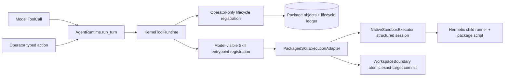
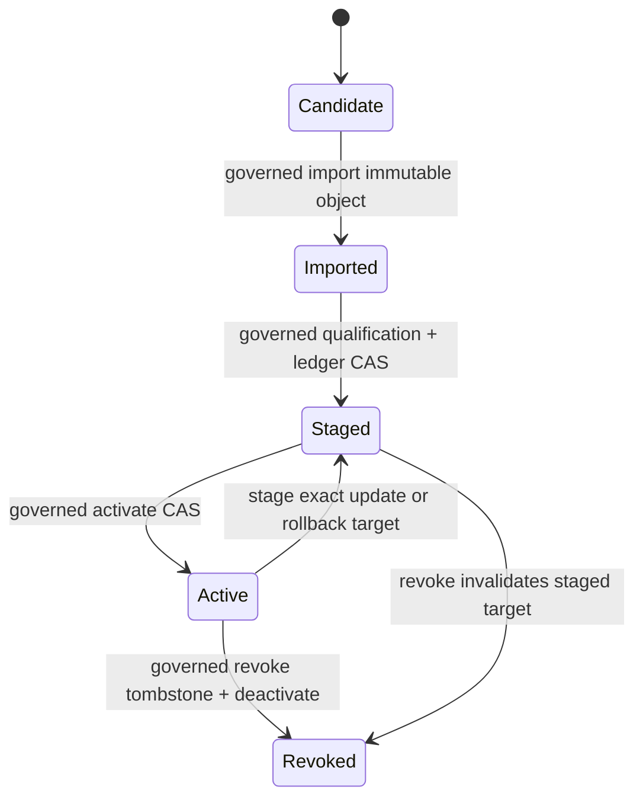

# 020–022 Governed Executable Skills、Package Lifecycle 与 Workspace Artifacts Design

> **状态说明**：本文是等待用户 review 的书面设计，不是已冻结实现 authority。
> 用户批准前不得进入 implementation plan 或修改 production code。2026-08-30 的三路
> Sol xhigh 审计 findings 已在本版关闭；批准后仍需按 slice 重新 detached review。

## 0. 裁决摘要

本 program 按依赖顺序 promotion 三个能力：

1. **020 Governed Executable Skills**：Agent Skills 中显式声明的 Python entrypoint
   可以执行；每个入口编译成独立 `ToolSpec`，经唯一 `KernelToolRuntime`、native
   sandbox、approval、`EXECUTING` checkpoint 和 result checkpoint 执行。
2. **021 Skill Package Lifecycle**：Skill 以 immutable content-addressed package
   安装；版本、portable requirements、host qualification、信任、激活与撤销均绑定
   exact digest，active set 用 CAS 切换且运行中不 hot reload。
3. **022 Workspace Artifacts**：PDF、DOCX、XLSX、PPTX 与 PNG/JPEG/WebP 作为
   first-party executable Skill packages，交付读取、创建、有限编辑/转换。

本轮明确**不做视觉模型能力**：不做 OCR、图片语义理解、目标/人脸识别、模型驱动/
生成式图像合成，也不把二进制图片送入 provider。允许完全由 closed recipe 决定的
deterministic raster construction 和像素/格式变换。

核心裁决：

- `AgentRuntime.run_turn` 继续是唯一 production model/tool loop 与状态变更入口；
- `KernelToolRuntime` 继续独占 model-visible **和 operator-only** tool 的 policy、approval、
  invoke 与 execution receipt；lifecycle mutation 也不能旁路它；
- package entrypoint 不 import 进 Agent 进程，只在 hermetic child runtime 中运行；
- child 不接收 workspace path：host no-follow snapshot 输入，child 只读 session inputs、
  只写 isolated staging，host 再 atomic commit exact approved target；
- packaged-Skill sandbox 采用 read/process allowlist；无法功能性证明时零 executable
  registrations，绝不回退到现有 allow-default profile 或 `local_process`；
- 不提供 `skill_run(path, command, args)`、shell/argv template、动态 registry、第二套
  loop、service locator、compatibility fallback 或 dormant feature flag。

## 1. 完成标准与非目标

### 1.1 020 Governed Executable Skills

完成必须证明：

- active package 的每个 entrypoint 具有稳定、独立、静态的 model-visible definition；
- exact package/manifest/requirement/qualification/entrypoint/policy identity 进入 ToolSpec、
  approval binding、sandbox command 与 durable result；
- approval 前零 spawn，durable `EXECUTING` 先于 spawn；
- input snapshot、structured result、staged artifact 全部 bounded、typed、digest-bound；
- revocation/ledger epoch/package/runtime/input drift 在 prepare 与紧邻 spawn 前 fail closed；
- backend/strict profile unavailable 时零执行，无 allow-default/local-process fallback；
- exit 0、stdout、自报 JSON 或 assistant prose 不能单独完成 Goal。

### 1.2 021 Package Lifecycle

完成必须证明：

- import、stage、activate、revoke、rollback 全部是 operator-only governed tools，经同一 Runtime
  approval、`EXECUTING` 与 result checkpoint；
- stage 不等于 activate；Runtime approval 绑定 exact preview/next snapshot digest；
- portable package identity 与 host qualification identity 分离，无 digest 循环；
- update/rollback 生成新 active revision，不覆盖旧 package；
- revoke 写 monotonic tombstone 并原子清除 active entry；
- active set 是 startup snapshot；epoch 变化后 packaged tools 立即 fail closed，重启才
  重组 definitions；
- action ID、expected token、next digest 支持 CAS conflict/UnknownCommit 精确 reconcile；
- activate 前编译完整 next active set，拒绝跨 package、reserved namespace/tool collision。

### 1.3 022 Workspace Artifacts

完成必须证明：

- PDF、DOCX、XLSX、PPTX 与 PNG/JPEG/WebP 都有 bounded inspect/read；
- 每类格式至少有本设计 closed schema 内的 create 与有限 edit/transform；
- child 无 workspace visibility/write authority，host 只 commit 一个 exact target；
- write 具有 sandbox receipt、host-minted mutation receipt 和 fresh binary digest read-back；
- active content、unsupported round-trip feature、corrupt/encrypted/bomb input 不会被静默
  stripping 或 partial success 冒充完成；
- sealed wheel + immutable packages + hermetic runtime + real macOS Seatbelt E3 通过。

### 1.4 非目标

- remote registry、自动下载/更新、`latest`、semver range solver；
- install 时运行 `pip`/`npm`/`brew`/post-install hook 或访问网络；
- publisher PKI、首次远端 key 信任、TLS 等同 publisher trust；
- model-visible install/update/revoke；
- arbitrary repository/home `.agents`、`.codex`、`.claude` Skill 自动扫描；
- 声称 exact digest 或 sandbox 能证明任意第三方代码“安全”；
- 非 Python runtime、shebang fallback、background/TTY/daemon/sudo/full network；
- PDF OCR/forms/signatures/encryption/JavaScript/attachment mutation；
- Office VBA/OLE、external relationship fetch、公式计算引擎、Track Changes fidelity；
- `.doc/.xls/.ppt`、ODF、HEIC/RAW、animated image、SVG active content；
- LibreOffice rendering、高保真 layout 或任意 round-trip fidelity。

## 2. 备选方案与选择

### 2.1 通用 `skill_run`（拒绝）

一个工具接受 package/path/command/args。它工具数少，但会把 risk、side effect、approval
和 schema 藏进参数，并演化为任意 shell、动态 registry 和第二套 policy engine。

### 2.2 Artifact in-process adapter registry（拒绝）

`artifact_read/create/edit` 在 Agent 进程加载格式 adapter。它减少 model tools，却不能
解决一般 executable Skill，并把 hostile parser 带进 Kernel world，形成第二执行路径。

### 2.3 immutable package + per-entrypoint governed tool（选择）

startup 把每个 active entrypoint 编译为独立 `RegisteredTool`；entrypoint 使用同一
structured native sandbox seam。PDF/Office/image 是 first-party packages，不获得特殊
execution authority。Artifact 只增加 typed I/O/receipt contracts，不增加 loop/executor。

## 3. Authority 与调用来源

### 3.1 同一 Runtime 覆盖 model 与 operator tools



增加两个 closed enum/fact，而不是第二个 runtime：

```python
class ToolExposure(StrEnum):
    MODEL = "model"
    OPERATOR = "operator"


class InvocationOrigin(StrEnum):
    MODEL = "model"
    OPERATOR = "operator"


@dataclass(frozen=True, slots=True)
class ExecuteOperatorTool(RuntimeAction):
    action_id: str
    tool_name: str
    arguments: dict[str, JSONValue]
    submitted_at: str
```

`__post_init__` 必须验证 `action_id/tool_name/submitted_at` 的 closed string shape，并用现有
JSON validator校验 arguments 后递归冻结 object/array；frozen dataclass 不能只冻结外层 dict。

- `RegisteredTool` 明确 exposure；model definitions 只包含 `MODEL`；
- `ToolPrepareContext` 携带 origin，`KernelToolRuntime.prepare` 必须 exact match exposure；
- model 即使猜中 operator tool name 也会被拒绝；
- `ExecuteOperatorTool` 是 closed、checkpointable action；`action_id` 同时成为 synthetic
  `tool_call_id`，restart/replay 不产生新 identity；tool name 必须注册为 `OPERATOR`；
- action 必须进入已有 active run 且已有 selected Goal/revision；没有 Goal 时 known rejection，
  不偷偷创建 maintenance state machine；
- source path 等 operator-private arguments 只进入 owner-only checkpoint/intention safety
  binding，不投影到 event/model/context；event 只显示 planner 生成的 redacted preview；
- CLI/UI 只构造 action，仍由 `run_turn` 处理；
- operator tool 同样需要 selected Goal/revision、approval、checkpoint 和 recovery；
- 不存在独立 lifecycle approval store，Runtime approval lease 就是 exact mutation authority。

### 3.2 三个深接口

```python
class SkillPackagePlanner(Protocol):
    def plan(
        self,
        action: SkillLifecycleActionV1,
        snapshot: SkillPackageSnapshotV1,
    ) -> SkillLifecyclePlanV1: ...


class SkillActivationGate(Protocol):
    def acquire_execution_guard(
        self,
        *,
        expected_snapshot_digest: str,
        package_digest: str,
    ) -> SkillExecutionGuardV1 | ActivationGateDecisionV1: ...


class PackagedSkillExecutionAdapter(Protocol):
    def execute(
        self,
        intent: ExecutionIntent,
        plan: PreparedPackagedSkillInvocationV1,
    ) -> StructuredSandboxToolDraftV1 | KnownNotExecuted: ...
```

- planner 是 pure plan/binding builder，不写 store/ledger；
- activation gate 在 prepare 时可短暂 acquire/release，在 invoke 时返回 shared execution
  guard 并保持到 bounded process、structured readback 和 host commit 全部结束；lifecycle
  CAS 使用同一 ledger 的 exclusive guard。先取得 exclusive revoke → 零 spawn；先取得
  execution guard → 该 invocation 在线性化上已经开始，revoke 等它结束；
- gate 只能回答 `ALLOW | REVOKED | RESTART_REQUIRED`/持有 guard，不能发现或激活工具；
- lifecycle repository/object store/CAS/archive scanner 是 lifecycle callable 的模块私有实现；
- execution adapter 只协调 input snapshot、唯一 sandbox executor、typed result 与 host
  commit，不拥有 approval/checkpoint/Goal；
- `NativeSandboxExecutor` 仍是唯一 process/confinement owner。

## 4. Agent Skills compatibility、manifest 与 transport

### 4.1 标准目录与 host extension

```text
pdf-workspace-1.0.0.skillpkg
├── SKILL.md
├── first-agent.json
├── skill.requirements.json
├── scripts/
│   ├── inspect.py
│   ├── create.py
│   └── edit.py
├── references/
└── assets/
```

官方 Agent Skills specification 定义 `scripts/` 是 optional executable code，却不定义
entrypoint schema、安装、trust 或 execution protocol。因此：

- instruction-only package 只要求标准 `SKILL.md`；
- executable package 额外要求 host-owned `first-agent.json`；
- undeclared `scripts/` 不执行，也不能由 `skill__read_resource` 读取；
- `SKILL.md` guidance 不产生 authority；
- `allowed-tools` 按官方当前 experimental **space-separated string** 解析并 bounded
  展示；当前 list 接受行为是 compatibility bug，迁移时修正；该字段不注册、不预批工具。

### 4.2 Executable manifest

```json
{
  "schema": "first-agent-executable-skill/v1",
  "package": {"name": "pdf-workspace", "version": "1.0.0"},
  "entrypoints": [
    {
      "name": "inspect",
      "description": "Inspect a bounded workspace PDF.",
      "runtime": "python-structured-v1",
      "script": "scripts/inspect.py",
      "operation": "artifact-read",
      "format": "pdf",
      "parameters": [
        {"name": "path", "kind": "workspace-input-file", "extensions": [".pdf"]},
        {"name": "pages", "kind": "pdf-page-selector", "optional": true}
      ],
      "result": {"kind": "artifact-observation-v1", "max_chars": 64000},
      "limits": {"profile": "artifact-standard-v1"},
      "network": "off"
    }
  ]
}
```

Decoder 必须 closed：拒绝 unknown/duplicate keys、unknown enum、重复 entrypoint、绝对/
`..`/backslash path、超限参数、非 `scripts/` regular file、tool-name collision，以及
`command`、shell、env、stdin/argv template、hook、URL、postinstall、network-on、
danger-full-access。

v1 只实现 `python-structured-v1`，child command 固定为：

```text
<hermetic-python> -I -m first_agent_skill_runner
  --package <exact-package-digest>
  --entrypoint <exact-entrypoint-id>
```

command 不含随机 temp path。product-owned runner 从 closed `TMPDIR` session 读取固定
`request.json`/`inputs/<slot>`，在加载 package script 前设置 hard resource limits，最后只写
固定 `result.json` 和可选 `artifact.bin`。模型不能提供 executable/script/env/cwd/argv。

### 4.3 唯一 transport codec

`.skillpkg` v1 是 closed ZIP subset：

- 只允许 UTF-8 canonical relative names、regular files/directories；
- 只允许 `stored`/`deflate`，拒绝 encryption、Zip64、data descriptor、extra/PAX-like
  semantics、duplicate entry、absolute/`..`/backslash、Unicode normalization/casefold collision；
- 固定 archive bytes、entry count、per-entry/aggregate expanded bytes、compression ratio、
  path depth/name bytes；central directory 与 streamed expanded counts 都校验；
- archive mode 不产生 authority；按 role 规范化 owner-only installed mode 后再算 tree
  identity；
- local directory migration 使用同一 canonical inventory/scanner，不走另一套 identity。

transport digest 只记录来源 bytes；expanded package digest 才是 execution identity。

## 5. Portable package、hermetic runtime 与 host qualification

### 5.1 Portable identity

```text
tree_digest        = digest(sorted(path, role, canonical_mode, size, sha256))
manifest_digest    = digest(canonical first-agent.json or no-executable marker)
skill_digest       = digest(canonical SKILL.md descriptor/body/resource inventory)
requirements_digest = digest(canonical skill.requirements.json)
package_digest     = H(domain || tree || manifest || skill || requirements)
```

`skill.requirements.json` 只含 publisher-authored portable constraints：runtime kind/ABI、
exact dependency names/versions、required runtime profile；不含当前 host interpreter inode/
path/digest。相同 `(name, version)` 不同 package digest 是 conflict。

### 5.2 Hermetic runtime closure

executable packages 不使用 ambient product/site/user Python。应用 release 提供独立
`skill-runtime-v1`：

- exact interpreter、stdlib/dynload、runner 和 allowlisted distributions/transitives；
- canonical per-file inventory + digest；
- no user site、no `PYTHONPATH`、no fallback 到 system package；
- Artifact parser dependencies 随应用 release materialize，不由 Skill installer 安装；
- dependency closure drift 使所有引用它的 qualifications fail closed。

### 5.3 Host-owned qualification

stage 生成独立 `QualificationRecordV1`：

```text
package_digest
storage_identity_digest
platform / architecture
hermetic_runtime_closure_digest
sandbox_backend_identity
packaged_skill_policy_digest
resource_limiter_identity
qualified_at
qualification_digest
```

它进入 preview、Runtime approval、active entry、ToolSpec 和 prepare/invoke revalidation，
但不进入 portable package digest。`StoredPackageV1` 记录 canonical inventory、root descriptor
与 storage identity；active/history 持久化 package + storage + qualification digest，restart
后仍能检测 same-path replacement。

`BundledReleaseAuthorityV1` 绑定已验证 application distribution identity、sealed installed
manifest digest 与 exact bundled package digests。它只表示“随当前已信任应用交付”，不声称
publisher signature/authenticity；installed manifest 或 application identity 漂移即失效。

## 6. Lifecycle 作为 operator-only governed tools

### 6.1 Registrations

| Tool | Exposure | Side effect | Approval | Authority |
| --- | --- | --- | --- | --- |
| `skill_package_inspect_source` | OPERATOR | READ_ONLY | NEVER | IN_PROCESS |
| `skill_package_import` | OPERATOR | EXTERNAL | ALWAYS | IN_PROCESS |
| `skill_package_stage` | OPERATOR | EXTERNAL | ALWAYS | IN_PROCESS |
| `skill_package_activate` | OPERATOR | EXTERNAL | ALWAYS | IN_PROCESS |
| `skill_package_revoke` | OPERATOR | EXTERNAL | ALWAYS | IN_PROCESS |
| `skill_package_rollback` | OPERATOR | EXTERNAL | ALWAYS | IN_PROCESS |
| `skill_package_begin_cutover` | OPERATOR | EXTERNAL | ALWAYS | IN_PROCESS |
| `skill_package_finalize_cutover` | OPERATOR | EXTERNAL | ALWAYS | IN_PROCESS |

`inspect_source/import` 只接受 operator action 中用户显式提供的 local directory/archive，
不接受 URL。prepare 用 no-follow scanner 冻结 canonical source locator、root descriptor、
transport/inventory/package digest；这些 private facts进入 durable `ExecutionIntent.safety_binding`
并在 restart 后可重开复验，绝不依赖 CLI closure、ephemeral catalog 或 service locator。
absolute source locator 不进入 approval event；preview 只显示 basename、package metadata 和
digests。model 看不到 registration，也不能构造 OPERATOR-origin action。

prepare binding 由 pure planner 生成 exact preview；Runtime approval lease 就是 mutation
authority，不再另建 package approval/grant stack。invoke 重算 plan 并要求完全相等后才写。

### 6.2 State transition



1. **Import**：approval 绑定 source/package/transport digest；invoke 严格 re-scan 后写
   incoming，read-back/fsync、atomic rename 成 content-addressed object，返回实际
   `package_digest + storage_identity_digest`。import 不写 active/staged ledger，不产生执行
   authority；成功 object 是可审计 orphan。这样 approval 前无需猜测 materialized inode。
2. **Stage**：只接受已存在 object 的 package + storage identity；prepare 即可完整计算
   runtime qualification、qualification digest 与 next staged snapshot；approval 后只做 CAS。
3. **Activate**：对完整 proposed active set 编译 activation/resource/entrypoint tool names，
   与全部 runtime reserved names 做 byte-exact、Unicode/casefold、长度/前缀 collision 检查；
   重验 object/qualification/revocation；CAS 替换 active set。
4. **Update**：import/stage 新 exact digest，再 activate；旧 object/history 不覆盖。
5. **Revoke**：exclusive guard 下 CAS 同时写 monotonic package-digest tombstone、清
   active/staged reference；
   不删除 bytes。
6. **Rollback**：历史 digest 重新作为 staged target，经当前 qualification 和新的 Runtime
   approval activate；revoked/incompatible object 不可 rollback。

v1 trust basis：

- `bundled_release`：sealed application authority 中 exact digest；
- `exact_local_approval`：activate Tool 的 Runtime approval 绑定 exact package/storage/
  qualification/preview/next snapshot digest；不扩展到 name/publisher。

### 6.3 CAS 与 crash reconciliation

每个 lifecycle plan 冻结：

```text
action_id
expected_snapshot_token
expected_snapshot_digest
next_snapshot_digest
preview_digest
```

ledger 持久化 `revision/token/snapshot_digest`、active、staged、revocations、history；另有
append-only committed-action journal，记录 `(action_id, next_snapshot_digest, revision)`。
本 program 不裁剪 journal；未来 GC 只有证明没有 nonterminal Runtime checkpoint引用 action
后才能另行设计。CAS 返回 closed `Applied | Conflict | UnknownCommit`。

- repository 在 exclusive guard 内完成 replace/fsync和立即 reload；仍不确定时必须抛
  `UnknownCommitError`，不能返回普通 ToolResult/KnownExecutedError。Runtime 由 durable
  `EXECUTING` 进入 existing `AWAITING_RECOVERY`；recovery 在 committed-action journal按
  `(action_id, next_snapshot_digest)` 查询，即使后续 mutation 已发生也可分类；
- `Conflict` 映射 `KnownNotExecuted`，`Applied` 才返回 success；
- Conflict：旧 plan/approval 失效；
- object rename 后 ledger 前 crash：immutable orphan 无 authority；
- revoke 后已 spawn 的 process 不能被“撤回”，只阻止未来 prepare/invoke；
- GC/delete 是后续显式 maintenance，不是隐含 cleanup。

private ledger/trust root 保持 sandbox unreadable；package objects 与 runtime closure 位于单独
read-only roots。所有 store traversal 使用 pinned fd、`O_NOFOLLOW`、regular-file、owner/
mode/nlink checks，拒绝 symlink/hardlink/FIFO/device/socket。

## 7. Static composition 与 revocation gate

```python
def build_packaged_skill_registrations(
    active_set: ActiveSkillSetV1,
    activation_gate: SkillActivationGate,
    execution_adapter: PackagedSkillExecutionAdapter,
    *,
    max_tool_result_chars: int,
) -> tuple[RegisteredTool, ...]: ...
```

startup 读取一个 immutable active snapshot，只构造一个 `KernelToolRuntime`。每个 active
Skill 生成 instructions activation、shared resource read 与 per-entrypoint tools。

gate 在 prepare 短暂 acquire/release，在 invoke 取得 shared execution guard并保持到完整
bounded invocation/commit 结束；activate/revoke 用 exclusive guard。任何 ledger head 变化
都返回 `RESTART_REQUIRED`，不会 hot-add/remove definitions。它不是 registry/service locator。

entrypoint ToolSpec：

```python
ToolSpec(
    name="skill__pdf-workspace__inspect",
    version="1.0.0",
    risk=ToolRisk.HIGH,
    side_effect=SideEffectClass.EXTERNAL,  # artifact-write 使用 WRITE
    approval_policy=ApprovalPolicy.ALWAYS,
    execution_authority=ExecutionAuthorityClass.ISOLATED_SANDBOX,
    egress=EgressClass.NONE,
    output_policy=OutputPolicy.BOUNDED_TEXT,
    safety_policy={
        "kind": "packaged_skill_entrypoint_v1",
        "package_digest": "...",
        "manifest_digest": "...",
        "requirements_digest": "...",
        "qualification_digest": "...",
        "entrypoint_digest": "...",
        "operation": "artifact-read|artifact-write",
        "sandbox_profile": "packaged-skill-v1",
        "network": "off",
        "runner": "python-structured-v1"
    },
)
```

spawn 本身是 external effect，因此 read 一律 HIGH + ALWAYS；write 还执行 host atomic
mutation，side effect 标记 WRITE。package trust 不等于 invocation approval。

## 8. Structured sandbox session 与 exact Artifact I/O

### 8.1 Generic structured session

`NativeSandboxExecutor.execute` 扩展为同一入口接受 optional closed I/O plan；不新建第二
executor：

```python
execute(
    prepared: PreparedSandboxInvocationV1,
    policy: SandboxPolicyV1,
    io_plan: StructuredSandboxIoPlanV1 | None = None,
) -> SandboxExecutionDraftV1 | StructuredSandboxProcessDraftV1 | KnownNotExecuted
```

`StructuredSandboxIoPlanV1` 只在 invoke 内存中存在，不进入 checkpoint/event：canonical
request bytes、opened input snapshot bytes/digests、result/output caps、expected result kind。

executor 在 approved `temp_root` 下创建随机 owner-only session。它预创建 read-only
`request.json/inputs/<slot>` subtree，以及两个 fixed writable regular files：`result.json` 和
`artifact.bin`；child 没有 parent directory create/unlink/rename 权限。closed env 的
`TMPDIR` 指向 session。

现有 `ProcessCommandV1.command_fingerprint` 语义保持不变，只绑定 executable/argv/cwd/
profile/environment identity。新增外层 `structured_invocation_digest`，绑定 process command
fingerprint、package/entrypoint/request/input/policy/canonical temp parent digests；随机 session
child name不是 authority。structured draft 与 ToolResult 必须 exact-match该外层 digest。

process 结束后、删除 session 前，executor 以 no-follow opened fd 读取固定 result/artifact，
验证原预创建 inode、regular file/owner/nlink/size/digest；symlink、替换、缺失、truncation或
read operation 写了 artifact 都是 known-executed error。

`StructuredSandboxProcessDraftV1` 绑定原 `SandboxExecutionDraftV1` facts、request/input/result/
artifact digests、bounded result bytes 和 transient staged artifact bytes。它不是 receipt。

### 8.2 Packaged-Skill strict policy

`packaged-skill-v1` 不是现有 allow-default workspace profile：

- file read default deny；只允许 exact hermetic runtime closure、active package object、
  invocation session 与最小 qualified system runtime closure；
- workspace、home、product state、credential/private roots均不可读；输入只能来自 host
  session snapshots；
- request/inputs subtree OS-enforced read-only；file write只允许两个预创建 exact files
  `result.json`/`artifact.bin` 的 data，不允许 create/unlink/rename或第三个 scratch file；
  child 永远不能写 workspace/package/runtime；v1 parser 若要求 scratch directory 即不合格；
- network off；`process-fork` 与 descendant `process-exec` default deny并做真实 probe；无
  shell/system tool fallback；
- product runner 在加载 package code 前设置 hard `RLIMIT_CPU/AS/FSIZE/NOFILE/CORE=0`
  （按平台支持集 qualification），sandbox 再限制 filesystem/network/process；
- archive/header preflight 在完整 parser decode 前执行；`RLIMIT_FSIZE` + 两个 fixed writable
  inodes构成 aggregate session cap，process cleanup和 fork/exec denials均测试。

strict read/process allowlist、hard limits 或 hermetic closure 任一无法功能性 qualification，
该 host 就不能注册 executable Skills；instruction-only Skills 仍可工作。

### 8.3 Host-owned snapshot 与 commit

prepare 只冻结 input/target preconditions。durable `EXECUTING` 后，invoke：

1. `WorkspaceBoundary` 用同一 opened no-follow fd revalidate 并读取 bounded binary inputs；
2. 将 input snapshot bytes/digests 交 structured session；child 不知道 workspace path；
3. strict decode typed result；write operation 还读取 staged artifact bytes；
4. revalidate exact target parent/existing target digest；
5. 校验 output size、allowlisted magic 与 result raw digest；
6. `WorkspaceBoundary.atomic_replace` commit **一个** exact target；v1 不支持多文件事务；
7. 构造 closed structured tool draft，丢弃 raw input/output bytes。

commit 后 result checkpoint 前异常属于 WRITE unknown outcome，绝不自动重放。in-place edit
先 snapshot source，再 atomic replace target，approval 绑定旧 target digest。

## 9. Typed Artifact contracts、results 与 evidence

### 9.1 Closed contracts

```python
class ArtifactFormatV1(StrEnum):
    PDF = "pdf"
    DOCX = "docx"
    XLSX = "xlsx"
    PPTX = "pptx"
    PNG = "png"
    JPEG = "jpeg"
    WEBP = "webp"


class ArtifactOperationV1(StrEnum):
    INSPECT = "inspect"
    EXTRACT = "extract"
    CREATE = "create"
    EDIT = "edit"
    TRANSFORM = "transform"


class ArtifactCommitOutcomeV1(StrEnum):
    ATOMIC_REPLACE_COMMITTED = "atomic_replace_committed"


class ArtifactFlagV1(StrEnum):
    PDF_ENCRYPTED = "pdf_encrypted"
    PDF_JAVASCRIPT = "pdf_javascript"
    PDF_ATTACHMENT = "pdf_attachment"
    PDF_FORM = "pdf_form"
    PDF_SIGNATURE = "pdf_signature"
    PDF_TITLE_PRESENT = "pdf_title_present"
    PDF_AUTHOR_PRESENT = "pdf_author_present"
    OFFICE_VBA = "office_vba"
    OFFICE_OLE = "office_ole"
    OFFICE_EXTERNAL_RELATIONSHIP = "office_external_relationship"
    OFFICE_TRACK_CHANGES = "office_track_changes"
    OFFICE_EMBEDDED_EXECUTABLE = "office_embedded_executable"
    OFFICE_UNSUPPORTED_THEME_OR_ANIMATION = "office_unsupported_theme_or_animation"
    RASTER_EXIF = "raster_exif"
    RASTER_GPS = "raster_gps"
    RASTER_ICC = "raster_icc"
    RASTER_XMP = "raster_xmp"
    RASTER_MULTIFRAME = "raster_multiframe"


@dataclass(frozen=True, slots=True)
class ArtifactExpectationV1:
    operation: ArtifactOperationV1
    format: ArtifactFormatV1
    request_digest: str
    source_raw_digests: tuple[str, ...]
    target_path: str | None
    target_precondition_digest: str | None
    request: ArtifactRequestV1


@dataclass(frozen=True, slots=True)
class ArtifactObservationV1:
    format: ArtifactFormatV1
    raw_sha256: str
    byte_count: int
    structure: ArtifactStructureV1
    structure_digest: str
    projection: str
    projection_digest: str
    active_content_flags: tuple[ArtifactFlagV1, ...]
    truncated: bool
    truncation_reason: str | None


@dataclass(frozen=True, slots=True)
class ArtifactMutationReceiptV1:
    goal_id: str
    goal_revision: int
    tool_identity: str
    package_digest: str
    qualification_digest: str
    entrypoint_digest: str
    request_digest: str
    source_raw_digests: tuple[str, ...]
    target_path: str
    target_precondition_digest: str | None
    output_raw_sha256: str
    output_byte_count: int
    detected_magic: str
    reported_structure_digest: str
    sandbox_receipt_digest: str
    commit_outcome: ArtifactCommitOutcomeV1
    receipt_digest: str
```

每个 format 的 `structure_schema` 和 request/result union versioned；Kernel 不解析自由 JSON。
`StructuredSandboxToolDraftV1` 把 sandbox facts、host-validated `ToolExecutionOutput`、source
drafts 与 optional artifact mutation draft 绑定在同一个 canonical digest。只有
`ISOLATED_SANDBOX + packaged_skill_entrypoint_v1` registration 可返回它；普通 callable
伪造继续被拒绝。

ToolRuntime 先验证 structured draft 与 intent/safety binding，再铸现有
`SandboxReceiptV1`；read/extract 同时铸 `WORKSPACE_PATH/WORKSPACE_EXCERPT` SourceReceipt；
write 再铸 host-owned `ArtifactMutationReceiptV1`。raw binary、absolute path、package path、
session path 不进入 context/checkpoint/event/receipt。

### 9.2 Binary read-back

增加普通 file tool：

```python
artifact_stat(path: str) -> {
    path, byte_count, raw_sha256, snapshot_digest, detected_magic, observed_at
}
```

它是 `IN_PROCESS / READ_ONLY / NEVER / Egress NONE`，同一 opened no-follow regular file 上
bounded hash/magic，不把 replacement-decoded binary 暴露给 model。

### 9.3 完成语义

`ARTIFACT_READBACK` 只声明：**exact bytes 已由指定 production entrypoint commit，且 fresh
host read-back 匹配；可选的 package observation 与这些 bytes 匹配。** 它不把同 package
自检冒充 independent semantic proof。

oracle exact join 同一 checkpointed result 的：Goal/revision、ToolSpec identity、package/
qualification/entrypoint digest、request digest、sandbox receipt digest、target、output raw
digest；再匹配 fresh `artifact_stat` path/raw digest。需要 structure criterion 时，还匹配
fresh typed `ArtifactObservationV1` 的 raw/structure digest，但 evidence label 必须是
`PACKAGE_OBSERVATION_CONFIRMED`，不是 independent verification。

它拒绝 prose、exit 0、free-form JSON、fake/mock、wrong Goal/revision/tool identity、partial/
truncated observation、unknown outcome 用户分类。逐字段 mutation tests 必须证明没有
“同 Goal 任意 sandbox receipt”误 join。accepted capability 的语义正确性由 E3 使用不同
reader/dependency 的独立 oracle promotion，不由每次 production 自证。

## 10. Format schemas 与 preservation rules

统一规则：inspect 可以安全报告 active-content flags；extract 不执行宏/脚本、不访问外部
关系；edit 遇 active content 或 unsupported round-trip feature 必须在 spawn/commit 前拒绝，
不能静默 strip。未来若要 sanitization，必须是独立显式 entrypoint并把删除项写入 approval。

| Package | Closed selector/address | Create | Edit/transform | Read-back properties |
| --- | --- | --- | --- | --- |
| `pdf-workspace` | 1-based page/range union，canonical sorted non-overlap | bounded Markdown/strict page recipe → simple PDF | merge/select/reorder/delete/rotate pages、allowlisted metadata | page count/order/size、selected text digest、active flags |
| `docx-workspace` | `paragraph:<index>`、`table:<index>/cell:<row>,<col>`，绑定 source structure digest | paragraphs/headings/simple tables | exact text/block replace、append/delete bounded blocks/cells | block/table counts、selected text/cell digests |
| `xlsx-workspace` | exact sheet name + closed A1 cell/range；公式作为 formula text，不计算 | bounded sheets/cells/basic number formats from CSV/strict JSON | bounded cell/range set、sheet add/remove/rename | sheets/used ranges、selected value/formula digests |
| `pptx-workspace` | `slide:<1-based>` + `shape:<index>`，绑定 source structure digest | title/body slides、basic text/image slots from strict deck JSON | slide reorder/delete、exact text/basic image replacement | slide/order/title/body/shape digests |
| `raster-image-workspace` | full single-frame raster；crop rectangle与 dimensions closed integers | deterministic canvas/text/shapes/composition | crop/resize/rotate/transcode/quality/metadata strip | format/dimensions/mode/pixel-or-raw digest/metadata flags |

具体 request unions：`pdf_create_v1/pdf_pages_patch_v1`、
`docx_blocks_v1/docx_blocks_patch_v1`、`xlsx_cells_v1/xlsx_cells_patch_v1`、
`pptx_slides_v1/pptx_slides_patch_v1`、`raster_canvas_v1/raster_transform_v1`。每个 union
必须 exact-key decode、operation count cap、source/target precondition 和 deterministic
canonical digest。

PDF encrypted、Office macros/OLE/external relationships、unsupported theme/animation/Track
Changes、animated image 都只可 inspect/report或明确 fail；create 永不产生这些内容，edit
不 silent drop。图片默认 strip EXIF/GPS；保留 allowlisted metadata 必须进入 exact request/
approval。只有 bounded metadata/text projection 进 context，raster bytes不送 provider。

### 10.1 Canonical encoding 与共同上限

`ArtifactRequestV1`/`ArtifactStructureV1` 是下面 discriminated unions；每个 object 都
`additionalProperties=false`。canonical digest 使用 UTF-8、NFC strings、sorted object keys、
无 NaN/Infinity、整数或 decimal string（禁 binary float）；array 顺序有语义，只有 page/
range selectors 在 decode 时 canonical merge/sort。workspace path/target由 host envelope拥有，
不进入 child request。

字段规则：下文列出的 key 默认 required；只有带 `?` 的 key 可 absent，且 present 时不可
为 null；只有显式 `|null` 可为 null。`sha256` 是 64 位 lowercase hex；普通 text scalar
≤ 32,000 chars，metadata title/author ≤ 512 chars；decimal string 匹配
`^-?(0|[1-9][0-9]*)(\\.[0-9]{1,12})?$`。所有 `ArtifactFlagV1` arrays 必须按 enum value
byte-sort、去重；对当前 format 不合法的 flag拒绝，不能保留 unknown string。

closed `NumberFormatV1` 只有：`general|integer|decimal_2|percent|date_iso|datetime_iso|
currency_usd|currency_cny`。closed flags 的 format allowlist：PDF 只允许 `PDF_*`；
DOCX/XLSX/PPTX 只允许 `OFFICE_*`；raster 只允许 `RASTER_*`。

`artifact-standard-v1` 冻结：request ≤ 64 KiB、result projection ≤ 64k chars、单 input
≤ 32 MiB、全部 inputs ≤ 64 MiB、output ≤ 64 MiB、inputs ≤ 16、operations ≤ 1,000、PDF
pages ≤ 500、Office ZIP parts ≤ 10,000/expanded ≤ 256 MiB、DOCX blocks ≤ 10,000、XLSX
selected/written cells ≤ 100,000、PPTX slides ≤ 500/shapes ≤ 10,000、raster dimensions each
≤ 20,000/pixels ≤ 50,000,000。越界在 parser full decode 前拒绝；result/output cap 不可放宽。

### 10.2 PDF unions

- `PdfPageSelectorV1 = {kind:"pages_v1", ranges:[{first:int>=1,last:int>=first}]}`；decode
  merge overlap/adjacent ranges，超 page count拒绝。
- inspect/extract request exact keys：`{kind:"pdf_inspect_v1|pdf_extract_v1",
  input_slot:int, pages:PdfPageSelectorV1|null}`。
- create：`{kind:"pdf_create_v1", source_slot:int, source_kind:"markdown|structured_text",
  page_size:"a4|letter", metadata:{title?:str,author?:str}}`。
- edit：`{kind:"pdf_pages_patch_v1", input_slots:[int], page_order:[{slot:int,page:int}],
  rotations:[{output_page:int,degrees:0|90|180|270}], metadata:{title?:str,author?:str}}`；
  delete=从 `page_order` 省略，merge/select/reorder由 exact sequence表达。
- structure exact keys：`{kind:"pdf_structure_v1", page_count:int,
  pages:[{page:int,width_pt:decimal-string,height_pt:decimal-string,text_digest:sha256}],
  metadata_flags:[ArtifactFlagV1], active_content_flags:[ArtifactFlagV1]}`；metadata flags只允许
  `pdf_title_present|pdf_author_present`，active flags只允许其余 `PDF_*`。

### 10.3 DOCX unions

- `DocxAddressV1` 只允许 `paragraph:<0-based>`、`table:<0-based>` 或
  `table:<0-based>/cell:<row>,<col>`；edit 必须另带 source `structure_digest`。
- inspect request：`{kind:"docx_inspect_v1",input_slot:int,
  addresses:[DocxAddressV1]|null}`；extract 相同但 kind=`docx_extract_v1`。null=按 document
  order 全部（仍受 block cap）；array 必须 1..10,000、保持请求顺序且无 duplicate。
- `DocxBlockV1` union：paragraph exact
  `{kind:"paragraph",style:"normal|title|heading1|heading2|heading3",text:str}`；table exact
  `{kind:"table",rows:[[str]]}`，rows 1..1,000、columns 1..256、所有 row列数相等。
- create exact：`{kind:"docx_blocks_v1",blocks:[DocxBlockV1]}`，blocks 1..10,000。
- `DocxPatchOpV1` union：
  `{kind:"replace_text",address:DocxAddressV1,expected:str,replacement:str}`、
  `{kind:"delete_block",address:DocxAddressV1}`、
  `{kind:"append_blocks",blocks:[DocxBlockV1]}`、
  `{kind:"set_cell",address:DocxAddressV1,expected:str,replacement:str}`；`set_cell`只接受
  cell address，`delete_block`只接受 paragraph/table address。
- edit exact：`{kind:"docx_blocks_patch_v1",input_slot:int,
  source_structure_digest:sha256,operations:[DocxPatchOpV1]}`；operations 1..1,000，同一 address
  不能有冲突 operation。
- structure exact：`{kind:"docx_structure_v1",blocks:[DocxBlockObservationV1],
  active_content_flags:[ArtifactFlagV1]}`；paragraph observation exact
  `{address,kind:"paragraph",text_digest:sha256}`；table observation exact
  `{address,kind:"table",text_digest:sha256,rows:int>=1,columns:int>=1}`。blocks 可空表示有效
  empty document；truncation只由外层 observation fields表达。

### 10.4 XLSX unions

- address 是 uppercase canonical A1 cell/range，禁 whole-column/whole-row/3D/external refs；sheet
  name是 exact NFC string，1–31 chars，拒绝 `[]:*?/\\` 与 casefold duplicate。
- `XlsxSelectionV1` exact `{sheet:str,range:A1RangeV1}`。inspect request exact
  `{kind:"xlsx_inspect_v1",input_slot:int,selections:[XlsxSelectionV1]|null}`；extract 相同但
  kind=`xlsx_extract_v1`。null=所有 non-empty used cells（受 100,000 cell cap）；array 1..1,000
  且 `(sheet,range)` 无 duplicate。
- writable scalar union：`blank{kind}`、`string{kind,value:str}`、
  `number{kind,value:decimal-string}`、`boolean{kind,value:bool}`。existing formula只在
  observation 中作为 exact formula text digest读取；v1 不创建/修改公式，也不计算。
- `XlsxCellWriteV1` exact `{address:A1CellV1,value:XlsxScalarV1,
  number_format?:NumberFormatV1}`。create exact `{kind:"xlsx_cells_v1",
  sheets:[{name:str,cells:[XlsxCellWriteV1]}]}`；sheets 1..256，cells可空，各 sheet address唯一。
- `XlsxPatchOpV1` union：
  `{kind:"set_cell",sheet:str,address:A1CellV1,value:XlsxScalarV1,
  number_format?:NumberFormatV1}`、
  `{kind:"clear_range",sheet:str,range:A1RangeV1}`、`{kind:"add_sheet",name:str}`、
  `{kind:"remove_sheet",name:str}`、`{kind:"rename_sheet",old_name:str,new_name:str}`。
- edit exact `{kind:"xlsx_cells_patch_v1",input_slot:int,source_structure_digest:sha256,
  operations:[XlsxPatchOpV1]}`；operations 1..1,000，canonical overlap/conflict拒绝，不能删除
  最后一个 sheet。
- structure exact `{kind:"xlsx_structure_v1",sheets:[XlsxSheetObservationV1],
  active_content_flags:[ArtifactFlagV1]}`；sheet observation exact
  `{name:str,used_range:A1RangeV1|null,selected_cells:[XlsxCellObservationV1]}`；empty sheet 的
  used_range=null；cell observation exact `{address:A1CellV1,value_digest:sha256,
  formula_digest?:sha256,number_format:NumberFormatV1}`。selected_cells 按 row/column排序，可空。

### 10.5 PPTX unions

- address 使用 `slide:<1-based>` 与 `slide:<n>/shape:<0-based>`，绑定 source structure digest；
  geometry使用整数 points，`0..10000`。
- inspect request exact `{kind:"pptx_inspect_v1",input_slot:int,slides:[int]|null}`；extract
  相同但 kind=`pptx_extract_v1`。null=全部 slides；array 1..500、1-based、无 duplicate、按
  request order。
- `PptxImagePlacementV1` exact `{input_slot:int,x_pt:int,y_pt:int,width_pt:int,height_pt:int}`，
  width/height至少1。`PptxSlideV1` exact `{layout:"title|title_body|blank",title?:str,
  body?:[str],images?:[PptxImagePlacementV1]}`；title layout要求title，title_body要求title+body，
  blank 禁 title/body；body 1..100 strings，images 1..100 when present。
- create exact `{kind:"pptx_slides_v1",slides:[PptxSlideV1]}`；slides 1..500。
- `PptxPatchOpV1` union：
  `{kind:"replace_text",address:PptxShapeAddressV1,expected:str,replacement:str}`、
  `{kind:"delete_slide",slide:int>=1}`、
  `{kind:"reorder_slides",order:[int]}`（删除后 remaining slides 的 exact permutation）、
  `{kind:"replace_image",address:PptxShapeAddressV1,input_slot:int}`。
- edit exact `{kind:"pptx_slides_patch_v1",input_slot:int,source_structure_digest:sha256,
  operations:[PptxPatchOpV1]}`；operations 1..1,000，不能删除全部 slides，地址/顺序冲突拒绝。
- structure exact `{kind:"pptx_structure_v1",slides:[PptxSlideObservationV1],
  active_content_flags:[ArtifactFlagV1]}`；slide observation exact
  `{slide:int>=1,title_digest:sha256,body_digest:sha256,shape_count:int>=0}`。title/body为空时仍
  使用 empty UTF-8 bytes digest，不使用 null；slides 按 document order，可空只用于 inspect
  一个已被判定 corrupt 的 error result，成功 observation至少1。

### 10.6 Raster unions

- RGBA 是四个 `0..255` integers；geometry是非负整数且必须落在 canvas bounds；font 只能是
  release-owned enum `sans_regular_v1|sans_bold_v1`。
- raster只支持 inspect，不支持 extract。inspect request exact
  `{kind:"raster_inspect_v1",input_slot:int}`。
- `RasterDrawOpV1` union完全展开：
  `{kind:"rectangle",x:int,y:int,width:int>=1,height:int>=1,fill:RGBA}`、
  `{kind:"ellipse",x:int,y:int,width:int>=1,height:int>=1,fill:RGBA}`、
  `{kind:"line",x1:int,y1:int,x2:int,y2:int,width:int>=1,color:RGBA}`、
  `{kind:"text",x:int,y:int,text:str,font:"sans_regular_v1|sans_bold_v1",
  size:int 1..512,color:RGBA}`、
  `{kind:"composite",input_slot:int,x:int,y:int,width:int>=1,height:int>=1}`。
- create exact `{kind:"raster_canvas_v1",format:"png|jpeg|webp",width:int>=1,height:int>=1,
  mode:"rgb|rgba",background:RGBA,operations:[RasterDrawOpV1]}`；operations可空（纯色 canvas），
  JPEG + rgba 要求 commit 前 deterministic flatten 到 background。
- `RasterTransformOpV1` union：
  `{kind:"crop",x:int,y:int,width:int>=1,height:int>=1}`、
  `{kind:"resize",width:int>=1,height:int>=1,
  filter:"nearest|bilinear|bicubic|lanczos"}`、`{kind:"rotate",degrees:90|180|270}`、
  `{kind:"transcode",format:"png|jpeg|webp",quality:int 1..95}`、
  `{kind:"metadata",mode:"strip|preserve_allowlist"}`。
- transform exact `{kind:"raster_transform_v1",input_slot:int,
  operations:[RasterTransformOpV1]}`；operations 1..1,000，最多一个 transcode和一个 metadata，
  按 array order执行且每步后复验 pixel cap。
- structure exact `{kind:"raster_structure_v1",format:"png|jpeg|webp",width:int>=1,
  height:int>=1,mode:"rgb|rgba",pixel_digest:sha256,
  metadata_flags:[ArtifactFlagV1],frame_count:1}`。

所有 union 对 unknown kind/key/type、duplicate logical address、out-of-range selector、operation
conflict 和 canonicalization 后 duplicate 都 fail closed。上面未列出的 operation 即不支持；
成功 result 不用 missing/null 表示 unsupported。ToolSpec schema、approval preview、mutation
tests与E3 fixtures必须从这些字段直接生成，implementation plan不得再发明第二套 DSL。

## 11. Migration 与 cutover

mutable `--skill-root` 与 managed store 并存会形成两套 trust/identity/revoke 语义，因此最终
是 breaking cutover。一次 checkpoint scan 不构成 quiescence；迁移先通过 operator-only
governed action 写 durable `legacy_prepare_disabled_epoch`，旧 mutable Skill prepare 必须检查
该 gate，而 recovery/cancel 仍可运行。begin/finalize cutover 与扫描持有同一 exclusive
lifecycle guard：

1. `skill_package_begin_cutover` 原子关闭所有新的 legacy Skill prepare；
2. 在 gate 已关闭后扫描 checkpoints；若任何 legacy Skill tool identity 处于 `AWAITING_APPROVAL`、
   `EXECUTING` 或 `AWAITING_RECOVERY`，拒绝 cutover并列出既有 resolve/cancel/recovery；
3. legacy `EXECUTING` 只能走已有 unknown recovery，不能重放；drain 期间 gate保持关闭；
4. 用 operator-only `skill_package_import` + `stage` 导入显式 root；`scripts/` 只有合法 manifest 才
   executable；
5. 独立 `skill_package_activate` Runtime action/approval 后生效；stage/activate 不合并为
   CLI 私有 saga；
6. `skill_package_finalize_cutover` 记录 migrated active-set digest；restart 后验证 exact
   definitions并删除 mutable-root composition；
7. 旧 `--skill-root` 只返回 actionable migration error，不静默扫描/import/fallback。

示意 UX：

```text
first-agent skill import-root <explicit-root> --version <exact-version>
# Runtime 显示 exact import approval；用户通过既有 approval action resolve
first-agent skill stage <package-digest> <storage-identity-digest>
# Runtime 显示 exact qualification/stage approval
first-agent skill activate <stage-id>
# Runtime 显示 complete next-active-set approval；再次通过既有 action resolve
```

无 active packages 时 base Kernel 行为不变。当前 `SkillCatalog` 的 descriptor/no-follow/
digest 逻辑下沉复用到 canonical package scanner，不保留 parallel mutable path。

## 12. Failure taxonomy

| 场景 | 结果 |
| --- | --- |
| transport/manifest/path/limit invalid | import preparation rejection，零 store effect |
| runtime/sandbox/resource qualification mismatch | stage rejection，零 executable activation |
| stale approval/CAS conflict | `KnownNotExecuted`，fresh plan/approval required |
| CAS replace/fsync unknown | callable 抛 `UnknownCommitError` → existing unknown recovery；committed-action journal reconcile |
| package revoked、ledger epoch/storage/qualification/input drift | `KnownNotExecuted`，零 spawn |
| strict sandbox unavailable | `KnownNotExecuted`，无 allow-default/local fallback |
| spawn failed且证明未启动 | `executed=false` |
| nonzero/signal/confirmed timeout cleanup | executed error + sandbox receipt，不重放 |
| spawn 后异常/cleanup unknown | existing `AWAITING_RECOVERY` |
| structured result inode replacement/missing/malformed/truncated或 read 写 artifact | known-executed error，无 commit |
| staged artifact magic/digest/size mismatch | known-executed error，无 commit |
| target drift before commit | known-executed error，无 commit |
| atomic commit 后 result checkpoint 前 crash | WRITE unknown；fresh stat/recovery，不自动重做 |
| encrypted/active/unsupported edit | explicit terminal refusal，零 commit |
| partial/truncated read | 可返回 bounded observation，但不得满足 completion evidence |

## 13. Red-first implementation slices

三个 capability 独立 promotion；每个 slice 先由 Sol 冻结计划/审计，Terra xhigh 只实现。

### 13.1 020a Runtime origin + structured sandbox foundation

1. Red：MODEL/OPERATOR exposure/origin，model 猜 operator name 被拒；
2. Green：`ExecuteOperatorTool` 复用 run_turn/ToolRuntime/approval/checkpoint；
3. Red/Green：structured session fixed files、outer structured invocation digest、no-follow readback、
   malformed/symlink/truncated/extra output；
4. strict packaged profile、hermetic runner、hard rlimits、process-fork/exec/read/network denials；
5. E2/E2M：real Runtime + real Seatbelt structured no-op package。

### 13.2 020b Packaged executable Skills

1. Red：official `allowed-tools` string、closed manifest、undeclared scripts、forbidden fields；
2. package/requirements/qualification/storage identities + activation gate；
3. per-entrypoint tools、input snapshots、typed results/source receipts；
4. prepare/invoke drift、revocation epoch、ordinary structured-draft forgery；
5. E2/E2M：ToolDefinition → Runtime → structured sandbox → receipt → ContextPack。

### 13.3 021 Lifecycle

1. Red：closed ZIP/directory scanner、bomb/collision/symlink/hardlink/device/bounds；
2. content-addressed store + storage identity + host qualification；
3. operator import/stage/activate/update/revoke/rollback through Runtime；
4. full active-set collision、execution/exclusive guard、action journal/CAS/UnknownCommit matrix；
5. durable cutover gate + drain tests；install → restart → update/revoke → restart E2/E2M。

### 13.4 022 Artifact I/O and packages

1. binary snapshot/staging/one-target atomic commit、`artifact_stat`、typed receipts/oracle；
2. PDF + raster inspect/create/edit simultaneously，证明两个 real consumers；
3. DOCX、XLSX、PPTX 逐 package加入 closed schemas；
4. active-content preservation/refusal、header preflight、parser/resource hostile fixtures；
5. E2/E2M 后运行真实 E3，并用不同 reader/dependency做独立 semantic promotion。

## 14. Verification 与 promotion matrix

| 层 | 必测 |
| --- | --- |
| Architecture | 唯一 Provider/ToolRuntime call site；operator/model同 Runtime；Skill 无 loop/provider import；无 dynamic registry/hot reload |
| Origin | model 不能执行 operator tool；operator action仍要求 Goal/approval/EXECUTING/result |
| Package | ZIP closed subset、directory parity、frontmatter、same-version different digest、portable/host identity separation |
| Store | owner/mode/nlink、root/object replacement、storage identity restart、sealed bundled authority |
| Lifecycle | stage不active、full-set collision、update/revoke/rollback、epoch fail closed、CAS/UnknownCommit/action reconcile |
| Runtime | hermetic closure、ToolSpec identity、approval前零spawn、prepare/invoke drift、draft forgery |
| Sandbox | read/process/fork allowlist、workspace/home/private deny、network deny、hard rlimits、fixed writable inodes、timeout/descendant cleanup、无fallback |
| Artifact I/O | no-follow input snapshot、child零workspace path、staging symlink/extra output拒绝、target drift、single atomic commit |
| Formats | positive closed matrix、PDF active/encryption、Office macro/external/ZIP bomb、image decompression/EXIF/animated refusal |
| Evidence | exact multi-field join；拒绝 prose/exit0/free JSON/fake/partial/unknown/wrong Goal/revision/tool/package |

E3 使用 synthetic non-sensitive fixtures，所有 denial 有 non-vacuous control；每类 reference
journey 连续 3 次：

1. PDF selected-page extract/create/edit；independent reader 核对 marker/page/order/raw digest；
2. DOCX/XLSX/PPTX inspect/create/edit；independent libraries核对 blocks/cells/slides；
3. PNG/JPEG/WebP inspect/deterministic construct/resize/crop/transcode；核对 dimensions、
   format、pixel/raw digest、metadata absence；
4. import → stage → activate → restart → invoke → update → restart → old identity rejected → revoke →
   restart → tool absent；
5. package child 无法读取 workspace/home sentinel、无法写 workspace/temp 外、无法 spawn
   descendant或联网；host 只 commit exact approved target；
6. memory/CPU/file/output limits、timeout/process cleanup、backend unavailable 零执行。

每个 slice 完成前运行：

```bash
git diff --check
.venv/bin/ruff check .
.venv/bin/python -m pytest -q -rx
```

timeout、truncated output、fake backend、direct helper test 或同 package 自报都不能冒充
promotion。每个 slice 需要 detached Sol architecture/correctness/security review；implementation
与 review fixes 由 Terra xhigh 完成。

## 15. 已知 tradeoffs

- content-addressed store 增加磁盘和显式 GC 成本，换来无覆盖 update、稳定 identity 与可审计
  rollback；本 program 不隐式删除。
- startup-only composition 需要重启，换来没有 hot registry 和 turn 间工具集合漂移。
- hermetic Skill runtime 增加 release 体积，换来 dependency closure 与 ambient import 可证明。
- per-entrypoint tools 增加 context，但保留静态 schema/risk/approval/identity。
- structured session + host atomic commit 比 child 直接写 workspace 多一次 binary copy/内存占用；
  input/output hard cap 必须按可接受内存预算冻结。它换来 exact-target mutation 与 hostile
  parser 不获得 workspace authority。
- strict macOS allowlist/rlimit qualification 比现有 allow-default Seatbelt profile复杂；未通过
  就不能宣称 executable Skill 可用，不能降级。
- typed Artifact structure schemas 一旦进入 evidence 就是 versioned contract；只冻结 v1
  closed subset，不追求万能跨格式 IR。
- exact local approval 证明用户批准这些 bytes，不证明 publisher identity或代码正确；E3
  与 revoke 仍必要，remote ecosystem 需另立 signature/registry threat model。

## 16. 设计审计 closure

本版关闭 2026-08-30 三路 Sol xhigh audit 的 load-bearing findings：

- lifecycle mutation 改为 operator-only registrations，仍走唯一 Runtime/ToolRuntime；
- `ToolExposure + InvocationOrigin` 阻止 model 猜测 hidden tool；
- request/result temp lifecycle 下沉到唯一 NativeSandboxExecutor structured session；
- child command 使用 logical session contract，不把随机 temp path放入 approval fingerprint；
- portable requirements 与 host qualification 拆分，消除 package digest循环；
- active entry持久化 storage/qualification identity，activation gate支持即时 fail closed；
- CAS 增加 action ID/next digest/closed outcome；activate编译完整 next tool set；
- import 与 stage 拆分，materialized storage identity 不再被 approval 前猜测；
- operator source locator 私密持久化于 intent，restart 不依赖 ephemeral candidate catalog；
- committed-action journal 支持后续 mutation 后的 UnknownCommit reconcile；
- shared execution guard/exclusive lifecycle guard关闭 revoke→spawn race；
- packaged profile改为 hermetic read/process allowlist，child无 workspace path/write；
- process-fork/exec 均拒绝，session 只允许两个预创建 writable inodes；
- host snapshot/staging/atomic commit关闭 TOCTOU与 workspace-wide parser compromise；
- typed Artifact contracts和exact oracle join取代 free-form format JSON；
- field-level format unions、canonical encoding与硬上限已冻结；
- production readback诚实声明 byte commit/package observation，独立 semantic proof只在E3；
- cutover增加 durable prepare gate + nonterminal legacy intent drain；active content不再 silent strip。

## 17. 官方来源

- [Agent Skills specification](https://github.com/agentskills/agentskills/blob/main/docs/specification.mdx)
  ——标准 frontmatter、optional `scripts/references/assets` 和当前 experimental
  `allowed-tools` string。
- [Agent Skills: Using scripts](https://github.com/agentskills/agentskills/blob/main/docs/skill-creation/using-scripts.mdx)
  ——script 应 non-interactive、清晰 help/error、structured output、safe defaults 与 bounded
  behavior；标准本身不授予 client authority。
- [Agent Skills client implementation guide](https://github.com/agentskills/agentskills/blob/main/docs/client-implementation/adding-skills-support.mdx)
  ——progressive disclosure、resource exposure 与 client-owned permission/trust decisions。
